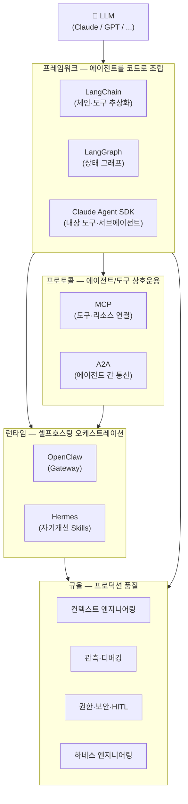
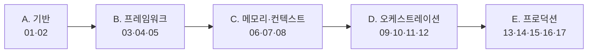

# 00. 오케스트레이션 지형도 + SDK 비교

이 챕터는 이후 모든 챕터의 **지도**입니다. 프레임워크·프로토콜·런타임·규율이 각각
어디에 속하고 서로 어떻게 연결되는지, 그리고 **언제 무엇을 선택할지**를 정리합니다.

## 1. 먼저: 정말 멀티에이전트가 필요한가?

멀티에이전트는 공짜가 아닙니다. 벤치마크상 **중앙집중형 오케스트레이션은 단일 에이전트 대비
약 +285%, 독립형 멀티에이전트도 약 +58%의 토큰 오버헤드**가 발생합니다.[^overhead]
따라서 다음 중 하나에 해당할 때만 값을 합니다:

- **전문화(specialization)** — 역할별로 도구/프롬프트/모델을 분리해야 품질이 오르는가?
- **병렬성(parallelism)** — 하위 작업을 동시에 처리해 지연을 줄일 수 있는가?
- **비평(critique)** — 생성과 평가를 분리해야 정확도가 오르는가? (자기채점은 후하게 나옴)

셋 다 아니라면 **단일 에이전트 + 좋은 도구**가 더 싸고 안정적입니다.
"가장 단순한 것부터 시작하라"가 제1원칙입니다.

## 2. 전체 지형도

- **프레임워크**는 에이전트를 *코드로* 조립하는 라이브러리입니다.
- **프로토콜**은 서로 다른 벤더/언어의 에이전트·도구를 *표준으로* 연결합니다. (MCP=도구, A2A=에이전트 간)
- **런타임**은 여러 에이전트를 *셀프호스팅으로* 돌리는 완성형 시스템입니다.
- **규율**은 이 전부를 *프로덕션에서 신뢰할 수 있게* 만드는 실천법입니다.

## 3. 계층별 개념 정리

| 계층 | 이 저장소에서 다루는 것 | 대응 챕터 |
|------|------------------------|-----------|
| LLM API | Messages API, 스트리밍, tool use | 01–02 |
| 프레임워크 | LangChain, LangGraph, Claude Agent SDK | 03–05 |
| 메모리 | 단기(체크포인터) / 장기(스토어) | 06–07 |
| 컨텍스트 | 선택·압축·격리, 핸드오프 | 08 |
| 오케스트레이션 | supervisor/swarm/hierarchical, 서브에이전트 | 09–10 |
| 프로토콜 | MCP, A2A | 11–12 |
| 관측 | 트레이싱, 디버깅 | 13 |
| 보안 | 권한·인가, HITL 승인 | 14 |
| 평가 | LLM-as-judge, 비용 | 15 |
| 런타임 | OpenClaw, Hermes | 16 |
| 하네스 | 계획/생성/평가 분리, 컨텍스트 리셋 | 17 |

## 4. 오케스트레이션 패턴 6종

2026년 프로덕션에서 통용되는 대표 패턴입니다. **supervisor / orchestrator-worker가
프로덕션의 다수(~70%)**를 차지합니다.[^patterns]

| 패턴 | 구조 | 언제 |
|------|------|------|
| **Supervisor** | 중앙 코디네이터가 워커에게 라우팅 | 2026 기본값. 명확한 제어·관측이 필요할 때 |
| **Orchestrator-Worker** | 오케스트레이터가 하위작업 분해→병렬 워커 | 병렬화 이득이 큰 작업 |
| **Swarm (handoff)** | 피어끼리 제어를 직접 넘김 | 중개자 없이 빠른 전환, LLM 호출 절감 |
| **Hierarchical** | supervisor를 계층으로 쌓음 | 대규모, 도메인 분할 |
| **Sequential (pipeline)** | 고정 순서 파이프라인 | 절차가 확정적일 때 (사실상 워크플로우) |
| **Blackboard** | 공유 상태에 기록/구독 | 느슨히 결합된 협업 |

!!! note "핸드오프의 핵심"
    swarm의 핵심 추상은 **handoff** — 에이전트가 제어권을 넘길 때 대화 컨텍스트를
    함께 전달합니다. 단, 전체가 아니라 **요약**을 넘기는 게 컨텍스트 엔지니어링의 정석입니다(→ 08장).

## 5. SDK 한눈 비교

자세한 매트릭스는 [부록 A](appendix-sdk-matrix.md)에 있습니다. 요지만:

| SDK | 강점 | 약점 | 한 줄 |
|-----|------|------|-------|
| **LangGraph** | 세밀한 제어, 체크포인트+time-travel, 검증됨 | 보일러플레이트↑, 그래프 학습곡선 | 프로덕션 기본 선택 |
| **CrewAI** | 프로토타입 최속(역할 기반 20줄) | 토큰 최대 3×, 라우팅 제어↓ | 빠른 PoC |
| **Claude Agent SDK** | 내장 도구(파일/bash/편집), MCP 최심 통합 | Claude 전용 | 코딩 에이전트 최강 |
| **OpenAI Agents SDK** | 깔끔한 handoff 모델, 낮은 학습곡선 | OpenAI 전용 | OpenAI 스택이면 |

!!! tip "실전 조언"
    많은 팀이 **CrewAI로 프로토타입 → LangGraph로 프로덕션 재구현**합니다.
    제어가 필요해지는 순간 역할 기반 DSL의 한계가 드러나기 때문입니다.
    처음부터 제어가 중요하면 LangGraph에서 시작하세요.

## 6. 이 저장소의 학습 경로

기초가 있다면 03(LangGraph)이나 09(패턴)로 바로 점프해도 됩니다.
프로덕션 MAS를 이미 굴리고 있다면 13(관측)·14(권한)·17(하네스)이 핵심입니다.

## 참고 자료

- [Building Effective Agents — Anthropic](https://www.anthropic.com/research/building-effective-agents)
- [Multi-Agent Orchestration: 5 Patterns That Work in 2026](https://www.digitalapplied.com/blog/multi-agent-orchestration-5-patterns-that-work)
- [Supervisor vs Swarm in LangGraph](https://dev.to/focused_dot_io/multi-agent-orchestration-in-langgraph-supervisor-vs-swarm-tradeoffs-and-architecture-1b7e)
- [2026 AI Agent Framework Showdown](https://qubittool.com/blog/ai-agent-framework-comparison-2026)

[^overhead]: 토큰 오버헤드 수치는 2026년 멀티에이전트 벤치마크 보고 기준. 작업 성격에 따라 크게 달라지므로 참고치로 볼 것.
[^patterns]: 프로덕션 채택 비율은 2026년 오케스트레이션 패턴 서베이 기준.
