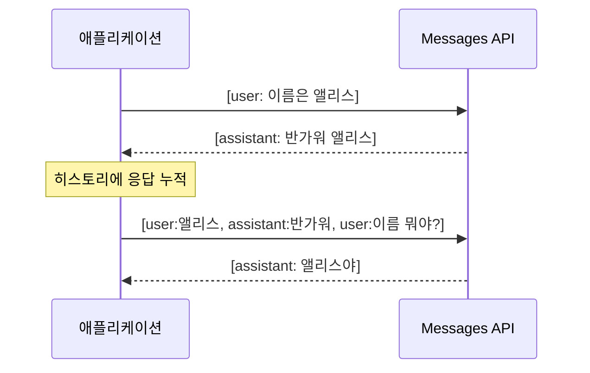

# 01. LLM API 기초

모든 에이전트는 결국 **한 번의 LLM 호출**을 반복하는 것입니다. 프레임워크가 아무리
복잡해도 바닥에는 Messages API 한 방이 있고, 그 위에 루프·메모리·도구가 얹힙니다.
이 챕터는 그 바닥을 정확히 이해하는 데 집중합니다 — 요청 구조, 무상태성,
`stop_reason` 분기, 스트리밍, 그리고 비용을 좌우하는 토큰 관리까지. 여기가 탄탄하면
[02장](02-tool-use-agent-loop.md) 이후의 도구·루프가 훨씬 쉽게 들어옵니다.

!!! note "이 챕터의 코드 기준"
    Anthropic Python SDK(`anthropic`) 최신 버전과 `claude-opus-4-8` 기준입니다.
    SDK 시그니처는 빠르게 바뀌므로, 오류가 나면 `pip show anthropic`으로 설치 버전을
    확인하고 대조하세요.

## 1. Messages API 한눈에

핵심 진입점은 단 하나, `client.messages.create()` 입니다. 채팅·요약·추출·분류·도구
사용·구조화 출력이 전부 이 **하나의 엔드포인트**의 파라미터 조합입니다.

```python
import anthropic

client = anthropic.Anthropic()  # ANTHROPIC_API_KEY 환경변수 자동 사용

response = client.messages.create(
    model="claude-opus-4-8",
    max_tokens=1024,
    system="너는 간결한 한국어 기술 도우미다.",
    messages=[
        {"role": "user", "content": "프랑스의 수도는 어디야?"},
    ],
)

# response.content 는 '블록 리스트'다. 문자열이 아님에 주의.
for block in response.content:
    if block.type == "text":
        print(block.text)
```

응답의 `content`는 **문자열이 아니라 블록의 리스트**입니다. 각 블록은
`type`을 가지며(`text`, `thinking`, `tool_use` 등), 타입을 확인하고 접근해야 합니다.
이 설계 덕분에 한 응답에 "생각 → 텍스트 → 도구 호출"이 섞여 담길 수 있습니다.

## 2. 핵심 파라미터

| 파라미터 | 필수 | 의미 | 팁 |
|----------|------|------|-----|
| `model` | ✅ | 모델 ID (`claude-opus-4-8` 등) | 날짜 접미사 붙이지 말 것 |
| `max_tokens` | ✅ | **출력** 토큰 상한 | 비스트리밍은 ~16000, 스트리밍은 ~64000 권장 |
| `messages` | ✅ | 대화 히스토리 (`role`+`content`) | 첫 메시지는 `user` |
| `system` | ❌ | 시스템 프롬프트(역할·규칙) | 문자열 또는 블록 리스트 |
| `thinking` | ❌ | 확장 사고 설정 | 최신 모델은 `{"type": "adaptive"}` |
| `output_config` | ❌ | `effort`, 구조화 출력 포맷 | `{"effort": "high"}` |
| `tools` | ❌ | 도구 정의 리스트 | → [02장](02-tool-use-agent-loop.md) |
| `stream` | ❌ | 스트리밍 여부 | 보통 `messages.stream()` 헬퍼 사용 |

!!! warning "`max_tokens`는 입력이 아니라 출력 상한"
    `max_tokens`는 모델이 **생성**할 수 있는 최대 토큰입니다. 너무 낮으면 답변이
    문장 도중에 잘리고 `stop_reason == "max_tokens"`가 됩니다. 큰 값(>~16000)을
    비스트리밍으로 요청하면 SDK가 HTTP 타임아웃을 우려해 막으므로, 그럴 땐
    스트리밍을 쓰세요(→ [5절](#5)).

## 3. 무상태성 — 매번 전체 히스토리를 보낸다

Messages API는 **완전한 무상태(stateless)** 입니다. 서버는 이전 대화를 기억하지
않습니다. 매번 처음 만나는 상담원과 통화하는 콜센터라고 생각하면 됩니다 — 대화를
이어가려면 지금까지의 통화 기록 전체를 매번 건네야 합니다. 즉 "멀티턴 대화"란 결국
**매 요청마다 지금까지의 전체 히스토리를 다시 보내는 것**입니다.

```python
messages = []

def chat(user_text: str) -> str:
    messages.append({"role": "user", "content": user_text})
    resp = client.messages.create(
        model="claude-opus-4-8", max_tokens=1024, messages=messages,
    )
    answer = next(b.text for b in resp.content if b.type == "text")
    # 어시스턴트 응답도 히스토리에 다시 넣어야 다음 턴이 이어진다
    messages.append({"role": "assistant", "content": answer})
    return answer

chat("내 이름은 앨리스야.")
chat("내 이름이 뭐라고?")  # 히스토리를 다시 보냈기에 '앨리스'를 안다
```



이 무상태성이 왜 중요할까요? **토큰 비용과 컨텍스트 관리의 근본 원인**이기
때문입니다. 대화가 길어질수록 매번 보내는 입력이 커지고, 비용도 선형으로
늘어납니다. 그래서 [06장 단기 메모리](06-short-term-memory.md)의 체크포인터와
[08장 컨텍스트 엔지니어링](08-context-engineering.md)의 압축·요약이 필요해집니다.

!!! tip "역할 규칙"
    - 첫 메시지는 반드시 `user`
    - 같은 역할이 연속되면 API가 하나의 턴으로 합칩니다
    - `assistant`로 시작하거나 역할 검증에 걸리면 400 오류

## 4. 확장 사고(thinking)와 effort

최신 모델(Opus 4.8/4.7, Sonnet 5 등)은 **적응형 사고(adaptive thinking)** 를
씁니다. 모델이 문제 난이도에 맞춰 얼마나 생각할지 스스로 정합니다.

```python
resp = client.messages.create(
    model="claude-opus-4-8",
    max_tokens=16000,
    thinking={"type": "adaptive", "display": "summarized"},  # 요약된 사고를 노출
    output_config={"effort": "high"},  # low | medium | high | xhigh | max
    messages=[{"role": "user", "content": "이 알고리즘의 시간복잡도를 단계별로 분석해줘."}],
)

for block in resp.content:
    if block.type == "thinking":
        print("[사고]", block.thinking)
    elif block.type == "text":
        print("[답변]", block.text)
```

!!! warning "옛 방식 `budget_tokens`는 400 오류"
    `thinking={"type": "enabled", "budget_tokens": N}` 는 Opus 4.8/4.7·Sonnet 5에서
    **거부(400)** 됩니다. 사고 깊이는 `output_config`의 `effort`로 제어하세요.
    또한 이 모델들에서는 `temperature`/`top_p`/`top_k`도 제거되어 400을 냅니다 —
    행동 제어는 프롬프트로 합니다.

- **`display`**: 기본값은 `"omitted"`(사고 블록이 오지만 텍스트가 빈 문자열).
  사용자에게 사고 과정을 보여주려면 `"summarized"`를 명시하세요.
- **`effort`**: 코딩·에이전트 작업은 `high`\~`xhigh`가 균형점입니다.

## 5. 스트리밍 {#5}

긴 출력이나 큰 `max_tokens`에서는 스트리밍이 사실상 필수입니다 — 응답을 토큰
단위로 받아 UI에 즉시 흘려보내고, HTTP 타임아웃도 피합니다.

```python
with client.messages.stream(
    model="claude-opus-4-8",
    max_tokens=64000,
    messages=[{"role": "user", "content": "짧은 SF 소설을 써줘."}],
) as stream:
    for text in stream.text_stream:      # 텍스트 델타만 순회
        print(text, end="", flush=True)

    final = stream.get_final_message()   # 스트림 종료 후 전체 메시지
    print("\n\n사용 토큰:", final.usage.output_tokens)
```

개별 이벤트가 필요 없다면 `.get_final_message()`만으로 전체 응답을 얻을 수
있습니다. 이벤트 타입(`content_block_delta`, `message_delta` 등)을 직접 다루면
사고 블록과 텍스트를 구분해 렌더링할 수 있습니다(실습 [02_streaming.py](https://github.com/agent-chobi/agent-atoz/blob/main/examples/02_streaming.py)).

## 6. 시스템 프롬프트

`system`은 모델의 **역할·규칙·톤**을 정의합니다. 캐싱을 고려하면 블록 리스트
형태로 두고 안정적인(잘 안 바뀌는) 내용을 앞에 배치하는 것이 좋습니다.

```python
resp = client.messages.create(
    model="claude-opus-4-8",
    max_tokens=1024,
    system=[{
        "type": "text",
        "text": "너는 파이썬 전문가다. 항상 실행 가능한 예제와 함께 답하라.",
        "cache_control": {"type": "ephemeral"},  # 이 프리픽스를 캐시
    }],
    messages=[{"role": "user", "content": "JSON 파일 읽는 법?"}],
)
```

!!! tip "시스템 프롬프트에 변하는 값 넣지 말기"
    `datetime.now()`, 사용자 ID, 세션 ID 같은 값을 시스템 프롬프트에 끼워 넣으면
    프리픽스가 매 요청 달라져 프롬프트 캐시가 전부 무효화됩니다. 변동 값은
    `messages` 뒤쪽에 두세요(→ [8절](#8)).

## 7. stop_reason — 왜 멈췄는가 {#7}

응답의 `stop_reason`은 **모델이 왜 생성을 멈췄는지**를 알려주며, 에이전트 루프의
분기 조건이 됩니다.

| 값 | 의미 | 대응 |
|----|------|------|
| `end_turn` | 자연스럽게 답변 완료 | 결과 사용 |
| `max_tokens` | 출력 상한 도달 | `max_tokens` 상향 또는 스트리밍 |
| `tool_use` | 도구 호출을 원함 | 도구 실행 후 결과 반환 → [02장](02-tool-use-agent-loop.md) |
| `pause_turn` | 서버 도구 루프 일시정지 | 히스토리 재전송해 재개 |
| `refusal` | 안전상 거절 | `stop_details` 확인, 동일 프롬프트 재시도 금지 |

```python
if resp.stop_reason == "refusal":
    # stop_details 는 refusal 일 때만 채워진다 (그 외엔 None)
    print("거절:", resp.stop_details.category if resp.stop_details else "?")
elif resp.stop_reason == "max_tokens":
    print("출력이 잘렸다 — max_tokens를 늘려 재시도")
elif resp.stop_reason == "tool_use":
    ...  # 02장에서 다룸
```

!!! warning "`content`를 읽기 전에 `stop_reason`부터 확인"
    거절 응답은 `content`가 비어 있을 수 있습니다. `resp.content[0].text`를 무조건
    읽으면 인덱스 오류가 납니다 — 항상 `stop_reason`을 먼저 분기하세요.

## 8. 비용 관리 {#8}

### 토큰 세기

요청 전에 입력 토큰 수를 정확히 알 수 있습니다. `tiktoken` 같은 OpenAI 토크나이저는
Claude 토큰을 15\~20% 과소 계산하므로 **쓰지 마세요**.

```python
count = client.messages.count_tokens(
    model="claude-opus-4-8",
    system="너는 도우미다.",
    messages=[{"role": "user", "content": open("문서.md", encoding="utf-8").read()}],
)
print("입력 토큰:", count.input_tokens)
print("예상 입력 비용: $%.4f" % (count.input_tokens * 5 / 1_000_000))  # $5/1M
```

### 프롬프트 캐싱

같은 프리픽스(시스템 프롬프트, 큰 문서)를 반복해서 보낼 때, `cache_control`로
캐시하면 캐시된 부분이 **약 90% 저렴**해집니다. 캐싱은 **프리픽스 매치**입니다 —
도미노처럼, 앞쪽 한 조각(한 바이트)만 달라져도 그 뒤 전체가 와르르 무효화됩니다.

```python
resp = client.messages.create(
    model="claude-opus-4-8",
    max_tokens=1024,
    system=[{
        "type": "text",
        "text": large_document,           # 예: 50KB 참조 문서
        "cache_control": {"type": "ephemeral"},  # 기본 TTL 5분
    }],
    messages=[{"role": "user", "content": "핵심을 요약해줘."}],
)

u = resp.usage
print("캐시 생성:", u.cache_creation_input_tokens)  # 약 1.25x 비용
print("캐시 읽기:", u.cache_read_input_tokens)      # 약 0.1x 비용
print("비캐시 입력:", u.input_tokens)               # 정가
```

반복 요청에도 `cache_read_input_tokens`가 0이라면, 프리픽스에 몰래 끼어든 변동
값(타임스탬프·UUID·정렬 안 된 JSON)이 캐시를 깨고 있는 것입니다. 자세한 전략은
[15장 평가 & 비용](15-evaluation-cost.md)에서 다룹니다.

## 9. 에러 처리

문자열 매칭 대신 **타입이 있는 예외 클래스**를 쓰고, 구체적인 것부터 잡습니다.
재시도 가능(429·5xx·네트워크)과 불가능(4xx)을 구분하는 것이 핵심입니다.

```python
import anthropic

try:
    resp = client.messages.create(...)
except anthropic.NotFoundError:
    print("잘못된 모델 ID")            # 404
except anthropic.RateLimitError as e:  # 429
    retry_after = e.response.headers.get("retry-after", "60")
    print(f"레이트 리밋 — {retry_after}s 후 재시도")
except anthropic.APIStatusError as e:  # 그 외 비2xx
    if e.status_code >= 500:
        print(f"서버 오류 {e.status_code} — 재시도 가능")
    else:
        print(f"API 오류: {e.message}")
except anthropic.APIConnectionError:
    print("네트워크 오류")
```

!!! note "SDK가 이미 재시도한다"
    SDK는 429·5xx·연결 오류를 지수 백오프로 **자동 재시도**합니다(기본 2회).
    `max_retries`로 조정하고, 그 이상이 필요할 때만 커스텀 로직을 얹으세요.

## 구조화된 출력 맛보기

2절의 파라미터 표에서 `output_config`에 "구조화 출력 포맷"이 스쳐 지나갔는데,
여기서 제대로 짚고 갑니다. 응답을 자유 텍스트가 아니라 **정해진 JSON 스키마 그대로**
받고 싶을 때 쓰는 기능입니다. "답변을 JSON으로 줘"라고 프롬프트로 부탁하는 것은
계약서 없이 구두 약속을 받는 것과 같아서 가끔 어긋나지만, `output_config.format`은
스키마를 **토큰 생성 단계에서 강제**하므로 파싱 실패가 원천적으로 없습니다.

```python
import json

resp = client.messages.create(
    model="claude-opus-4-8",
    max_tokens=1024,
    messages=[{
        "role": "user",
        "content": "다음에서 고객 정보를 추출해: 김철수(kim@example.com)는 엔터프라이즈 플랜을 원한다.",
    }],
    output_config={
        "format": {
            "type": "json_schema",
            "schema": {
                "type": "object",
                "properties": {
                    "name": {"type": "string"},
                    "email": {"type": "string"},
                    "plan": {"type": "string"},
                },
                "required": ["name", "email", "plan"],
                "additionalProperties": False,
            },
        }
    },
)

data = json.loads(next(b.text for b in resp.content if b.type == "text"))
print(data["name"])  # "김철수" — 키 누락·타입 오류 걱정 없음
```

같은 보장이 **도구 입력**에도 필요하면(예: 결제 API에 잘못된 파라미터가 들어가면 안 될 때),
도구 정의에 `strict: True`를 켭니다. 그러면 `tool_use.input`이 `input_schema`와 정확히
일치함이 보장됩니다 — [02장](02-tool-use-agent-loop.md)의 도구 호출과 조합하는 패턴입니다.

```python
tools = [{
    "name": "save_contact",
    "description": "고객 연락처를 저장한다.",
    "strict": True,  # 입력이 스키마와 '정확히' 일치함을 보장 (strict tool use)
    "input_schema": {
        "type": "object",
        "properties": {"name": {"type": "string"}, "email": {"type": "string"}},
        "required": ["name", "email"],
        "additionalProperties": False,  # strict 모드에서는 필수
    },
}]
```

스키마 제약(재귀 스키마·길이 제한 불가 등), Pydantic 연동, 프리필 기법 대체 전략 같은
자세한 내용은 [18장 구조화된 출력](18-structured-output.md)에서 다룹니다.

## 실습 코드

- [`examples/01_basic_message.py`](https://github.com/agent-chobi/agent-atoz/blob/main/examples/01_basic_message.py) — 기본 메시지 1회 호출 + 블록 순회
- [`examples/02_streaming.py`](https://github.com/agent-chobi/agent-atoz/blob/main/examples/02_streaming.py) — 스트리밍 + 최종 usage 출력

## 따라하기

위 실습 코드 두 개를 단계별로 실행해 봅니다. 전체 환경 설정은
[examples/README.md](https://github.com/agent-chobi/agent-atoz/blob/main/examples/README.md)를 참고하세요.

**1) 사전 준비**

```bash
python -m venv .venv
.venv\Scripts\activate            # macOS/Linux: source .venv/bin/activate
pip install -r requirements.txt   # 최소한 anthropic, python-dotenv
copy .env.example .env            # macOS/Linux: cp — 그리고 ANTHROPIC_API_KEY=sk-ant-... 채우기
```

**2) 실행**

```bash
python examples/01_basic_message.py
python examples/02_streaming.py
```

**3) 기대 출력 요지**

- `01_basic_message.py` — 응답 블록을 순회하며 텍스트가 출력된 뒤, `stop_reason: end_turn`과 입력/출력 토큰 수가 찍힙니다.
- `02_streaming.py` — 짧은 SF 이야기가 토큰 단위로 실시간 출력되고, 마지막에 `stop_reason`과 최종 usage(토큰 수)가 출력됩니다.

**4) 흔한 에러**

| 증상 | 원인과 해결 |
|------|-------------|
| `authentication_error (401)` | `.env`에 `ANTHROPIC_API_KEY`가 없거나 오타. 파일 위치(프로젝트 루트)와 키 값을 확인 |
| `ModuleNotFoundError: No module named 'anthropic'` | 가상환경을 활성화하지 않고 실행. `.venv` 활성화 후 `pip install anthropic python-dotenv` |

## 실무 트레이드오프

**스트리밍 vs 비스트리밍**

| | 비스트리밍 (`create`) | 스트리밍 (`stream`) |
|--|--|--|
| 코드 복잡도 | 낮음 — 응답 객체 하나 | 약간 높음 — 이벤트/델타 처리 |
| 체감 지연 | 전체 생성이 끝나야 표시 | 첫 토큰부터 즉시 표시 |
| 긴 출력(>~16K 토큰) | SDK가 타임아웃을 우려해 차단 | 문제 없음 — 사실상 필수 |
| 적합한 곳 | 배치 처리, 백엔드 파이프라인, 짧은 응답 | 챗 UI, 긴 문서 생성, 에이전트 루프 |

**프롬프트 캐싱 — 언제 켜나**

| 상황 | 판단 |
|------|------|
| 큰 시스템 프롬프트/참조 문서(수천 토큰↑)를 반복 사용 | 켜라 — 두 번째 요청부터 이득 (쓰기 ~1.25×, 읽기 ~0.1×) |
| 매 요청 프리픽스가 달라짐 (짧은 개인화 프롬프트 등) | 켜지 마라 — 쓰기 프리미엄만 내고 읽기 절감은 0 |
| 요청 간격이 기본 TTL(5분)보다 김 | 1시간 TTL 고려 — 단 쓰기 비용 2×라 읽기 횟수로 회수돼야 함 |

## 2026 실무 트렌드

- **비용이 1급 엔지니어링 지표가 됐다.** 에이전트는 단순 챗봇보다 LLM 호출이 3~10배 많아, 프롬프트 캐싱(캐시 부분 최대 ~90% 절감)·배치 API(50% 할인)·모델 라우팅을 설계 단계부터 조합하는 것이 표준이 됐다.
- **구조화 출력이 정식(GA) 기능으로.** `output_config.format`(JSON 스키마 강제)과 strict tool use가 베타 헤더 없이 제공되면서, "JSON으로 답해줘" 프롬프트나 어시스턴트 프리필 같은 우회 기법을 빠르게 대체하고 있다.
- **샘플링 파라미터의 퇴장.** 최신 모델(Opus 4.7+/4.8, Sonnet 5)은 `temperature`/`top_p` 대신 적응형 사고와 `effort`로 동작을 제어한다 — 프롬프트와 effort 튜닝이 새로운 다이얼이다.

## 실전 레퍼런스

- [Structured Outputs — Claude 공식 문서](https://platform.claude.com/docs/en/build-with-claude/structured-outputs) — `output_config.format`과 strict tool use의 정식 레퍼런스.
- [Effective context engineering for AI agents — Anthropic Engineering](https://www.anthropic.com/engineering/effective-context-engineering-for-ai-agents) — 무상태 API 위에서 컨텍스트(=토큰)를 어떻게 다룰지에 대한 공식 가이드. 08장의 미리보기 격.
- [A Hands-On Guide to Anthropic's Structured Output — Towards Data Science](https://towardsdatascience.com/hands-on-with-anthropics-new-structured-output-capabilities/) — 구조화 출력 기능을 코드로 훑는 실습 튜토리얼.
- [Prompt Caching in 2026: Cut LLM Costs, Keep Quality](https://www.digitalapplied.com/blog/prompt-caching-2026-cut-llm-costs-engineering-guide) — 캐싱 도입 시점·프리픽스 설계에 대한 엔지니어링 가이드.

다음 장에서는 이 위에 **도구**를 얹어, 모델이 스스로 행동하고 관찰하는
[에이전트 루프](02-tool-use-agent-loop.md)를 만듭니다.

## 참고 자료

- [Messages API 개요](https://platform.claude.com/docs/en/api/messages)
- [스트리밍 가이드](https://platform.claude.com/docs/en/build-with-claude/streaming)
- [적응형 사고(Adaptive Thinking)](https://platform.claude.com/docs/en/build-with-claude/adaptive-thinking)
- [프롬프트 캐싱](https://platform.claude.com/docs/en/build-with-claude/prompt-caching)
- [토큰 세기](https://platform.claude.com/docs/en/build-with-claude/token-counting)
- [API 에러 코드](https://platform.claude.com/docs/en/api/errors)
