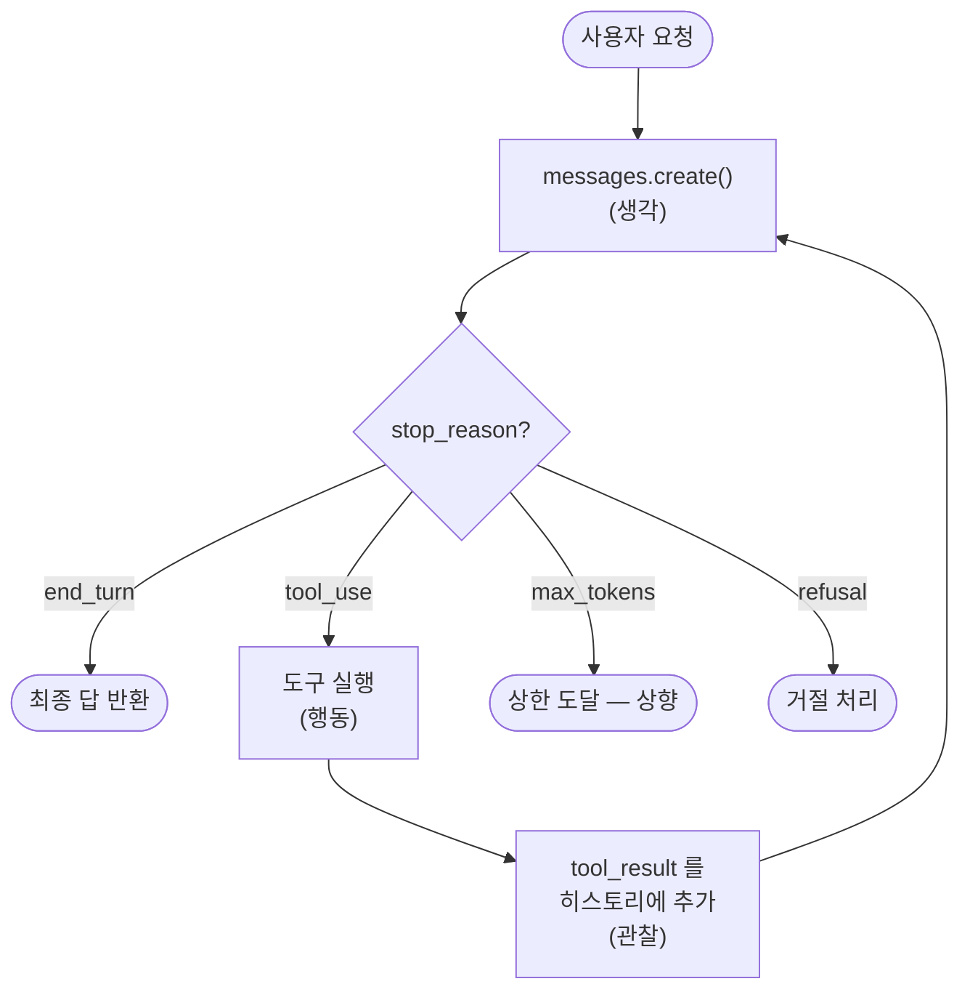

# 02. Tool Use & 에이전트 루프

[01장](01-llm-api-basics.md)의 LLM은 텍스트만 생성했습니다. 하지만 진짜 에이전트는
**행동**해야 합니다 — 날씨를 조회하고, 계산하고, 파일을 읽고, API를 호출합니다.
그 다리가 **도구 사용(tool use)** 이고, 그것을 반복하는 것이 **에이전트 루프**입니다.
이 챕터는 도구 정의 → `tool_use`/`tool_result` 왕복 → 자율 루프(생각→행동→관찰)까지,
모든 멀티에이전트 프레임워크의 공통 바닥을 손으로 직접 만들어 봅니다.

!!! note "왜 직접 만들어 보는가"
    LangGraph([04장](04-langgraph-state-graph.md))·Claude Agent SDK([05장](05-claude-agent-sdk.md))는
    이 루프를 대신 돌려줍니다. 하지만 바닥을 손으로 한 번 만들면, 프레임워크가
    무엇을 자동화하는지·언제 제어를 되찾아야 하는지가 명확해집니다.

## 1. 도구 정의 — JSON Schema

도구는 세 가지로 정의합니다: `name`, `description`, `input_schema`(JSON Schema).
모델은 **설명을 읽고** 언제·어떻게 이 도구를 쓸지 판단하므로, 설명은 "무엇을
하는가"뿐 아니라 **"언제 호출해야 하는가"** 까지 명시하는 것이 좋습니다.

```python
tools = [
    {
        "name": "get_weather",
        "description": "특정 도시의 현재 날씨를 조회한다. 사용자가 날씨·기온을 물으면 호출.",
        "input_schema": {
            "type": "object",
            "properties": {
                "city": {"type": "string", "description": "도시 이름, 예: 서울"},
                "unit": {
                    "type": "string",
                    "enum": ["celsius", "fahrenheit"],
                    "description": "온도 단위",
                },
            },
            "required": ["city"],
        },
    },
    {
        "name": "calculator",
        "description": "산술식을 계산한다. 수식 계산이 필요하면 호출.",
        "input_schema": {
            "type": "object",
            "properties": {"expression": {"type": "string", "description": "예: (3+5)*2"}},
            "required": ["expression"],
        },
    },
]
```

!!! tip "도구 설계 원칙"
    - 명확한 이름(`get_weather` > `weather`)
    - 트리거 조건을 설명에 명시 — 최신 모델은 도구를 보수적으로 부르므로 효과가 큼
    - 고정 값 파라미터는 `enum` 사용
    - 정말 필요한 것만 `required`

## 2. tool_use / tool_result 왕복

모델에 `tools`를 넘기면, 모델은 도구가 필요할 때 `stop_reason == "tool_use"`와 함께
`tool_use` 블록을 반환합니다. **여러분이** 그 도구를 실행하고, 결과를 `tool_result`
블록으로 되돌려줍니다. 그러면 모델이 결과를 반영해 최종 답을 냅니다.

```python
messages = [{"role": "user", "content": "서울 날씨 어때?"}]

resp = client.messages.create(
    model="claude-opus-4-8", max_tokens=1024, tools=tools, messages=messages,
)

# resp.content 안의 tool_use 블록을 찾는다
tool_use = next(b for b in resp.content if b.type == "tool_use")
print(tool_use.name)   # "get_weather"
print(tool_use.input)  # {"city": "서울"}  ← 이미 파싱된 dict

# 1) 어시스턴트 응답(도구 호출 포함)을 히스토리에 추가
messages.append({"role": "assistant", "content": resp.content})

# 2) 도구를 실행하고 결과를 tool_result 로 반환
result_text = "맑음, 24도"  # 실제로는 실제 함수 실행
messages.append({
    "role": "user",
    "content": [{
        "type": "tool_result",
        "tool_use_id": tool_use.id,   # 반드시 tool_use.id 와 일치
        "content": result_text,
    }],
})

# 3) 결과를 반영한 최종 답을 다시 요청
final = client.messages.create(
    model="claude-opus-4-8", max_tokens=1024, tools=tools, messages=messages,
)
print(next(b.text for b in final.content if b.type == "text"))
```

!!! warning "세 가지 규칙"
    - `tool_result.tool_use_id`는 대응하는 `tool_use.id`와 **정확히 일치**해야 함
    - 어시스턴트의 `content`(도구 호출 블록 포함) 전체를 히스토리에 다시 넣어야 함
    - 병렬 도구 호출이 여러 개면 **모든** `tool_result`를 **하나의** user 메시지에 담을 것

도구 입력은 이미 파싱된 dict입니다. 직렬화된 문자열을 정규식으로 긁지 말고
`tool_use.input`을 그대로 쓰세요(최신 모델은 JSON 이스케이프 방식이 다를 수 있음).

## 3. 자율 에이전트 루프 — 생각→행동→관찰

단일 왕복은 도구를 **한 번** 씁니다. 진짜 에이전트는 도구를 몇 번이고 연쇄해야
합니다("먼저 날씨 조회 → 그 값으로 계산 → 결과 판단"). 이때 핵심은
**`stop_reason`을 보고 반복**하는 `while` 루프입니다.



이 순환이 바로 **생각(모델 추론) → 행동(도구 실행) → 관찰(결과를 컨텍스트에 반영)**
이며, ReAct 패턴의 뼈대입니다. 종료 조건은 명확합니다: **`stop_reason == "end_turn"`**
이면 모델이 더는 도구가 필요 없다고 판단한 것 — 루프를 빠져나옵니다.

```python
def run_agent(user_input: str, tools, tool_functions, max_turns=10) -> str:
    messages = [{"role": "user", "content": user_input}]

    for _ in range(max_turns):  # 무한 루프 방지 상한
        resp = client.messages.create(
            model="claude-opus-4-8", max_tokens=4096, tools=tools, messages=messages,
        )

        # 종료 조건: 도구가 더 필요 없으면 끝
        if resp.stop_reason == "end_turn":
            return next(b.text for b in resp.content if b.type == "text")

        if resp.stop_reason != "tool_use":
            return f"[예상 밖 stop_reason: {resp.stop_reason}]"

        # 어시스턴트 응답(도구 호출 포함) 누적
        messages.append({"role": "assistant", "content": resp.content})

        # 이번 턴의 모든 도구 호출을 실행 (병렬 호출 대비)
        results = []
        for block in resp.content:
            if block.type == "tool_use":
                output = tool_functions[block.name](**block.input)  # 로컬 함수 실행
                results.append({
                    "type": "tool_result",
                    "tool_use_id": block.id,
                    "content": str(output),
                })

        # 모든 결과를 하나의 user 메시지로 반환
        messages.append({"role": "user", "content": results})

    return "[최대 턴 수 초과]"
```

!!! tip "종료 조건과 안전장치"
    - **`end_turn`** 이 정상 종료. `tool_use`인 한 계속 돈다.
    - **`max_turns` 상한**은 필수 — 모델이 도구를 무한 반복하는 폭주를 막는다.
    - 도구 실행이 실패하면 결과를 버리지 말고 `is_error: True`로 되돌려라.
      모델이 오류를 보고 다른 방법을 시도한다.

```python
# 도구 실행 실패 시
results.append({
    "type": "tool_result",
    "tool_use_id": block.id,
    "content": "오류: 도시 'xyz'를 찾을 수 없음. 유효한 도시명을 제공하라.",
    "is_error": True,
})
```

## 4. 다중 도구와 병렬 호출

한 응답에 `tool_use` 블록이 **여러 개** 담길 수 있습니다(예: 세 도시 날씨를 동시에
조회). 이것이 **병렬 도구 호출**입니다. 위 루프의 `for block in resp.content`가
이미 이 경우를 처리합니다 — 모든 도구를 실행하고, 결과 전부를 **하나의** user
메시지에 모아 반환합니다.

!!! warning "병렬 결과를 쪼개지 말 것"
    `tool_result` 블록들을 여러 user 메시지로 나눠 보내면, 모델이 "병렬 호출은
    하면 안 되는구나"라고 잘못 학습해 이후 병렬성을 잃습니다. **한 번의 도구 묶음
    → 한 번의 결과 묶음**을 지키세요.

## 5. 수동 루프 vs 툴 러너

방금 만든 것은 **수동 에이전트 루프**입니다. Anthropic SDK는 이 루프를 대신 돌려주는
**툴 러너(베타)** 도 제공합니다.

| | 수동 루프 | 툴 러너(`@beta_tool` + `tool_runner`) |
|--|-----------|----------------------------------------|
| 제어 | 세밀 (승인 게이트·로깅·조건 실행) | 자동 |
| 코드량 | 많음 | 적음 |
| 언제 | HITL 승인·커스텀 관측이 필요할 때 | 단순 자동화 |

```python
from anthropic import beta_tool

@beta_tool
def get_weather(city: str) -> str:
    """도시의 현재 날씨를 조회한다."""
    return "맑음, 24도"

runner = client.beta.messages.tool_runner(
    model="claude-opus-4-8", max_tokens=1024,
    tools=[get_weather],
    messages=[{"role": "user", "content": "서울 날씨?"}],
)
for message in runner:  # 루프를 SDK가 알아서 돈다
    print(message)
```

인간 승인(HITL)·감사 로그·조건부 실행이 필요하면 **수동 루프**를 쓰세요. 이 주제는
[14장 권한 & 보안 & HITL](14-permissions-security-hitl.md)에서 깊이 다룹니다. 실제
프레임워크가 이 루프를 어떻게 상태 그래프로 감싸는지는
[04장 LangGraph](04-langgraph-state-graph.md)에서 이어집니다.

## 실습 코드

- [`examples/03_tool_use.py`](../examples/README.md) — 도구 2개 정의, 단일 `tool_use`→`tool_result` 수동 처리
- [`examples/04_agent_loop.py`](../examples/README.md) — `while` 루프로 도구를 반복 실행하는 최소 에이전트

## 참고 자료

- [Tool Use 개요](https://platform.claude.com/docs/en/agents-and-tools/tool-use/overview)
- [Tool Use 구현 가이드](https://platform.claude.com/docs/en/agents-and-tools/tool-use/implement-tool-use)
- [stop_reason 처리](https://platform.claude.com/docs/en/build-with-claude/handling-stop-reasons)
- [Building Effective Agents — Anthropic](https://www.anthropic.com/research/building-effective-agents)
- [ReAct: Synergizing Reasoning and Acting in Language Models](https://arxiv.org/abs/2210.03629)
