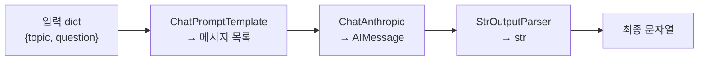

# 03. LangChain 기초 (LCEL)

앞선 [02장](02-tool-use-agent-loop.md)에서는 Anthropic SDK로 **에이전트 루프를 직접**
짜 봤습니다. 매번 `messages` 리스트를 관리하고, `stop_reason`을 분기하고, 도구 결과를
되돌려 넣는 보일러플레이트가 반복됐죠. LangChain은 이 반복을 **재사용 가능한 부품**으로
바꿉니다. 이 챕터의 핵심은 두 가지입니다. (1) **LCEL**로 프롬프트·모델·파서를 파이프처럼
잇는 법, (2) 그리고 **언제 이 추상화가 값을 하고 언제 과한가**를 판단하는 눈입니다.

## 1. LangChain은 무엇을 추상화하나

LangChain의 존재 이유는 **"프로바이더 교체 가능성"과 "조합 가능성"** 입니다. 비유하면
**레고 블록**입니다. 프롬프트·모델·파서라는 블록이 모두 같은 규격의 요철(표준 인터페이스
`Runnable`)을 갖고 있어서, 어떤 순서로든 끼울 수 있고, 마음에 안 드는 블록 하나만 쏙 빼서
다른 것으로 갈아 끼울 수 있습니다. 아래 세 조각이 그 기본 블록입니다.

| 조각 | 역할 | 대표 클래스 |
|------|------|-------------|
| **Prompt** | 변수를 받아 메시지로 렌더링 | `ChatPromptTemplate` |
| **Model** | 메시지 → 응답 | `ChatAnthropic`, `ChatOpenAI` |
| **Parser** | 응답 → 원하는 타입 | `StrOutputParser`, `PydanticOutputParser` |

`ChatAnthropic`은 `langchain-anthropic` 패키지가 제공하며, 내부적으로 우리가 [01장](01-llm-api-basics.md)에서
본 `client.messages.create(...)`를 감쌉니다. 즉 **없던 기능이 생기는 게 아니라, 같은 API가
표준 인터페이스로 포장**되는 것입니다.

## 2. LCEL — 파이프로 잇는 체인

LCEL(LangChain Expression Language)은 파이썬 `|` 연산자로 `Runnable`을 잇는 문법입니다.
왼쪽의 출력이 오른쪽의 입력으로 흐릅니다 — 유닉스 파이프와 같은 감각입니다.

```python
from langchain_anthropic import ChatAnthropic
from langchain_core.prompts import ChatPromptTemplate
from langchain_core.output_parsers import StrOutputParser

prompt = ChatPromptTemplate.from_messages([
    ("system", "너는 {topic} 전문가다. 세 문장으로 답하라."),
    ("human", "{question}"),
])
model = ChatAnthropic(model="claude-opus-4-8", max_tokens=1024)
parser = StrOutputParser()

chain = prompt | model | parser          # ← LCEL 파이프
answer = chain.invoke({"topic": "분산 시스템", "question": "왜 합의가 어려운가?"})
print(answer)                            # 이미 str (파서가 .content 추출)
```



파이프로 조립된 `chain` 역시 하나의 `Runnable`입니다. 그래서 **모든 조각이 같은 메서드**를
공유합니다 — 이게 LCEL이 주는 진짜 가치입니다.

| 메서드 | 용도 |
|--------|------|
| `.invoke(x)` | 단건 동기 실행 |
| `.batch([x1, x2])` | 여러 입력 병렬 처리 |
| `.stream(x)` | 토큰 스트리밍(제너레이터) |
| `.ainvoke` / `.astream` | 비동기 버전 |

!!! tip "스트리밍이 공짜"
    `chain.stream({...})`를 호출하면 파이프 전체가 자동으로 스트리밍 모드가 됩니다.
    SDK에서 직접 `stream=True`를 다루던 것과 달리, 체인을 바꾸지 않고 호출만 바꾸면 됩니다.

`.batch`도 같은 원리입니다. 입력 리스트를 넘기면 내부적으로 병렬 실행됩니다 — 여러 문서를
한 번에 요약·분류할 때 유용합니다.

```python
inputs = [
    {"topic": "OS", "question": "컨텍스트 스위칭이란?"},
    {"topic": "DB", "question": "인덱스는 왜 빠른가?"},
]
answers = chain.batch(inputs)     # [str, str] — 순서 보존, 병렬 처리
```

### 파서 교체 — 구조화된 출력

`StrOutputParser` 대신 다른 파서를 끼우면 출력 타입이 바뀝니다. 파이프의 앞 두 조각은
그대로 두고 **마지막 조각만 교체**하면 되는 게 LCEL의 조합성입니다. 예를 들어 Pydantic
모델로 구조화하려면 `.with_structured_output`을 쓰는 게 2026년 권장 경로입니다.

```python
from pydantic import BaseModel, Field

class Verdict(BaseModel):
    sentiment: str = Field(description="positive | negative | neutral")
    score: float = Field(description="0.0~1.0 확신도")

structured = ChatAnthropic(model="claude-opus-4-8").with_structured_output(Verdict)
v = structured.invoke("이 리뷰 감성 분석: '배송은 느렸지만 제품은 훌륭했다'")
print(v.sentiment, v.score)      # 이미 Verdict 인스턴스 (검증 완료)
```

## 3. 도구 바인딩 — `.bind_tools`

에이전트를 만들려면 모델이 도구를 호출할 수 있어야 합니다. LangChain은 파이썬 함수에
`@tool` 데코레이터만 붙이면 **스키마를 자동 추론**합니다(01·02장에서 손으로 짠 JSON Schema를
대신 만들어 줍니다).

```python
from langchain_core.tools import tool

@tool
def get_weather(city: str) -> str:
    """주어진 도시의 현재 날씨를 반환한다."""   # ← docstring이 도구 설명이 됨
    return f"{city}: 맑음, 24도"

model_with_tools = ChatAnthropic(model="claude-opus-4-8", max_tokens=1024).bind_tools([get_weather])
ai = model_with_tools.invoke("서울 날씨 알려줘")

# 모델이 도구를 부르기로 하면 tool_calls에 구조화되어 담긴다
for call in ai.tool_calls:
    print(call["name"], call["args"])     # get_weather {'city': '서울'}
```

`.bind_tools`는 도구 목록을 모델에 "묶어" 새 `Runnable`을 돌려줍니다. 응답의
`ai.tool_calls`는 프로바이더별 포맷 차이를 흡수한 **표준 형태**입니다 — Anthropic이든
OpenAI든 같은 코드로 읽습니다. 실제 도구 실행·결과 반환 루프는 [04장](04-langgraph-state-graph.md)의
LangGraph가 담당하게 됩니다.

## 4. 언제 LangChain이 유용하고, 언제 과한가

추상화는 공짜가 아닙니다. **디버깅할 층이 하나 더 생기고**, 버전 간 API 변화에 노출되며,
문제가 생기면 "내 코드인지 프레임워크인지"를 먼저 가려야 합니다. 아래 기준으로 판단하세요.

| 상황 | 권장 |
|------|------|
| 프로바이더를 바꿀 가능성이 있다 | ✅ LangChain (인터페이스 통일) |
| 프롬프트·파서·도구를 여러 조합으로 재사용 | ✅ LCEL |
| 배치/스트리밍/비동기를 무료로 얻고 싶다 | ✅ LCEL |
| LangGraph·LangSmith 생태계를 함께 쓴다 | ✅ (도구가 `Runnable`이면 바로 물림) |
| 단발성 스크립트, Claude 한 곳만 호출 | ❌ 그냥 `anthropic` SDK |
| 프롬프트 하나 + 단순 파싱 | ❌ 추상화 비용이 이득보다 큼 |
| 저수준 동작을 완전히 통제해야 함 | ❌ SDK 직접 |

!!! warning "추상화 비용은 실재한다"
    "LCEL이 있으니 무조건 LangChain" 은 안티패턴입니다. **[00장](00-landscape.md)의 제1원칙 —
    가장 단순한 것부터** 는 여기서도 유효합니다. Claude 하나에 프롬프트 하나면
    `anthropic` SDK 직접 호출이 더 읽기 쉽고 디버깅도 쉽습니다. LangChain은
    **조합·교체·생태계**가 필요할 때 값을 합니다.

!!! note "LangChain vs LangGraph"
    LangChain(LCEL)은 **선형 파이프라인**에 강합니다. 하지만 조건 분기, 반복 루프,
    상태 누적, 중단·재개(HITL) 같은 **제어 흐름**이 필요하면 그래프 기반의 LangGraph가
    정답입니다. 실제로 에이전트 루프는 다음 챕터에서 LangGraph로 구현합니다.

## 따라하기

이 챕터의 내용은 [`examples/05_langchain_lcel.py`](https://github.com/agent-chobi/agent-atoz/blob/main/examples/05_langchain_lcel.py)
한 파일에 담겨 있습니다 — `ChatAnthropic` + `ChatPromptTemplate` + `StrOutputParser`를 LCEL로
잇고, `.invoke`·`.stream`·`.bind_tools`를 차례로 시연합니다.

**1) 사전 준비**

```bash
pip install -r requirements.txt
copy .env.example .env        # macOS/Linux는 cp — 열어서 ANTHROPIC_API_KEY 채우기
```

**2) 실행**

```bash
python examples/05_langchain_lcel.py
```

**3) 기대 출력 요지**

- `.invoke` 데모: 세 문장 이내의 한국어 답변이 **한 번에** 출력됩니다.
- `.stream` 데모: 같은 체인의 답변이 **토큰 단위로 끊겨서** 흘러나옵니다 — 체인은 그대로 두고
  호출 방법만 바꿨다는 점이 포인트입니다.
- `.bind_tools` 데모: 모델이 `get_weather` 도구를 선택한 `tool_calls`(도구 이름 + 인자 dict)가
  출력됩니다. 도구를 실제로 실행하는 루프는 다음 챕터의 몫입니다.

**4) 흔한 에러**

| 증상 | 원인 → 해결 |
|------|-------------|
| 인증 오류(401) 또는 API 키 관련 예외 | `.env` 미작성 → `copy .env.example .env` 후 `ANTHROPIC_API_KEY` 입력 |
| `ModuleNotFoundError: langchain_anthropic` | 의존성 미설치 → `pip install -r requirements.txt` |
| 응답은 나오는데 비용이 부담 | 파일 상단 `MODEL`을 `"claude-haiku-4-5"`로 교체 |

## 실무 트레이드오프

4절이 "어떤 상황에 무엇을 쓰나"였다면, 여기서는 두 경로를 **항목별로 나란히** 비교합니다.
LangChain 추상화와 순수 `anthropic` SDK는 우열이 아니라 트레이드오프 관계입니다.

| 기준 | LangChain (LCEL) | 순수 `anthropic` SDK |
|------|------------------|----------------------|
| 코드량 (단순 호출 1회) | 부품 조립으로 오히려 김 | 최소 — `client.messages.create` 한 번 |
| 코드량 (스트리밍+배치+비동기) | `.stream`/`.batch`/`.ainvoke` 가 공짜 | 각각 직접 구현해야 함 |
| 프로바이더 교체 | 모델 클래스 한 줄 교체 | 호출부 전면 수정 |
| 디버깅 | 프레임워크 층까지 스택을 추적해야 함 | 스택이 얕아 원인 파악이 빠름 |
| 버전 리스크 | 0.x→1.0 등 마이그레이션 이력 존재 | Anthropic API 변경만 따라가면 됨 |
| 저수준 API 제어 (베타 헤더, 캐싱 세부) | 래퍼가 노출해 줄 때까지 대기 | 즉시 사용 가능 |
| 생태계 (LangGraph·LangSmith) | `Runnable`이면 그대로 물림 | 별도 통합 작업 필요 |

한 줄 결론: **조합·교체·생태계**가 필요하면 LangChain, **통제·단순함**이 필요하면 SDK 직접.

## 2026 실무 트렌드

- **LangChain 1.0 정식 출시(2025-10)** — 에이전트 중심으로 재편되어 `create_agent`가 고수준
  진입점이 됐고, 내부 런타임은 LangGraph로 통일됐습니다. `LLMChain`·`AgentExecutor` 같은
  레거시는 `langchain-classic` 패키지로 분리됐습니다.
- **LCEL의 위상 변화** — `Runnable`과 파이프(`|`) 조합 자체는 계속 지원되지만, 복잡한 에이전트
  로직은 LCEL 체인 대신 에이전트/그래프 기반 설계로 옮기라는 것이 공식 방향입니다. 이 챕터의
  "선형 파이프에는 LCEL, 제어 흐름에는 그래프" 구분이 그대로 공식화된 셈입니다.
- **표준 콘텐츠 블록** — v1부터 모든 챗 모델이 text/tool_call/reasoning 등을 프로바이더 중립
  포맷(`.content_blocks`)으로 반환해, 벤더 교체 시 파싱 코드를 다시 쓸 필요가 없어졌습니다.
- **미들웨어가 새 커스터마이징 축** — HITL 승인, 대화 요약, PII 마스킹 등을 에이전트 루프의
  before/after 훅에 끼우는 미들웨어 시스템이 도입되어, 실무 커스터마이징의 중심이 "체인 조립"에서
  "미들웨어 스택"으로 이동하고 있습니다.

## 실전 레퍼런스

- [LangChain & LangGraph 1.0: Foundations for Agent Engineering](https://www.langchain.com/blog/langchain-langgraph-1dot0) —
  1.0 공식 발표. `create_agent`·미들웨어·표준 콘텐츠 블록·`langchain-classic` 분리를 한눈에 정리.
- [LangChain v1 마이그레이션 가이드](https://docs.langchain.com/oss/python/migrate/langchain-v1) —
  v0 코드(LCEL 체인, `create_react_agent` 등)를 v1로 옮기는 공식 체크리스트.
- [Standard message content](https://blog.langchain.com/standard-message-content/) —
  프로바이더 중립 콘텐츠 블록의 설계 배경과 `.content_blocks` 사용법(공식 블로그).
- [How middleware lets you customize your agent harness](https://www.langchain.com/blog/how-middleware-lets-you-customize-your-agent-harness) —
  미들웨어 아키텍처의 설계 의도와 before/after 훅 모델(공식 블로그).
- [Lessons Learned from Upgrading to LangChain 1.0 in Production](https://towardsdatascience.com/lessons-learnt-from-upgrading-to-langchain-1-0-in-production/) —
  실서비스 코드베이스를 1.0으로 올리며 겪은 문제를 담은 실전 후기(Towards Data Science).

## 참고 자료

- [LangChain (OSS Python) 개요](https://docs.langchain.com/oss/python/langchain/overview)
- [LCEL / Runnable 인터페이스](https://python.langchain.com/docs/concepts/lcel/)
- [langchain-anthropic ChatAnthropic 레퍼런스](https://python.langchain.com/docs/integrations/chat/anthropic/)
- [도구 호출(tool calling) 가이드](https://docs.langchain.com/oss/python/langchain/tools)
