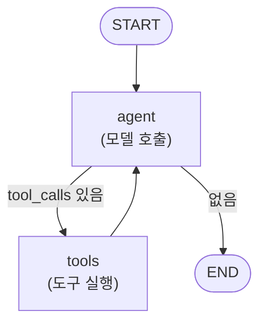
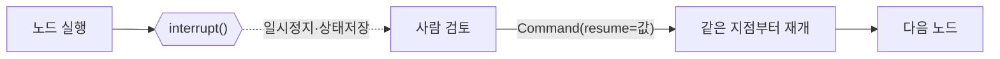

# 04. LangGraph 상태 그래프

[03장](03-langchain-basics.md)에서 본 LCEL은 **직선 파이프라인**에 강합니다. 하지만 에이전트는
직선이 아닙니다 — 모델이 도구를 부르면 실행하고, 결과를 다시 넣고, 끝날 때까지 **반복**합니다.
중간에 사람 승인을 받아야 할 수도 있습니다. 이런 **순환·분기·상태 누적**을 다루려면
그래프가 필요합니다. LangGraph는 에이전트를 **노드(계산 단위)와 엣지(흐름)의 상태 그래프**로
표현하며, 2026년 프로덕션 멀티에이전트의 사실상 기본 선택입니다([00장](00-landscape.md) 참고).

## 1. 핵심 3요소 — 상태, 노드, 엣지

LangGraph 프로그램은 세 가지로 구성됩니다.

| 요소 | 정의 | 코드 |
|------|------|------|
| **State** | 그래프를 흐르는 공유 데이터 | `TypedDict` + 리듀서 |
| **Node** | 상태를 받아 갱신분을 반환하는 함수 | `def node(state) -> dict` |
| **Edge** | 다음에 어느 노드로 갈지 | `add_edge` / `add_conditional_edges` |

노드는 **전체 상태를 반환하지 않습니다**. 바뀐 키만 담은 부분 dict를 반환하면, LangGraph가
**리듀서(reducer)** 규칙에 따라 기존 상태에 병합합니다.

## 2. 상태와 리듀서 — `add_messages`

메시지 리스트는 대화가 진행될수록 **누적**되어야 합니다. 매번 덮어쓰면 이전 맥락을 잃죠.
그래서 `messages` 필드에는 `add_messages` 리듀서를 붙입니다 — 반환된 메시지를 덮어쓰지 않고
**이어붙이는(append)** 규칙입니다.

```python
from typing import Annotated, TypedDict
from langgraph.graph.message import add_messages

class State(TypedDict):
    # Annotated[타입, 리듀서] — 이 필드는 병합 시 add_messages 규칙을 따른다
    messages: Annotated[list, add_messages]
```

!!! note "리듀서가 없으면?"
    리듀서를 지정하지 않은 필드는 **덮어쓰기(last-write-wins)** 가 기본입니다.
    카운터·플래그처럼 최신값만 필요하면 그대로 두고, 누적이 필요하면 `add_messages`나
    `operator.add` 같은 리듀서를 붙이세요.

## 3. 그래프 조립 — 노드·엣지·조건분기

`StateGraph`에 노드를 등록하고, `START`에서 시작해 `END`로 끝나는 흐름을 엣지로 잇습니다.
분기가 필요하면 `add_conditional_edges`에 **라우팅 함수**를 넘깁니다.

```python
from langgraph.graph import StateGraph, START, END

def should_continue(state: State) -> str:
    last = state["messages"][-1]
    # 마지막 AI 메시지가 도구를 불렀으면 tools로, 아니면 종료
    return "tools" if last.tool_calls else END

builder = StateGraph(State)
builder.add_node("agent", call_model)      # 모델 호출 노드
builder.add_node("tools", run_tools)       # 도구 실행 노드
builder.add_edge(START, "agent")
builder.add_conditional_edges("agent", should_continue, ["tools", END])
builder.add_edge("tools", "agent")         # 도구 결과를 다시 모델로 (루프!)
graph = builder.compile()
```



`tools → agent` 엣지가 만드는 **순환**이 바로 [02장](02-tool-use-agent-loop.md)에서 손으로
짰던 에이전트 루프입니다. `compile()`은 이 그래프를 실행 가능한 `Runnable`로 변환합니다 —
즉 LangGraph 그래프도 `.invoke` / `.stream`을 그대로 씁니다.

## 4. 프리빌트 — `create_react_agent`

위 루프는 워낙 흔해서 LangGraph가 **미리 만들어** 뒀습니다. `create_react_agent`에 모델과
도구만 주면 위 그래프를 한 줄로 얻습니다.

```python
from langgraph.prebuilt import create_react_agent
from langchain_anthropic import ChatAnthropic

agent = create_react_agent(
    model=ChatAnthropic(model="claude-opus-4-8", max_tokens=1024),
    tools=[get_weather],           # 03장의 @tool 함수 재사용
)
result = agent.invoke({"messages": [("user", "서울 날씨 알려줘")]})
print(result["messages"][-1].content)
```

!!! tip "언제 프리빌트, 언제 직접"
    표준 ReAct 루프면 `create_react_agent`로 충분합니다. **커스텀 노드(검증·라우팅·다중
    모델)나 HITL 게이트**가 필요해지는 순간 `StateGraph`로 직접 조립하세요. 둘은
    자연스럽게 이어집니다 — 프리빌트로 시작해 필요할 때 풀어 헤치면 됩니다.

## 5. HITL — 중단(interrupt)과 재개(resume)

프로덕션 에이전트는 위험한 행동(결제, 삭제, 외부 전송) 전에 **사람 승인**을 받아야 합니다
([14장](14-permissions-security-hitl.md)에서 심화). LangGraph는 이를 그래프 수준에서 지원합니다.
노드 안에서 `interrupt(payload)`를 호출하면 실행이 **그 자리에서 멈추고**, 상태가
체크포인터에 저장됩니다. 나중에 `Command(resume=값)`으로 실행을 이어갑니다.

```python
from langgraph.types import interrupt, Command
from langgraph.checkpoint.memory import InMemorySaver

def approval_node(state: State):
    # 실행을 멈추고 사람에게 물어본다. resume 값이 decision으로 들어온다.
    decision = interrupt({"question": "이 송금을 승인하시겠습니까?", "amount": state["amount"]})
    return {"approved": decision == "yes"}

# ⚠️ interrupt는 체크포인터가 있어야 동작한다 (상태를 저장해 둬야 재개 가능)
graph = builder.compile(checkpointer=InMemorySaver())
config = {"configurable": {"thread_id": "tx-1"}}   # 스레드 단위로 상태 격리

# 1) 실행 → interrupt에서 멈춤
result = graph.invoke({"amount": 10000}, config=config)
print(result["__interrupt__"])          # 승인 요청 페이로드가 여기 담긴다

# 2) 사람 판단을 받아 재개 (같은 thread_id로!)
final = graph.invoke(Command(resume="yes"), config=config)
```



!!! warning "재개의 두 조건"
    (1) `interrupt`는 **체크포인터 없이는 동작하지 않습니다** — 상태를 저장해야 나중에
    복원할 수 있으니까요. (2) 재개할 때 **동일한 `thread_id`** 를 넘겨야 멈춘 그 대화를
    이어갑니다. 다른 thread_id면 새 실행이 됩니다. 체크포인터·스레드 개념은
    [06장](06-short-term-memory.md)에서 자세히 다룹니다.

## 6. 실습 코드

- [`examples/06_langgraph_basics.py`](../examples/06_langgraph_basics.py) — 도구 1개를 가진
  최소 에이전트를 `StateGraph`로 직접 조립하고, `create_react_agent` 프리빌트와 비교합니다.
- [`examples/07_langgraph_hitl.py`](../examples/07_langgraph_hitl.py) — `interrupt`로
  승인 게이트를 넣고 `Command(resume=...)`으로 재개하는 HITL 예제.

실행:

```bash
pip install -r requirements.txt
python examples/06_langgraph_basics.py
python examples/07_langgraph_hitl.py
```

## 참고 자료

- [LangGraph 개요 (OSS Python)](https://docs.langchain.com/oss/python/langgraph/overview)
- [Human-in-the-loop / Interrupts](https://docs.langchain.com/oss/python/langgraph/interrupts)
- [create_react_agent 레퍼런스](https://reference.langchain.com/python/langgraph.prebuilt/chat_agent_executor/create_react_agent)
- [상태·리듀서(add_messages) 개념](https://docs.langchain.com/oss/python/langgraph/graph-api)
