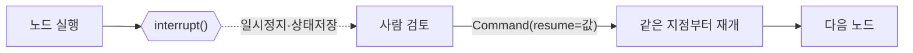

# 04. LangGraph 상태 그래프

[03장](03-langchain-basics.md)에서 본 LCEL은 **직선 파이프라인**에 강합니다. 하지만 에이전트는
직선이 아닙니다 — 모델이 도구를 부르면 실행하고, 결과를 다시 넣고, 끝날 때까지 **반복**합니다.
중간에 사람 승인을 받아야 할 수도 있습니다. 이런 **순환·분기·상태 누적**을 다루려면
그래프가 필요합니다. LangGraph는 에이전트를 **노드(계산 단위)와 엣지(흐름)의 상태 그래프**로
표현하며, 2026년 프로덕션 멀티에이전트의 사실상 기본 선택입니다([00장](00-landscape.md) 참고).

## 1. 핵심 3요소 — 상태, 노드, 엣지

LangGraph 프로그램은 세 가지로 구성됩니다.

| 요소 | 정의 | 코드 |
|------|------|------|
| **State** | 그래프를 흐르는 공유 데이터 | `TypedDict` + 리듀서 |
| **Node** | 상태를 받아 갱신분을 반환하는 함수 | `def node(state) -> dict` |
| **Edge** | 다음에 어느 노드로 갈지 | `add_edge` / `add_conditional_edges` |

노드는 **전체 상태를 반환하지 않습니다**. 바뀐 키만 담은 부분 dict를 반환하면, LangGraph가
**리듀서(reducer)** 규칙에 따라 기존 상태에 병합합니다.

## 2. 상태와 리듀서 — `add_messages`

메시지 리스트는 대화가 진행될수록 **누적**되어야 합니다. 매번 덮어쓰면 이전 맥락을 잃죠.
그래서 `messages` 필드에는 `add_messages` 리듀서를 붙입니다 — 반환된 메시지를 덮어쓰지 않고
**이어붙이는(append)** 규칙입니다.

```python
from typing import Annotated, TypedDict
from langgraph.graph.message import add_messages

class State(TypedDict):
    # Annotated[타입, 리듀서] — 이 필드는 병합 시 add_messages 규칙을 따른다
    messages: Annotated[list, add_messages]
```

!!! note "리듀서가 없으면?"
    리듀서를 지정하지 않은 필드는 **덮어쓰기(last-write-wins)** 가 기본입니다.
    카운터·플래그처럼 최신값만 필요하면 그대로 두고, 누적이 필요하면 `add_messages`나
    `operator.add` 같은 리듀서를 붙이세요.

## 3. 그래프 조립 — 노드·엣지·조건분기

`StateGraph`에 노드를 등록하고, `START`에서 시작해 `END`로 끝나는 흐름을 엣지로 잇습니다.
분기가 필요하면 `add_conditional_edges`에 **라우팅 함수**를 넘깁니다.

먼저 그래프에 등록할 두 노드를 정의합니다. 노드는 평범한 파이썬 함수이며, 1절에서 말한
대로 **바뀐 키만 담은 부분 dict**를 반환합니다(여기서는 `messages` 하나).

```python
from langchain_core.messages import ToolMessage

def call_model(state: State) -> dict:
    """모델 호출 노드: 응답 메시지 하나를 부분 dict로 반환한다."""
    response = model_with_tools.invoke(state["messages"])   # 03장의 .bind_tools 모델
    return {"messages": [response]}        # add_messages 리듀서가 뒤에 이어붙인다

def run_tools(state: State) -> dict:
    """도구 실행 노드: 마지막 AI 메시지의 tool_calls를 실행해 ToolMessage로 반환한다."""
    results = [
        ToolMessage(content=get_weather.invoke(call["args"]), tool_call_id=call["id"])
        for call in state["messages"][-1].tool_calls        # 03장의 @tool 함수 실행
    ]
    return {"messages": results}
```

이제 이 둘을 노드로 등록하고 엣지로 잇습니다.

```python
from langgraph.graph import StateGraph, START, END

def should_continue(state: State) -> str:
    last = state["messages"][-1]
    # 마지막 AI 메시지가 도구를 불렀으면 tools로, 아니면 종료
    return "tools" if last.tool_calls else END

builder = StateGraph(State)
builder.add_node("agent", call_model)      # 모델 호출 노드
builder.add_node("tools", run_tools)       # 도구 실행 노드
builder.add_edge(START, "agent")
builder.add_conditional_edges("agent", should_continue, ["tools", END])
builder.add_edge("tools", "agent")         # 도구 결과를 다시 모델로 (루프!)
graph = builder.compile()
```


`tools → agent` 엣지가 만드는 **순환**이 바로 [02장](02-tool-use-agent-loop.md)에서 손으로
짰던 에이전트 루프입니다. `compile()`은 이 그래프를 실행 가능한 `Runnable`로 변환합니다 —
즉 LangGraph 그래프도 `.invoke` / `.stream`을 그대로 씁니다.

## 4. 프리빌트 — `create_react_agent`

위 루프는 워낙 흔해서 LangGraph가 **미리 만들어** 뒀습니다. `create_react_agent`에 모델과
도구만 주면 위 그래프를 한 줄로 얻습니다.

```python
from langgraph.prebuilt import create_react_agent
from langchain_anthropic import ChatAnthropic

agent = create_react_agent(
    model=ChatAnthropic(model="claude-opus-4-8", max_tokens=1024),
    tools=[get_weather],           # 03장의 @tool 함수 재사용
)
result = agent.invoke({"messages": [("user", "서울 날씨 알려줘")]})
print(result["messages"][-1].content)
```

!!! tip "언제 프리빌트, 언제 직접"
    표준 ReAct 루프면 `create_react_agent`로 충분합니다. **커스텀 노드(검증·라우팅·다중
    모델)나 HITL 게이트**가 필요해지는 순간 `StateGraph`로 직접 조립하세요. 둘은
    자연스럽게 이어집니다 — 프리빌트로 시작해 필요할 때 풀어 헤치면 됩니다.

## 5. HITL — 중단(interrupt)과 재개(resume)

프로덕션 에이전트는 위험한 행동(결제, 삭제, 외부 전송) 전에 **사람 승인**을 받아야 합니다
([14장](14-permissions-security-hitl.md)에서 심화). LangGraph는 이를 그래프 수준에서 지원합니다.
노드 안에서 `interrupt(payload)`를 호출하면 실행이 **그 자리에서 멈추고**, 상태가
**체크포인터(checkpointer)** — 그래프 실행 상태를 스텝마다 저장해 두는 저장소로, 자세히는
[06장](06-short-term-memory.md)에서 다룹니다 — 에 저장됩니다. 나중에 `Command(resume=값)`으로
실행을 이어갑니다. 게임에 비유하면 세이브 파일(체크포인터)이 있어야 저장하고 껐다가
그 지점부터 다시 시작할 수 있는 것과 같습니다.

```python
from langgraph.types import interrupt, Command
from langgraph.checkpoint.memory import InMemorySaver

def approval_node(state: State):
    # 실행을 멈추고 사람에게 물어본다. resume 값이 decision으로 들어온다.
    decision = interrupt({"question": "이 송금을 승인하시겠습니까?", "amount": state["amount"]})
    return {"approved": decision == "yes"}

# ⚠️ interrupt는 체크포인터가 있어야 동작한다 (상태를 저장해 둬야 재개 가능)
graph = builder.compile(checkpointer=InMemorySaver())
config = {"configurable": {"thread_id": "tx-1"}}   # 스레드 단위로 상태 격리

# 1) 실행 → interrupt에서 멈춤
result = graph.invoke({"amount": 10000}, config=config)
print(result["__interrupt__"])          # 승인 요청 페이로드가 여기 담긴다

# 2) 사람 판단을 받아 재개 (같은 thread_id로!)
final = graph.invoke(Command(resume="yes"), config=config)
```



!!! warning "재개의 두 조건"
    (1) `interrupt`는 **체크포인터 없이는 동작하지 않습니다** — 상태를 저장해야 나중에
    복원할 수 있으니까요. (2) 재개할 때 **동일한 `thread_id`** 를 넘겨야 멈춘 그 대화를
    이어갑니다. 다른 thread_id면 새 실행이 됩니다. 체크포인터·스레드 개념은
    [06장](06-short-term-memory.md)에서 자세히 다룹니다.

## 따라하기

이 챕터에는 예제가 두 개입니다.

- [`examples/06_langgraph_basics.py`](https://github.com/agent-chobi/agent-atoz/blob/main/examples/06_langgraph_basics.py) —
  도구 1개를 가진 최소 에이전트를 `StateGraph`로 직접 조립하고, `create_react_agent`
  프리빌트와 비교합니다.
- [`examples/07_langgraph_hitl.py`](https://github.com/agent-chobi/agent-atoz/blob/main/examples/07_langgraph_hitl.py) —
  `interrupt`로 승인 게이트를 넣고 `Command(resume=...)`으로 재개하는 HITL 예제.

**1) 사전 준비**

```bash
pip install -r requirements.txt
copy .env.example .env        # macOS/Linux는 cp — ANTHROPIC_API_KEY 채우기
```

06번은 실제 모델을 호출하므로 API 키가 필요합니다. 07번은 **LLM 호출 없이** 그래프의
제어 흐름(interrupt/resume)만 시연하므로 키 없이도 돌아갑니다.

**2) 실행**

```bash
python examples/06_langgraph_basics.py
python examples/07_langgraph_hitl.py
```

**3) 기대 출력 요지**

- 06번: 프리빌트(A)와 직접 조립(B) **두 방식 모두** "서울: 맑음, 24도"라는 도구 결과가 반영된
  최종 답변을 출력합니다 — 같은 루프를 두 가지 방법으로 만들었음을 눈으로 확인합니다.
- 07번: 첫 `invoke`에서 `__interrupt__`에 담긴 승인 요청 페이로드가 출력되며 멈추고,
  `Command(resume="yes")`/`"no"` 두 경로로 재개했을 때 각각 "송금 실행"과 "송금 취소"류의
  다른 결말을 보여줍니다.

**4) 흔한 에러**

| 증상 | 원인 → 해결 |
|------|-------------|
| 06번에서 인증 오류(401) | `.env`에 `ANTHROPIC_API_KEY` 미설정 |
| `interrupt` 이후 재개가 안 되고 처음부터 다시 실행됨 | 재개 시 **다른 `thread_id`** 를 넘김 → 멈췄을 때와 같은 `config` 사용 |
| `interrupt`가 그냥 무시됨 | `compile(checkpointer=...)` 누락 → 체크포인터 없이는 동작하지 않음 |
| 프로세스를 껐다 켜니 재개 불가 | `InMemorySaver`는 RAM에만 저장 → 영속 재개는 06장의 `SqliteSaver` 등으로 |

## 실무 트레이드오프

4절의 팁("표준 루프면 프리빌트, 커스텀이 필요하면 직접")을 항목별로 펼치면 이렇습니다.

| 기준 | `create_react_agent` (프리빌트) | `StateGraph` 직접 조립 |
|------|--------------------------------|------------------------|
| 착수 속도 | 몇 줄로 완성 | 상태·노드·엣지 설계 필요 |
| 커스텀 노드(검증·라우팅·다중 모델) | 제한적 — 파라미터가 허용하는 범위 내 | 자유 — 임의의 함수를 노드로 |
| HITL 게이트 위치 | 루프 구조가 고정돼 삽입 지점 제한 | 임의의 노드 사이에 승인 게이트 삽입 |
| 상태 스키마 | 표준 `messages` 중심 | `TypedDict`로 임의 필드 추가 |
| 학습 곡선 | 낮음 | 그래프 개념 학습 필요 |
| 유지보수 | 프레임워크 업데이트를 따라감(1.0에서 `create_agent`로 개명) | 코어 API(`StateGraph`)는 안정적, 대신 내 코드는 내 책임 |

프리빌트로 시작해서, 위 표의 오른쪽 열이 필요해지는 **첫 순간**에 풀어 헤치는 것이
정석 경로입니다.

## 2026 실무 트렌드

- **LangGraph 1.0 GA(2025-10)** — 기존 API의 파괴적 변경 없이 1.0에 도달했고, durable
  execution(체크포인트 기반 상태 영속화)과 내장 HITL이 핵심 가치로 자리잡았습니다.
- **`create_react_agent` → `create_agent`** — `langgraph.prebuilt.create_react_agent`는
  deprecated 경로가 되었고, 신규 코드는 `from langchain.agents import create_agent`가
  권장됩니다(동일하게 LangGraph 런타임 위에서 동작). 기존 코드는 계속 돌지만 새 문서·예제는
  `create_agent` 기준입니다.
- **대기업 프로덕션 채택의 표준화** — Klarna(8,500만 사용자 고객지원), Uber(테스트 자동화로
  약 21,000 개발자-시간 절감), LinkedIn(계층형 supervisor 채용 에이전트), Replit 등이 공식
  케이스 스터디로 문서화되며 "LangGraph = 프로덕션 에이전트 기본기" 인식이 굳어졌습니다.
- **배포 인프라 재편** — LangGraph Platform이 2025년 하반기 **LangSmith Deployment**로
  리브랜딩되어, 장기 실행·스테이트풀 에이전트를 Cloud/Self-hosted/컨테이너 세 모델로
  배포하는 것이 기본 패턴이 됐습니다.

## 실전 레퍼런스

- [How Klarna's AI assistant redefined customer support at scale](https://www.langchain.com/blog/customers-klarna) —
  상담사 700명 분 업무를 처리하는 Klarna 어시스턴트의 LangGraph 공식 케이스 스터디.
- [How Uber Built AI Agents That Save 21,000 Developer Hours (YouTube)](https://www.youtube.com/watch?v=Bugs0dVcNI8) —
  Uber의 단위 테스트 자동 생성 에이전트 네트워크를 다룬 LangChain Interrupt 컨퍼런스 발표.
- [How LinkedIn Built Their First AI Agent for Hiring (YouTube)](https://www.youtube.com/watch?v=NmblVxyBhi8) —
  LinkedIn Hiring Assistant의 supervisor–서브에이전트 계층 설계 발표.
- [Is LangGraph Used in Production?](https://blog.langchain.com/is-langgraph-used-in-production/) —
  Replit·Uber·LinkedIn·Elastic 등 실제 프로덕션 도입 사례를 모은 공식 블로그.
- [LangGraph Platform is now Generally Available](https://www.langchain.com/blog/langgraph-platform-ga) —
  스테이트풀 에이전트 배포 인프라(현 LangSmith Deployment)의 GA 발표.

### 함께 보면 좋은 한국어 자료

- [LangGraph 개념 완전 정복 몰아보기(3시간) — 테디노트 (YouTube)](https://www.youtube.com/watch?v=W_uwR_yx4-c) — 상태·노드·엣지부터 조건분기·메모리까지, 이 챕터의 핵심 3요소를 한국어 강의로 몰아 배우는 영상.
- [LangGraph를 활용한 Agent 구축 — <랭체인LangChain 노트> WikiDocs](https://wikidocs.net/264624) — StateGraph로 에이전트를 조립하는 과정을 한국어 실습 코드로 따라가는 무료 책의 해당 장.
- [LangGraph 가이드북 - 에이전트 RAG with 랭그래프 — WikiDocs](https://wikidocs.net/book/16723) — LangGraph 기초부터 ReAct 에이전트·HITL·멀티에이전트까지 다루는 무료 한국어 책.
- [LangChain의 새로운 라이브러리 LangGraph 훑어보기 — 에스코어](https://s-core.co.kr/insight/view/langchain%EC%9D%98-%EC%83%88%EB%A1%9C%EC%9A%B4-%EB%9D%BC%EC%9D%B4%EB%B8%8C%EB%9F%AC%EB%A6%AC-langgraph-%ED%9B%91%EC%96%B4%EB%B3%B4%EA%B8%B0/) — LangChain만으로는 왜 부족하고 그래프 구조가 왜 필요한지를 국내 기업 기술블로그 시각에서 정리.

## 참고 자료

- [LangGraph 개요 (OSS Python)](https://docs.langchain.com/oss/python/langgraph/overview)
- [Human-in-the-loop / Interrupts](https://docs.langchain.com/oss/python/langgraph/interrupts)
- [create_react_agent 레퍼런스](https://reference.langchain.com/python/langgraph.prebuilt/chat_agent_executor/create_react_agent)
- [상태·리듀서(add_messages) 개념](https://docs.langchain.com/oss/python/langgraph/graph-api)
