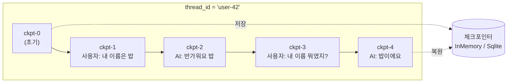
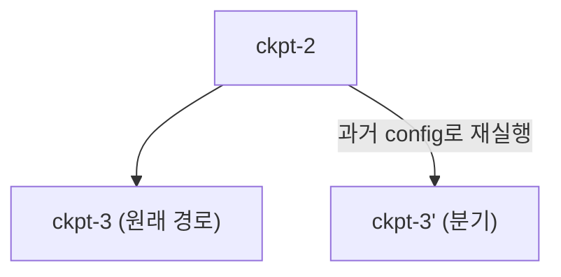

# 06. 단기 메모리 (체크포인터)

에이전트가 "방금 무슨 얘기를 했지?"를 기억하려면 **대화 한 세션(thread)의 상태를
어딘가에 저장**해야 합니다. LangGraph에서 이 역할을 하는 것이 **체크포인터(checkpointer)**
입니다. 그래프가 노드를 한 스텝 실행할 때마다 상태 스냅샷을 저장하고, 같은 `thread_id`로
다시 호출하면 그 상태를 이어받습니다. 이것이 **단기 메모리** — 하나의 스레드 안에서만
유지되는, 대화 맥락의 영속화입니다.

!!! note "단기 vs 장기 한 줄 정리"
    - **단기(이 챕터)** = *thread 단위* 체크포인터. "이 대화"의 메시지·상태를 잇는다.
    - **장기([07장](07-long-term-memory.md))** = *cross-thread* 스토어. "이 사용자"에 대한 사실을
      여러 대화에 걸쳐 기억한다.

## 1. 체크포인터란

체크포인터는 그래프의 각 **super-step**마다 상태를 **체크포인트(checkpoint)**로 저장합니다.
체크포인트에는 그 시점의 채널 값(예: `messages`), 다음 실행할 노드, 메타데이터가 담깁니다.
게임의 **세이브 파일**과 같은 개념입니다 — 매 장면(스텝)마다 자동 저장되고, 같은 슬롯
(`thread_id`)을 열면 마지막 지점부터 이어서 플레이하며, 과거 세이브로 되돌아갈 수도 있습니다.



같은 `thread_id`로 그래프를 다시 호출하면 마지막 체크포인트에서 상태를 **복원**하므로,
이전 대화를 프롬프트에 수동으로 다시 넣지 않아도 됩니다.

## 2. 체크포인터 종류

| 클래스 | import | 저장 위치 | 용도 |
|--------|--------|-----------|------|
| `InMemorySaver` | `langgraph.checkpoint.memory` | RAM(프로세스 메모리) | 테스트·데모. 재시작하면 사라짐 |
| `SqliteSaver` | `langgraph.checkpoint.sqlite` | 로컬 `.sqlite` 파일 | 단일 노드 개발·소규모 영속화 |
| `AsyncSqliteSaver` | `langgraph.checkpoint.sqlite.aio` | 로컬 파일(async) | 비동기 앱 |
| `PostgresSaver` | `langgraph.checkpoint.postgres` | Postgres | 프로덕션·다중 인스턴스 |

!!! warning "설치 주의"
    `SqliteSaver`는 코어에 없습니다. 별도 패키지가 필요합니다:
    `pip install langgraph-checkpoint-sqlite`. 이 저장소의 `requirements.txt`에 포함돼 있습니다.

```python
# InMemory — 가장 간단
from langgraph.checkpoint.memory import InMemorySaver
checkpointer = InMemorySaver()

# Sqlite — 파일로 영속화 (컨텍스트 매니저)
from langgraph.checkpoint.sqlite import SqliteSaver
with SqliteSaver.from_conn_string("checkpoints.sqlite") as checkpointer:
    agent = create_react_agent(model, tools, checkpointer=checkpointer)
    ...
```

## 3. thread_id — 대화의 열쇠

체크포인터를 붙였다면, 호출할 때 **어떤 스레드인지**를 `config`로 알려줘야 합니다.

```python
config = {"configurable": {"thread_id": "user-42"}}
agent.invoke({"messages": [("user", "내 이름은 밥이야")]}, config)
agent.invoke({"messages": [("user", "내 이름 뭐였지?")]}, config)  # → "밥"
```

`thread_id`가 다르면 완전히 별개의 대화입니다. 한 사용자의 여러 세션을 구분하거나,
멀티 유저 서비스에서 사용자별 대화를 격리할 때 이 값을 키로 씁니다.

!!! tip "thread_id 설계"
    실무에선 `f"{user_id}:{session_id}"`처럼 조합해 씁니다. 값은 255자 미만으로 유지하세요.

## 4. 상태 조회 · 타임트래블 · 수정

체크포인터가 있으면 컴파일된 그래프에서 세 가지 강력한 API가 열립니다.

### get_state — 현재 스냅샷

```python
snap = agent.get_state(config)
snap.values      # 현재 채널 값 (예: {"messages": [...]})
snap.next        # 다음에 실행될 노드 (비어 있으면 완료)
snap.config      # 이 스냅샷의 checkpoint_id 포함
```

### get_state_history — 타임트래블

과거 모든 체크포인트를 **최신→과거 순**으로 순회합니다. 각 스냅샷은 자신의
`checkpoint_id`를 갖고 있어, 특정 시점으로 **되감기(replay)**할 수 있습니다.

```python
for snap in agent.get_state_history(config):
    print(snap.config["configurable"]["checkpoint_id"], snap.next)
```

### 되감기(replay)와 분기(fork)

과거 스냅샷의 `config`(= checkpoint_id 포함)를 그대로 `invoke`에 넘기면 그 시점부터
**다시 실행**합니다. 여기에 다른 입력을 주면 "만약 그때 다르게 답했다면?"의 분기가 생깁니다.



### update_state — 상태 직접 수정

사람이 개입(HITL)해 상태를 고쳐 넣을 때 씁니다. 리듀서가 있는 채널(`messages` 등)은
리듀서 규칙에 따라 병합됩니다.

```python
agent.update_state(config, {"messages": [("user", "정정: 내 이름은 로버트야")]})
```

## 5. resume — 중단된 실행 이어가기

`interrupt`([04장](04-langgraph-state-graph.md))로 그래프가 사람 승인을 기다리며 멈추면,
그 상태가 체크포인트에 저장됩니다. 나중에 같은 `thread_id`로 `Command(resume=...)`을 주면
**멈춘 지점부터** 이어서 실행합니다. 즉 단기 메모리는 HITL의 기술적 토대이기도 합니다.

## 따라하기

이 챕터의 예제는 [`examples/09_short_term_memory.py`](https://github.com/agent-chobi/agent-atoz/blob/main/examples/09_short_term_memory.py)
입니다 — `create_react_agent` + `SqliteSaver`로 같은 `thread_id`에서 멀티턴 기억을 유지하고,
`get_state_history`로 타임트래블을 출력합니다. (예제↔챕터 대응은
[매핑표](https://github.com/agent-chobi/agent-atoz/blob/main/examples/README.md) 참고)

**1) 사전 준비**

```bash
pip install -r requirements.txt   # langgraph-checkpoint-sqlite 포함
copy .env.example .env            # macOS/Linux는 cp — ANTHROPIC_API_KEY 채우기
```

**2) 실행**

```bash
python examples/09_short_term_memory.py
```

**3) 기대 출력 요지**

- 같은 thread에서 세 턴: 이름("밥")과 색("파랑")을 알려준 뒤 되물으면 에이전트가 **기억해서**
  답합니다.
- `get_state` 스냅샷: 누적 메시지 개수와 다음 실행 노드(완료면 빈 값)가 출력됩니다.
- 타임트래블: 과거 체크포인트가 최신→과거 순으로 나열되며, 스텝마다 메시지 수가 늘어난
  흔적이 보입니다.
- 다른 `thread_id`: 같은 질문에 "모른다"고 답합니다 — 스레드 격리의 증명.

**4) 흔한 에러**

| 증상 | 원인 → 해결 |
|------|-------------|
| `ANTHROPIC_API_KEY 가 설정되지 않았습니다` (SystemExit) | `.env` 미작성 → 키 입력 |
| `ModuleNotFoundError: langgraph.checkpoint.sqlite` | `SqliteSaver`는 코어에 없음 → `pip install langgraph-checkpoint-sqlite` (requirements.txt에 포함) |
| 재실행했더니 이전 실행의 대화가 이어짐 | 정상 동작 — `checkpoints.sqlite` 파일에 영속화됨. 초기화하려면 파일 삭제 |

## 실무 트레이드오프

세 저장소는 기능이 같고 **운영 특성**이 다릅니다. "어디에 저장되는가"가 곧
"어떤 서비스까지 감당하는가"를 결정합니다.

| 기준 | `InMemorySaver` | `SqliteSaver` | `PostgresSaver` |
|------|-----------------|---------------|-----------------|
| 영속성 | 프로세스 종료 시 소멸 | 로컬 파일로 유지 | DB 서버에 유지 |
| 동시성·다중 인스턴스 | 불가(단일 프로세스) | 단일 노드 위주 | 다중 워커·수평 확장 |
| 운영 부담 | 없음 | 거의 없음(파일 하나) | 백업·마이그레이션·모니터링 필요 |
| 설치 | 코어 포함 | `langgraph-checkpoint-sqlite` | `langgraph-checkpoint-postgres` + 최초 `.setup()` |
| 적합 | 단위 테스트·노트북 데모 | CLI 앱·소규모 영속화 | 프로덕션 웹 서비스 |

운영을 직접 감당하기 싫다면 관리형(LangSmith Deployment, 구 LangGraph Platform)이
체크포인터를 대신 운영해 줍니다.

!!! danger "단기 메모리의 한계"
    스레드가 길어지면 `messages`가 무한정 쌓여 컨텍스트 창을 넘고 비용이 폭증합니다.
    체크포인터는 "저장"만 할 뿐 "줄이기"는 하지 않습니다. 압축·요약은
    [08장 컨텍스트 엔지니어링](08-context-engineering.md)에서 다룹니다.

## 2026 실무 트렌드

- **"개발은 InMemory/Sqlite, 프로덕션은 Postgres"가 공식 권고로 정착** — 공식 레퍼런스
  문서가 `InMemorySaver`를 "디버깅·테스트 전용"으로 명시하고, 프로덕션에는
  `PostgresSaver`(또는 관리형 배포)를 권합니다.
- **체크포인터 백엔드 생태계 확장** — Redis가 `langgraph-checkpoint-redis`를 공식 지원하며
  저지연 읽기/쓰기·TTL 자동 만료를 내세우고, AWS도 `langgraph-checkpoint-aws`와 DynamoDB
  기반 내구성 에이전트 패턴을 내놓는 등 벤더 공식 구현이 경쟁 중입니다.
- **체크포인터가 보안 공격면으로 부상** — 2026년 Check Point Research가 SQLite/Redis
  체크포인터의 SQL 인젝션 + 역직렬화 체인으로 원격 코드 실행이 가능함을 공개했습니다
  (이후 패치됨). 체크포인터 라이브러리의 **버전 고정과 신속한 업그레이드**, 그리고
  `get_state_history` 필터에 사용자 입력을 그대로 넘기지 않기가 실무 수칙이 됐습니다.

## 실전 레퍼런스

- [Build smarter AI agents with LangGraph and Redis](https://redis.io/blog/langgraph-redis-build-smarter-ai-agents-with-memory-persistence/) —
  Redis 체크포인터(단기) + Redis Store(장기) 조합을 다룬 벤더 공식 가이드.
- [From SQLi to RCE: Exploiting LangGraph's Checkpointer](https://research.checkpoint.com/2026/from-sqli-to-rce-exploiting-langgraphs-checkpointer/) —
  체크포인터 취약점 체인을 분석한 Check Point Research 기술 블로그(패치 완료된 사례 연구).
- [Build durable AI agents with LangGraph and Amazon DynamoDB](https://aws.amazon.com/blogs/database/build-durable-ai-agents-with-langgraph-and-amazon-dynamodb/) —
  DynamoDB를 체크포인터 백엔드로 쓰는 AWS 공식 블로그.
- [LangGraph v0.2: 새 체크포인터 라이브러리](https://blog.langchain.com/langgraph-v0-2/) —
  체크포인터가 `checkpoint-sqlite`/`checkpoint-postgres` 별도 패키지로 분리된 배경(공식 블로그).

## 참고 자료

- [LangGraph Persistence](https://docs.langchain.com/oss/python/langgraph/persistence)
- [Checkpointers 레퍼런스](https://reference.langchain.com/python/langgraph/checkpoints)
- [langgraph-checkpoint-sqlite (PyPI)](https://pypi.org/project/langgraph-checkpoint-sqlite/)
- [Time Travel — LangGraph](https://langchain-ai.github.io/langgraph/how-tos/human_in_the_loop/time-travel/)
