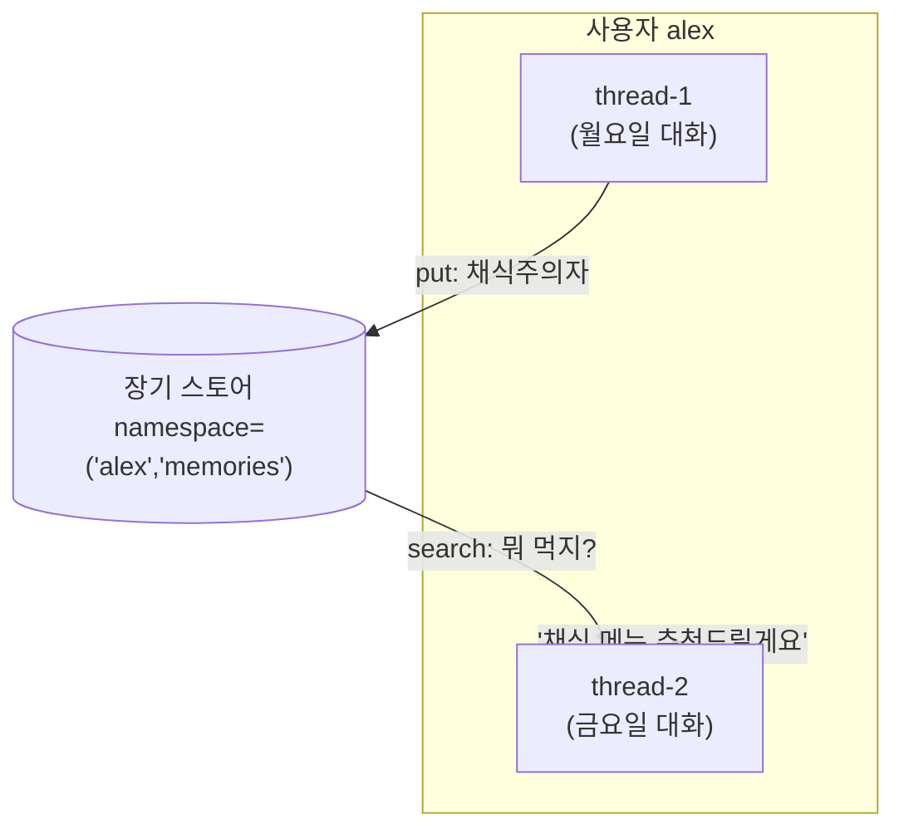
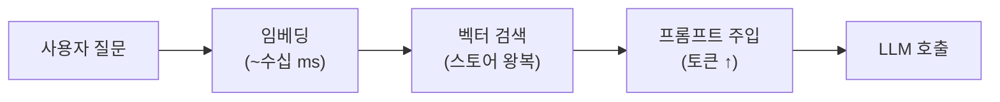

# 07. 장기 메모리 (스토어)

단기 메모리([06장](06-short-term-memory.md))는 *하나의 대화(thread)* 안에서만 유효합니다.
하지만 사람에게 "지난주에 말했던 그 알레르기 있으시죠?"라고 물으면, 우리는 **다른 날, 다른
대화**의 사실을 떠올립니다. 에이전트에게 이 능력을 주는 것이 **장기 메모리** — 스레드를
가로지르는(cross-thread) **스토어(store)**입니다.



## 1. LangGraph 스토어: BaseStore / InMemoryStore

`BaseStore`는 **네임스페이스로 구획된 key-value 저장소**입니다. `InMemoryStore`는 그 개발용
구현체(재시작하면 소멸)이며, 프로덕션에선 `PostgresStore`·`RedisStore` 등을 씁니다.

```python
from langgraph.store.memory import InMemoryStore

store = InMemoryStore()
namespace = ("alex", "memories")          # (user_id, 카테고리) 튜플

store.put(namespace, "diet", {"food": "채식", "allergy": "견과류"})
item = store.get(namespace, "diet")        # 단건 조회
hits = store.search(namespace, query="점심 뭐 먹을까")  # 의미 검색(임베딩 설정 시)
```

- **namespace**: 임의 길이의 튜플. `(user_id, ...)`, `(org, user, project)` 등 자유롭게 계층화.
- **put/get/search**: 저장·단건조회·검색. `search`는 메타데이터 필터와 **벡터 유사도 검색**을
  모두 지원합니다(임베딩 인덱스를 붙였을 때).

의미 검색을 켜려면 임베딩 인덱스를 지정합니다:

```python
store = InMemoryStore(index={"dims": 1536, "embed": "openai:text-embedding-3-small"})
```

그래프 컴파일 시 `store`를 넘기면 노드 함수에 자동 주입되어, 노드 안에서 사용자 기억을
읽고 쓸 수 있습니다.

```python
graph = builder.compile(checkpointer=checkpointer, store=store)
```

## 2. 기억의 3분류

인지과학의 분류를 에이전트에 대응시키면 무엇을 저장할지 명확해집니다.

| 유형 | 무엇 | 에이전트 예시 | 저장 방식 |
|------|------|---------------|-----------|
| **의미(semantic)** | 사실·프로필 | "사용자는 채식주의자" | 프로필 문서 / 사실 컬렉션 |
| **에피소드(episodic)** | 과거 경험·사례 | "지난번 이렇게 풀어서 성공함" | few-shot 예시로 회상 |
| **절차(procedural)** | 방법·규칙 | "이 사용자에겐 존댓말로" | 시스템 프롬프트에 반영 |

!!! tip "무엇을 언제 쓸까"
    - 개인화·프로필 → **의미**
    - "예전에 어떻게 했더라" 학습 → **에피소드**
    - 에이전트 자기개선(프롬프트 진화) → **절차**

## 3. 두 접근: LangMem vs mem0

메모리를 직접 다루는 대신, 저장·검색·정리를 도와주는 라이브러리가 있습니다.

### LangMem (LangChain 생태계)

LangGraph 스토어 위에서 동작하는 **도구(tool)**를 제공합니다. 에이전트가 스스로 "저장할지"
판단해 도구를 호출합니다.

```python
from langmem import create_manage_memory_tool, create_search_memory_tool

tools = [
    create_manage_memory_tool(namespace=("memories", "{user_id}")),  # 저장/수정/삭제
    create_search_memory_tool(namespace=("memories", "{user_id}")),  # 검색
]
agent = create_react_agent(model, tools=tools, store=store)
```

- LangGraph `store`에 그대로 얹힘 → 체크포인터/스토어와 자연스럽게 통합.
- `{user_id}` 같은 **동적 네임스페이스** 템플릿 지원.
- 백그라운드로 대화에서 기억을 자동 추출하는 유틸도 제공.

### mem0 (독립 메모리 레이어)

프레임워크 독립적인 **전용 메모리 서비스**. `add`/`search` 두 API가 핵심이며, 내부적으로
LLM으로 대화를 요약·추출해 저장합니다.

```python
from mem0 import Memory

m = Memory()
m.add(messages, user_id="alex")                       # 대화에서 사실 추출·저장
results = m.search("식성이 어떻게 되지?", user_id="alex")  # 관련 기억 검색
```

- 오픈소스 `Memory`(self-host) / 클라우드 `MemoryClient` 두 형태.
- 벡터 DB + (선택) 그래프 저장으로 관계까지 기억.
- 프레임워크에 종속되지 않아 LangGraph·CrewAI·직접 구현 어디든 붙임.

### 비교

| 항목 | LangMem | mem0 |
|------|---------|------|
| 포지션 | LangGraph 스토어 위 도구 | 독립 메모리 레이어 |
| 저장 백엔드 | BaseStore(Postgres/Redis 등) | 자체 벡터/그래프 스토어 |
| 통합 | LangGraph에 밀착 | 프레임워크 무관 |
| 추출 | 도구 기반 + 백그라운드 | add 시 LLM 자동 추출 |
| 적합 | 이미 LangGraph 사용 중 | 스택 독립·이식성 중시 |

## 4. 지연·성능 트레이드오프

장기 메모리는 공짜가 아닙니다. **매 턴 검색**은 지연과 비용을 더합니다.



!!! warning "실전 체크리스트"
    - **검색을 매 턴 하지 말 것** — 필요할 때만(도구 호출/라우팅으로) 회상.
    - **top-k를 작게** — 너무 많이 주입하면 [08장](08-context-engineering.md)의 "컨텍스트
      과부하"로 오히려 성능 저하.
    - **쓰기는 비동기/백그라운드로** — 사용자 응답 경로를 막지 않게.
    - **InMemory는 데모용** — 프로덕션은 Postgres/Redis 등 영속 스토어.

## 실습 코드

`examples/10_long_term_memory.py` — `InMemoryStore`에 사용자 선호를 저장하고, **다른
thread**에서 회상하는 예제. (LangMem/mem0가 없어도 순수 스토어로 동작)
([매핑표](../examples/README.md) 참고)

```bash
python examples/10_long_term_memory.py
```

## 참고 자료

- [LangGraph Memory (스토어)](https://docs.langchain.com/oss/python/langgraph/add-memory)
- [Semantic Search for LangGraph Memory](https://blog.langchain.com/semantic-search-for-langgraph-memory/)
- [LangMem 문서](https://langchain-ai.github.io/langmem/)
- [mem0 (GitHub)](https://github.com/mem0ai/mem0)
