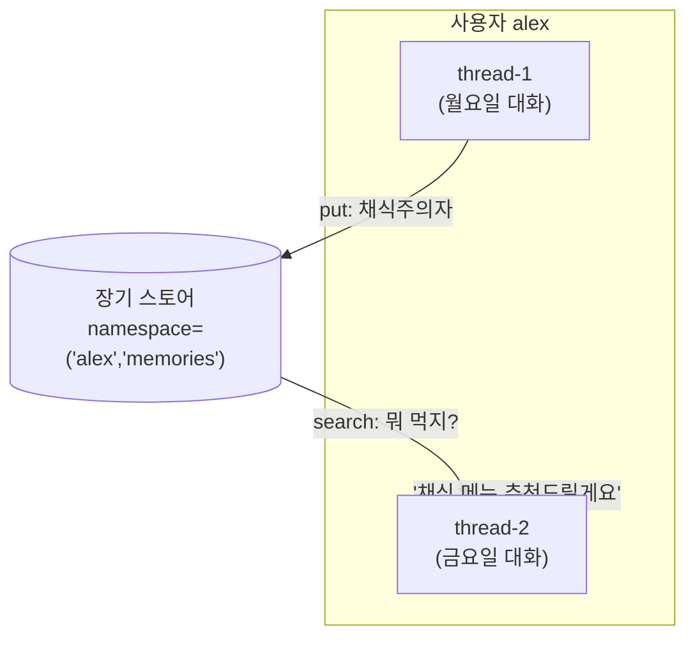
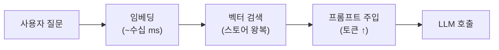

# 07. 장기 메모리 (스토어)

단기 메모리([06장](06-short-term-memory.md))는 *하나의 대화(thread)* 안에서만 유효합니다.
하지만 사람에게 "지난주에 말했던 그 알레르기 있으시죠?"라고 물으면, 우리는 **다른 날, 다른
대화**의 사실을 떠올립니다. 에이전트에게 이 능력을 주는 것이 **장기 메모리** — 스레드를
가로지르는(cross-thread) **스토어(store)**입니다.



## 1. LangGraph 스토어: BaseStore / InMemoryStore

`BaseStore`는 **네임스페이스로 구획된 key-value 저장소**입니다. `InMemoryStore`는 그 개발용
구현체(재시작하면 소멸)이며, 프로덕션에선 `PostgresStore`·`RedisStore` 등을 씁니다.

```python
from langgraph.store.memory import InMemoryStore

store = InMemoryStore()
namespace = ("alex", "memories")          # (user_id, 카테고리) 튜플

store.put(namespace, "diet", {"food": "채식", "allergy": "견과류"})
item = store.get(namespace, "diet")        # 단건 조회
hits = store.search(namespace, query="점심 뭐 먹을까")  # 의미 검색(임베딩 설정 시)
```

- **namespace**: 임의 길이의 튜플. `(user_id, ...)`, `(org, user, project)` 등 자유롭게 계층화.
- **put/get/search**: 저장·단건조회·검색. `search`는 메타데이터 필터와 **벡터 유사도 검색**을
  모두 지원합니다(임베딩 인덱스를 붙였을 때).

의미 검색을 켜려면 임베딩 인덱스를 지정합니다:

```python
store = InMemoryStore(index={"dims": 1536, "embed": "openai:text-embedding-3-small"})
```

!!! warning "의미 검색에는 OPENAI_API_KEY가 필요하다"
    `"openai:text-embedding-3-small"`은 **OpenAI 임베딩 API**를 호출합니다. 따라서 `.env`에
    `ANTHROPIC_API_KEY`와 **별도로** `OPENAI_API_KEY=sk-...` 를 추가해야 합니다(Anthropic은
    임베딩 모델을 제공하지 않아, 임베딩만 다른 프로바이더를 빌려 쓰는 구성이 흔합니다).
    키가 없으면 `put()` 시점(임베딩 계산)에 인증 오류가 납니다. 이 저장소의 예제 10번은
    키가 없으면 의미 검색 부분을 건너뛰도록 작성돼 있습니다.

그래프 컴파일 시 `store`를 넘기면 노드 함수에 자동 주입되어, 노드 안에서 사용자 기억을
읽고 쓸 수 있습니다.

```python
graph = builder.compile(checkpointer=checkpointer, store=store)
```

## 2. 기억의 3분류

인지과학의 분류를 에이전트에 대응시키면 무엇을 저장할지 명확해집니다.

| 유형 | 무엇 | 에이전트 예시 | 저장 방식 |
|------|------|---------------|-----------|
| **의미(semantic)** | 사실·프로필 | "사용자는 채식주의자" | 프로필 문서 / 사실 컬렉션 |
| **에피소드(episodic)** | 과거 경험·사례 | "지난번 이렇게 풀어서 성공함" | few-shot 예시로 회상 |
| **절차(procedural)** | 방법·규칙 | "이 사용자에겐 존댓말로" | 시스템 프롬프트에 반영 |

!!! tip "무엇을 언제 쓸까"
    - 개인화·프로필 → **의미**
    - "예전에 어떻게 했더라" 학습 → **에피소드**
    - 에이전트 자기개선(프롬프트 진화) → **절차**

## 3. 두 접근: LangMem vs mem0

메모리를 직접 다루는 대신, 저장·검색·정리를 도와주는 라이브러리가 있습니다.

### LangMem (LangChain 생태계)

LangGraph 스토어 위에서 동작하는 **도구(tool)**를 제공합니다. 에이전트가 스스로 "저장할지"
판단해 도구를 호출합니다.

```python
from langmem import create_manage_memory_tool, create_search_memory_tool

tools = [
    create_manage_memory_tool(namespace=("memories", "{user_id}")),  # 저장/수정/삭제
    create_search_memory_tool(namespace=("memories", "{user_id}")),  # 검색
]
agent = create_react_agent(model, tools=tools, store=store)
```

- LangGraph `store`에 그대로 얹힘 → 체크포인터/스토어와 자연스럽게 통합.
- `{user_id}` 같은 **동적 네임스페이스** 템플릿 지원.
- 백그라운드로 대화에서 기억을 자동 추출하는 유틸도 제공.

### mem0 (독립 메모리 레이어)

프레임워크 독립적인 **전용 메모리 서비스**. `add`/`search` 두 API가 핵심이며, 내부적으로
LLM으로 대화를 요약·추출해 저장합니다.

```python
from mem0 import Memory

m = Memory()
m.add(messages, user_id="alex")                       # 대화에서 사실 추출·저장
results = m.search("식성이 어떻게 되지?", user_id="alex")  # 관련 기억 검색
```

- 오픈소스 `Memory`(self-host) / 클라우드 `MemoryClient` 두 형태.
- 벡터 DB + (선택) 그래프 저장으로 관계까지 기억.
- 프레임워크에 종속되지 않아 LangGraph·CrewAI·직접 구현 어디든 붙임.

두 라이브러리(그리고 "라이브러리 없이 직접")의 상세 비교는 아래 **실무 트레이드오프**
섹션의 표에서 다룹니다.

## 4. 지연·성능 트레이드오프

장기 메모리는 공짜가 아닙니다. **매 턴 검색**은 지연과 비용을 더합니다.



!!! warning "실전 체크리스트"
    - **검색을 매 턴 하지 말 것** — 필요할 때만(도구 호출/라우팅으로) 회상.
    - **top-k를 작게** — 너무 많이 주입하면 [08장](08-context-engineering.md)의 "컨텍스트
      과부하"로 오히려 성능 저하.
    - **쓰기는 비동기/백그라운드로** — 사용자 응답 경로를 막지 않게.
    - **InMemory는 데모용** — 프로덕션은 Postgres/Redis 등 영속 스토어.

## 따라하기

이 챕터의 예제는 [`examples/10_long_term_memory.py`](https://github.com/agent-chobi/agent-atoz/blob/main/examples/10_long_term_memory.py)
입니다 — `InMemoryStore`에 사용자 선호를 저장하고 **다른 thread**에서 회상합니다.
LangMem/mem0가 없어도 순수 스토어만으로 동작합니다. (예제↔챕터 대응은
[매핑표](https://github.com/agent-chobi/agent-atoz/blob/main/examples/README.md) 참고)

**1) 사전 준비**

```bash
pip install -r requirements.txt
copy .env.example .env    # macOS/Linux는 cp
```

`.env`에 채울 키는 데모 범위에 따라 다릅니다.

- 순수 스토어 데모(1부): 키 **불필요** — LLM 호출 없이 put/get/search만 시연.
- 의미 검색 부분: **`OPENAI_API_KEY`** 필요(임베딩용). 없으면 자동으로 건너뜁니다.
- langmem 에이전트 데모(선택): `ANTHROPIC_API_KEY` 필요.

**2) 실행**

```bash
python examples/10_long_term_memory.py
```

**3) 기대 출력 요지**

- 1부: `put()`으로 저장한 식성·언어 선호를, 전혀 다른 대화(thread)를 가정한 코드에서
  `get()`/`search()`로 회상해 출력합니다 — cross-thread 기억의 증명.
- (키 설정 시) 의미 검색: "점심 뭐 먹지?" 같은 **다른 표현**의 질의로도 관련 기억이 검색됩니다.
- (langmem 설치 시) 에이전트가 스스로 메모리 도구를 호출해 저장·검색하는 과정이 출력됩니다.

**4) 흔한 에러**

| 증상 | 원인 → 해결 |
|------|-------------|
| 의미 검색에서 인증 오류 / 해당 부분이 건너뛰어짐 | **`OPENAI_API_KEY` 미설정** — 이 예제의 대표 함정. `.env`에 추가 (임베딩은 OpenAI API 사용) |
| `ModuleNotFoundError: langmem` | 선택 의존성 — 없어도 1부는 동작. 필요하면 `pip install langmem` |
| 재실행하면 기억이 사라짐 | 정상 — `InMemoryStore`는 RAM 저장. 영속화는 `PostgresStore` 등으로 |

## 실무 트레이드오프

장기 메모리를 도입하는 세 가지 경로 — 라이브러리 둘, 그리고 직접 구현 — 의 비교입니다.
(호출당 지연 구조는 위 4절의 다이어그램 참고.)

| 항목 | LangMem | mem0 | 직접 구현 (BaseStore만) |
|------|---------|------|------------------------|
| 포지션 | LangGraph 스토어 위의 도구 | 독립 메모리 레이어 | 내 코드 |
| 저장 백엔드 | BaseStore(Postgres/Redis 등) | 자체 벡터/그래프 스토어 | BaseStore 그대로 |
| 기억 추출 | 도구 기반 + 백그라운드 유틸 | `add()` 시 LLM 자동 추출 | 직접 설계(추출용 LLM 호출 등) |
| 지연 특성 | 도구 호출 = 에이전트 턴 **안에서** 추가 LLM 왕복 발생 | 추출은 `add()` 쪽에 몰림 — 자사 벤치마크 기준 full-context 대비 p95 응답 지연 약 91% 절감 주장(참고치) | `put`/`get` 자체는 ms 단위, 임베딩·추출을 붙이는 만큼 수십~수백 ms 가산 |
| 통합·이식성 | LangGraph에 밀착 | 프레임워크 무관 | 스택 무관, 전부 내 책임 |
| 적합 | 이미 LangGraph 사용 중 | 스택 독립·이식성 중시 | 요구가 단순할 때(프로필 몇 건 수준) |

!!! warning "벤더 벤치마크 수치는 참고치"
    메모리 라이브러리들의 정확도·지연 수치(LoCoMo 등)는 **벤더 자체 평가**가 대부분이고,
    평가 설정을 두고 벤더 간 공방(mem0의 SOTA 주장 vs Zep의 반박)이 진행 중입니다.
    도입 결정 전에 반드시 **자기 워크로드로 직접 측정**하세요.

## 2026 실무 트렌드

- **메모리 레이어가 독립 인프라 카테고리로** — mem0가 2025년 10월 $24M 시리즈 A를 유치했고,
  AWS Agent SDK의 메모리 프로바이더 채택, CrewAI·Flowise 등 네이티브 통합이 이어지며
  "메모리는 별도 레이어"라는 구도가 굳어졌습니다.
- **벤치마크 경쟁과 방법론 논쟁** — LoCoMo·LongMemEval이 표준 벤치마크로 자리잡았지만,
  벤더 간 점수 공방이 치열해 결과를 그대로 믿기보다 평가 설정을 뜯어보는 것이 실무자의
  필수 소양이 됐습니다.
- **자기 관리형 메모리 패러다임** — Letta(구 MemGPT)의 sleep-time compute처럼, 에이전트가
  유휴 시간에 백그라운드로 기억을 통합·요약·재작성하는 아키텍처가 확산 중입니다. 이 챕터의
  "쓰기는 비동기로" 원칙의 발전형입니다.
- **모델 벤더가 메모리를 API 기본 기능으로** — Anthropic이 Claude API에 memory tool(베타)을
  도입해, 별도 스토어 없이 API 레벨에서 세션 간 기억을 유지하는 선택지가 생겼습니다.

## 실전 레퍼런스

- [Claude memory tool 공식 문서](https://platform.claude.com/docs/en/agents-and-tools/tool-use/memory-tool) —
  파일 기반 저장소로 세션 간 기억을 유지하는 Claude API 베타 기능.
- [LangGraph 장기 메모리 공식 문서](https://docs.langchain.com/oss/python/langchain/long-term-memory) —
  Store 기반 장기 기억의 namespace/key 설계와 에이전트 연동 예제.
- [Agent Memory: How to Build Agents That Learn and Remember (Letta 블로그)](https://www.letta.com/blog/agent-memory/) —
  MemGPT 계보의 계층형 메모리(메인 컨텍스트/recall/archival) 설계 해설.
- [Is Mem0 Really SOTA in Agent Memory? (Zep 블로그)](https://blog.getzep.com/lies-damn-lies-statistics-is-mem0-really-sota-in-agent-memory/) —
  메모리 벤치마크 결과를 어떻게 비판적으로 읽어야 하는지 보여주는 벤더 간 논쟁 사례.
- [Mem0: Building Production-Ready AI Agents with Scalable Long-Term Memory (논문)](https://arxiv.org/abs/2504.19413) —
  mem0의 2단계(추출→갱신) 파이프라인과 그래프 변형을 담은 원 논문.

## 참고 자료

- [LangGraph Memory (스토어)](https://docs.langchain.com/oss/python/langgraph/add-memory)
- [Semantic Search for LangGraph Memory](https://blog.langchain.com/semantic-search-for-langgraph-memory/)
- [LangMem 문서](https://langchain-ai.github.io/langmem/)
- [mem0 (GitHub)](https://github.com/mem0ai/mem0)
