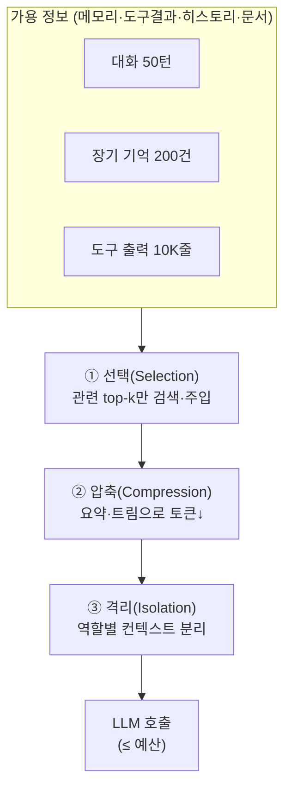
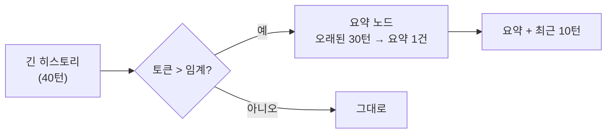
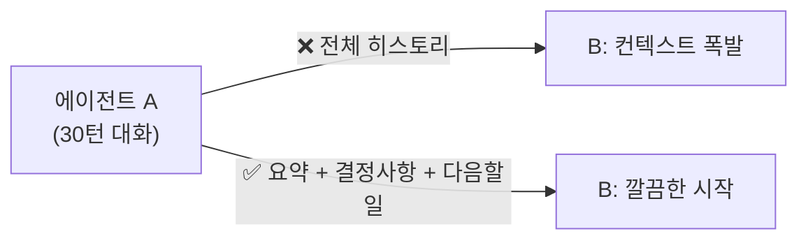

# 08. 컨텍스트 엔지니어링

2026년 에이전트 품질을 가르는 것은 더 큰 모델이 아니라 **컨텍스트 창에 무엇을, 얼마나,
어떤 형태로 넣는가**입니다. 메모리([06](06-short-term-memory.md)·[07장](07-long-term-memory.md))가
"무엇을 저장할까"였다면, 컨텍스트 엔지니어링은 "저장한 것 중 **무엇을 지금 이 호출에
넣을까**"입니다. 이것이 프롬프트 엔지니어링을 넘어선, MAS의 핵심 규율입니다.

## 1. 왜 더 넣는 게 답이 아닌가

컨텍스트 창이 길다고 다 채우면 안 됩니다. 관련 컨텍스트가 대략 **50K 토큰을 넘어서면
성능이 눈에 띄게 저하**됩니다(정확도·지연·비용 모두). 이 50K라는 숫자는 특정 벤치마크에서
관찰된 **참고치**이지 보편 상수가 아닙니다 — 모델·작업에 따라 임계는 달라지며,
"길이가 늘수록 성능이 깎인다"는 **경향**으로 읽어야 합니다([00장](00-landscape.md)의
오버헤드 수치 각주와 같은 태도). 대표적 실패 양상:

- **컨텍스트 오염(poisoning)**: 잘못된 정보가 한 번 들어가 계속 참조됨.
- **주의 분산(distraction)**: 관련 없는 내용이 신호를 묻어버림.
- **혼동(confusion)**: 서로 모순되는 정보로 판단이 흔들림.
- **Lost in the middle**: 긴 컨텍스트의 중간부는 실제로 잘 안 읽힘.

!!! danger "핵심 원칙"
    컨텍스트는 **예산(budget)**이다. 토큰은 유한한 자원이며, 넣을 후보가 아니라
    **꼭 필요한 것만** 넣는 것이 기본값이다.

## 2. 세 가지 전략: 선택 · 압축 · 격리



### ① 선택(Selection) — 관련된 것만

전부가 아니라 **지금 작업에 관련된 것**만 고릅니다.

- 장기 기억은 벡터 검색으로 **top-k**만 회상(07장).
- 도구는 필요한 것만 노출 — 도구 100개를 다 주면 선택 정확도가 떨어집니다.
- RAG 문서도 재랭킹 후 상위 몇 개만.

### ② 압축(Compression) — 같은 뜻을 더 적은 토큰으로

대화가 길어지면 오래된 부분을 **잘라내거나(trim)** **요약(summarize)**합니다.

**trim_messages** — 최근 N 토큰만 남기기:

```python
from langchain_core.messages import trim_messages

trimmed = trim_messages(
    messages,
    strategy="last",          # 최근 메시지 우선 보존
    max_tokens=4000,
    token_counter=model,      # 모델의 토큰 카운터 사용
    start_on="human",         # 대화가 HumanMessage로 시작하도록
    include_system=True,      # 시스템 프롬프트는 유지
)
```

**요약 노드(summarization)** — 오래된 대화를 한 문단으로 접기:



오래된 메시지를 LLM으로 요약해 하나의 `SystemMessage`로 대체하고, 최근 몇 턴은 원문 유지.
LangGraph에는 이를 자동화하는 `SummarizationNode`/`langmem` 요약 유틸도 있습니다.

### ③ 격리(Isolation) — 컨텍스트를 나눠 담기

하나의 거대한 컨텍스트 대신 **역할별로 분리**합니다. 서브에이전트가 각자 자기 컨텍스트에서
일하고, 메인은 결과만 받습니다(→ [10장](10-subagents-deep-agents-skills.md)).

- 서브에이전트 격리: 리서치 워커의 10K줄 원자료는 워커 안에 두고, 메인엔 요약만.
- 상태 스키마 분리: 그래프 내부 상태와 LLM에 보이는 메시지를 구분.
- 샌드박스/파일: 큰 산출물은 컨텍스트가 아니라 파일·가상 FS에 두고 경로만 전달.

## 3. 공유 컨텍스트 계층과 라우팅

멀티에이전트에서는 "누가 무엇을 보는가"를 계층으로 설계합니다.

| 계층 | 내용 | 누가 봄 |
|------|------|---------|
| **전역(global)** | 목표·제약·공용 사실 | 모든 에이전트 |
| **역할(role)** | 그 역할에 필요한 정보만 | 해당 에이전트 |
| **로컬(local)** | 진행 중 스크래치·도구 원출력 | 자기 자신 |

**컨텍스트 라우팅** = 에이전트의 역할에 맞는 정보만 골라 전달하는 것. 코더에겐 코드·에러
로그를, 기획자에겐 요구사항·결정 로그를 준다 — 서로의 잡음을 나눠 갖지 않게 합니다.

!!! note "왜 격리가 압축보다 먼저인가"
    무작정 요약부터 하면 정작 필요한 디테일이 뭉개집니다. 먼저 **누가 무엇을 봐야 하는지**를
    계층으로 정리하면 각 에이전트의 컨텍스트가 자연히 작아져, 애초에 압축할 양이 줄어듭니다.
    즉 격리(설계)가 압축(사후 처리)보다 근본적인 해법입니다.

## 4. 핸드오프는 "전체"가 아니라 "요약"

swarm/supervisor에서 제어권을 넘길 때([00장](00-landscape.md) 패턴), 초심자는 전체 대화를
그대로 넘깁니다. 멀티에이전트의 토큰 오버헤드(중앙집중형 약 +285%, 독립형 약 +58% —
벤치마크 참고치이며 작업 성격에 따라 크게 달라집니다, [00장](00-landscape.md) 각주 참고)의
상당 부분이 바로 이 "통째 핸드오프"에서 나옵니다. 정석은 **요약된 핸드오프**입니다.



핸드오프 페이로드에 담을 것: **목표, 지금까지의 결론, 미해결 항목, 다음 액션**. 원본이
필요하면 스토어/파일 참조 경로만 함께 넘깁니다.

!!! tip "요약 핸드오프 체크리스트"
    - 결정된 사실(decisions)과 열린 질문(open questions)을 분리해 명시.
    - 숫자·ID·경로 등 **정확성이 중요한 값은 원문 그대로** 유지(요약이 뭉개지 않게).
    - "왜"보다 "무엇을 다음에"에 무게.

## 5. 정리: 컨텍스트 엔지니어의 루프

1. **관측**: 현재 컨텍스트 토큰을 계측(참고치인 50K 근처를 경보선 삼되, 자기 워크로드로 조정).
2. **선택**: 관련 top-k만.
3. **압축**: 넘치면 trim/요약.
4. **격리**: 큰 작업은 서브에이전트/파일로 분리.
5. **핸드오프**: 넘길 땐 요약으로.

## 따라하기

이 챕터의 예제는 [`examples/11_context_engineering.py`](https://github.com/agent-chobi/agent-atoz/blob/main/examples/11_context_engineering.py)
입니다 — 40턴짜리 긴 가짜 대화를 만들어 (A) `trim_messages`로 자르고, (B) 오래된 부분을
LLM 요약으로 접는 두 압축 기법을 시연합니다. (예제↔챕터 대응은
[매핑표](https://github.com/agent-chobi/agent-atoz/blob/main/examples/README.md) 참고)

**1) 사전 준비**

```bash
pip install -r requirements.txt
copy .env.example .env    # macOS/Linux는 cp — 요약 데모(B)에만 ANTHROPIC_API_KEY 필요
```

**2) 실행**

```bash
python examples/11_context_engineering.py
```

**3) 기대 출력 요지**

- (A) 트리밍: 41건짜리 히스토리가 `max_tokens` 예산에 맞게 **최근 메시지 위주로** 줄어든
  결과가 출력됩니다(시스템 프롬프트는 유지, 대화는 Human 메시지로 시작).
- (B) 요약: 오래된 턴들이 요약 한 문단(`SystemMessage`)으로 접히고, 최근 몇 턴만 원문으로
  남은 "요약 + 최근 N턴" 구조가 출력됩니다.

**4) 흔한 에러**

| 증상 | 원인 → 해결 |
|------|-------------|
| 요약 데모에서 인증 오류 | (B)는 실제 LLM을 호출 → `.env`에 `ANTHROPIC_API_KEY` 필요. (A)는 키 없이도 동작 |
| 트리밍 결과가 기대보다 많이/적게 잘림 | `max_tokens` 예산과 `token_counter` 기준의 차이 → 값을 바꿔 가며 관찰 |
| 요약 후 세부 정보(숫자·이름)가 사라짐 | 요약의 본질적 한계 → 정확성이 중요한 값은 원문 유지(4절 체크리스트) |

## 실무 트레이드오프

"컨텍스트가 넘친다"에 대한 세 가지 대응은 성격이 다릅니다. 무엇을 잃고 무엇을 지불하는지가
선택 기준입니다.

| 기준 | 트리밍(trim) | 요약(summarize) | RAG-스타일 선택(retrieve) |
|------|--------------|------------------|---------------------------|
| 원리 | 오래된 것을 **삭제** | 오래된 것을 **압축** | 관련된 것만 **골라 주입** |
| 정보 손실 | 잘린 부분은 완전 소실 | 디테일이 뭉개짐(숫자·ID 위험) | 검색이 못 찾으면 누락 |
| 추가 비용·지연 | 없음(로컬 연산) | LLM 호출 1회 추가 | 임베딩 + 벡터 검색 왕복 |
| 구현 난이도 | 낮음 (`trim_messages` 한 번) | 중간 (트리거 임계·요약 프롬프트 설계) | 높음 (스토어·인덱스 운영, [07장](07-long-term-memory.md)) |
| 적합 | 최근 맥락만 중요한 짧은 챗 | 긴 작업에서 결정·경위를 보존해야 할 때 | 대량 지식·오래된 사실의 회상 |

셋은 배타적이지 않습니다 — 실무 기본형은 "요약 + 최근 N턴 원문(트리밍)"이고, 오래된 사실
회상이 필요해지면 RAG-스타일 선택(=07장의 장기 메모리)을 얹습니다.

## 2026 실무 트렌드

- **컨텍스트 엔지니어링의 공식화** — Anthropic이 이를 프롬프트 엔지니어링의 후속 규율로
  정리한 엔지니어링 가이드(compaction, 구조화된 노트, just-in-time 검색, 서브에이전트 분리)가
  업계 표준 텍스트로 자리잡았습니다.
- **"Context Rot" 실증** — Chroma가 18개 모델을 평가해, 문서상 컨텍스트 한계에 한참 못 미치는
  길이에서도 입력이 길어지는 것만으로 성능이 연속 저하됨을 보였습니다. "큰 컨텍스트 창이면
  해결"이라는 가정을 깨는, 이 챕터 1절의 실증적 근거입니다.
- **컨텍스트 관리의 API 네이티브화** — Claude API에 context editing(오래된 도구 결과 자동
  제거)과 자동 compaction(한계 접근 시 이전 대화 자동 요약·치환)이 추가되어, 이 챕터에서
  손으로 구현한 트리밍·요약을 API가 직접 수행하는 흐름이 시작됐습니다.
- **프로덕션 교훈의 공유 — KV-cache 중심 설계** — Manus 팀은 프로덕션 에이전트의 지연·비용을
  좌우하는 최대 요인이 KV-cache 적중률이라며, 프리픽스 안정화·append-only 컨텍스트 같은
  패턴을 공개했습니다. "압축"과 별개로 "캐시를 깨뜨리지 않는 컨텍스트 배치"라는 축이 추가된
  셈입니다.

## 실전 레퍼런스

- [Context Rot: How Increasing Input Tokens Impacts LLM Performance (Chroma Research)](https://research.trychroma.com/context-rot) —
  입력 길이 증가에 따른 성능 저하를 18개 모델로 실증한 연구; "context rot" 용어의 출처.
- [Context Engineering for AI Agents: Lessons from Building Manus](https://manus.im/blog/Context-Engineering-for-AI-Agents-Lessons-from-Building-Manus) —
  KV-cache 최적화, 파일시스템을 외부 메모리로 쓰는 패턴 등 프로덕션 에이전트 구축 교훈.
- [Context editing (Claude API 공식 문서)](https://platform.claude.com/docs/en/build-with-claude/context-editing) —
  오래된 도구 결과를 자동 제거하는 API 네이티브 컨텍스트 관리 기능.
- [Context engineering in agents (LangChain 공식 문서)](https://docs.langchain.com/oss/python/langchain/context-engineering) —
  LangChain/LangGraph에서의 트리밍 vs 요약 구현 방법과 트리거 임계 관리.
- [langchain-ai/context_engineering (GitHub)](https://github.com/langchain-ai/context_engineering) —
  선택·압축·격리 계열 전략을 LangGraph로 구현한 공식 예제 코드 모음.

## 참고 자료

- [Effective context engineering for AI agents (Anthropic)](https://www.anthropic.com/engineering/effective-context-engineering-for-ai-agents)
- [Context Engineering for Agents (LangChain)](https://blog.langchain.com/context-engineering-for-agents/)
- [How to trim messages (LangChain)](https://python.langchain.com/docs/how_to/trim_messages/)
- [How Long Contexts Fail (Drew Breunig)](https://www.dbreunig.com/2025/06/22/how-contexts-fail-and-how-to-fix-them.html)
