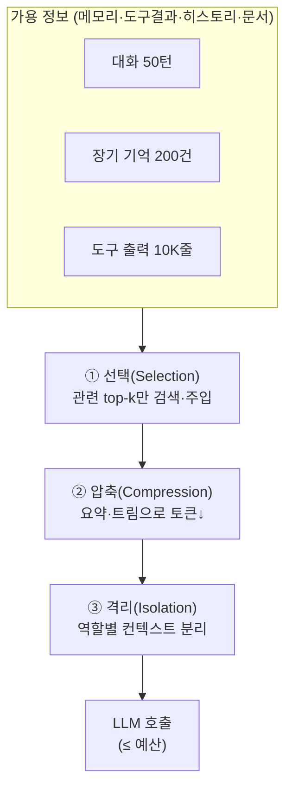
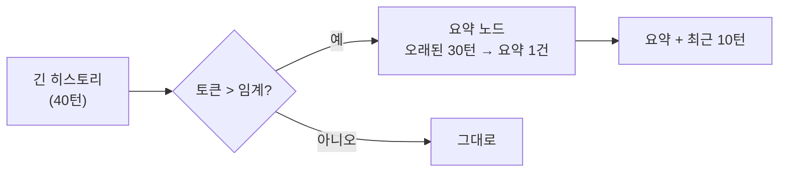
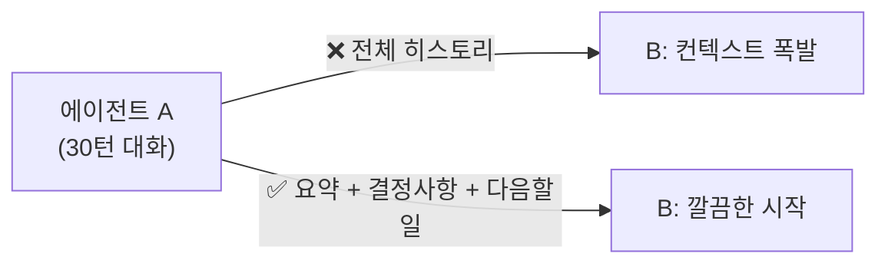

# 08. 컨텍스트 엔지니어링

2026년 에이전트 품질을 가르는 것은 더 큰 모델이 아니라 **컨텍스트 창에 무엇을, 얼마나,
어떤 형태로 넣는가**입니다. 메모리([06](06-short-term-memory.md)·[07장](07-long-term-memory.md))가
"무엇을 저장할까"였다면, 컨텍스트 엔지니어링은 "저장한 것 중 **무엇을 지금 이 호출에
넣을까**"입니다. 이것이 프롬프트 엔지니어링을 넘어선, MAS의 핵심 규율입니다.

## 1. 왜 더 넣는 게 답이 아닌가

컨텍스트 창이 길다고 다 채우면 안 됩니다. 관련 컨텍스트가 대략 **50K 토큰을 넘어서면
성능이 눈에 띄게 저하**됩니다(정확도·지연·비용 모두). 이 50K라는 숫자는 특정 벤치마크에서
관찰된 **참고치**이지 보편 상수가 아닙니다 — 모델·작업에 따라 임계는 달라지며,
"길이가 늘수록 성능이 깎인다"는 **경향**으로 읽어야 합니다([00장](00-landscape.md)의
오버헤드 수치 각주와 같은 태도). 대표적 실패 양상:

- **컨텍스트 오염(poisoning)**: 잘못된 정보가 한 번 들어가 계속 참조됨.
- **주의 분산(distraction)**: 관련 없는 내용이 신호를 묻어버림.
- **혼동(confusion)**: 서로 모순되는 정보로 판단이 흔들림.
- **Lost in the middle**: 긴 컨텍스트의 중간부는 실제로 잘 안 읽힘.

!!! danger "핵심 원칙"
    컨텍스트는 **예산(budget)**이다. 토큰은 유한한 자원이며, 넣을 후보가 아니라
    **꼭 필요한 것만** 넣는 것이 기본값이다.

## 2. 세 가지 전략: 선택 · 압축 · 격리



### ① 선택(Selection) — 관련된 것만

전부가 아니라 **지금 작업에 관련된 것**만 고릅니다.

- 장기 기억은 벡터 검색으로 **top-k**만 회상(07장).
- 도구는 필요한 것만 노출 — 도구 100개를 다 주면 선택 정확도가 떨어집니다.
- RAG 문서도 재랭킹 후 상위 몇 개만.

### ② 압축(Compression) — 같은 뜻을 더 적은 토큰으로

대화가 길어지면 오래된 부분을 **잘라내거나(trim)** **요약(summarize)**합니다.

**trim_messages** — 최근 N 토큰만 남기기:

```python
from langchain_core.messages import trim_messages

trimmed = trim_messages(
    messages,
    strategy="last",          # 최근 메시지 우선 보존
    max_tokens=4000,
    token_counter=model,      # 모델의 토큰 카운터 사용
    start_on="human",         # 대화가 HumanMessage로 시작하도록
    include_system=True,      # 시스템 프롬프트는 유지
)
```

**요약 노드(summarization)** — 오래된 대화를 한 문단으로 접기:



오래된 메시지를 LLM으로 요약해 하나의 `SystemMessage`로 대체하고, 최근 몇 턴은 원문 유지.
LangGraph에는 이를 자동화하는 `SummarizationNode`/`langmem` 요약 유틸도 있습니다.

### ③ 격리(Isolation) — 컨텍스트를 나눠 담기

하나의 거대한 컨텍스트 대신 **역할별로 분리**합니다. 서브에이전트가 각자 자기 컨텍스트에서
일하고, 메인은 결과만 받습니다(→ [10장](10-subagents-deep-agents-skills.md)).

- 서브에이전트 격리: 리서치 워커의 10K줄 원자료는 워커 안에 두고, 메인엔 요약만.
- 상태 스키마 분리: 그래프 내부 상태와 LLM에 보이는 메시지를 구분.
- 샌드박스/파일: 큰 산출물은 컨텍스트가 아니라 파일·가상 FS에 두고 경로만 전달.

## 3. 공유 컨텍스트 계층과 라우팅

멀티에이전트에서는 "누가 무엇을 보는가"를 계층으로 설계합니다.

| 계층 | 내용 | 누가 봄 |
|------|------|---------|
| **전역(global)** | 목표·제약·공용 사실 | 모든 에이전트 |
| **역할(role)** | 그 역할에 필요한 정보만 | 해당 에이전트 |
| **로컬(local)** | 진행 중 스크래치·도구 원출력 | 자기 자신 |

**컨텍스트 라우팅** = 에이전트의 역할에 맞는 정보만 골라 전달하는 것. 코더에겐 코드·에러
로그를, 기획자에겐 요구사항·결정 로그를 준다 — 서로의 잡음을 나눠 갖지 않게 합니다.

!!! note "왜 격리가 압축보다 먼저인가"
    무작정 요약부터 하면 정작 필요한 디테일이 뭉개집니다. 먼저 **누가 무엇을 봐야 하는지**를
    계층으로 정리하면 각 에이전트의 컨텍스트가 자연히 작아져, 애초에 압축할 양이 줄어듭니다.
    즉 격리(설계)가 압축(사후 처리)보다 근본적인 해법입니다.

## 4. 핸드오프는 "전체"가 아니라 "요약"

swarm/supervisor에서 제어권을 넘길 때([00장](00-landscape.md) 패턴), 초심자는 전체 대화를
그대로 넘깁니다. 멀티에이전트의 토큰 오버헤드(중앙집중형 약 +285%, 독립형 약 +58% —
벤치마크 참고치이며 작업 성격에 따라 크게 달라집니다, [00장](00-landscape.md) 각주 참고)의
상당 부분이 바로 이 "통째 핸드오프"에서 나옵니다. 정석은 **요약된 핸드오프**입니다.



핸드오프 페이로드에 담을 것: **목표, 지금까지의 결론, 미해결 항목, 다음 액션**. 원본이
필요하면 스토어/파일 참조 경로만 함께 넘깁니다.

!!! tip "요약 핸드오프 체크리스트"
    - 결정된 사실(decisions)과 열린 질문(open questions)을 분리해 명시.
    - 숫자·ID·경로 등 **정확성이 중요한 값은 원문 그대로** 유지(요약이 뭉개지 않게).
    - "왜"보다 "무엇을 다음에"에 무게.

## 5. 정리: 컨텍스트 엔지니어의 루프

1. **관측**: 현재 컨텍스트 토큰을 계측(참고치인 50K 근처를 경보선 삼되, 자기 워크로드로 조정).
2. **선택**: 관련 top-k만.
3. **압축**: 넘치면 trim/요약.
4. **격리**: 큰 작업은 서브에이전트/파일로 분리.
5. **핸드오프**: 넘길 땐 요약으로.

## 따라하기

이 챕터의 예제는 [`examples/11_context_engineering.py`](https://github.com/agent-chobi/agent-atoz/blob/main/examples/11_context_engineering.py)
입니다 — 40턴짜리 긴 가짜 대화를 만들어 (A) `trim_messages`로 자르고, (B) 오래된 부분을
LLM 요약으로 접는 두 압축 기법을 시연합니다. (예제↔챕터 대응은
[매핑표](https://github.com/agent-chobi/agent-atoz/blob/main/examples/README.md) 참고)

**1) 사전 준비**

```bash
pip install -r requirements.txt
copy .env.example .env    # macOS/Linux는 cp — 요약 데모(B)에만 ANTHROPIC_API_KEY 필요
```

**2) 실행**

```bash
python examples/11_context_engineering.py
```

**3) 기대 출력 요지**

- (A) 트리밍: 41건짜리 히스토리가 `max_tokens` 예산에 맞게 **최근 메시지 위주로** 줄어든
  결과가 출력됩니다(시스템 프롬프트는 유지, 대화는 Human 메시지로 시작).
- (B) 요약: 오래된 턴들이 요약 한 문단(`SystemMessage`)으로 접히고, 최근 몇 턴만 원문으로
  남은 "요약 + 최근 N턴" 구조가 출력됩니다.

**4) 흔한 에러**

| 증상 | 원인 → 해결 |
|------|-------------|
| 요약 데모에서 인증 오류 | (B)는 실제 LLM을 호출 → `.env`에 `ANTHROPIC_API_KEY` 필요. (A)는 키 없이도 동작 |
| 트리밍 결과가 기대보다 많이/적게 잘림 | `max_tokens` 예산과 `token_counter` 기준의 차이 → 값을 바꿔 가며 관찰 |
| 요약 후 세부 정보(숫자·이름)가 사라짐 | 요약의 본질적 한계 → 정확성이 중요한 값은 원문 유지(4절 체크리스트) |

### 예제 31 — 컨텍스트 예산 관리자

아래 "실무 패턴"의 예산 배분(패턴 1)을 코드로 옮긴 것이
[`examples/31_context_budget.py`](https://github.com/agent-chobi/agent-atoz/blob/main/examples/31_context_budget.py)
입니다 — 섹션별(시스템/도구 정의/히스토리/RAG) 토큰 예산을 정의하고,
`client.messages.count_tokens`(키 있을 때) 또는 로컬 근사(키 없을 때 폴백)로 사용량을
측정한 뒤, 초과 섹션을 성격에 맞게(히스토리는 트리밍, RAG는 요약/절삭) 줄이는 과정을
예산표로 출력합니다. `ANTHROPIC_API_KEY` 없이도 폴백 모드로 실행됩니다.

```bash
python examples/31_context_budget.py
```

## 실무 트레이드오프

"컨텍스트가 넘친다"에 대한 세 가지 대응은 성격이 다릅니다. 무엇을 잃고 무엇을 지불하는지가
선택 기준입니다.

| 기준 | 트리밍(trim) | 요약(summarize) | RAG-스타일 선택(retrieve) |
|------|--------------|------------------|---------------------------|
| 원리 | 오래된 것을 **삭제** | 오래된 것을 **압축** | 관련된 것만 **골라 주입** |
| 정보 손실 | 잘린 부분은 완전 소실 | 디테일이 뭉개짐(숫자·ID 위험) | 검색이 못 찾으면 누락 |
| 추가 비용·지연 | 없음(로컬 연산) | LLM 호출 1회 추가 | 임베딩 + 벡터 검색 왕복 |
| 구현 난이도 | 낮음 (`trim_messages` 한 번) | 중간 (트리거 임계·요약 프롬프트 설계) | 높음 (스토어·인덱스 운영, [07장](07-long-term-memory.md)) |
| 적합 | 최근 맥락만 중요한 짧은 챗 | 긴 작업에서 결정·경위를 보존해야 할 때 | 대량 지식·오래된 사실의 회상 |

셋은 배타적이지 않습니다 — 실무 기본형은 "요약 + 최근 N턴 원문(트리밍)"이고, 오래된 사실
회상이 필요해지면 RAG-스타일 선택(=07장의 장기 메모리)을 얹습니다.

## 실무 패턴

앞 절이 "무엇을 넣고 뺄까"의 원리였다면, 여기서는 프로덕션 에이전트 루프에 바로 옮겨
쓸 수 있는 네 가지 패턴을 다룹니다.

### 패턴 1 — 컨텍스트 예산 배분: 창을 섹션별로 쪼개라

컨텍스트 창을 하나의 덩어리로 관리하면 히스토리나 RAG 결과가 슬금슬금 전체를 잠식합니다.
총 예산을 **용도별 섹션으로 나누고 섹션마다 상한**을 겁니다. 200K 창이라도 context rot(1절)
때문에 전부 쓰지 않고, 실효 예산을 보수적으로(예: 절반 수준) 잡는 것이 요령입니다.

| 섹션 | 비율 | 토큰(실효 예산 100K 기준) | 초과 시 정책 |
|------|------|---------------------------|--------------|
| 시스템 프롬프트 | 5% | 5K | 런타임 축소 금지 — 설계 재검토 신호 |
| 도구 정의 | 10% | 10K | 도구 수 축소·필요한 도구만 노출 |
| 대화 히스토리 | 30% | 30K | 오래된 턴 트리밍/요약(2절) |
| RAG·검색 결과 | 20% | 20K | top-k 축소, 재랭킹, 요약 |
| 작업 공간(도구 결과·생성 여유) | 35% | 35K | 즉시 압축(패턴 3), `max_tokens` 상한 |

```python
BUDGET = {"system": 5_000, "tools": 10_000, "history": 30_000, "rag": 20_000}

def over_budget(sections: dict) -> list:
    """섹션별 사용량을 재서 초과 목록을 반환 — 매 루프 시작 시 호출."""
    return [name for name, text in sections.items()
            if count_tokens(text) > BUDGET[name]]
```

핵심은 전체 합계가 아직 여유여도 **섹션 상한을 넘으면 그 섹션만 그 섹션의 정책으로
줄인다**는 것입니다. 전체가 넘칠 때까지 기다리면 "무엇을 줄일지"의 판단이 늦고 비쌉니다.

### 패턴 2 — KV-캐시 친화 설계: 프리픽스를 얼려라

프롬프트 캐싱([15장 4.2절](15-evaluation-cost.md))은 **프리픽스 매칭**입니다 — 앞에서 1바이트만 달라져도 그 뒤
전체 캐시가 무효화됩니다. 그래서 컨텍스트 배치의 철칙은 "**불변은 앞, 가변은 뒤**":
시스템 프롬프트·도구 정의는 절대 바뀌지 않는 형태로 맨 앞에 고정하고, 대화·도구 결과는
append-only로 뒤에만 쌓습니다.

```python
# ❌ 안티패턴: 시스템 프롬프트에 가변 값 → 매 호출 캐시 전체 무효화
system = f"너는 비서다. 현재 시각: {datetime.now()}"       # 타임스탬프
tools = json.dumps(tool_defs)                              # dict 순서 비결정적

# ✅ 프리픽스 안정화: 불변으로 앞에, 가변은 마지막 user 메시지로
system = "너는 비서다."                                     # 불변
tools = json.dumps(tool_defs, sort_keys=True)               # 결정적 직렬화
messages = [*history, {"role": "user",
                       "content": f"[현재 시각: {now}] {user_input}"}]
```

캐시를 깨는 대표 안티패턴: 시스템 프롬프트 속 타임스탬프·요청 ID, 정렬하지 않은 JSON
직렬화, 대화 중간의 과거 메시지 수정·삭제, 턴마다 바뀌는 도구 목록. 효과는
`usage.cache_read_input_tokens`가 0이 아닌지로 검증합니다. Manus 팀이 보고했듯 프로덕션
에이전트는 입력:출력이 100:1 수준이라, 캐시 적중률이 지연·비용을 좌우하는 단일 최대
요인입니다.

### 패턴 3 — 도구 결과 즉시 압축: 원문을 루프에 넣지 마라

검색·파일 읽기 같은 도구는 수천 줄을 돌려줍니다. 이를 그대로 히스토리에 쌓으면 다음
호출부터 **매번** 그 토큰을 지불합니다. 루프에 넣기 전에 요약·발췌하고, 원문은 파일이나
스토어에 두고 참조 경로만 남깁니다(3절의 격리와 같은 원리).

```python
def run_tool(name: str, args: dict) -> str:
    raw = execute(name, args)
    if count_tokens(raw) <= 2_000:          # 작으면 그대로
        return raw
    path = save_to_workspace(raw)           # 원문은 파일로 보존
    excerpt = summarize(raw, max_tokens=500)  # 요약/발췌만 루프에
    return f"{excerpt}\n[전체 결과: {path} — 필요하면 read_file로 재조회]"
```

요약이 뭉갤 수 있는 값(숫자·ID·에러 메시지 원문)은 발췌로 원문 유지 — 4절 핸드오프
체크리스트와 같은 규칙입니다. 참조 경로를 남겨 두면 "요약이 부족할 때 다시 읽는" 복구
경로가 생겨, 공격적으로 압축해도 안전합니다.

### 패턴 4 — 컴팩션 트리거: 언제, 무엇을 남기고 접을까

압축(2절)을 "언제" 실행할지도 설계 대상입니다. 두 방식을 조합합니다.

- **사용률 임계 트리거** — 히스토리 토큰이 예산의 70~80%에 닿으면 컴팩션. 단순하고
  안전하지만, 작업 한가운데서 발동하면 진행 맥락이 뭉개질 수 있습니다.
- **마일스톤 트리거** — 서브태스크 완료·테스트 통과·핸드오프 직전 등 "자연스러운 매듭"에서
  컴팩션. 맥락 손상이 적지만, 매듭 없이 길어지는 작업에는 임계 트리거가 백업으로 필요합니다.

```python
def maybe_compact(state) -> None:
    hit_limit = state.history_tokens > BUDGET["history"] * 0.8
    if hit_limit or state.milestone_reached:
        state.compact(keep=["목표·제약", "결정사항과 근거", "미해결 항목·다음 액션",
                            "파일 경로·ID 등 정확값", "최근 N턴 원문"])
```

무엇을 남기나: 목표·결정사항·미해결 항목·정확값(경로/ID/숫자)은 남기고, 중간 시행착오의
왕복 원문은 접습니다. 버릴 자신이 없는 것은 삭제 대신 파일로 내리고 경로만 남기세요.
Claude API의 자동 compaction·context editing(아래 트렌드)을 쓰면 이 트리거 관리를 API에
위임할 수도 있습니다.

## 2026 실무 트렌드

- **컨텍스트 엔지니어링의 공식화** — Anthropic이 이를 프롬프트 엔지니어링의 후속 규율로
  정리한 엔지니어링 가이드(compaction, 구조화된 노트, just-in-time 검색, 서브에이전트 분리)가
  업계 표준 텍스트로 자리잡았습니다.
- **"Context Rot" 실증** — Chroma가 18개 모델을 평가해, 문서상 컨텍스트 한계에 한참 못 미치는
  길이에서도 입력이 길어지는 것만으로 성능이 연속 저하됨을 보였습니다. "큰 컨텍스트 창이면
  해결"이라는 가정을 깨는, 이 챕터 1절의 실증적 근거입니다.
- **컨텍스트 관리의 API 네이티브화** — Claude API의 3종 세트가 자리를 잡았습니다:
  context editing(오래된 도구 결과 자동 제거), 서버측 자동 compaction(임계 도달 시 대화를
  요약 블록으로 치환 — 2026년 1월 베타, `compact-2026-01-12` 헤더), memory tool(대화 밖
  파일에 지식을 축적). 이 챕터에서 손으로 구현한 트리밍·요약·격리를 API가 직접 수행하는
  흐름이며, 아직 베타(지원 모델 제한)라 프로덕션 채택 시 확인이 필요합니다.
- **프로덕션 교훈의 공유 — KV-cache 중심 설계** — Manus 팀은 프로덕션 에이전트의 지연·비용을
  좌우하는 최대 요인이 KV-cache 적중률이라며, 프리픽스 안정화·append-only 컨텍스트 같은
  패턴을 공개했습니다(입력:출력 비율이 약 100:1이라 캐시 단가 ~10배 차이가 그대로 비용
  구조가 됩니다). "압축"과 별개로 "캐시를 깨뜨리지 않는 컨텍스트 배치"라는 축이 추가된
  셈입니다.
- **파일시스템을 컨텍스트 계층으로** — 큰 산출물·도구 원문을 컨텍스트가 아니라 파일에 두고
  경로만 유지하는 패턴(3절의 격리)이 연구·프레임워크 양쪽에서 1급 추상화로 승격되고
  있습니다. "Everything is Context" 계열 연구가 파일시스템을 에이전트 컨텍스트의 표준
  인터페이스로 제안하고, Claude의 memory tool·에이전트 하네스들의 워크스페이스가 같은
  구조를 제품화했습니다.
- **긴 궤적(trajectory) 압축 연구** — 단순 대화 요약을 넘어, 수백 스텝짜리 에이전트 실행
  기록을 재귀적으로 압축·정리하는 기법(RE-TRAC 등)과 극단적 컨텍스트 증가 상황을 재는
  전용 벤치마크(LOCA-bench 등)가 등장했습니다. "요약 한 번"이 아니라 **압축 자체가 에이전트
  루프의 반복 연산**이라는 관점입니다.
- **메모리 연구와의 수렴** — 에이전트 메모리(06·07장)와 컨텍스트 엔지니어링을 하나의 문제
  ("행동 시점에 모델이 무엇을 아는가")로 통합해 다루는 서베이·프레임워크가 늘고 있습니다.
  컨텍스트 창을 유한한 계산 자원으로, 메모리를 그 밖의 저장 계층으로 보는 이 챕터의 관점이
  표준 프레임이 되는 중입니다.

## 실전 레퍼런스

- [Context Rot: How Increasing Input Tokens Impacts LLM Performance (Chroma Research)](https://research.trychroma.com/context-rot) —
  입력 길이 증가에 따른 성능 저하를 18개 모델로 실증한 연구; "context rot" 용어의 출처.
- [Context Engineering for AI Agents: Lessons from Building Manus](https://manus.im/blog/Context-Engineering-for-AI-Agents-Lessons-from-Building-Manus) —
  KV-cache 최적화, 파일시스템을 외부 메모리로 쓰는 패턴 등 프로덕션 에이전트 구축 교훈.
- [Context editing (Claude API 공식 문서)](https://platform.claude.com/docs/en/build-with-claude/context-editing) —
  오래된 도구 결과를 자동 제거하는 API 네이티브 컨텍스트 관리 기능.
- [Context engineering in agents (LangChain 공식 문서)](https://docs.langchain.com/oss/python/langchain/context-engineering) —
  LangChain/LangGraph에서의 트리밍 vs 요약 구현 방법과 트리거 임계 관리.
- [langchain-ai/context_engineering (GitHub)](https://github.com/langchain-ai/context_engineering) —
  선택·압축·격리 계열 전략을 LangGraph로 구현한 공식 예제 코드 모음.

### 함께 보면 좋은 한국어 자료

- [엔터프라이즈 LLM 서비스 구축기 1: 컨텍스트 엔지니어링 — LINE(LY Corporation) 기술블로그](https://techblog.lycorp.co.jp/ko/building-an-llm-service-for-enterprise-1-context-engineering) — 사내 LLM 서비스를 만들며 컨텍스트를 어떻게 선별·구성했는지 담은 국내 기업 실전 구축기.
- [Context Engineering: AI 시대의 새로운 핵심 역량 — SK DEVOCEAN](https://devocean.sk.com/blog/techBoardDetail.do?ID=167772&boardType=techBlog) — "노이즈를 줄이고 신호만 남겨라"라는 이 챕터의 핵심 메시지를 프롬프트 엔지니어링과 대비해 쉽게 설명.
- [프롬프트 엔지니어링 시대는 끝? 컨텍스트 엔지니어링 — 브런치](https://brunch.co.kr/@potbloom/6) — 프롬프트 대비 컨텍스트 엔지니어링이 무엇이 다른지 비개발자 눈높이로 풀어주는 개념 소개 글.

## 참고 자료

- [Effective context engineering for AI agents (Anthropic)](https://www.anthropic.com/engineering/effective-context-engineering-for-ai-agents)
- [Context Engineering for Agents (LangChain)](https://blog.langchain.com/context-engineering-for-agents/)
- [How to trim messages (LangChain)](https://python.langchain.com/docs/how_to/trim_messages/)
- [How Long Contexts Fail (Drew Breunig)](https://www.dbreunig.com/2025/06/22/how-contexts-fail-and-how-to-fix-them.html)
