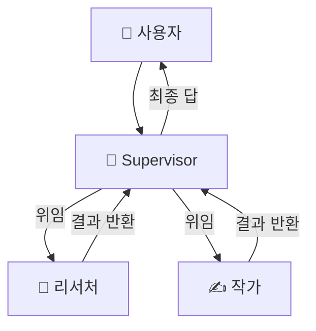
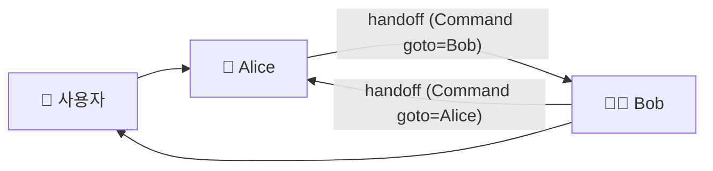
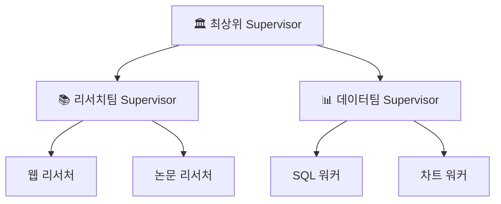
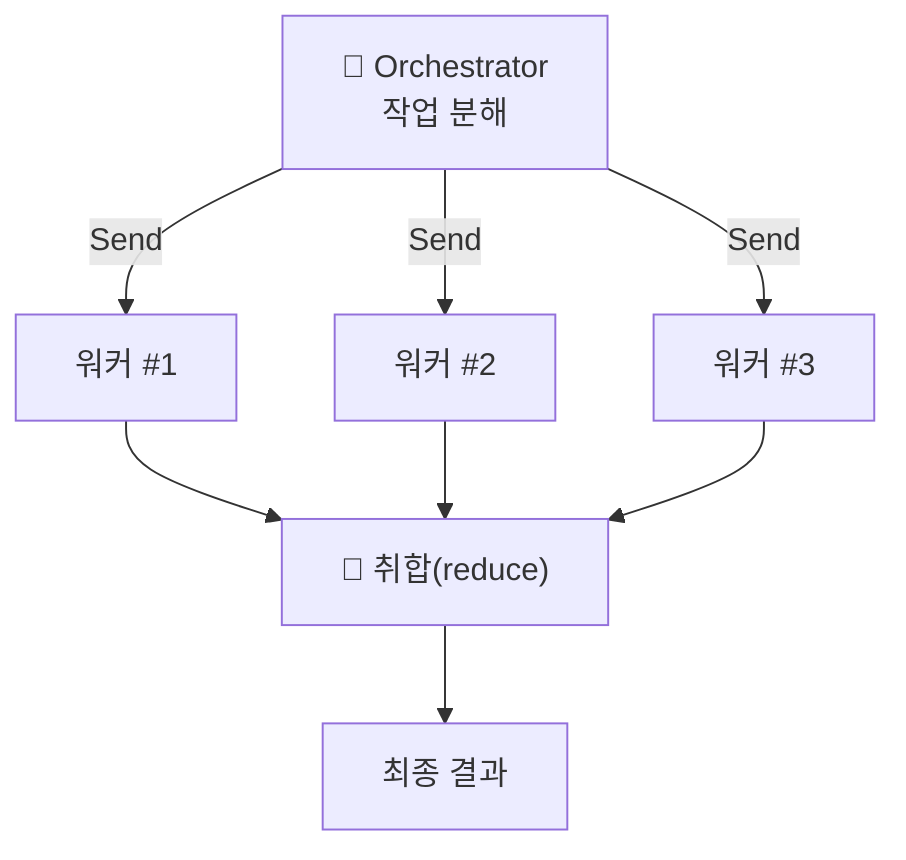
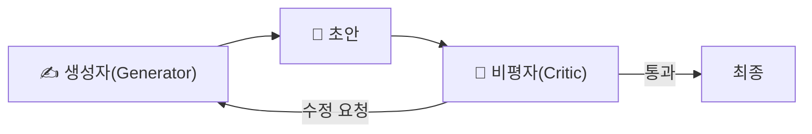
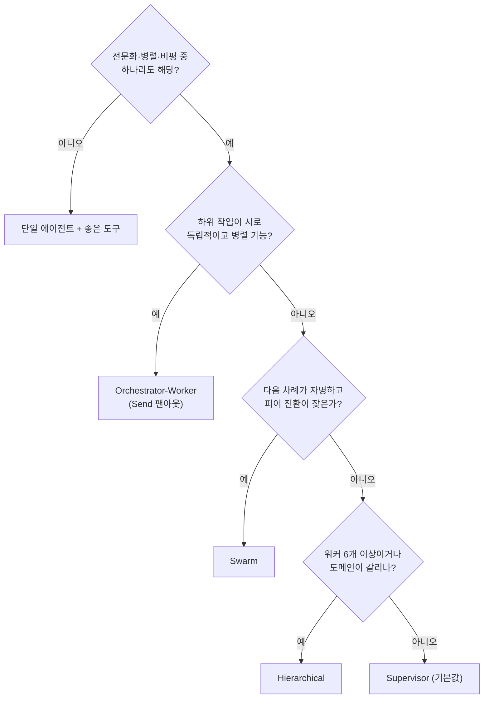

# 09. 멀티에이전트 패턴

멀티에이전트 시스템을 조립하는 방법은 몇 가지 **재사용 가능한 형태**로 수렴합니다.
이 챕터는 프로덕션에서 가장 많이 쓰이는 네 패턴 — **supervisor / swarm /
hierarchical / orchestrator-worker** — 을 구조·다이어그램·선택 기준으로 정리하고,
가장 중요한 질문인 **"그만큼의 토큰을 쓸 값이 있는가"** 를 먼저 못 박습니다.

[00장](00-landscape.md)이 예고한 6패턴 중 **Sequential(pipeline)** 과 **Blackboard**
두 가지는 이 챕터에서 별도로 다루지 않습니다. Sequential은 에이전트가 경로를 스스로
정하지 않는 **고정 순서 파이프라인**이라 사실상 에이전트 패턴이 아니라 워크플로우이며,
[19장 워크플로우 패턴](19-workflow-patterns.md)에서 따로 다룹니다(구현 재료는
[04장](04-langgraph-state-graph.md)의 상태 그래프 고정 엣지이고,
[17장 하네스 엔지니어링](17-harness-engineering.md)의 계획→생성→평가 분리에서도 다시
등장합니다). Blackboard의 핵심인 "공유 상태(칠판)에 여러 에이전트가 읽고 쓰기"도 새
패턴으로 배울 것이 없습니다 — 이미 [06장](06-short-term-memory.md)의 체크포인터와
[07장](07-long-term-memory.md)의 스토어가 바로 그 '칠판' 역할이므로, 개념이 그쪽으로
흡수되었다고 보면 됩니다.

## 1. 먼저: 토큰 트레이드오프

멀티에이전트는 공짜가 아닙니다. 에이전트 간 라우팅·핸드오프·중복 컨텍스트 때문에
토큰 사용량이 크게 늘어납니다.

| 구성 | 단일 에이전트 대비 토큰 오버헤드 | 언제 정당화되나 |
|------|-------------------------------|-----------------|
| **중앙집중형(supervisor 등)** | 약 **+285%** | 제어·관측이 명확해야 할 때 |
| **독립형(swarm 등)** | 약 **+58%** | 빠른 피어 전환이 필요할 때 |

위 수치는 특정 벤치마크에서 보고된 **참고치**일 뿐입니다. 작업 성격(병렬화 여지, 도구
호출량), 핸드오프 설계, 컨텍스트 엔지니어링 수준에 따라 크게 달라지므로, 절대값이 아니라
"중앙집중형일수록 조율 비용이 커진다"는 **방향성**으로 읽으세요([00장](00-landscape.md)
하단 각주 참조).

!!! warning "값을 하는 경우는 셋뿐"
    멀티에이전트가 비용을 정당화하는 경우는 사실상 세 가지입니다.

    - **전문화(specialization)** — 역할별로 도구/프롬프트/모델을 분리해야 품질이 오를 때
    - **병렬성(parallelism)** — 하위 작업을 동시에 처리해 지연을 줄일 수 있을 때
    - **비평(critique)** — 생성과 평가를 분리해야 정확도가 오를 때

    셋 다 아니라면 **단일 에이전트 + 좋은 도구**가 더 싸고 안정적입니다. "가장 단순한
    것부터 시작하라"([00장](00-landscape.md))가 제1원칙입니다.

## 2. Supervisor — 중앙 라우팅

한 명의 **supervisor(코디네이터)** 가 모든 제어권을 쥐고, 사용자 요청을 보고 어떤
워커에게 위임할지 결정합니다. 워커는 서로 직접 대화하지 않고 항상 supervisor를
거칩니다(hub-and-spoke). 회사로 치면 **모든 업무 지시와 보고가 팀장을 거치는 팀**입니다 —
전달 단계가 하나 늘어 느려지지만, 누가 무엇을 하고 있는지 팀장이 전부 파악합니다.
2026년 프로덕션의 **기본값**이며, 제어·관측·디버깅이 가장 쉽습니다.



`langgraph-supervisor` 의 `create_supervisor()` 로 몇 줄이면 만듭니다. 각 워커는
독립된 `create_react_agent` 이고, supervisor가 `transfer_to_<name>` handoff 도구로
라우팅합니다.

```python
from langgraph_supervisor import create_supervisor

workflow = create_supervisor(
    [research_agent, writer_agent],   # 이름을 가진 워커들
    model=model,
    prompt="너는 팀 supervisor다. 조사는 research_expert, 글은 writing_expert 에게 위임하라.",
)
app = workflow.compile()   # StateGraph 를 컴파일해야 실행 가능
```

→ 전체 실행 예제: [`examples/12_supervisor.py`](https://github.com/agent-chobi/agent-atoz/blob/main/examples/12_supervisor.py)

## 3. Swarm — peer-to-peer handoff

중개자 없이 **피어 에이전트끼리 제어권을 직접 넘깁니다(handoff)**. 감독의 지시를
기다리지 않고 선수끼리 공을 직접 패스하는 경기와 같습니다. 에이전트가
handoff 도구를 호출하면 내부적으로 `Command(goto="대상에이전트")` 로 그래프 제어가
이동합니다. supervisor를 거치지 않으므로 LLM 호출이 한 번 줄어(=지연·비용 감소),
"누가 다음 차례인지"가 자명한 협업에 적합합니다.



!!! note "swarm 은 '마지막 활성 에이전트'를 기억한다"
    멀티턴 대화에서 swarm은 상태에 마지막으로 활성화된 에이전트를 저장합니다. 그래서
    다음 턴이 이전에 넘어간 에이전트에서 이어집니다 — 이 때문에 **반드시 checkpointer와
    함께 compile** 해야 대화가 이어집니다.

```python
from langgraph_swarm import create_handoff_tool, create_swarm

# 각 에이전트는 상대에게 넘길 handoff 도구를 소지
alice = create_react_agent(model, tools=[add, create_handoff_tool(agent_name="Bob")], name="Alice")
bob   = create_react_agent(model, tools=[create_handoff_tool(agent_name="Alice")], name="Bob")

workflow = create_swarm([alice, bob], default_active_agent="Alice")
app = workflow.compile(checkpointer=checkpointer)
```

→ 전체 실행 예제: [`examples/13_swarm.py`](https://github.com/agent-chobi/agent-atoz/blob/main/examples/13_swarm.py)

핸드오프 시 **대화 전체가 아니라 요약을 넘기는 것**이 컨텍스트 엔지니어링의 정석입니다
(→ [08장](08-context-engineering.md)).

## 4. Hierarchical — supervisor를 계층으로

에이전트/워커 수가 많아지면 단일 supervisor의 라우팅 판단이 흐려집니다. 이때
**supervisor를 계층으로 쌓아** 도메인별 팀을 만들고, 최상위 supervisor는 팀
supervisor에게만 위임합니다. 본부장이 팀원 전원을 직접 챙기는 대신 팀장에게만
위임하는 조직도를 떠올리면 됩니다. 대규모·도메인 분할 시스템에 적합합니다.



구현상으로는 "supervisor 그래프를 다른 supervisor의 워커(노드)로 넣는" 재귀 구성입니다.
각 팀은 자기 컨텍스트를 격리하므로, 상위는 팀의 **요약만** 보게 되어 컨텍스트가
깨끗하게 유지됩니다.

## 5. Orchestrator-Worker — 분해 → 병렬

오케스트레이터가 큰 작업을 **동적으로 하위 작업으로 분해**하고, 각 조각을 워커에게
**병렬로** 던진 뒤 결과를 취합(reduce)합니다. 주방장이 주문서를 코스별로 쪼개 여러
라인 쿡에게 동시에 맡기고 마지막 플레이팅만 직접 하는 주방과 같습니다. supervisor가
"누구에게 순차로 넘길까"라면, orchestrator-worker는 "몇 개로 쪼개 동시에 돌릴까"입니다.
병렬화 이득이 큰 작업(다중 소스 조사, 파일 일괄 처리)에서 지연을 크게 줄입니다.



LangGraph에서는 **Send API** 로 동적 팬아웃을 구현합니다. 조건부 엣지에서 `Send`
객체 리스트를 반환하면, 각 `Send` 가 워커 노드를 **독립 병렬 인스턴스**로 실행합니다.

```python
from langgraph.constants import Send

def fan_out(state):
    # 런타임에 하위 작업 수가 정해짐 → 동적으로 워커 인스턴스 생성
    return [Send("worker", {"subtask": s}) for s in state["subtasks"]]

graph.add_conditional_edges("orchestrator", fan_out, ["worker"])
```

## 6. Critique — 생성과 평가의 분리

앞의 네 패턴이 "일을 나누는" 축이라면, **critique(비평)** 는 "품질을 올리는" 축입니다.
한 에이전트가 생성하고 **다른 에이전트가 평가·수정**하도록 분리하면 정확도가 오릅니다 —
같은 에이전트에게 자기 답을 채점시키면 후하게 나오기 때문입니다(self-grading bias).



이 루프는 supervisor 안에 "작가 → 검수자" 워커로 넣거나, orchestrator-worker의 취합
단계에 붙일 수 있습니다. 단, **반복 횟수 상한**을 두지 않으면 무한 왕복·비용 폭증이
생기므로 최대 N회로 제한하세요.

## 7. 흔한 실수

!!! danger "안티패턴"
    - **불필요한 멀티에이전트** — 전문화·병렬·비평 어디에도 해당 없는데 나눴다면 토큰만
      약 +285% 태우는 것. 단일 에이전트로 돌아가세요.
    - **핸드오프에 전체 히스토리 전달** — 요약이 아니라 대화 통째로 넘기면 컨텍스트가
      기하급수로 부풀고 품질이 떨어집니다([08장](08-context-engineering.md)).
    - **swarm에 checkpointer 누락** — 마지막 활성 에이전트를 잊어 멀티턴이 깨집니다.
    - **무한 라우팅 루프** — supervisor↔워커가 서로 넘기기만 반복. 종료 조건과 반복
      상한을 명시하세요.

## 8. 패턴 선택 요약

| 패턴 | 제어 흐름 | 언제 |
|------|-----------|------|
| **Supervisor** | 중앙 hub-and-spoke | 2026 기본값. 명확한 제어·관측이 필요할 때 |
| **Swarm** | 피어 간 직접 handoff | 중개자 없이 빠른 전환, LLM 호출 절감 |
| **Hierarchical** | supervisor 계층 | 대규모, 도메인 분할 |
| **Orchestrator-Worker** | 분해 → 병렬(Send) | 병렬화 이득이 큰 작업 |
| **Critique** | 생성 ↔ 평가 분리 | 정확도가 중요하고 자기채점을 못 믿을 때 |

!!! tip "실전 순서"
    ① 단일 에이전트로 시작 → ② 전문화가 필요하면 supervisor → ③ 병렬 이득이 크면
    orchestrator-worker → ④ 팀이 커지면 hierarchical → ⑤ 피어 전환이 잦고 중개
    오버헤드가 아까우면 swarm. **패턴을 위한 패턴을 만들지 마세요.**

다음 챕터는 이 패턴들의 공통 빌딩블록인 **서브에이전트**와, 이를 배터리처럼 포장한
[Deep Agents · Skills](10-subagents-deep-agents-skills.md) 로 이어집니다.

## 설계 가이드

패턴 지식을 실제 아키텍처 결정으로 옮길 때 부딪히는 네 가지 질문을 정리합니다.

### 어떤 패턴을 고르나 — 결정 트리



작업 유형 관점의 경험칙: **조사·집계형**(여러 소스에서 모아 합치기)은
orchestrator-worker, **정책·감사가 중요한 업무 자동화**는 supervisor, **창구 전환형
대화**(상담→결제→기술지원처럼 담당이 옮겨 다니는 흐름)는 swarm이 자연스럽습니다.
팀 규모 관점에서는 워커 2~5개까지 supervisor 단층, 그 이상 또는 도메인이 갈리면
hierarchical입니다.

### 워커 수 상한 — 토큰 예산에서 역산하라

워커 수는 "필요해 보이는 역할 수"가 아니라 **요청당 토큰 예산**에서 역산해야 합니다.

1. 요청당 허용 비용을 먼저 정합니다(예: 단일 에이전트 소비량의 4배까지).
2. 워커 1개 추가의 한계비용을 셉니다 — 워커의 시스템 프롬프트, supervisor의 위임
   판단 호출, 워커 결과 요약의 재소비가 위임마다 반복해서 붙습니다.
3. 예산 ÷ 한계비용이 워커 수 상한입니다. 중앙집중형 오버헤드 참고치(약 +285%)를
   감안하면 **supervisor 하나에 워커 3~5개**가 현실적인 스위트 스팟이고, 그 이상이
   필요하면 워커를 늘리지 말고 hierarchical로 층을 나누는 편이 낫습니다.

### 상태 공유 범위 — 워커 사이에 무엇을 넘길 것인가

| 공유 범위 | 토큰 비용 | 정보 보존 | 언제 |
|-----------|----------|----------|------|
| 전체 메시지 히스토리 | 최악 — 핸드오프마다 기하급수 증가 | 완전 | 사실상 금지. 디버깅용 임시 조치만 |
| 자연어 요약 | 중간 | 요약 품질에 의존 | 후속 워커가 맥락 이해를 요구할 때 |
| 구조화 결과만(스키마 고정) | 최소 | 스키마에 담긴 것만 | 워커 산출물이 정형적일 때의 **기본값** |

"구조화 결과만"으로 시작해, 하류 워커가 맥락 부족으로 실패할 때만 요약을 추가하는
순서가 안전합니다([08장](08-context-engineering.md)).

### 실패 워커 처리 전략

- **예외를 전파하지 말고 결과로 반환** — 워커 실패를 `{"status": "failed", "reason": ...}`
  같은 값으로 supervisor에게 돌려줘야, supervisor가 재시도/우회를 **라우팅으로** 판단할
  수 있습니다. 예외가 그래프 밖으로 터지면 전체 요청이 죽습니다.
- **재시도는 상한부터** — 워커당 재시도 1~2회 + 그래프 전체 반복 상한
  (LangGraph `recursion_limit`)을 함께 겁니다. 상한 없는 재시도는 무한 라우팅
  루프(7절 안티패턴)의 다른 얼굴입니다.
- **부분 실패를 전제로 취합 설계** — orchestrator-worker의 reduce 단계는 일부 워커가
  비어 있어도 결측을 표시한 채 결과를 만들 수 있어야 합니다.
- **타임아웃 + 폴백 경로** — 응답 없는 워커는 제한 시간 후 끊고, 마지막 폴백으로
  "supervisor가 직접 답변"(단일 에이전트 경로)을 남겨 두면 시스템 전체의 가용성이
  워커 하나에 인질로 잡히지 않습니다.

## 따라하기

이 챕터의 두 패턴을 직접 실행해 봅니다 — supervisor는
[`examples/12_supervisor.py`](https://github.com/agent-chobi/agent-atoz/blob/main/examples/12_supervisor.py),
swarm은 [`examples/13_swarm.py`](https://github.com/agent-chobi/agent-atoz/blob/main/examples/13_swarm.py)
입니다.

**① 사전 준비**

```bash
# 저장소 루트에서 (requirements.txt 에 모두 포함되어 있음)
pip install -U langgraph langgraph-supervisor langgraph-swarm langchain-anthropic python-dotenv
```

`.env` 에 `ANTHROPIC_API_KEY` 를 넣고, 비용을 아끼려면 파일 상단의 `MODEL` 상수를
`claude-haiku-4-5` 로 바꾸세요.

**② 실행**

```bash
python examples/12_supervisor.py   # supervisor: 리서처 → 작가 순 라우팅
python examples/13_swarm.py        # swarm: Alice ↔ Bob peer handoff (2턴)
```

**③ 기대 출력 요지**

- `12_supervisor.py` — `=== 최종 답변 ===` 아래 한국어 한 단락, 이어서
  `=== 라우팅 추적 ===` 에 supervisor → `research_expert` → `writing_expert` 순으로
  누가 언제 발화했는지가 찍힙니다. 이 추적 로그가 hub-and-spoke 흐름의 증거입니다.
- `13_swarm.py` — 턴 1에서 Bob이 해적 말투로 인사하고, 턴 2에서 "5 더하기 7"을 묻자
  Alice로 handoff 되어 12를 계산합니다. 같은 `thread_id` 로 마지막 활성 에이전트가
  이어지는 것을 확인하세요.

**④ 흔한 에러**

| 증상 | 원인 · 해결 |
|------|-------------|
| `ModuleNotFoundError: langgraph_supervisor` / `langgraph_swarm` | 패키지 미설치 — 위 pip 명령 재실행 |
| `ANTHROPIC_API_KEY 가 없습니다` (SystemExit) | `.env` 파일 누락 또는 키 미기입 |
| `create_react_agent` 임포트 오류 | LangChain/LangGraph 버전 차이 — 파일 상단 주석의 대체 임포트 참고 |
| 턴 2에서 handoff 없이 Bob이 계속 답함 | `checkpointer` 없이 compile 했거나 `thread_id` 를 턴마다 바꾼 경우 |

## 실무 트레이드오프

supervisor와 swarm 중 무엇을 고를지는 결국 **"조율 비용을 낼 것인가, 제어를 포기할
것인가"** 의 선택입니다.

| 기준 | Supervisor | Swarm |
|------|-----------|-------|
| 토큰/지연 | 라우팅마다 supervisor LLM 호출 추가 — 오버헤드 큼(중앙집중형 약 +285% 계열) | 피어 직접 handoff — 호출 한 단계 절감(독립형 약 +58% 계열) |
| 제어 | supervisor 프롬프트 한 곳에서 정책 통제 | 각 에이전트의 handoff 판단에 분산 — 통제 지점 없음 |
| 관측·디버깅 | 모든 흐름이 허브를 지나 추적 쉬움 | "누가 왜 넘겼나"가 분산되어 재현·디버깅 어려움 |
| 멀티턴 상태 | 상태 관리 단순(항상 supervisor 재진입) | 마지막 활성 에이전트 기억 필요 — checkpointer 필수 |
| 적합 상황 | 정책·감사가 중요한 프로덕션 기본값 | 다음 차례가 자명하고 전환이 잦은 협업 |

## 2026 실무 트렌드

- **orchestrator-worker의 실증** — Anthropic은 리드 에이전트(Opus) + 병렬 서브에이전트(Sonnet)
  구조의 리서치 시스템이 단일 에이전트 대비 내부 평가에서 90% 이상 우수했다고 보고했습니다.
  단, 성능 향상이 토큰 사용량과 강하게 연동된다는 점(=비용으로 성능을 사는 구조)을 함께
  못 박았습니다.
- **프로덕션 진입이 다수파** — LangChain의 State of Agent Engineering 조사(2026)에 따르면
  응답 조직의 57%가 이미 에이전트를 프로덕션에 배포했고, 30%가 배포를 전제로 개발 중입니다.
  "될까?"가 아니라 "어떻게 안정적으로 굴릴까"의 단계입니다.
- **커스텀 그래프 → 기성 하네스** — supervisor/서브에이전트 구성을 밑바닥부터 짜는 대신
  planning·서브에이전트가 내장된 하네스(deepagents 등)를 쓰는 흐름이 뚜렷합니다(→ [10장](10-subagents-deep-agents-skills.md)).

## 실전 레퍼런스

- [How we built our multi-agent research system — Anthropic Engineering](https://www.anthropic.com/engineering/multi-agent-research-system) — orchestrator-worker 패턴의 대표 프로덕션 사례. 프롬프트로 서브에이전트 폭주(단순 질문에 50개 생성 등)를 길들인 과정까지 공개
- [State of Agent Engineering — LangChain](https://www.langchain.com/state-of-agent-engineering) — 에이전트 프로덕션 채택률·스택 통계 조사 보고서
- [How Anthropic Built a Multi-Agent Research System — ByteByteGo](https://blog.bytebytego.com/p/how-anthropic-built-a-multi-agent) — 위 Anthropic 시스템의 아키텍처 해설(리드/서브에이전트/CitationAgent 분해)
- [The Agent Development Lifecycle — Interrupt 26 키노트 (YouTube)](https://www.youtube.com/watch?v=jWy39wavbjY) — LangChain 창업자들이 말하는 에이전트 빌드→테스트→배포→모니터링 수명주기
- [Building Multi-Agent Systems — Shrivu Shankar](https://blog.sshh.io/p/building-multi-agent-systems-part) — 멀티에이전트 설계 실무 노트 시리즈

### 함께 보면 좋은 한국어 자료

- [멀티 에이전트 감독자(Multi-Agent Supervisor) — 랭체인 노트(WikiDocs)](https://wikidocs.net/270690) — Supervisor 패턴을 한국어 코드 예제로 따라 만들 수 있는 무료 튜토리얼 장
- [RAG기반 Multi-Agent를 구현해보자 — SK 데보션(DEVOCEAN)](https://devocean.sk.com/blog/techBoardDetail.do?ID=168018&boardType=techBlog) — supervisor와 handoff 개념을 실제 구현기로 쉽게 풀어 주는 국내 기업 기술블로그
- [LangGraph - Multi-Agent Collaboration으로 복잡한 태스크 수행하기 — 테디노트](https://teddylee777.github.io/langgraph/langgraph-multi-agent-collaboration/) — 다중 협업 에이전트를 LangGraph로 조립하는 과정을 단계별로 해설
- [AI Agent 멀티에이전트 오케스트레이션 패턴 — Chaos and Order](https://www.youngju.dev/blog/ai-platform/2026-03-14-ai-agent-multi-agent-orchestration-patterns) — 계층형·파이프라인·스웜 아키텍처의 트레이드오프를 한국어로 비교 정리

## 참고 자료

- [Building Effective Agents — Anthropic](https://www.anthropic.com/research/building-effective-agents)
- [langgraph-supervisor (GitHub)](https://github.com/langchain-ai/langgraph-supervisor-py)
- [langgraph-swarm (GitHub)](https://github.com/langchain-ai/langgraph-swarm-py)
- [LangGraph Multi-Agent 개념 문서](https://langchain-ai.github.io/langgraph/concepts/multi_agent/)
- [Supervisor vs Swarm 트레이드오프](https://dev.to/focused_dot_io/multi-agent-orchestration-in-langgraph-supervisor-vs-swarm-tradeoffs-and-architecture-1b7e)
