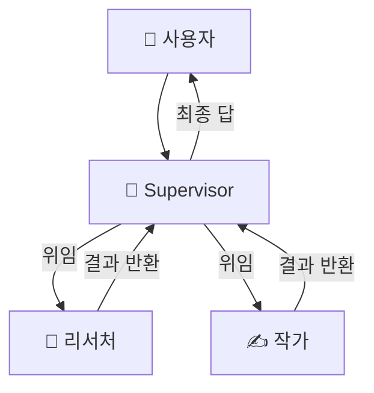
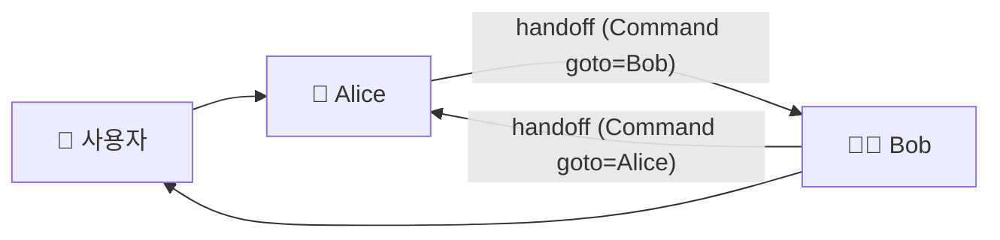
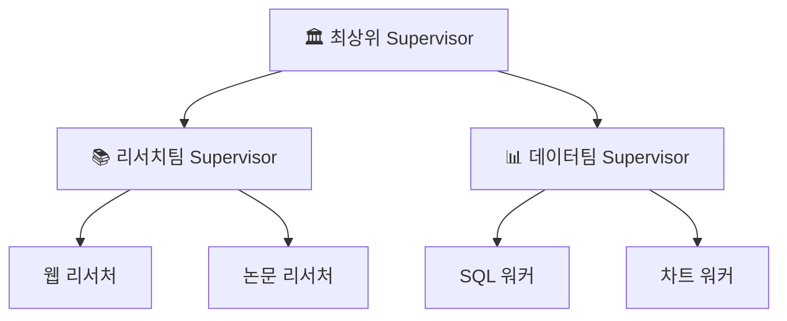
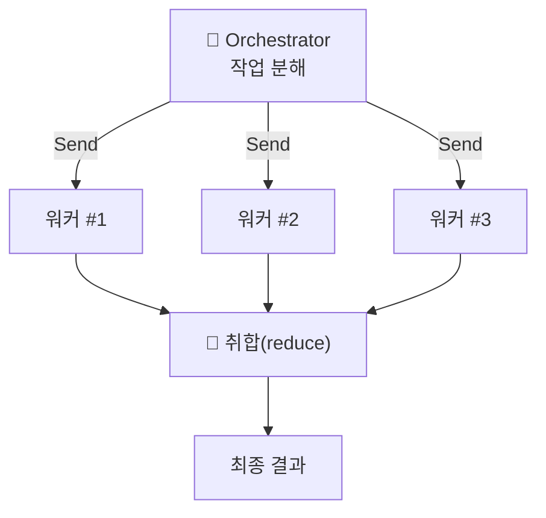
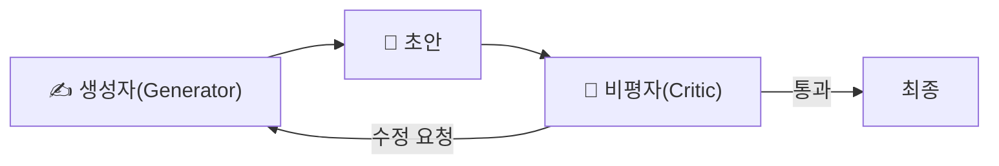

# 09. 멀티에이전트 패턴

멀티에이전트 시스템을 조립하는 방법은 몇 가지 **재사용 가능한 형태**로 수렴합니다.
이 챕터는 프로덕션에서 가장 많이 쓰이는 네 패턴 — **supervisor / swarm /
hierarchical / orchestrator-worker** — 을 구조·다이어그램·선택 기준으로 정리하고,
가장 중요한 질문인 **"그만큼의 토큰을 쓸 값이 있는가"** 를 먼저 못 박습니다.

## 1. 먼저: 토큰 트레이드오프

멀티에이전트는 공짜가 아닙니다. 에이전트 간 라우팅·핸드오프·중복 컨텍스트 때문에
토큰 사용량이 크게 늘어납니다.

| 구성 | 단일 에이전트 대비 토큰 오버헤드 | 언제 정당화되나 |
|------|-------------------------------|-----------------|
| **중앙집중형(supervisor 등)** | 약 **+285%** | 제어·관측이 명확해야 할 때 |
| **독립형(swarm 등)** | 약 **+58%** | 빠른 피어 전환이 필요할 때 |

!!! warning "값을 하는 경우는 셋뿐"
    멀티에이전트가 비용을 정당화하는 경우는 사실상 세 가지입니다.

    - **전문화(specialization)** — 역할별로 도구/프롬프트/모델을 분리해야 품질이 오를 때
    - **병렬성(parallelism)** — 하위 작업을 동시에 처리해 지연을 줄일 수 있을 때
    - **비평(critique)** — 생성과 평가를 분리해야 정확도가 오를 때

    셋 다 아니라면 **단일 에이전트 + 좋은 도구**가 더 싸고 안정적입니다. "가장 단순한
    것부터 시작하라"([00장](00-landscape.md))가 제1원칙입니다.

## 2. Supervisor — 중앙 라우팅

한 명의 **supervisor(코디네이터)** 가 모든 제어권을 쥐고, 사용자 요청을 보고 어떤
워커에게 위임할지 결정합니다. 워커는 서로 직접 대화하지 않고 항상 supervisor를
거칩니다(hub-and-spoke). 2026년 프로덕션의 **기본값**이며, 제어·관측·디버깅이
가장 쉽습니다.



`langgraph-supervisor` 의 `create_supervisor()` 로 몇 줄이면 만듭니다. 각 워커는
독립된 `create_react_agent` 이고, supervisor가 `transfer_to_<name>` handoff 도구로
라우팅합니다.

```python
from langgraph_supervisor import create_supervisor

workflow = create_supervisor(
    [research_agent, writer_agent],   # 이름을 가진 워커들
    model=model,
    prompt="너는 팀 supervisor다. 조사는 research_expert, 글은 writing_expert 에게 위임하라.",
)
app = workflow.compile()   # StateGraph 를 컴파일해야 실행 가능
```

→ 전체 실행 예제: [`examples/12_supervisor.py`](../examples/12_supervisor.py)

## 3. Swarm — peer-to-peer handoff

중개자 없이 **피어 에이전트끼리 제어권을 직접 넘깁니다(handoff)**. 에이전트가
handoff 도구를 호출하면 내부적으로 `Command(goto="대상에이전트")` 로 그래프 제어가
이동합니다. supervisor를 거치지 않으므로 LLM 호출이 한 번 줄어(=지연·비용 감소),
"누가 다음 차례인지"가 자명한 협업에 적합합니다.



!!! note "swarm 은 '마지막 활성 에이전트'를 기억한다"
    멀티턴 대화에서 swarm은 상태에 마지막으로 활성화된 에이전트를 저장합니다. 그래서
    다음 턴이 이전에 넘어간 에이전트에서 이어집니다 — 이 때문에 **반드시 checkpointer와
    함께 compile** 해야 대화가 이어집니다.

```python
from langgraph_swarm import create_handoff_tool, create_swarm

# 각 에이전트는 상대에게 넘길 handoff 도구를 소지
alice = create_react_agent(model, tools=[add, create_handoff_tool(agent_name="Bob")], name="Alice")
bob   = create_react_agent(model, tools=[create_handoff_tool(agent_name="Alice")], name="Bob")

workflow = create_swarm([alice, bob], default_active_agent="Alice")
app = workflow.compile(checkpointer=checkpointer)
```

→ 전체 실행 예제: [`examples/13_swarm.py`](../examples/13_swarm.py)

핸드오프 시 **대화 전체가 아니라 요약을 넘기는 것**이 컨텍스트 엔지니어링의 정석입니다
(→ [08장](08-context-engineering.md)).

## 4. Hierarchical — supervisor를 계층으로

에이전트/워커 수가 많아지면 단일 supervisor의 라우팅 판단이 흐려집니다. 이때
**supervisor를 계층으로 쌓아** 도메인별 팀을 만들고, 최상위 supervisor는 팀
supervisor에게만 위임합니다. 대규모·도메인 분할 시스템에 적합합니다.



구현상으로는 "supervisor 그래프를 다른 supervisor의 워커(노드)로 넣는" 재귀 구성입니다.
각 팀은 자기 컨텍스트를 격리하므로, 상위는 팀의 **요약만** 보게 되어 컨텍스트가
깨끗하게 유지됩니다.

## 5. Orchestrator-Worker — 분해 → 병렬

오케스트레이터가 큰 작업을 **동적으로 하위 작업으로 분해**하고, 각 조각을 워커에게
**병렬로** 던진 뒤 결과를 취합(reduce)합니다. supervisor가 "누구에게 순차로 넘길까"라면,
orchestrator-worker는 "몇 개로 쪼개 동시에 돌릴까"입니다. 병렬화 이득이 큰 작업
(다중 소스 조사, 파일 일괄 처리)에서 지연을 크게 줄입니다.



LangGraph에서는 **Send API** 로 동적 팬아웃을 구현합니다. 조건부 엣지에서 `Send`
객체 리스트를 반환하면, 각 `Send` 가 워커 노드를 **독립 병렬 인스턴스**로 실행합니다.

```python
from langgraph.constants import Send

def fan_out(state):
    # 런타임에 하위 작업 수가 정해짐 → 동적으로 워커 인스턴스 생성
    return [Send("worker", {"subtask": s}) for s in state["subtasks"]]

graph.add_conditional_edges("orchestrator", fan_out, ["worker"])
```

## 6. Critique — 생성과 평가의 분리

앞의 네 패턴이 "일을 나누는" 축이라면, **critique(비평)** 는 "품질을 올리는" 축입니다.
한 에이전트가 생성하고 **다른 에이전트가 평가·수정**하도록 분리하면 정확도가 오릅니다 —
같은 에이전트에게 자기 답을 채점시키면 후하게 나오기 때문입니다(self-grading bias).



이 루프는 supervisor 안에 "작가 → 검수자" 워커로 넣거나, orchestrator-worker의 취합
단계에 붙일 수 있습니다. 단, **반복 횟수 상한**을 두지 않으면 무한 왕복·비용 폭증이
생기므로 최대 N회로 제한하세요.

## 7. 흔한 실수

!!! danger "안티패턴"
    - **불필요한 멀티에이전트** — 전문화·병렬·비평 어디에도 해당 없는데 나눴다면 토큰만
      +285% 태우는 것. 단일 에이전트로 돌아가세요.
    - **핸드오프에 전체 히스토리 전달** — 요약이 아니라 대화 통째로 넘기면 컨텍스트가
      기하급수로 부풀고 품질이 떨어집니다([08장](08-context-engineering.md)).
    - **swarm에 checkpointer 누락** — 마지막 활성 에이전트를 잊어 멀티턴이 깨집니다.
    - **무한 라우팅 루프** — supervisor↔워커가 서로 넘기기만 반복. 종료 조건과 반복
      상한을 명시하세요.

## 8. 패턴 선택 요약

| 패턴 | 제어 흐름 | 언제 |
|------|-----------|------|
| **Supervisor** | 중앙 hub-and-spoke | 2026 기본값. 명확한 제어·관측이 필요할 때 |
| **Swarm** | 피어 간 직접 handoff | 중개자 없이 빠른 전환, LLM 호출 절감 |
| **Hierarchical** | supervisor 계층 | 대규모, 도메인 분할 |
| **Orchestrator-Worker** | 분해 → 병렬(Send) | 병렬화 이득이 큰 작업 |
| **Critique** | 생성 ↔ 평가 분리 | 정확도가 중요하고 자기채점을 못 믿을 때 |

!!! tip "실전 순서"
    ① 단일 에이전트로 시작 → ② 전문화가 필요하면 supervisor → ③ 병렬 이득이 크면
    orchestrator-worker → ④ 팀이 커지면 hierarchical → ⑤ 피어 전환이 잦고 중개
    오버헤드가 아까우면 swarm. **패턴을 위한 패턴을 만들지 마세요.**

다음 챕터는 이 패턴들의 공통 빌딩블록인 **서브에이전트**와, 이를 배터리처럼 포장한
[Deep Agents · Skills](10-subagents-deep-agents-skills.md) 로 이어집니다.

## 참고 자료

- [Building Effective Agents — Anthropic](https://www.anthropic.com/research/building-effective-agents)
- [langgraph-supervisor (GitHub)](https://github.com/langchain-ai/langgraph-supervisor-py)
- [langgraph-swarm (GitHub)](https://github.com/langchain-ai/langgraph-swarm-py)
- [LangGraph Multi-Agent 개념 문서](https://langchain-ai.github.io/langgraph/concepts/multi_agent/)
- [Supervisor vs Swarm 트레이드오프](https://dev.to/focused_dot_io/multi-agent-orchestration-in-langgraph-supervisor-vs-swarm-tradeoffs-and-architecture-1b7e)
