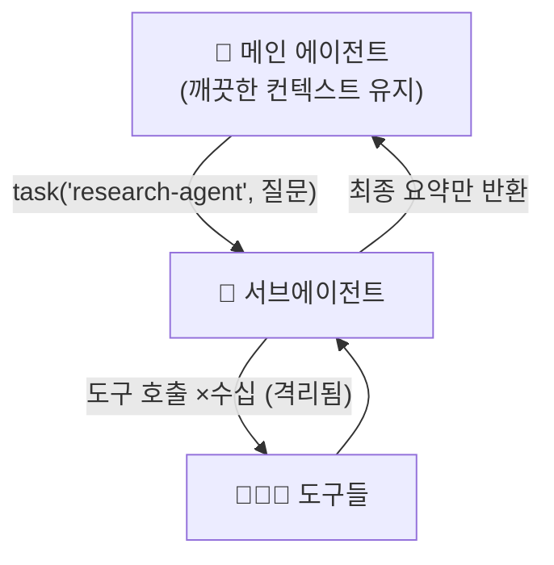
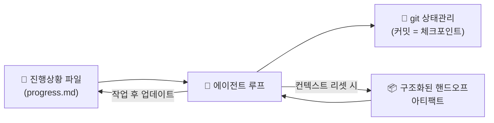

# 10. 서브에이전트 · Deep Agents · Skills

[09장](09-multi-agent-patterns.md)의 패턴들은 모두 하나의 빌딩블록 위에 서 있습니다 —
**서브에이전트**. 이 챕터는 서브에이전트가 왜 컨텍스트 관점에서 결정적인지, 이를
배터리처럼 포장한 **LangChain Deep Agents**, 그리고 장기실행 에이전트를 지탱하는
**하네스 패턴**과 **Skills** 개념을 다룹니다.

## 1. 서브에이전트 위임 — 핵심은 컨텍스트 격리

서브에이전트의 진짜 값은 "일을 나눠 한다"가 아니라 **컨텍스트 격리(context
quarantine)** 입니다. 메인 에이전트가 무거운 작업(웹검색 수십 회, 긴 파일 읽기,
대용량 DB 조회)을 서브에이전트에게 위임하면, 그 수십 번의 중간 도구 호출은
서브에이전트 안에 갇히고 메인 에이전트는 **최종 결과만** 돌려받습니다.



!!! note "왜 격리가 중요한가"
    도구 출력이 큰 작업일수록 컨텍스트 창이 중간 결과로 빠르게 오염됩니다. 서브에이전트는
    이 상세 작업을 격리해, 메인은 결론만 보고 판단을 이어갑니다. 이것이 [08장](08-context-engineering.md)
    의 "격리(isolation)" 를 실전에서 구현하는 방법입니다.

## 2. LangChain Deep Agents

`deepagents` 는 `create_agent` 위에 **planning · 가상 파일시스템 · 서브에이전트 ·
skills** 를 기본 탑재한 "배터리 포함(batteries-included)" 하네스입니다. Claude Code가
쓰는 패턴(계획 세우기 → 파일에 작업 상태 기록 → 서브에이전트 위임)을 라이브러리로
일반화한 것입니다.

```python
from deepagents import create_deep_agent

agent = create_deep_agent(
    model="anthropic:claude-opus-4-8",
    tools=[internet_search],
    system_prompt="너는 리서치 오케스트레이터다. 먼저 write_todos 로 계획을 세워라.",
    subagents=[research_subagent],   # 커스텀 서브에이전트 (아래 표 형식)
)
result = agent.invoke({"messages": [{"role": "user", "content": "..."}]})
```

→ 전체 실행 예제: [`examples/14_subagents.py`](../examples/14_subagents.py)

### 2-1. 네 가지 기본 탑재 기능

| 기능 | 역할 |
|------|------|
| **planning (`write_todos`)** | 작업을 todo 리스트로 쪼개 계획을 명시. 긴 작업에서 방향 유지 |
| **가상 파일시스템** | `read`/`write`/`edit`/`search` 로 중간 산출물을 파일에 저장(컨텍스트 밖 메모리) |
| **서브에이전트** | `task()` 도구로 위임. `general-purpose` 서브에이전트가 자동 포함 |
| **skills** | 재사용 가능한 절차(아래 4절)를 시스템 프롬프트에 로드 |

### 2-2. 서브에이전트 딕셔너리 형식

```python
research_subagent = {
    "name": "research-agent",          # 메인이 task() 로 부를 식별자
    "description": "심층 조사에 사용",   # 구체적·행동 지향적으로
    "system_prompt": "너는 뛰어난 리서처다. 결론만 요약해 반환하라.",
    "tools": [internet_search],        # 선택
    "model": "anthropic:claude-haiku-4-5",  # 선택 — 메인 모델 오버라이드
}
```

!!! warning "버전 민감성"
    `deepagents` 는 2026년 빠르게 진화 중입니다. 서브에이전트 키가 `system_prompt` 인지
    `prompt` 인지, skills 상속 규칙 등이 바뀔 수 있습니다. 커스텀 서브에이전트는 기본적으로
    skills를 **상속하지 않으므로** 필요하면 `skills` 파라미터로 따로 줘야 합니다. 설치
    버전 대조가 필요합니다.

## 3. 장기실행 하네스 패턴 (Anthropic)

에이전트가 수십 분~수 시간 도는 장기 작업에서는, 컨텍스트 창 하나에 모든 것을 담을 수
없습니다. Anthropic이 권장하는 **하네스 엔지니어링** 패턴은 상태를 컨텍스트 밖으로
빼내 관리합니다.



- **진행상황 파일** — 무엇을 했고 다음에 뭘 할지 파일에 기록. 컨텍스트가 리셋돼도 여기서
  이어감(가상 FS의 `write_todos`/`progress.md`가 이 역할).
- **git 상태관리** — 커밋을 체크포인트로 삼아 되돌리기·비교 가능. 에이전트가 자기
  변경을 git으로 추적.
- **구조화된 핸드오프 아티팩트** — 컨텍스트를 비우기 전에, 다음 인스턴스가 읽을 수 있는
  **요약 문서**를 남김. "대화 통째로 넘기기"가 아니라 "정제된 상태만 넘기기".

!!! tip "컨텍스트 리셋은 실패가 아니라 설계다"
    긴 작업에서 컨텍스트를 주기적으로 비우고 핸드오프 아티팩트로 재시작하는 것은
    정상적인 운영입니다. 이 규율은 [17장 하네스 엔지니어링](17-harness-engineering.md)에서
    캡스톤으로 깊게 다룹니다.

## 4. Skills 개념

**Skill** 은 에이전트가 재사용하는 **절차적 지식의 패키지**입니다. 보통
`SKILL.md`(무엇을·언제·어떻게) + 스크립트/리소스로 구성되며, 에이전트는 필요할 때
해당 skill을 컨텍스트로 로드해 "매번 처음부터 추론" 대신 검증된 절차를 따릅니다.

```markdown
<!-- 예: skills/pdf-report/SKILL.md -->
---
name: pdf-report
description: 데이터 요약을 PDF 보고서로 변환할 때 사용
---
1. 데이터를 `report.md` 로 정리한다.
2. `scripts/render.py` 로 PDF 로 변환한다.
3. 표지·목차·페이지 번호를 포함한다.
```

| 구분 | 도구(tool) | 스킬(skill) |
|------|-----------|-------------|
| 단위 | 함수 하나 | 절차·지침·리소스 묶음 |
| 형태 | 코드 시그니처 | `SKILL.md` + 자산 |
| 로드 | 항상 노출 | 필요 시 선택적 로드 |

Deep Agents는 skills를 미들웨어로 시스템 프롬프트에 주입합니다(**progressive
disclosure** — 이름·설명만 먼저 보이고, 실제 호출 시 본문을 로드해 컨텍스트를 아낌).
자기개선형 런타임에서는 에이전트가 **skill을 스스로 만들어** 축적하기도 합니다
(→ [16장 Hermes](16-self-hosted-runtimes.md)).

!!! tip "언제 도구 대신 skill로 만드나"
    - 단일 함수 호출이면 **도구**.
    - "여러 단계를 정해진 순서로, 매번 같은 방식으로" 반복한다면 **skill**.
    - 절차가 자주 바뀌거나 사람이 관리해야 한다면 코드가 아니라 `SKILL.md` 로 두는 편이
      수정이 쉽습니다.

## 5. 정리

- 서브에이전트의 값은 분업이 아니라 **컨텍스트 격리**다.
- **Deep Agents** = create_agent + planning + 가상 FS + 서브에이전트 + skills.
- 장기실행은 **진행상황 파일 · git · 핸드오프 아티팩트**로 상태를 컨텍스트 밖에 둔다.
- **Skill** 은 재사용 절차의 패키지 — 도구보다 큰 단위, 선택적 로드.

다음은 에이전트를 외부 도구 생태계와 표준으로 잇는 [MCP 연계](11-mcp-integration.md)입니다.

## 참고 자료

- [deepagents (GitHub)](https://github.com/langchain-ai/deepagents)
- [Deep Agents — Subagents 문서](https://docs.langchain.com/oss/python/deepagents/subagents)
- [Effective harnesses for long-running agents — Anthropic](https://www.anthropic.com/engineering/effective-harnesses-for-long-running-agents)
- [Agent Skills — Anthropic](https://www.anthropic.com/news/skills)
- [Building Effective Agents — Anthropic](https://www.anthropic.com/research/building-effective-agents)
