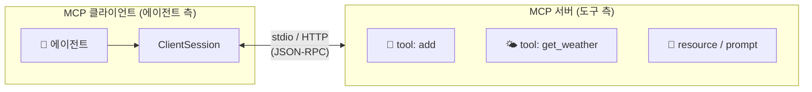
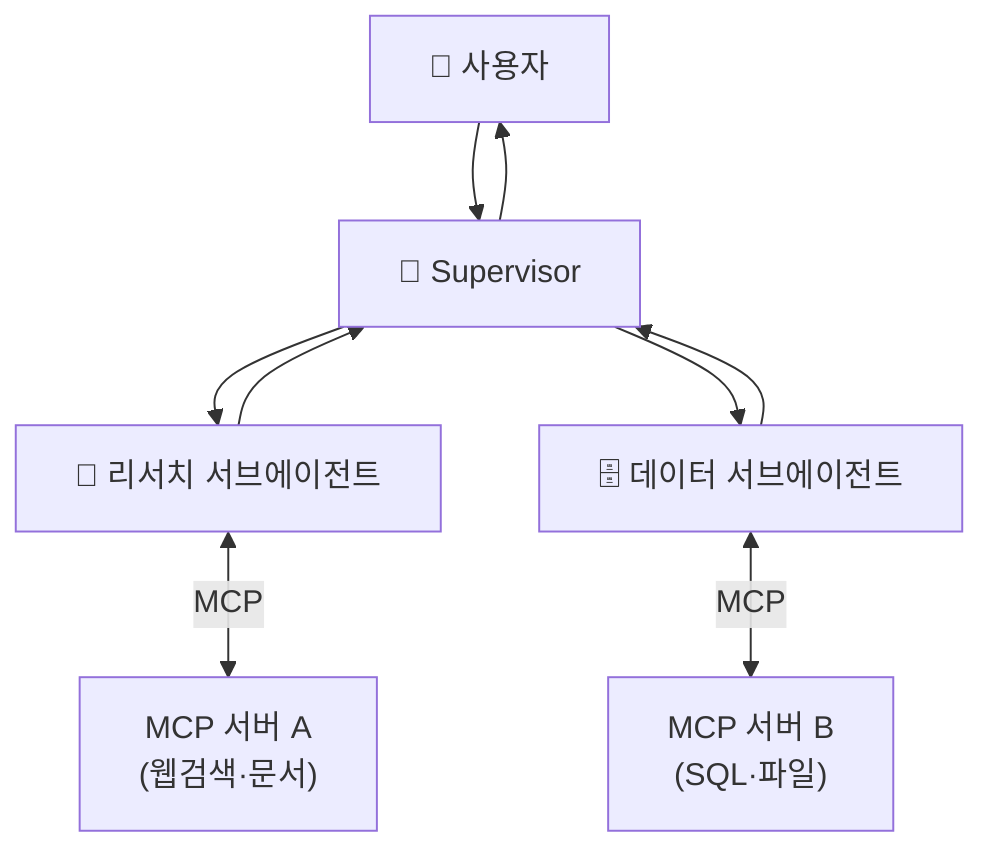

# 11. MCP 연계

에이전트가 강력해지려면 **외부 도구·데이터**에 닿아야 합니다. 문제는 도구마다 연결
방식이 제각각이라는 것. **MCP(Model Context Protocol)** 는 이 "에이전트 ↔ 도구"
연결을 표준화한 프로토콜입니다. USB-C가 기기 연결을 표준화하듯, MCP는 도구 연결을
표준화합니다 — 한 번 MCP 서버로 노출한 도구는 어떤 MCP 클라이언트(Claude, LangGraph,
IDE 등)에서도 그대로 쓸 수 있습니다.

## 1. MCP의 구성



| 개념 | 설명 |
|------|------|
| **서버** | 도구·리소스·프롬프트를 표준 형식으로 노출 |
| **클라이언트** | 서버에 접속해 도구 목록을 받고 호출 |
| **전송(transport)** | `stdio`(로컬 서브프로세스) 또는 `HTTP`(원격) |

서버가 노출하는 것은 도구 하나가 아닙니다 — MCP는 **tool(행동) · resource(읽기 전용
데이터) · prompt(재사용 템플릿)** 세 가지 능력을 구분해 정의합니다. 대부분의 예제가
tool만 다루지만 셋의 구분이 MCP 설계의 뼈대이므로, 아래 5절에서 따로 정리합니다.

!!! note "stdio vs HTTP"
    **stdio** 는 클라이언트가 서버를 서브프로세스로 띄워 stdin/stdout으로 통신 — 로컬
    도구에 가장 간단합니다. **HTTP(streamable-http)** 는 원격/공유 서버에 적합하며
    인증·확장이 필요한 프로덕션에서 씁니다.

## 2. FastMCP 서버 만들기

`mcp` 패키지의 **FastMCP** 는 "타입 힌트 + docstring" 만으로 도구를 노출합니다. JSON
스키마와 프로토콜 처리는 프레임워크가 자동 생성합니다.

```python
from mcp.server.fastmcp import FastMCP

mcp = FastMCP("demo-tools")

@mcp.tool()
def add(a: int, b: int) -> int:
    """두 정수를 더한다."""
    return a + b

@mcp.tool()
def get_weather(city: str) -> str:
    """도시의 날씨를 반환한다."""
    return {"seoul": "맑음, 26도"}.get(city.lower(), "데이터 없음")

if __name__ == "__main__":
    mcp.run(transport="stdio")   # 원격이면 transport="streamable-http"
```

→ 전체 예제: [`examples/15_mcp_server.py`](https://github.com/agent-chobi/agent-atoz/blob/main/examples/15_mcp_server.py)

!!! warning "mcp v1.x vs v2"
    위는 안정판 `mcp>=1.x` 의 `mcp.server.fastmcp.FastMCP` 기준입니다. `mcp` v2는
    pre-release로 임포트 경로가 다릅니다(`from mcp.server import MCPServer` 등). 설치
    버전을 대조하세요.

## 3. MCP 클라이언트 — 도구 호출

### 3-1. 순수 MCP SDK

`ClientSession` 으로 직접 서버에 붙어 도구를 나열·호출합니다. stdio에서는 클라이언트가
서버를 서브프로세스로 띄우므로 **서버를 미리 실행할 필요가 없습니다**.

```python
from mcp import ClientSession, StdioServerParameters
from mcp.client.stdio import stdio_client

server_params = StdioServerParameters(command="python", args=["15_mcp_server.py"])

async with stdio_client(server_params) as (read, write):
    async with ClientSession(read, write) as session:
        await session.initialize()                       # 핸드셰이크
        tools = await session.list_tools()               # 도구 목록
        result = await session.call_tool("add", {"a": 3, "b": 5})
        print(result.content[0].text)                    # -> 8
```

### 3-2. langchain-mcp-adapters — LangGraph에 바로 연결

`MultiServerMCPClient.get_tools()` 는 MCP 도구를 **LangChain 도구 객체로 변환**해
`create_react_agent` 에 그대로 넣습니다. 그러면 에이전트가 알아서 MCP 도구를 호출합니다.

```python
from langchain_mcp_adapters.client import MultiServerMCPClient
from langgraph.prebuilt import create_react_agent

client = MultiServerMCPClient({
    "demo": {"command": "python", "args": ["15_mcp_server.py"], "transport": "stdio"},
    # "remote": {"url": "http://localhost:8000/mcp", "transport": "http"},
})
tools = await client.get_tools()                 # 비동기
agent = create_react_agent(model, tools)
resp = await agent.ainvoke({"messages": [{"role": "user", "content": "서울 날씨는?"}]})
```

→ 두 방식 모두: [`examples/16_mcp_client.py`](https://github.com/agent-chobi/agent-atoz/blob/main/examples/16_mcp_client.py)

## 4. agent + subagent + MCP 통합 그림

MCP는 [09](09-multi-agent-patterns.md)·[10장](10-subagents-deep-agents-skills.md)의
구조와 자연스럽게 합쳐집니다. **여러 서브에이전트가 각자 다른 MCP 서버의 도구를**
쓰도록 배치하면, 도구 접근을 역할별로 분리(최소 권한)하면서 컨텍스트도 격리됩니다.



!!! tip "MCP + 최소 권한"
    서브에이전트마다 **필요한 MCP 서버만** 붙이면, 리서처가 실수로 DB를 쓰거나 데이터
    워커가 임의 웹에 접근하는 일을 구조적으로 막습니다. 권한·인가는 [14장](14-permissions-security-hitl.md)
    에서 이어집니다.

## 5. 도구만이 아니다 — resource · prompt

MCP 서버는 도구(tool) 외에 두 가지를 더 노출할 수 있습니다. 도서관에 비유하면
**tool은 사서에게 시키는 업무**(대출 처리 — 뭔가를 바꾸는 행동), **resource는
열람실의 자료**(읽기만 가능), **prompt는 비치된 신청서 양식**(빈칸만 채우면 되는
정형화된 요청)입니다.

| 프리미티브 | 무엇 | 제어 주체 |
|-----------|------|-----------|
| **tool** | 에이전트가 호출하는 함수(부수효과 O) | 모델이 결정 |
| **resource** | 읽기 전용 데이터(파일·DB 행 등) | 애플리케이션이 선택 |
| **prompt** | 재사용 프롬프트 템플릿 | 사용자가 선택 |

세 프리미티브의 결정적 차이는 **"누가 쓸지 결정하는가"** 입니다. tool은 모델이 스스로
호출을 결정하므로 부수효과가 있는 행동에 쓰고, resource는 애플리케이션이 어떤 데이터를
컨텍스트에 넣을지 선택하며(모델이 마음대로 읽는 게 아님), prompt는 사용자가 UI에서
명시적으로 고르는 템플릿입니다. FastMCP에서는 각각 `@mcp.tool()`,
`@mcp.resource("uri://...")`, `@mcp.prompt()` 데코레이터로 노출합니다. 대부분의
에이전트 연동은 tool만 쓰지만, 대용량 컨텍스트를 읽기 전용으로 붙일 때 resource가,
검증된 질의 패턴을 배포할 때 prompt가 유용합니다.

!!! danger "MCP 도구도 신뢰 경계다"
    MCP 서버는 외부 코드입니다. 서드파티 서버를 붙일 때는 **어떤 도구가 어떤 권한으로
    무엇을 하는지** 반드시 검토하세요. 악의적 도구 설명(prompt injection)·과도한 권한은
    실제 위협입니다. 인가·최소권한은 [14장](14-permissions-security-hitl.md)에서 다룹니다.

## 6. MCP 서버 생태계 — 직접 만들기 전에 레지스트리부터

MCP의 진짜 힘은 "한 번 만들면 어디서나"가 아니라 **"이미 누가 만들어 놨다"** 에
있습니다. 공개 MCP 서버는 이미 1만 개를 넘었고, GitHub·Slack·DB·클라우드 등 흔한
연동은 대부분 기성 서버가 존재합니다. 도구를 직접 짜기 전에 레지스트리를 먼저
검색하세요 — 앱을 직접 개발하기 전에 앱스토어를 뒤지는 것과 같습니다.

| 레지스트리 | 성격 |
|-----------|------|
| [공식 MCP Registry](https://registry.modelcontextprotocol.io/) | MCP 프로젝트가 직접 운영하는 공개 서버 메타데이터 카탈로그 + API. 서버 배포·발견 방식의 표준 |
| [Docker MCP Catalog](https://github.com/docker/mcp-registry) | Docker Hub 통합 큐레이션 카탈로그. 검증·버전 관리된 서버를 컨테이너 이미지로 제공 — 격리 실행에 유리 |
| [Smithery](https://smithery.ai/) | 커뮤니티 레지스트리 + 호스팅. 서버를 직접 배포하지 않고 원격으로 빌려 쓰는 형태 지원 |

!!! warning "레지스트리에 있다고 안전한 것은 아니다"
    레지스트리는 **발견**을 도와줄 뿐 **신뢰**를 보증하지 않습니다. 서드파티 서버는
    위의 신뢰 경계 경고가 그대로 적용됩니다 — 어떤 권한으로 무엇을 하는지 검토한 뒤
    붙이세요.

## 7. 정리

- MCP = **에이전트 ↔ 도구** 표준. 한 번 노출하면 어떤 클라이언트에서도 재사용.
- **FastMCP** 로 타입힌트+docstring 만에 서버를, `ClientSession`/`MultiServerMCPClient`
  로 클라이언트를 만든다.
- **langchain-mcp-adapters** 가 MCP 도구를 LangGraph 에이전트에 브릿지한다.
- 서브에이전트별로 MCP 서버를 분리하면 컨텍스트 격리 + 최소 권한을 동시에 얻는다.

MCP가 "도구"의 표준이라면, 다음 [12장 A2A](12-a2a-protocol.md)는 "에이전트끼리"의
표준입니다.

## 따라하기

서버([`examples/15_mcp_server.py`](https://github.com/agent-chobi/agent-atoz/blob/main/examples/15_mcp_server.py))와
클라이언트([`examples/16_mcp_client.py`](https://github.com/agent-chobi/agent-atoz/blob/main/examples/16_mcp_client.py))
한 쌍입니다. **서버 코드를 먼저** 읽고 무엇이 노출되는지 파악한 뒤 클라이언트를 돌리세요.

**① 사전 준비**

```bash
pip install -U mcp langchain-mcp-adapters langgraph langchain-anthropic python-dotenv
```

`.env` 에 `ANTHROPIC_API_KEY` — 없으면 (B) LangGraph 연동 부분만 건너뛰고 (A)는 실행됩니다.

**② 실행**

```bash
# stdio 전송에서는 클라이언트가 서버를 서브프로세스로 자동 실행합니다.
# (15번을 직접 실행하면 stdin/stdout 대기 상태가 되는데, 그게 정상입니다 — Ctrl+C 종료)
python examples/16_mcp_client.py
```

단, `15_mcp_server.py` 를 `transport="streamable-http"` 로 바꿔 원격 모드로 실험한다면
얘기가 다릅니다 — 그때는 **서버를 먼저 별도 터미널에서 띄워야** 클라이언트가 접속할 수
있습니다.

**③ 기대 출력 요지**

- `=== (A) 서버가 노출한 도구 ===` 에 `add`, `get_weather` 두 도구가 나열되고,
  `add(3, 5) => 8`, `get_weather('Seoul') => 맑음, 26도` 가 찍힙니다.
- `=== (B) LangGraph 에이전트가 MCP 도구를 자율 호출 ===` 에서는 에이전트가 스스로
  두 도구를 골라 호출해 "서울 날씨 + 3+5" 를 한 답변으로 묶어 냅니다.

**④ 흔한 에러**

| 증상 | 원인 · 해결 |
|------|-------------|
| `ModuleNotFoundError: mcp` / `langchain_mcp_adapters` | 패키지 미설치 — 위 pip 명령 재실행 |
| `ImportError`(FastMCP 경로) | `mcp` v2 pre-release 설치됨 — 안정판 `mcp>=1.x` 로 맞추거나 임포트 경로 변경 |
| `[건너뜀] ANTHROPIC_API_KEY 가 없어 …` | 에러가 아니라 안내 — 키를 넣으면 (B)까지 실행 |
| `Connection refused` (HTTP 모드) | 서버를 먼저 띄우지 않았거나 포트/URL 불일치 |
| 클라이언트가 응답 없이 멈춤 | 서버 스크립트 경로 오타 — 서브프로세스가 즉시 죽었을 가능성. 서버 파일을 단독 실행해 문법 오류 확인 |

## 실무 트레이드오프

"이 함수를 MCP 서버로 감쌀까, 그냥 파이썬 도구로 넘길까"는 매번 마주치는 선택입니다.
**같은 프로세스 안에서 나만 쓸 도구라면 직접 함수가 거의 항상 이깁니다** — MCP는
경계(팀·언어·클라이언트)를 넘을 때 값을 합니다.

| 기준 | MCP 서버로 표준화 | 직접 함수 도구 |
|------|------------------|---------------|
| 재사용 | 어떤 MCP 클라이언트(Claude, IDE, LangGraph)에서도 재사용 | 해당 코드베이스 전용 |
| 호출 지연 | 프로세스/네트워크 경유 — 왕복 오버헤드 있음 | in-process 호출 — 가장 빠름 |
| 초기 비용 | 서버 작성·전송 설정·버전 관리 필요 | 함수 하나 정의로 끝 |
| 보안 표면 | 외부 코드 실행·도구 설명 주입 등 신뢰 경계 검토 필요 | 자기 코드 — 표면 최소 |
| 조직 확장 | 도구 팀과 에이전트 팀을 분리 배포 가능 | 도구 변경 = 에이전트 코드 변경 |
| 적합 상황 | 여러 클라이언트/팀이 공유하는 연동, 서드파티 생태계 활용 | 프로토타입, 단일 앱 전용 로직, 지연에 민감한 도구 |

## 2026 실무 트렌드

- **중립 거버넌스로 이관** — Anthropic은 2025년 12월 MCP를 Linux Foundation 산하
  **Agentic AI Foundation(AAIF)** 에 기부했습니다(Anthropic·Block·OpenAI 공동 설립,
  Google·Microsoft·AWS 등 지원). 특정 벤더의 프로토콜이 아니라 업계 공동 표준이 됐습니다.
- **생태계 규모의 임계점 돌파** — 공개 MCP 서버 1만 개 이상, SDK 월 다운로드 약 9,700만 회,
  ChatGPT·Cursor·Gemini·Copilot·VS Code 등 주요 클라이언트가 모두 MCP를 지원합니다.
- **스펙의 대개편 진행 중** — 2026-07-28 스펙(릴리스 후보)은 무상태(stateless) 코어,
  확장(Extensions) 체계, 비동기 Tasks 확장을 도입한 출시 이후 최대 개정판입니다.
  원격/대규모 배포를 겨냥한 변화라 프로덕션 채택 전 버전 대조가 더 중요해졌습니다.
- **레지스트리 중심 배포** — 공식 레지스트리·Docker MCP Catalog 등이 자리잡으며 "서버를
  직접 짜기"에서 "레지스트리에서 골라 붙이기"로 무게중심이 이동하고 있습니다(위 6절).

## 실전 레퍼런스

- [Donating MCP and establishing the Agentic AI Foundation — Anthropic](https://www.anthropic.com/news/donating-the-model-context-protocol-and-establishing-of-the-agentic-ai-foundation) — MCP의 Linux Foundation 이관 공식 발표와 1년간의 생태계 수치
- [Introducing the MCP Registry — MCP 공식 블로그](https://blog.modelcontextprotocol.io/posts/2025-09-08-mcp-registry-preview/) — 공식 레지스트리의 설계 의도와 사용법
- [The 2026-07-28 MCP Specification Release Candidate — MCP 공식 블로그](https://blog.modelcontextprotocol.io/posts/2026-07-28-release-candidate/) — 무상태 코어·Extensions·Tasks 등 차기 스펙 요약
- [Everything your team needs to know about MCP in 2026 — WorkOS](https://workos.com/blog/everything-your-team-needs-to-know-about-mcp-in-2026) — 도입 관점에서 정리한 MCP 현황 브리핑
- [docker/mcp-registry (GitHub)](https://github.com/docker/mcp-registry) — Docker MCP Catalog의 소스 레지스트리. 컨테이너화된 검증 서버 목록

## 참고 자료

- [Model Context Protocol 공식 사이트](https://modelcontextprotocol.io/)
- [MCP Python SDK (GitHub)](https://github.com/modelcontextprotocol/python-sdk)
- [langchain-mcp-adapters (GitHub)](https://github.com/langchain-ai/langchain-mcp-adapters)
- [MCP 도구 to LangGraph — LangChain 문서](https://langchain-ai.github.io/langgraph/agents/mcp/)
