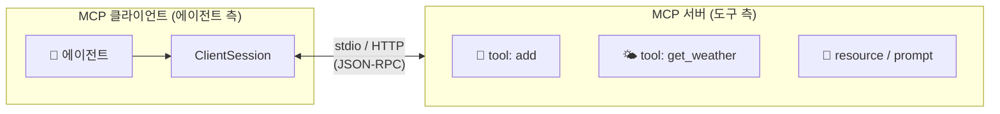
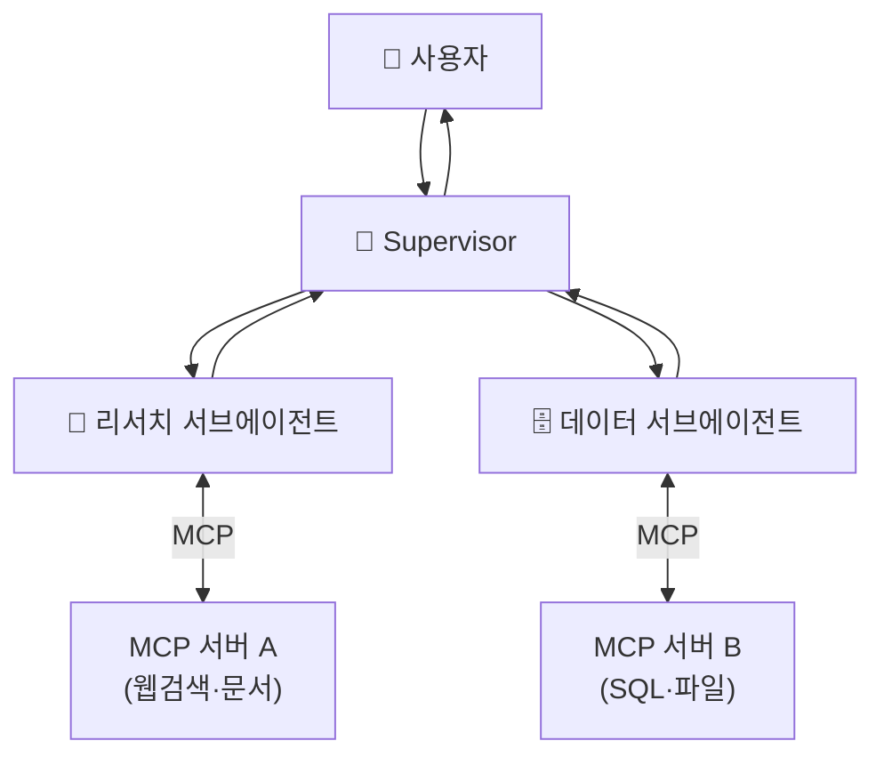

# 11. MCP 연계

에이전트가 강력해지려면 **외부 도구·데이터**에 닿아야 합니다. 문제는 도구마다 연결
방식이 제각각이라는 것. **MCP(Model Context Protocol)** 는 이 "에이전트 ↔ 도구"
연결을 표준화한 프로토콜입니다. USB-C가 기기 연결을 표준화하듯, MCP는 도구 연결을
표준화합니다 — 한 번 MCP 서버로 노출한 도구는 어떤 MCP 클라이언트(Claude, LangGraph,
IDE 등)에서도 그대로 쓸 수 있습니다.

## 1. MCP의 구성



| 개념 | 설명 |
|------|------|
| **서버** | 도구·리소스·프롬프트를 표준 형식으로 노출 |
| **클라이언트** | 서버에 접속해 도구 목록을 받고 호출 |
| **전송(transport)** | `stdio`(로컬 서브프로세스) 또는 `HTTP`(원격) |

!!! note "stdio vs HTTP"
    **stdio** 는 클라이언트가 서버를 서브프로세스로 띄워 stdin/stdout으로 통신 — 로컬
    도구에 가장 간단합니다. **HTTP(streamable-http)** 는 원격/공유 서버에 적합하며
    인증·확장이 필요한 프로덕션에서 씁니다.

## 2. FastMCP 서버 만들기

`mcp` 패키지의 **FastMCP** 는 "타입 힌트 + docstring" 만으로 도구를 노출합니다. JSON
스키마와 프로토콜 처리는 프레임워크가 자동 생성합니다.

```python
from mcp.server.fastmcp import FastMCP

mcp = FastMCP("demo-tools")

@mcp.tool()
def add(a: int, b: int) -> int:
    """두 정수를 더한다."""
    return a + b

@mcp.tool()
def get_weather(city: str) -> str:
    """도시의 날씨를 반환한다."""
    return {"seoul": "맑음, 26도"}.get(city.lower(), "데이터 없음")

if __name__ == "__main__":
    mcp.run(transport="stdio")   # 원격이면 transport="streamable-http"
```

→ 전체 예제: [`examples/15_mcp_server.py`](../examples/15_mcp_server.py)

!!! warning "mcp v1.x vs v2"
    위는 안정판 `mcp>=1.x` 의 `mcp.server.fastmcp.FastMCP` 기준입니다. `mcp` v2는
    pre-release로 임포트 경로가 다릅니다(`from mcp.server import MCPServer` 등). 설치
    버전을 대조하세요.

## 3. MCP 클라이언트 — 도구 호출

### 3-1. 순수 MCP SDK

`ClientSession` 으로 직접 서버에 붙어 도구를 나열·호출합니다. stdio에서는 클라이언트가
서버를 서브프로세스로 띄우므로 **서버를 미리 실행할 필요가 없습니다**.

```python
from mcp import ClientSession, StdioServerParameters
from mcp.client.stdio import stdio_client

server_params = StdioServerParameters(command="python", args=["15_mcp_server.py"])

async with stdio_client(server_params) as (read, write):
    async with ClientSession(read, write) as session:
        await session.initialize()                       # 핸드셰이크
        tools = await session.list_tools()               # 도구 목록
        result = await session.call_tool("add", {"a": 3, "b": 5})
        print(result.content[0].text)                    # -> 8
```

### 3-2. langchain-mcp-adapters — LangGraph에 바로 연결

`MultiServerMCPClient.get_tools()` 는 MCP 도구를 **LangChain 도구 객체로 변환**해
`create_react_agent` 에 그대로 넣습니다. 그러면 에이전트가 알아서 MCP 도구를 호출합니다.

```python
from langchain_mcp_adapters.client import MultiServerMCPClient
from langgraph.prebuilt import create_react_agent

client = MultiServerMCPClient({
    "demo": {"command": "python", "args": ["15_mcp_server.py"], "transport": "stdio"},
    # "remote": {"url": "http://localhost:8000/mcp", "transport": "http"},
})
tools = await client.get_tools()                 # 비동기
agent = create_react_agent(model, tools)
resp = await agent.ainvoke({"messages": [{"role": "user", "content": "서울 날씨는?"}]})
```

→ 두 방식 모두: [`examples/16_mcp_client.py`](../examples/16_mcp_client.py)

## 4. agent + subagent + MCP 통합 그림

MCP는 [09](09-multi-agent-patterns.md)·[10장](10-subagents-deep-agents-skills.md)의
구조와 자연스럽게 합쳐집니다. **여러 서브에이전트가 각자 다른 MCP 서버의 도구를**
쓰도록 배치하면, 도구 접근을 역할별로 분리(최소 권한)하면서 컨텍스트도 격리됩니다.



!!! tip "MCP + 최소 권한"
    서브에이전트마다 **필요한 MCP 서버만** 붙이면, 리서처가 실수로 DB를 쓰거나 데이터
    워커가 임의 웹에 접근하는 일을 구조적으로 막습니다. 권한·인가는 [14장](14-permissions-security-hitl.md)
    에서 이어집니다.

## 5. 도구만이 아니다 — resource · prompt

MCP 서버는 도구(tool) 외에 두 가지를 더 노출할 수 있습니다.

| 프리미티브 | 무엇 | 제어 주체 |
|-----------|------|-----------|
| **tool** | 에이전트가 호출하는 함수(부수효과 O) | 모델이 결정 |
| **resource** | 읽기 전용 데이터(파일·DB 행 등) | 애플리케이션이 선택 |
| **prompt** | 재사용 프롬프트 템플릿 | 사용자가 선택 |

FastMCP에서는 각각 `@mcp.tool()`, `@mcp.resource("uri://...")`, `@mcp.prompt()`
데코레이터로 노출합니다. 대부분의 에이전트 연동은 tool만 쓰지만, 대용량 컨텍스트를
읽기 전용으로 붙일 때 resource가 유용합니다.

!!! danger "MCP 도구도 신뢰 경계다"
    MCP 서버는 외부 코드입니다. 서드파티 서버를 붙일 때는 **어떤 도구가 어떤 권한으로
    무엇을 하는지** 반드시 검토하세요. 악의적 도구 설명(prompt injection)·과도한 권한은
    실제 위협입니다. 인가·최소권한은 [14장](14-permissions-security-hitl.md)에서 다룹니다.

## 6. 정리

- MCP = **에이전트 ↔ 도구** 표준. 한 번 노출하면 어떤 클라이언트에서도 재사용.
- **FastMCP** 로 타입힌트+docstring 만에 서버를, `ClientSession`/`MultiServerMCPClient`
  로 클라이언트를 만든다.
- **langchain-mcp-adapters** 가 MCP 도구를 LangGraph 에이전트에 브릿지한다.
- 서브에이전트별로 MCP 서버를 분리하면 컨텍스트 격리 + 최소 권한을 동시에 얻는다.

MCP가 "도구"의 표준이라면, 다음 [12장 A2A](12-a2a-protocol.md)는 "에이전트끼리"의
표준입니다.

## 참고 자료

- [Model Context Protocol 공식 사이트](https://modelcontextprotocol.io/)
- [MCP Python SDK (GitHub)](https://github.com/modelcontextprotocol/python-sdk)
- [langchain-mcp-adapters (GitHub)](https://github.com/langchain-ai/langchain-mcp-adapters)
- [MCP 도구 to LangGraph — LangChain 문서](https://langchain-ai.github.io/langgraph/agents/mcp/)
