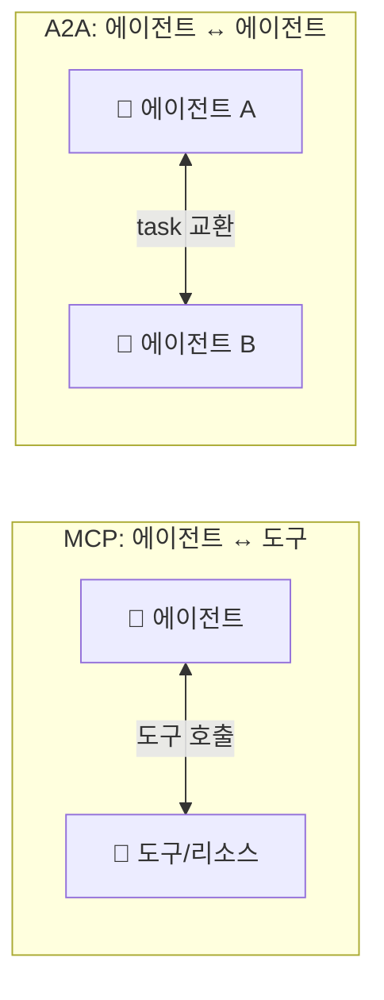
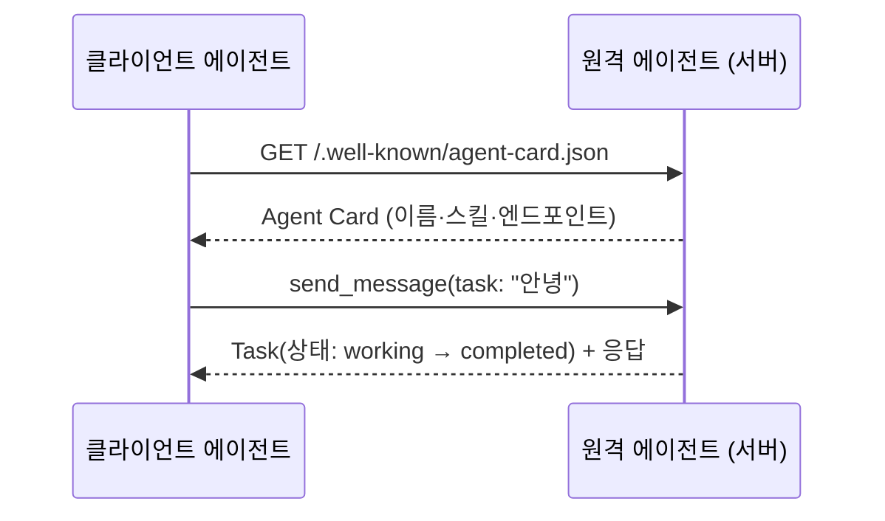
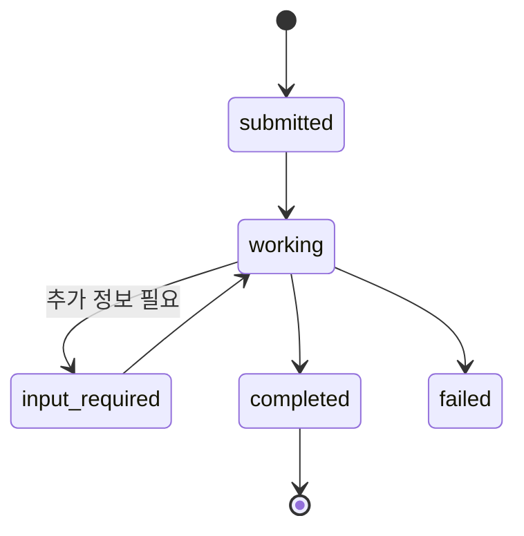
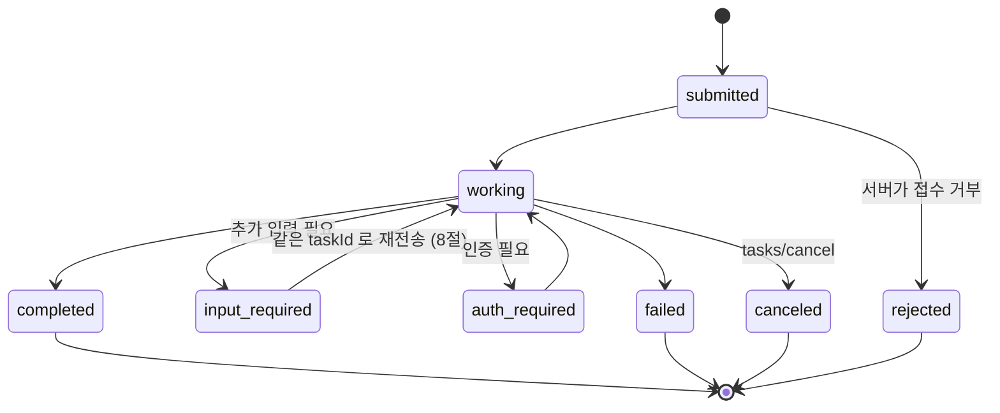
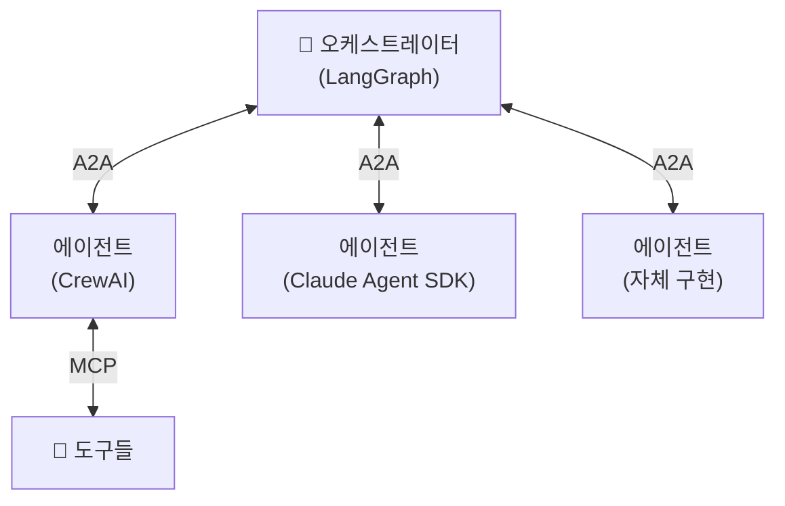
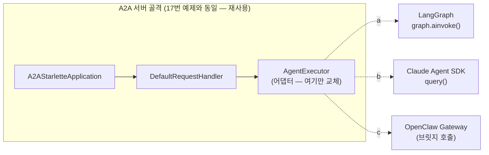
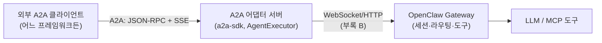
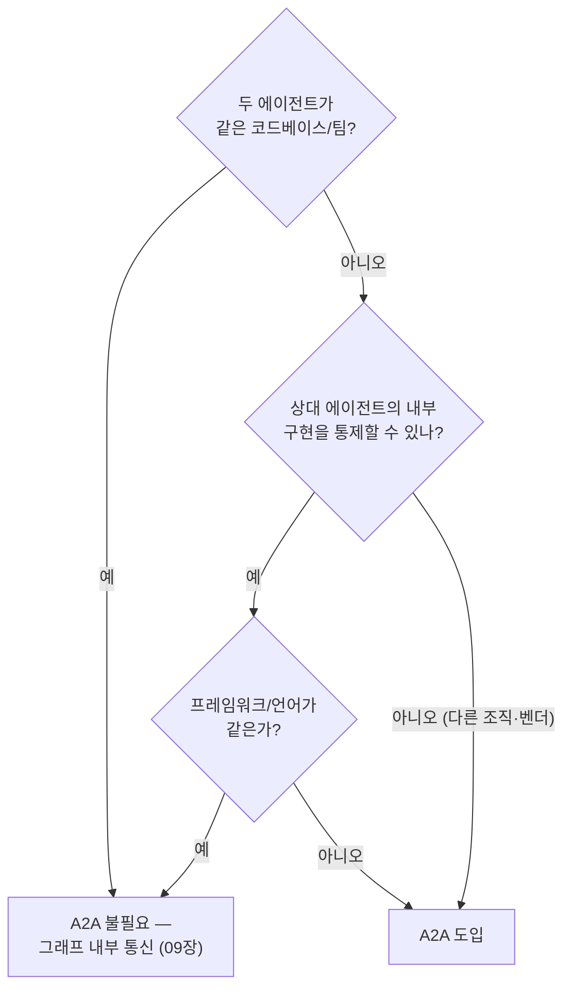

# 12. A2A 프로토콜

[MCP](11-mcp-integration.md)가 에이전트를 **도구**에 연결하는 표준이라면, **A2A(Agent2Agent)**
는 에이전트를 **다른 에이전트**에 연결하는 표준입니다. 서로 다른 벤더·프레임워크·언어로
만들어진 에이전트가 마치 웹 API처럼 서로를 발견하고 작업(task)을 주고받게 합니다.
Google이 발표하고 이후 **Linux Foundation** 으로 이관되어 중립적 표준으로 운영됩니다.

## 1. MCP vs A2A — 무엇이 다른가



| 구분 | MCP | A2A |
|------|-----|-----|
| 연결 대상 | 에이전트 ↔ **도구** | 에이전트 ↔ **에이전트** |
| 상대의 성격 | 수동적 함수 | 자율적 에이전트(스스로 판단) |
| 발견 방식 | 서버의 도구 목록 | **Agent Card**(.well-known) |
| 교환 단위 | 도구 호출(tool call) | **task**(수명주기를 가진 작업) |

!!! note "둘은 경쟁이 아니라 보완"
    실전 시스템은 보통 **A2A로 에이전트를 조율하고, 각 에이전트는 MCP로 도구를 씁니다.**
    A2A는 "누구에게 일을 맡길까", MCP는 "그 일을 무슨 도구로 할까"를 담당합니다.

## 2. Agent Card — 에이전트의 명함

A2A의 발견(discovery)은 **Agent Card** 로 이뤄집니다. 에이전트는 자신을 설명하는 JSON
문서를 `/.well-known/` 경로에 노출하고, 클라이언트는 이를 읽어 "이 에이전트가 뭘 할 수
있고 어디로 요청하는지"를 파악합니다.



Agent Card의 핵심 필드: `name`, `description`, `url`(엔드포인트), `version`,
`capabilities`(스트리밍 등), `skills`(AgentSkill 목록), 입출력 모드.

## 3. a2a-sdk 서버

`a2a-sdk` 서버는 클래스 네 종류를 조립해 만듭니다. 처음 보면 부품이 많아 보이지만,
**작은 회사 하나를 차린다**고 생각하면 각자의 자리가 분명해집니다.

- **AgentCard / AgentSkill / AgentCapabilities** — 문 앞에 붙이는 **간판이자 명함**입니다.
  실제 일은 하나도 하지 않고, "우리가 누구고 무엇을 할 수 있고 어디로 연락하면 되는지"를
  `/.well-known/` 경로에 공개하는 발견용 메타데이터입니다(2절).
- **AgentExecutor** — 유일하게 **실제 일을 하는 실무자**입니다. 여러분의 에이전트 로직
  (LLM 호출, 도구 사용 등)은 전부 `execute()` 안에 들어갑니다.
- **DefaultRequestHandler + InMemoryTaskStore** — **접수처와 장부**입니다. 들어온 요청을
  task로 만들어 executor에게 넘기고, task의 상태(submitted → working → completed)를
  스토어에 기록·추적합니다. 여러분이 건드릴 일은 거의 없습니다.
- **A2AStarletteApplication** — 이 모든 것을 담는 **건물(HTTP 창구)**입니다. ASGI 앱으로
  빌드해 uvicorn으로 띄우면 Agent Card 노출과 task 엔드포인트가 열립니다.

요청 하나가 흐르는 경로는 이렇습니다: 클라이언트의 메시지가 **HTTP 창구
(A2AStarletteApplication)** 로 들어오면, **접수처(RequestHandler)** 가 task를 만들어
**실무자(executor)** 의 `execute()` 를 호출합니다. 여기서 중요한 설계가 하나 있는데 —
executor는 응답을 **직접 반환하지 않습니다**. 대신 **이벤트 큐(EventQueue)** 에 넣습니다.
이벤트 큐는 **서버가 클라이언트에게 흘려보낼 응답의 우편함**입니다. 실무자는 답장(중간
경과든 최종 결과든)을 우편함에 넣기만 하면 되고, 발송 — 즉 클라이언트로의 전송과
스트리밍 — 은 프레임워크가 알아서 처리합니다. 응답이 "한 번의 return"이 아니라 "여러
통의 우편"일 수 있기 때문에, 오래 걸리는 task의 중간 진행 상황을 흘려보내는 스트리밍이
자연스럽게 지원됩니다(아래 Task 수명주기 참고).

```python
from a2a.server.agent_execution import AgentExecutor, RequestContext
from a2a.server.events import EventQueue
from a2a.utils import new_agent_text_message

class GreeterAgentExecutor(AgentExecutor):
    async def execute(self, context: RequestContext, event_queue: EventQueue) -> None:
        text = context.get_user_input()
        await event_queue.enqueue_event(new_agent_text_message(f"받았습니다: {text}"))

    async def cancel(self, context, event_queue) -> None:
        raise Exception("취소 미지원")
```

위 executor에서 `execute()` 가 아무것도 return 하지 않고 `event_queue.enqueue_event(...)`
로 끝나는 것이 바로 우편함 패턴입니다. 마지막으로 Agent Card와 핸들러를 묶어
`A2AStarletteApplication(...).build()` 로 ASGI 앱을 만들고 `uvicorn.run(...)` 으로 띄우면
서버가 완성됩니다.

→ 전체 서버: [`examples/17_a2a_server.py`](https://github.com/agent-chobi/agent-atoz/blob/main/examples/17_a2a_server.py)

## 4. a2a-sdk 클라이언트

클라이언트는 ① Agent Card를 발견하고 ② 클라이언트를 생성한 뒤 ③ task를 보냅니다.

```python
import httpx
from a2a.client import A2ACardResolver, A2AClient
from a2a.types import MessageSendParams, SendMessageRequest

async with httpx.AsyncClient() as http:
    resolver = A2ACardResolver(httpx_client=http, base_url="http://localhost:9999")
    card = await resolver.get_agent_card()              # ① 발견
    client = A2AClient(httpx_client=http, agent_card=card)  # ② 생성
    req = SendMessageRequest(id="...", params=MessageSendParams(**payload))
    resp = await client.send_message(req)               # ③ task 전송
```

→ 전체 클라이언트: [`examples/18_a2a_client.py`](https://github.com/agent-chobi/agent-atoz/blob/main/examples/18_a2a_client.py)

!!! warning "a2a-sdk는 시그니처가 자주 바뀝니다"
    A2A SDK는 2026년 활발히 변경 중입니다. 특히 **0.3 → 1.0** 에서 Agent Card 필드
    (`supported_interfaces`/`AgentInterface` 도입)와 클라이언트 생성 방식(`create_client` +
    `ClientConfig`)이 달라졌습니다. 본문은 널리 쓰이는 0.2.x/0.3.x 패턴이며, **설치한
    버전의 공식 예제와 대조**한 뒤 사용하세요.

### Task 수명주기

A2A의 교환 단위인 **task** 는 단순 요청/응답이 아니라 **상태를 가진 작업**입니다. 오래
걸리는 작업도 상태를 추적하며 스트리밍으로 중간 결과를 받을 수 있습니다.



`AgentCapabilities(streaming=True)` 로 노출하면 클라이언트는 `working` 중간 이벤트를
스트리밍으로 받아 진행 상황을 보여줄 수 있습니다. (위 다이어그램은 요약판입니다 —
스펙의 전체 상태 집합과 와이어 문자열은 다음 절에서 다룹니다.)

## 5. A2A 와이어 데이터 실체

3~4절의 SDK 클래스는 결국 **JSON-RPC 2.0 over HTTP** 를 감싼 껍데기입니다. 디버깅과
상호운용의 최종 심급은 와이어에 흐르는 JSON이므로, 여기서 실제 데이터를 눈으로
확인합니다. 아래 구조는 모두 [공식 스펙](https://a2a-protocol.org/)의 JSON-RPC 바인딩
(0.2.x/0.3.x 계열) 기준입니다.

### 5.1 Agent Card — 실제 JSON 전문

`GET /.well-known/agent-card.json` 이 돌려주는 문서입니다. 17번 예제의 Greeter를
스펙 형식으로 펼치면 이렇습니다(파이썬 SDK의 `default_input_modes` 같은 snake_case
필드는 와이어에서 **camelCase로 직렬화**됩니다).

```json
{
  "protocolVersion": "0.3.0",
  "name": "Greeter Agent",
  "description": "A2A 데모용 인사 에이전트",
  "url": "http://localhost:9999/",
  "preferredTransport": "JSONRPC",
  "version": "1.0.0",
  "capabilities": {
    "streaming": true,
    "pushNotifications": false
  },
  "defaultInputModes": ["text"],
  "defaultOutputModes": ["text"],
  "skills": [
    {
      "id": "greet",
      "name": "인사하기",
      "description": "받은 메시지에 한국어로 인사하며 응답한다.",
      "tags": ["greeting", "demo"],
      "examples": ["안녕", "hello"]
    }
  ]
}
```

- `capabilities` — `streaming`(message/stream 지원)·`pushNotifications`(웹훅 지원) 등
  **기능 플래그**. 클라이언트는 이걸 보고 호출 방식을 고릅니다.
- `skills[]` — `id`/`name`/`description`/`tags`/`examples`, 필요하면 스킬별
  `inputModes`/`outputModes` 재정의. 상대 에이전트의 LLM이 **읽고 라우팅을 결정하는
  문서**입니다(설계 가이드 참고).
- `protocolVersion`/`preferredTransport` 는 스펙 0.2.9+/0.3.x에서 도입된 필드로, 설치한
  SDK 버전에 따라 없을 수 있습니다.

### 5.2 message/send — 요청·응답 JSON-RPC 전문

클라이언트가 보내는 것은 **Message**(role + parts + messageId)이고, 돌아오는 것은
**Task**(수명주기를 가진 작업) 또는 단순 **Message**입니다. 스펙의 예시 그대로:

```json
// 요청 — POST / (JSON-RPC 2.0)
{
  "jsonrpc": "2.0",
  "id": 1,
  "method": "message/send",
  "params": {
    "message": {
      "role": "user",
      "parts": [{ "kind": "text", "text": "tell me a joke" }],
      "messageId": "9229e770-767c-417b-a0b0-f0741243c589"
    }
  }
}
```

```json
// 응답 — result 가 Task 인 경우
{
  "jsonrpc": "2.0",
  "id": 1,
  "result": {
    "id": "363422be-b0f9-4692-a24d-278670e7c7f1",
    "contextId": "c295ea44-7543-4f78-b524-7a38915ad6e4",
    "status": { "state": "completed" },
    "artifacts": [
      {
        "artifactId": "9b6934dd-37e3-4eb1-8766-962efaab63a1",
        "name": "joke",
        "parts": [{ "kind": "text", "text": "Why did the chicken cross the road? To get to the other side!" }]
      }
    ],
    "kind": "task"
  }
}
```

읽는 법:

- **Message** — `role`("user"/"agent") + `parts[]` + `messageId`(클라이언트가 생성,
  멱등성 키로도 씀). `parts[]` 의 판별자는 `kind` 이고 세 종류입니다:
  `TextPart`(`"kind":"text"`), `FilePart`(`"kind":"file"`), `DataPart`(`"kind":"data"`) —
  형태는 8절에서.
- **Task** — `id`(서버 생성), `contextId`(여러 task를 묶는 대화 맥락), `status.state`,
  `artifacts[]`(작업의 **산출물** — 각각 `artifactId`/`name`/`parts[]`), `kind: "task"`.
- 응답 `result` 는 `kind` 필드로 구분합니다 — 서버가 task를 만들지 않고 즉답하면
  `"kind": "message"` 가 옵니다(18번 예제의 출력이 바로 이 형태).

### 5.3 Task 상태 수명주기 — 스펙 전체 상태

와이어의 상태 문자열은 **kebab-case**입니다(`input-required` 등). 전체 상태 기계:



| 와이어 문자열 | 의미 | 성격 |
|---------------|------|------|
| `submitted` / `working` | 접수됨 / 처리 중 | 진행 |
| `input-required` / `auth-required` | 추가 입력 / 인증 대기 | **중단(interrupted)** — 클라이언트 행동 필요 |
| `completed` / `failed` / `canceled` / `rejected` | 성공 / 실패 / 취소 / 거부 | **종결(terminal)** — 더는 변하지 않음 |
| `unknown` | 판별 불가 | — |

### 5.4 message/stream — 스트리밍은 SSE로 온다

`message/stream` 을 호출하면 응답이 `Content-Type: text/event-stream`, 즉
**SSE(Server-Sent Events)** 스트림으로 옵니다 — 전송 계층 자체는
[부록 B](appendix-streaming-transports.md)에서 비교한 바로 그 SSE입니다. 각 `data:` 줄이
JSON-RPC 응답 하나이고, `result.kind` 로 이벤트 종류를 구분합니다:
`task`(최초 스냅샷) / `message` / `status-update` / `artifact-update`.

```json
// SSE data: — 상태 변경 이벤트 (TaskStatusUpdateEvent)
{ "jsonrpc": "2.0", "id": 1, "result": {
    "taskId": "363422be-...", "contextId": "c295ea44-...",
    "kind": "status-update", "status": { "state": "working" }, "final": false } }
```

```json
// SSE data: — 산출물 조각 이벤트 (TaskArtifactUpdateEvent)
{ "jsonrpc": "2.0", "id": 1, "result": {
    "taskId": "363422be-...", "contextId": "c295ea44-...",
    "kind": "artifact-update",
    "artifact": { "artifactId": "9b6934dd-...", "parts": [{ "kind": "text", "text": "생성 중..." }] },
    "append": false, "lastChunk": false } }
```

- `status-update` 의 `final: true` 가 **스트림 종료 신호**입니다(종결 상태 도달).
- `artifact-update` 는 `append`(이어붙이기)·`lastChunk`(마지막 조각) 플래그로 긴 산출물을
  조각내 보냅니다.
- 3절의 **이벤트 큐(우편함) 패턴**이 와이어에서 이렇게 보이는 것입니다 — executor가
  큐에 넣은 이벤트 하나가 SSE 이벤트 하나로 발송됩니다.

## 6. 크로스-프레임워크 상호운용

A2A의 진짜 값은 **프레임워크 경계를 넘는 협업**입니다. LangGraph로 만든 에이전트가
CrewAI·Claude Agent SDK·자체 구현 에이전트를 A2A로 호출할 수 있습니다 — 상대가 A2A
Agent Card만 노출하면 내부 구현은 몰라도 됩니다.



!!! tip "표준의 값"
    프레임워크 lock-in 없이 팀·조직마다 다른 스택으로 만든 에이전트를 조합할 수 있다는
    것이 A2A의 핵심 가치입니다. 내부는 자유롭게, 경계는 표준으로.

## 7. 프레임워크별 A2A 통합

6절의 그림을 실제 코드로 내리면, 모든 통합의 공통 원리는 하나입니다 —
**프레임워크는 그대로 두고, `AgentExecutor` 어댑터만 갈아끼운다.** 3절의 서버 골격
(A2AStarletteApplication + RequestHandler)은 어떤 프레임워크든 동일하고, `execute()`
안에서 무엇을 호출하느냐만 다릅니다.



### 7.1 LangGraph — 공식 샘플 패턴

공식 [a2a-samples의 LangGraph 예제](https://github.com/a2aproject/a2a-samples/tree/main/samples/python/agents/langgraph)
(환율 에이전트)가 정석 패턴입니다. `create_react_agent` 그래프를 executor 안에서
호출하고, 결과를 **`TaskUpdater`** 로 task 상태·artifact에 반영합니다(공식 샘플을
단순화한 골격 — 실동 전체 코드는 아래 따라하기의 32번 예제):

```python
from a2a.server.agent_execution import AgentExecutor, RequestContext
from a2a.server.events import EventQueue
from a2a.server.tasks import TaskUpdater
from a2a.types import Part, TaskState, TextPart
from a2a.utils import new_agent_text_message, new_task

class LangGraphAgentExecutor(AgentExecutor):
    def __init__(self):
        self.graph = create_react_agent(model=..., tools=[...])   # 04장의 그래프 그대로

    async def execute(self, context: RequestContext, event_queue: EventQueue) -> None:
        query = context.get_user_input()
        task = context.current_task
        if not task:                                  # 첫 호출이면 task 생성·발행
            task = new_task(context.message)
            await event_queue.enqueue_event(task)
        updater = TaskUpdater(event_queue, task.id, task.context_id)

        # 진행 상황 → status-update 이벤트 (5.4절의 SSE 로 발송된다)
        await updater.update_status(
            TaskState.working,
            new_agent_text_message("그래프 실행 중...", task.context_id, task.id))

        result = await self.graph.ainvoke({"messages": [("user", query)]})
        answer = result["messages"][-1].content       # 마지막 AIMessage

        # 최종 결과 → artifact 로 승격하고 task 종결
        await updater.add_artifact([Part(root=TextPart(text=str(answer)))], name="result")
        await updater.complete()
```

3절의 최소 executor(`new_agent_text_message` 만 큐에 넣기)와 달리, 이 패턴은 **task를
명시적으로 만들고 artifact로 종결**하므로 5.2절의 `"kind": "task"` 응답이 됩니다.
공식 샘플은 여기에 더해 그래프의 구조화 출력으로 `input-required` 전환(멀티턴, 8.1절)과
스트리밍 중간 상태까지 처리합니다.

두 세계의 메시지 모델 대응은 이렇습니다([04장](04-langgraph-state-graph.md)의
`AnyMessage` = `HumanMessage | AIMessage | ...` 유니언 기준):

| LangChain/LangGraph (그래프 내부) | A2A (와이어) |
|-----------------------------------|--------------|
| `HumanMessage` | `Message(role: "user")` |
| `AIMessage` | `Message(role: "agent")` |
| `content`(문자열) | `TextPart` — `{"kind": "text", "text": ...}` |
| `content`(블록 리스트)·멀티모달 | `parts[]` — Text/File/DataPart 배열 |
| `ToolMessage`·`tool_calls` | **노출 안 됨** — 도구 사용은 서버 내부 사정 |
| 최종 응답 | `Task.artifacts[]` 로 승격이 관례 |
| 체크포인터 `thread_id` | `contextId` 로 매핑(공식 샘플의 방식) |

`ToolMessage` 가 와이어에 없다는 점이 핵심입니다 — A2A는 **결과를 교환하는 프로토콜**
이지 상대의 추론 과정을 들여다보는 창이 아닙니다(불투명성은 실무 트레이드오프 표 참고).

**반대 방향** — 원격 A2A 에이전트를 LangGraph의 **도구**로 감싸면, 그래프 입장에서는
평범한 `@tool` 하나입니다(4절 클라이언트 코드를 함수에 넣었을 뿐):

```python
from langchain_core.tools import tool

@tool
async def ask_remote_agent(question: str) -> str:
    """원격 A2A 에이전트에게 질문을 위임하고 답을 받아온다."""
    async with httpx.AsyncClient() as http:
        card = await A2ACardResolver(httpx_client=http, base_url=REMOTE_URL).get_agent_card()
        client = A2AClient(httpx_client=http, agent_card=card)
        req = SendMessageRequest(id=uuid4().hex, params=MessageSendParams(message={
            "role": "user", "parts": [{"kind": "text", "text": question}],
            "message_id": uuid4().hex}))
        resp = await client.send_message(req)
        data = resp.model_dump(mode="json", exclude_none=True).get("result", {})
        # Task 응답이면 artifacts 에서, Message 응답이면 parts 에서 텍스트 추출
        parts = ([p for a in data.get("artifacts", []) for p in a.get("parts", [])]
                 or data.get("parts", []))
        return "\n".join(p["text"] for p in parts if p.get("kind") == "text")

agent = create_react_agent(model=..., tools=[ask_remote_agent])
```

이 두 방향을 합치면 "LangGraph 오케스트레이터가 A2A로 외부 에이전트를 도구처럼 부리고,
자신도 A2A 서버로 노출되는" 6절의 그림이 완성됩니다.

### 7.2 Claude Agent SDK — 직접 어댑터 패턴

Anthropic 공식 A2A 통합은 **없습니다**(2026-07 기준 확인 — 커뮤니티 래퍼로
[claude-a2a](https://github.com/ericabouaf/claude-a2a) 등이 있는 정도). 하지만 어댑터
원리는 동일해서, [05장](05-claude-agent-sdk.md)의 `query()` 를 executor 안에서 돌리고
`AssistantMessage` 의 `TextBlock` 을 `TextPart` 로 옮기면 끝입니다:

```python
from claude_agent_sdk import query, ClaudeAgentOptions, AssistantMessage, TextBlock

class ClaudeAgentExecutor(AgentExecutor):
    async def execute(self, context: RequestContext, event_queue: EventQueue) -> None:
        task = context.current_task
        if not task:
            task = new_task(context.message)
            await event_queue.enqueue_event(task)
        updater = TaskUpdater(event_queue, task.id, task.context_id)

        chunks: list[str] = []
        async for message in query(          # 05장의 Claude Agent SDK 그대로
            prompt=context.get_user_input(),
            options=ClaudeAgentOptions(allowed_tools=["Read", "Glob", "Grep"]),
        ):
            if isinstance(message, AssistantMessage):
                for block in message.content:
                    if isinstance(block, TextBlock):
                        chunks.append(block.text)          # TextBlock → TextPart 변환 재료
                        await updater.update_status(       # 중간 발화는 진행 상태로 중계
                            TaskState.working,
                            new_agent_text_message(block.text, task.context_id, task.id))

        await updater.add_artifact([Part(root=TextPart(text="".join(chunks)))], name="result")
        await updater.complete()
```

주의점 두 가지 — ① Claude Agent SDK는 **Node.js 런타임 전제**(05장)라서 이 A2A 서버의
배포 이미지에도 Node 18+가 필요합니다. ② `query()` 는 파일·셸을 만지는 강력한 도구를
쓰므로, 외부에 A2A로 노출하기 전에 `permission_mode`·도구 허용 목록을 보수적으로
잠가야 합니다([14장](14-permissions-security-hitl.md)).

### 7.3 OpenClaw — 브릿지 패턴

[16장](16-self-hosted-runtimes.md)의 OpenClaw는 코어에 **A2A 네이티브 지원이 없습니다**
(2026-07 기준 — 본체 저장소에 A2A 지원 기능 요청 이슈가 열려 있고, A2A v0.3을 구현했다는
서드파티 플러그인 [openclaw-a2a-gateway](https://github.com/win4r/openclaw-a2a-gateway)가
있는 단계입니다). 정석은 **Gateway 앞에 얇은 A2A 어댑터 서버를 세우는 브릿지 패턴**
입니다 — 16장과 같은 이유로 아래는 개념 수준이며 세부 API는 버전 문서 대조가 필요합니다.



어댑터의 `execute()` 는 Gateway에 메시지를 전달하고(WebSocket 또는 HTTP — 16장 참고),
돌아온 응답 텍스트를 `TextPart` 로 변환합니다. `contextId` ↔ Gateway 세션 id를
매핑해 두면 멀티턴도 이어집니다. 즉 OpenClaw 자체는 건드리지 않고, **A2A라는 표준
현관문 한 겹**만 덧대는 것입니다 — 7절 서두의 "어댑터만 갈아끼운다" 원리의 극단적
적용입니다.

## 8. 구현 관점 추가 패턴

실전 구현에서 곧 마주치는 네 가지를 와이어 수준으로 짚어 둡니다.

### 8.1 멀티턴 — `input-required` 왕복

task가 `input-required` 로 멈추면, 클라이언트는 **같은 `taskId`·`contextId` 를 넣은**
두 번째 `message/send` 로 재개합니다(스펙의 멀티턴 예시 요약):

```json
// ① 응답: task 가 입력 대기로 멈춤
{ "result": { "id": "task-456", "contextId": "ctx-789",
              "status": { "state": "input-required" }, "kind": "task" } }
```

```json
// ② 재개: 같은 taskId/contextId 를 message 에 실어 재전송
{ "method": "message/send", "params": { "message": {
    "role": "user", "parts": [{ "kind": "text", "text": "출발지는 서울" }],
    "messageId": "def-456", "taskId": "task-456", "contextId": "ctx-789" } } }
```

서버 쪽에서는 executor가 `context.current_task` 로 기존 task를 이어받습니다(7.1절
코드의 `if not task:` 분기가 그 지점). LangGraph라면 `contextId` 를 체크포인터
`thread_id` 로 쓰면 대화 상태가 자연스럽게 이어집니다([04장](04-langgraph-state-graph.md)).

### 8.2 Push notification — 웹훅

폴링·SSE 연결 유지가 곤란한 **장시간 task**(수 분~수 시간)용입니다. 클라이언트가
웹훅 URL을 등록해 두면, 서버가 상태 변화 시 그 URL로 HTTP POST를 보냅니다.
서버 카드에 `capabilities.pushNotifications: true` 가 있어야 합니다.

```json
{ "method": "tasks/pushNotificationConfig/set", "params": {
    "taskId": "task-456",
    "pushNotificationConfig": {
      "url": "https://client.example.com/webhook",
      "token": "secret-token-xyz",
      "authentication": { "schemes": ["Bearer"], "credentials": "auth-value" } } } }
```

`token` 은 웹훅 수신 측이 "내가 등록한 task의 알림이 맞는지" 검증하는 값입니다.
웹훅 엔드포인트는 공개 HTTP 표면이므로 인증 없는 URL은 금물입니다(14장).

### 8.3 파일·구조화 데이터 — FilePart / DataPart

`parts[]` 는 텍스트만이 아닙니다. 세 종류의 실제 형태(5.2절의 `kind` 판별자):

```json
{ "kind": "text", "text": "요약입니다" }
{ "kind": "file", "file": { "name": "report.pdf", "mimeType": "application/pdf",
                             "bytes": "<base64>" } }
{ "kind": "file", "file": { "name": "big.mp4", "mimeType": "video/mp4",
                             "uri": "https://files.example.com/big.mp4" } }
{ "kind": "data", "data": { "환율": 1350.2, "기준": "USD/KRW" } }
```

- `FilePart` 는 **인라인(`bytes`, base64) 또는 참조(`uri`)** 둘 중 하나 — 큰 파일은
  URI로 넘기고 접근 권한은 별도 협상이 정석입니다.
- `DataPart` 는 임의 JSON — 폼, 구조화 결과([18장](18-structured-output.md)의 출력)를
  그대로 실어 나릅니다.
- Agent Card의 `defaultInputModes/OutputModes`(MIME 타입)와 맞지 않는 형식을 보내면
  8.4절의 `ContentTypeNotSupportedError` 를 받게 됩니다.

### 8.4 에러 처리 — JSON-RPC 에러 코드

에러는 JSON-RPC 표준 `error` 객체(`{"code", "message", "data"}`)로 옵니다.
A2A 고유 코드는 -32000번대입니다:

| 코드 | 이름 | 의미 · 클라이언트의 대응 |
|------|------|--------------------------|
| -32700 / -32600 / -32601 / -32602 / -32603 | JSON-RPC 표준 오류 | 파싱/요청형식/메서드/파라미터/내부 오류 — 내 요청 직렬화부터 의심 |
| -32001 | `TaskNotFoundError` | task id 만료·오타 — 재조회가 아니라 새 task로 |
| -32002 | `TaskNotCancelableError` | 이미 종결된 task 취소 시도 — 상태 확인 후 포기 |
| -32003 | `PushNotificationNotSupportedError` | 서버가 웹훅 미지원 — 폴링/스트리밍으로 전환 |
| -32004 | `UnsupportedOperationError` | 미구현 연산(예: 17번 예제의 `cancel`) |
| -32005 | `ContentTypeNotSupportedError` | MIME 불일치 — 카드의 입출력 모드 재확인 |
| -32006 | `InvalidAgentResponseError` | 서버 쪽 응답 생성 결함 — 내 잘못 아님, 상대에 리포트 |

서버 구현 쪽에서는 a2a-sdk의 `ServerError(error=...)` 로 이 코드들을 던집니다 —
7.1절 공식 샘플 패턴의 `raise ServerError(error=InternalError())` 가 그 예입니다.
설계 가이드의 재시도 표와 함께 보세요: **어떤 코드는 재시도가 무의미**합니다
(-32001, -32005는 요청을 고쳐야 하고, -32603은 잠시 후 재시도 가치가 있습니다).

## 9. 정리

- A2A = **에이전트 ↔ 에이전트** 표준(Google → Linux Foundation).
- **Agent Card**(.well-known)로 발견하고, **task** 로 작업을 교환한다.
- 서버는 `AgentExecutor` + `A2AStarletteApplication`, 클라이언트는 `A2ACardResolver` +
  `A2AClient` 로 구성.
- 와이어의 실체는 **JSON-RPC 2.0** — Message(role+parts+messageId)를 보내고
  Task(id·contextId·status.state·artifacts)를 받으며, 스트리밍은 **SSE**로 온다(5절).
- 프레임워크 통합의 공통 원리는 **"AgentExecutor 어댑터만 갈아끼운다"** — LangGraph는
  공식 샘플 패턴, Claude Agent SDK·OpenClaw는 직접 어댑터/브릿지로(7절).
- MCP(도구)와 **보완 관계** — A2A로 조율하고 각자 MCP로 도구를 쓴다.
- SDK 시그니처 변동이 크니 설치 버전 대조가 필수.

여기까지가 오케스트레이션·프로토콜(Phase D)입니다. 다음 [Phase E](13-debugging-observability.md)
는 이 모든 것을 프로덕션에서 신뢰할 수 있게 만드는 관측·권한·평가로 넘어갑니다.

## 설계 가이드

A2A는 "붙일 수 있다"와 "붙여야 한다"의 간극이 특히 큰 기술입니다. 도입 판단 →
노출 범위 → 수명주기 설계 순으로 정리합니다.

### 언제 A2A가 정당한가 — 결정 트리



핵심 판별식은 **"경계를 넘는가"** 입니다. 조직 경계(파트너사 에이전트 호출), 벤더
경계(구매한 SaaS 에이전트), 프레임워크 경계(LangGraph ↔ CrewAI)를 넘으면 A2A가
정당하고, 셋 다 아니면 HTTP 왕복·Agent Card 관리·SDK 버전 추적이라는 비용만 남습니다.
"나중에 외부에 공개할지도 모르니까"는 도입 사유가 못 됩니다 — 경계가 실제로 생길 때
서버 한 겹을 씌우는 편이 쌉니다.

### Agent Card 스킬 노출 범위

Agent Card는 **공개 계약서**입니다. 명함에 모든 업무 이력을 적지 않듯, 내부 능력을
전부 노출하지 마세요.

- [ ] **외부가 호출할 스킬만** `skills` 에 올린다 — 내부 보조 단계(중간 검증, 내부
  포맷 변환)는 노출하지 않는다.
- [ ] 스킬 `description` 과 `examples` 는 **상대 에이전트의 LLM이 읽고 라우팅을
  결정하는 문서**로 쓴다 — "무엇을 언제 맡기면 되는지"가 드러나게.
- [ ] `version` 을 올리는 규칙을 정한다 — 스킬 시그니처가 바뀌면 카드 버전도 올려
  클라이언트가 감지할 수 있게 한다.
- [ ] 인증 없는 공개 엔드포인트라면 카드 자체가 공격 표면 정찰 자료가 된다는 점을
  기억한다([14장](14-permissions-security-hitl.md)).

### task 수명주기·재시도·타임아웃 설계

상대는 함수가 아니라 **자율 에이전트**입니다 — 느리고, 실패하고, 되물을 수 있다는
전제로 클라이언트를 설계해야 합니다.

| 설계 항목 | 권장 |
|-----------|------|
| 타임아웃 | 짧은 task는 요청 타임아웃 하나로. 긴 task는 `AgentCapabilities(streaming=True)` 기반 스트리밍이나 폴링으로 전환하고, "진행 이벤트가 N초간 없으면 포기" 형태로 건다 |
| 재시도 | 네트워크 오류는 재시도하되, **task가 서버에 이미 생성됐을 수 있음**을 전제로 `message_id`/요청 id를 재사용해 중복 실행을 방지한다(멱등성) |
| `input_required` | task가 이 상태로 멈출 수 있다 — 클라이언트에 "추가 정보를 채워 재개"하는 분기를 만들지 않으면 task가 영원히 매달린다 |
| `failed` | 원인(잘못된 입력 vs 상대 내부 오류)을 구분해 기록한다 — 전자는 재시도해도 또 실패한다 |
| 관측 | task id를 자기 시스템의 트레이스에 남겨, "상대 에이전트에서 무슨 일이 있었나"를 추적할 열쇠로 삼는다([13장](13-debugging-observability.md)) |

## 따라하기

예제는 세 개입니다.

- 서버([`examples/17_a2a_server.py`](https://github.com/agent-chobi/agent-atoz/blob/main/examples/17_a2a_server.py))와
  클라이언트([`examples/18_a2a_client.py`](https://github.com/agent-chobi/agent-atoz/blob/main/examples/18_a2a_client.py))
  한 쌍 — a2a-sdk의 최소 골격(LLM 없음).
- [`examples/32_a2a_langgraph.py`](https://github.com/agent-chobi/agent-atoz/blob/main/examples/32_a2a_langgraph.py) —
  7.1절의 **LangGraph 통합**: `create_react_agent` 에이전트를 `AgentExecutor` +
  `TaskUpdater` 로 감싸 A2A 서버로 노출하고, 같은 파일의 `--client` 모드로 호출합니다
  (task·artifact 응답을 직접 확인).

MCP 예제와 달리 HTTP 서버라서 **반드시 서버를 먼저** 띄워야 합니다.

**① 사전 준비**

```bash
pip install -U a2a-sdk uvicorn httpx
```

이 예제는 LLM을 호출하지 않으므로 API 키가 필요 없습니다.

**② 실행 — 터미널 두 개**

```bash
# 터미널 1: 서버 먼저!
python examples/17_a2a_server.py
# → "A2A 서버 시작: http://localhost:9999" 가 뜨고 대기 상태 유지

# (선택) 브라우저나 curl 로 Agent Card 를 눈으로 확인
#   http://localhost:9999/.well-known/agent-card.json

# 터미널 2: 클라이언트
python examples/18_a2a_client.py
```

**③ 기대 출력 요지**

- 클라이언트 쪽에 `=== 발견한 Agent Card ===` — 이름(`Greeter Agent`)·설명·스킬
  목록(`['인사하기']`)이 출력됩니다. 발견(discovery)이 성공한 것입니다.
- 이어서 `=== 서버 응답 ===` 에 응답 JSON 덤프가 나오고, 그 안에
  `"안녕하세요! A2A 에이전트가 받았습니다: '안녕, A2A 서버!'"` 텍스트가 들어 있습니다.

**④ 흔한 에러**

| 증상 | 원인 · 해결 |
|------|-------------|
| `httpx.ConnectError` / `Connection refused` | **서버를 먼저 안 띄웠거나** 포트가 다름 — 터미널 1 확인 |
| `ModuleNotFoundError: a2a` | `pip install a2a-sdk` (패키지명이 `a2a` 가 아니라 `a2a-sdk`) |
| `ImportError` / `ValidationError`(필드 불일치) | a2a-sdk 0.3 ↔ 1.0 시그니처 차이 — 본문 경고 참조, 설치 버전 대조 |
| `Address already in use` (포트 9999) | 이전 서버 프로세스가 살아 있음 — 종료 후 재실행 |

**⑤ LangGraph 통합 예제(32번) — 터미널 두 개**

32번은 서버·클라이언트가 **한 파일**이고, 서버 모드가 실제 LLM(LangGraph 에이전트)을
호출하므로 `ANTHROPIC_API_KEY` 가 필요합니다.

```bash
# 터미널 1: A2A 서버 모드 (LangGraph 에이전트, 포트 9998)
python examples/32_a2a_langgraph.py

# 터미널 2: 클라이언트 모드
python examples/32_a2a_langgraph.py --client
```

기대 출력 — 클라이언트에 발견된 Agent Card(이름 `LangGraph Exchange Agent`)에 이어,
**`"kind": "task"` 응답**이 출력됩니다: `status.state` 가 `completed` 이고 `artifacts[]`
안의 텍스트에 환율 도구 결과(1달러 = 1,350원 데모값)가 반영된 답이 들어 있습니다 —
17·18의 `"kind": "message"` 응답과 형태를 비교해 보세요(5.2절).

## 실무 트레이드오프

"에이전트 둘을 잇는 데 정말 A2A가 필요한가?"부터 물어야 합니다. **같은 팀이 같은
프레임워크로 만드는 에이전트라면 그래프 안의 노드로 두는 것(09장)이 거의 항상
단순합니다.** A2A는 조직·벤더·프레임워크 경계를 넘을 때 값을 합니다.

| 기준 | A2A 도입 | 단일 프레임워크 내부 통신(예: LangGraph 노드) |
|------|---------|------------------------------------------|
| 상호운용 | 벤더·언어·프레임워크 무관 — 카드만 노출하면 연결 | 같은 스택 내부로 한정 |
| 지연·오버헤드 | HTTP 왕복 + 직렬화 비용 | in-process 상태 공유 — 가장 빠름 |
| 운영 복잡도 | 서버 배포·포트·인증·버전 관리가 각 에이전트마다 필요 | 프로세스 하나 배포로 끝 |
| 상태 공유 | task 단위로만 교환 — 내부 상태는 불투명 | 그래프 상태를 직접 공유·검사 가능 |
| 결합도 | 느슨함 — 상대 내부 구현 교체 자유 | 강함 — 프레임워크 lock-in |
| 안정성 | SDK 시그니처 변동 큼(0.3→1.0) | 프레임워크 하나만 추적하면 됨 |
| 적합 상황 | 팀/조직/벤더 간 에이전트 연동, 외부 공개 에이전트 | 한 팀이 소유한 멀티에이전트 앱 |

## 2026 실무 트렌드

- **1년 만에 150개 조직 돌파** — Linux Foundation은 A2A 1주년 시점에 150개 이상 조직
  참여, Google·Microsoft·AWS 주요 클라우드 플랫폼 통합, 공급망·금융·보험·IT 운영 분야의
  실제 프로덕션 배포를 발표했습니다.
- **프로토콜 거버넌스의 정렬** — MCP(AAIF)·A2A가 모두 Linux Foundation 산하로 들어오면서
  "도구 연결은 MCP, 에이전트 연결은 A2A"라는 역할 분담이 제도적으로도 굳어지고 있습니다.
- **로드맵은 상호운용·레지스트리·보안** — A2A 프로젝트는 상호운용성 명세, 에이전트
  레지스트리 통합, 보안·배포 모범사례를 다음 과제로 공표했습니다. 발견(discovery)이
  Agent Card 단건에서 레지스트리 규모로 확장되는 방향입니다.

## 실전 레퍼런스

- [A2A Protocol 공식 명세](https://a2a-protocol.org/) — Agent Card·task·스트리밍 등 프로토콜 원전
- [Linux Foundation Launches the Agent2Agent Protocol Project](https://www.linuxfoundation.org/press/linux-foundation-launches-the-agent2agent-protocol-project-to-enable-secure-intelligent-communication-between-ai-agents) — Google에서 Linux Foundation으로의 이관 공식 발표
- [A2A Protocol Surpasses 150 Organizations — Linux Foundation](https://www.linuxfoundation.org/press/a2a-protocol-surpasses-150-organizations-lands-in-major-cloud-platforms-and-sees-enterprise-production-use-in-first-year) — 1주년 채택 현황과 프로덕션 사례 발표
- [Linux Foundation A2A Protocol Marks One Year — AIwire](https://www.hpcwire.com/aiwire/2026/04/09/linux-foundation-a2a-protocol-marks-one-year-with-broad-enterprise-and-cloud-adoption/) — 1주년 채택 현황의 외부 시각 리포트
- [Agent Interoperability Protocols 2026: MCP, A2A, ACP — Zylos Research](https://zylos.ai/research/2026-03-26-agent-interoperability-protocols-mcp-a2a-acp-convergence/) — 에이전트 상호운용 프로토콜들의 역할 분담·수렴 방향 분석

### 함께 보면 좋은 한국어 자료

아직 한국어 자료가 드문 최신 주제입니다 — 확인된 자료 위주로 소개합니다.

- [[번역] Agent2Agent (A2A) 프로토콜은 무엇인가요? — velog](https://velog.io/@surim014/a2a-protocol) — A2A의 등장 배경과 MCP와의 역할 구분을 한국어로 풀어 주는 번역 글
- [Agent2Agent(A2A) 프로토콜 발표 — Google Developers Blog(한국어)](https://developers.googleblog.com/ko/a2a-a-new-era-of-agent-interoperability/) — Agent Card·task 등 핵심 개념을 담은 공식 발표문의 한국어판
- ["MCP, A2A" 진짜 엔터프라이즈 적용할 수 있을지 집중탐구 — 테디노트](https://www.youtube.com/watch?v=z2rnK9COhuQ) (YouTube) — MCP와 A2A를 기업 환경에 적용할 때의 현실적 쟁점을 라이브 코딩과 함께 토론하는 영상

## 참고 자료

- [A2A Protocol 공식 사이트](https://a2a-protocol.org/)
- [a2a-python SDK (GitHub)](https://github.com/a2aproject/a2a-python)
- [a2a-samples (GitHub)](https://github.com/a2aproject/a2a-samples)
- [Multi-Agent Communication with the A2A Python SDK — Towards Data Science](https://towardsdatascience.com/multi-agent-communication-with-the-a2a-python-sdk/)
