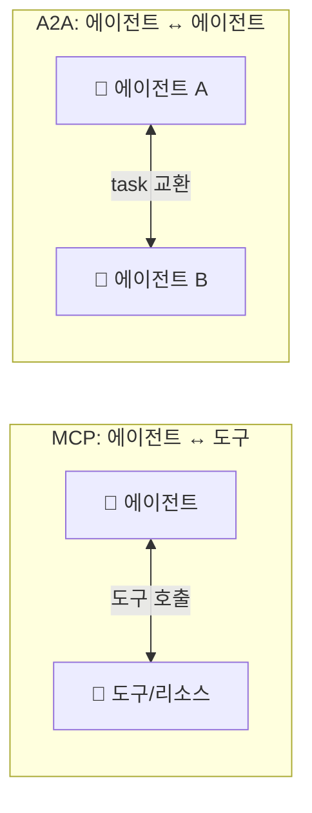
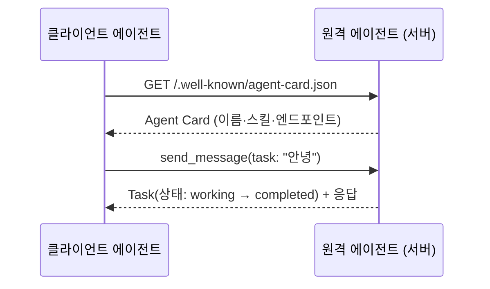
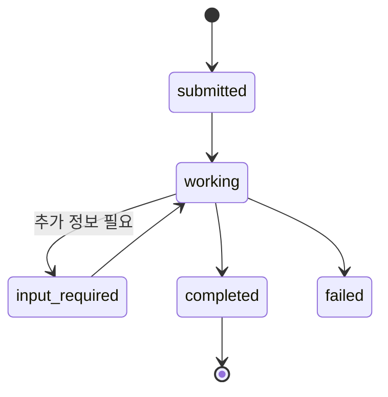
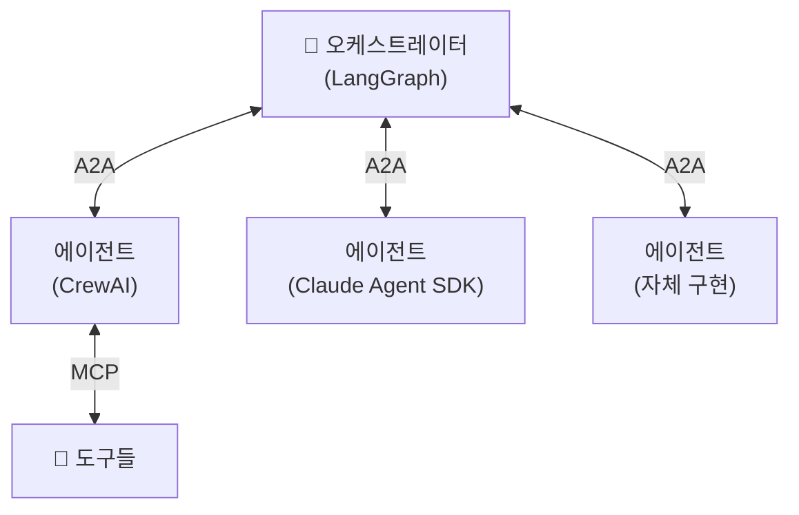

# 12. A2A 프로토콜

[MCP](11-mcp-integration.md)가 에이전트를 **도구**에 연결하는 표준이라면, **A2A(Agent2Agent)**
는 에이전트를 **다른 에이전트**에 연결하는 표준입니다. 서로 다른 벤더·프레임워크·언어로
만들어진 에이전트가 마치 웹 API처럼 서로를 발견하고 작업(task)을 주고받게 합니다.
Google이 발표하고 이후 **Linux Foundation** 으로 이관되어 중립적 표준으로 운영됩니다.

## 1. MCP vs A2A — 무엇이 다른가



| 구분 | MCP | A2A |
|------|-----|-----|
| 연결 대상 | 에이전트 ↔ **도구** | 에이전트 ↔ **에이전트** |
| 상대의 성격 | 수동적 함수 | 자율적 에이전트(스스로 판단) |
| 발견 방식 | 서버의 도구 목록 | **Agent Card**(.well-known) |
| 교환 단위 | tool call | **task**(수명주기를 가진 작업) |

!!! note "둘은 경쟁이 아니라 보완"
    실전 시스템은 보통 **A2A로 에이전트를 조율하고, 각 에이전트는 MCP로 도구를 씁니다.**
    A2A는 "누구에게 일을 맡길까", MCP는 "그 일을 무슨 도구로 할까"를 담당합니다.

## 2. Agent Card — 에이전트의 명함

A2A의 발견(discovery)은 **Agent Card** 로 이뤄집니다. 에이전트는 자신을 설명하는 JSON
문서를 `/.well-known/` 경로에 노출하고, 클라이언트는 이를 읽어 "이 에이전트가 뭘 할 수
있고 어디로 요청하는지"를 파악합니다.



Agent Card의 핵심 필드: `name`, `description`, `url`(엔드포인트), `version`,
`capabilities`(스트리밍 등), `skills`(AgentSkill 목록), 입출력 모드.

## 3. a2a-sdk 서버

`a2a-sdk` 로 서버를 만들 때의 조립은 다음과 같습니다.

- **AgentCard / AgentSkill / AgentCapabilities** — 발견용 메타데이터
- **AgentExecutor.execute()** — 실제 일 처리(응답을 이벤트 큐에 넣음)
- **DefaultRequestHandler + InMemoryTaskStore** — task 수명주기 관리
- **A2AStarletteApplication** — ASGI 앱으로 빌드 → uvicorn 실행

```python
from a2a.server.agent_execution import AgentExecutor, RequestContext
from a2a.server.events import EventQueue
from a2a.utils import new_agent_text_message

class GreeterAgentExecutor(AgentExecutor):
    async def execute(self, context: RequestContext, event_queue: EventQueue) -> None:
        text = context.get_user_input()
        await event_queue.enqueue_event(new_agent_text_message(f"받았습니다: {text}"))

    async def cancel(self, context, event_queue) -> None:
        raise Exception("취소 미지원")
```

Agent Card와 핸들러를 묶어 `A2AStarletteApplication(...).build()` 로 ASGI 앱을 만들고
`uvicorn.run(...)` 으로 띄웁니다.

→ 전체 서버: [`examples/17_a2a_server.py`](../examples/17_a2a_server.py)

## 4. a2a-sdk 클라이언트

클라이언트는 ① Agent Card를 발견하고 ② 클라이언트를 생성한 뒤 ③ task를 보냅니다.

```python
import httpx
from a2a.client import A2ACardResolver, A2AClient
from a2a.types import MessageSendParams, SendMessageRequest

async with httpx.AsyncClient() as http:
    resolver = A2ACardResolver(httpx_client=http, base_url="http://localhost:9999")
    card = await resolver.get_agent_card()              # ① 발견
    client = A2AClient(httpx_client=http, agent_card=card)  # ② 생성
    req = SendMessageRequest(id="...", params=MessageSendParams(**payload))
    resp = await client.send_message(req)               # ③ task 전송
```

→ 전체 클라이언트: [`examples/18_a2a_client.py`](../examples/18_a2a_client.py)

!!! warning "a2a-sdk는 시그니처가 자주 바뀝니다"
    A2A SDK는 2026년 활발히 변경 중입니다. 특히 **0.3 → 1.0** 에서 Agent Card 필드
    (`supported_interfaces`/`AgentInterface` 도입)와 클라이언트 생성 방식(`create_client` +
    `ClientConfig`)이 달라졌습니다. 본문은 널리 쓰이는 0.2.x/0.3.x 패턴이며, **설치한
    버전의 공식 예제와 대조**한 뒤 사용하세요.

### Task 수명주기

A2A의 교환 단위인 **task** 는 단순 요청/응답이 아니라 **상태를 가진 작업**입니다. 오래
걸리는 작업도 상태를 추적하며 스트리밍으로 중간 결과를 받을 수 있습니다.



`AgentCapabilities(streaming=True)` 로 노출하면 클라이언트는 `working` 중간 이벤트를
스트리밍으로 받아 진행 상황을 보여줄 수 있습니다.

## 5. 크로스-프레임워크 상호운용

A2A의 진짜 값은 **프레임워크 경계를 넘는 협업**입니다. LangGraph로 만든 에이전트가
CrewAI·Claude Agent SDK·자체 구현 에이전트를 A2A로 호출할 수 있습니다 — 상대가 A2A
Agent Card만 노출하면 내부 구현은 몰라도 됩니다.



!!! tip "표준의 값"
    프레임워크 lock-in 없이 팀·조직마다 다른 스택으로 만든 에이전트를 조합할 수 있다는
    것이 A2A의 핵심 가치입니다. 내부는 자유롭게, 경계는 표준으로.

## 6. 정리

- A2A = **에이전트 ↔ 에이전트** 표준(Google → Linux Foundation).
- **Agent Card**(.well-known)로 발견하고, **task** 로 작업을 교환한다.
- 서버는 `AgentExecutor` + `A2AStarletteApplication`, 클라이언트는 `A2ACardResolver` +
  `A2AClient` 로 구성.
- MCP(도구)와 **보완 관계** — A2A로 조율하고 각자 MCP로 도구를 쓴다.
- SDK 시그니처 변동이 크니 설치 버전 대조가 필수.

여기까지가 오케스트레이션·프로토콜(Phase D)입니다. 다음 [Phase E](13-debugging-observability.md)
는 이 모든 것을 프로덕션에서 신뢰할 수 있게 만드는 관측·권한·평가로 넘어갑니다.

## 참고 자료

- [A2A Protocol 공식 사이트](https://a2a-protocol.org/)
- [a2a-python SDK (GitHub)](https://github.com/a2aproject/a2a-python)
- [a2a-samples (GitHub)](https://github.com/a2aproject/a2a-samples)
- [Multi-Agent Communication with the A2A Python SDK — Towards Data Science](https://towardsdatascience.com/multi-agent-communication-with-the-a2a-python-sdk/)
