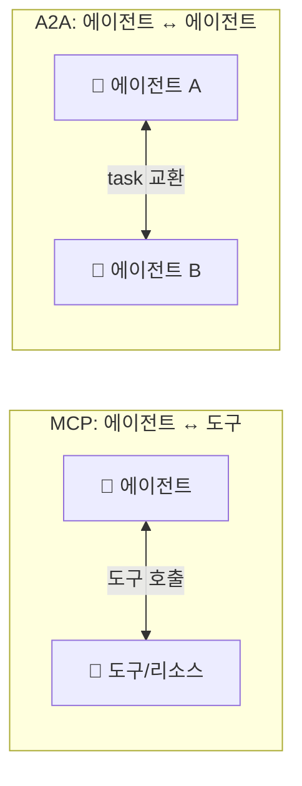
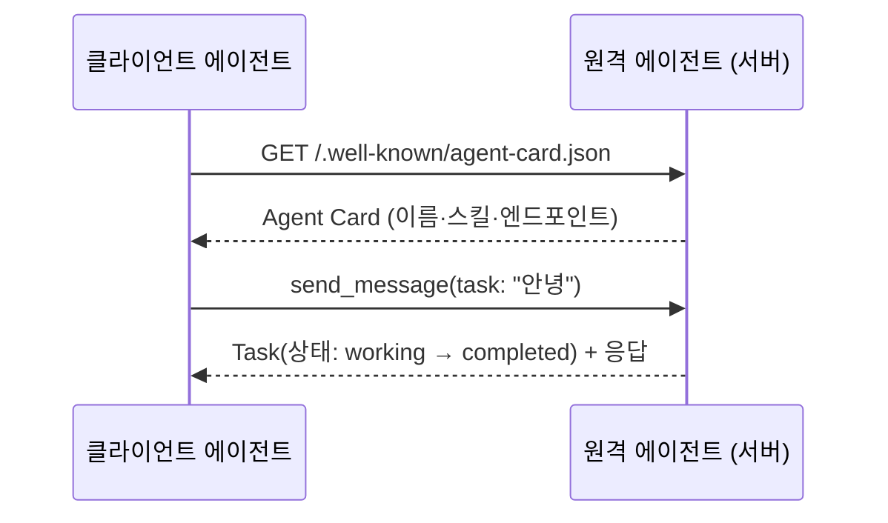
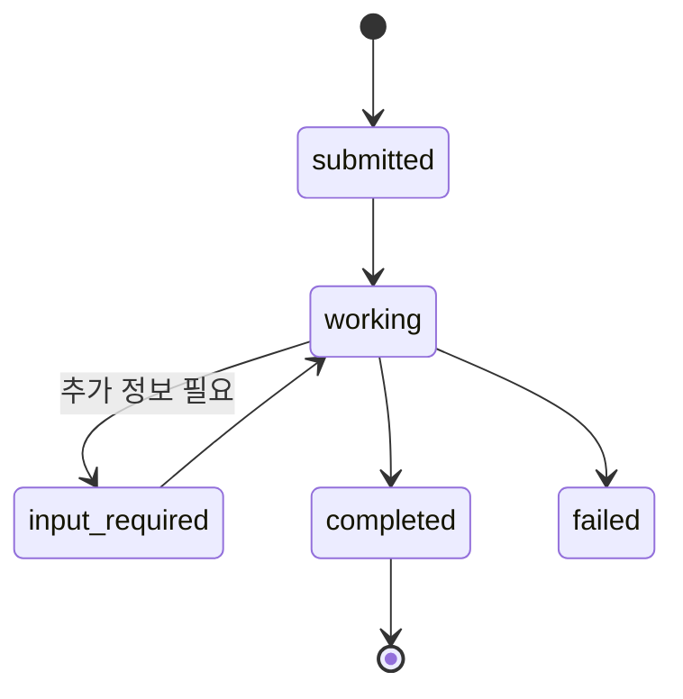
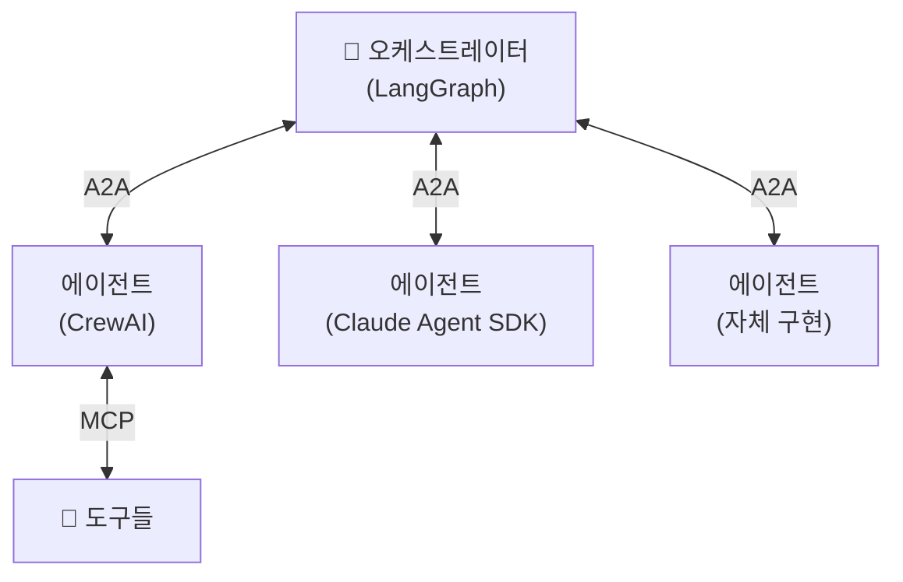
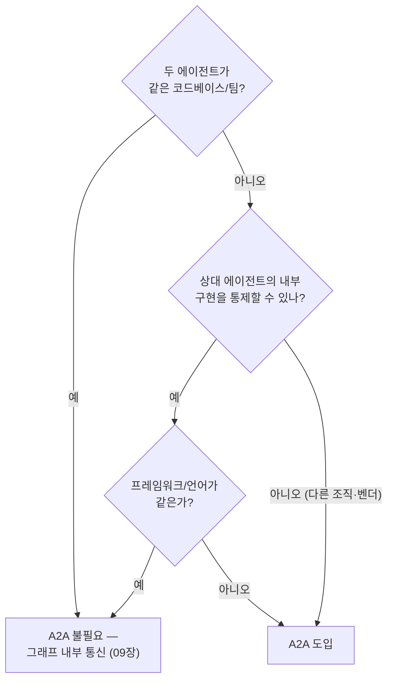

# 12. A2A 프로토콜

[MCP](11-mcp-integration.md)가 에이전트를 **도구**에 연결하는 표준이라면, **A2A(Agent2Agent)**
는 에이전트를 **다른 에이전트**에 연결하는 표준입니다. 서로 다른 벤더·프레임워크·언어로
만들어진 에이전트가 마치 웹 API처럼 서로를 발견하고 작업(task)을 주고받게 합니다.
Google이 발표하고 이후 **Linux Foundation** 으로 이관되어 중립적 표준으로 운영됩니다.

## 1. MCP vs A2A — 무엇이 다른가



| 구분 | MCP | A2A |
|------|-----|-----|
| 연결 대상 | 에이전트 ↔ **도구** | 에이전트 ↔ **에이전트** |
| 상대의 성격 | 수동적 함수 | 자율적 에이전트(스스로 판단) |
| 발견 방식 | 서버의 도구 목록 | **Agent Card**(.well-known) |
| 교환 단위 | 도구 호출(tool call) | **task**(수명주기를 가진 작업) |

!!! note "둘은 경쟁이 아니라 보완"
    실전 시스템은 보통 **A2A로 에이전트를 조율하고, 각 에이전트는 MCP로 도구를 씁니다.**
    A2A는 "누구에게 일을 맡길까", MCP는 "그 일을 무슨 도구로 할까"를 담당합니다.

## 2. Agent Card — 에이전트의 명함

A2A의 발견(discovery)은 **Agent Card** 로 이뤄집니다. 에이전트는 자신을 설명하는 JSON
문서를 `/.well-known/` 경로에 노출하고, 클라이언트는 이를 읽어 "이 에이전트가 뭘 할 수
있고 어디로 요청하는지"를 파악합니다.



Agent Card의 핵심 필드: `name`, `description`, `url`(엔드포인트), `version`,
`capabilities`(스트리밍 등), `skills`(AgentSkill 목록), 입출력 모드.

## 3. a2a-sdk 서버

`a2a-sdk` 서버는 클래스 네 종류를 조립해 만듭니다. 처음 보면 부품이 많아 보이지만,
**작은 회사 하나를 차린다**고 생각하면 각자의 자리가 분명해집니다.

- **AgentCard / AgentSkill / AgentCapabilities** — 문 앞에 붙이는 **간판이자 명함**입니다.
  실제 일은 하나도 하지 않고, "우리가 누구고 무엇을 할 수 있고 어디로 연락하면 되는지"를
  `/.well-known/` 경로에 공개하는 발견용 메타데이터입니다(2절).
- **AgentExecutor** — 유일하게 **실제 일을 하는 실무자**입니다. 여러분의 에이전트 로직
  (LLM 호출, 도구 사용 등)은 전부 `execute()` 안에 들어갑니다.
- **DefaultRequestHandler + InMemoryTaskStore** — **접수처와 장부**입니다. 들어온 요청을
  task로 만들어 executor에게 넘기고, task의 상태(submitted → working → completed)를
  스토어에 기록·추적합니다. 여러분이 건드릴 일은 거의 없습니다.
- **A2AStarletteApplication** — 이 모든 것을 담는 **건물(HTTP 창구)**입니다. ASGI 앱으로
  빌드해 uvicorn으로 띄우면 Agent Card 노출과 task 엔드포인트가 열립니다.

요청 하나가 흐르는 경로는 이렇습니다: 클라이언트의 메시지가 **HTTP 창구
(A2AStarletteApplication)** 로 들어오면, **접수처(RequestHandler)** 가 task를 만들어
**실무자(executor)** 의 `execute()` 를 호출합니다. 여기서 중요한 설계가 하나 있는데 —
executor는 응답을 **직접 반환하지 않습니다**. 대신 **이벤트 큐(EventQueue)** 에 넣습니다.
이벤트 큐는 **서버가 클라이언트에게 흘려보낼 응답의 우편함**입니다. 실무자는 답장(중간
경과든 최종 결과든)을 우편함에 넣기만 하면 되고, 발송 — 즉 클라이언트로의 전송과
스트리밍 — 은 프레임워크가 알아서 처리합니다. 응답이 "한 번의 return"이 아니라 "여러
통의 우편"일 수 있기 때문에, 오래 걸리는 task의 중간 진행 상황을 흘려보내는 스트리밍이
자연스럽게 지원됩니다(아래 Task 수명주기 참고).

```python
from a2a.server.agent_execution import AgentExecutor, RequestContext
from a2a.server.events import EventQueue
from a2a.utils import new_agent_text_message

class GreeterAgentExecutor(AgentExecutor):
    async def execute(self, context: RequestContext, event_queue: EventQueue) -> None:
        text = context.get_user_input()
        await event_queue.enqueue_event(new_agent_text_message(f"받았습니다: {text}"))

    async def cancel(self, context, event_queue) -> None:
        raise Exception("취소 미지원")
```

위 executor에서 `execute()` 가 아무것도 return 하지 않고 `event_queue.enqueue_event(...)`
로 끝나는 것이 바로 우편함 패턴입니다. 마지막으로 Agent Card와 핸들러를 묶어
`A2AStarletteApplication(...).build()` 로 ASGI 앱을 만들고 `uvicorn.run(...)` 으로 띄우면
서버가 완성됩니다.

→ 전체 서버: [`examples/17_a2a_server.py`](https://github.com/agent-chobi/agent-atoz/blob/main/examples/17_a2a_server.py)

## 4. a2a-sdk 클라이언트

클라이언트는 ① Agent Card를 발견하고 ② 클라이언트를 생성한 뒤 ③ task를 보냅니다.

```python
import httpx
from a2a.client import A2ACardResolver, A2AClient
from a2a.types import MessageSendParams, SendMessageRequest

async with httpx.AsyncClient() as http:
    resolver = A2ACardResolver(httpx_client=http, base_url="http://localhost:9999")
    card = await resolver.get_agent_card()              # ① 발견
    client = A2AClient(httpx_client=http, agent_card=card)  # ② 생성
    req = SendMessageRequest(id="...", params=MessageSendParams(**payload))
    resp = await client.send_message(req)               # ③ task 전송
```

→ 전체 클라이언트: [`examples/18_a2a_client.py`](https://github.com/agent-chobi/agent-atoz/blob/main/examples/18_a2a_client.py)

!!! warning "a2a-sdk는 시그니처가 자주 바뀝니다"
    A2A SDK는 2026년 활발히 변경 중입니다. 특히 **0.3 → 1.0** 에서 Agent Card 필드
    (`supported_interfaces`/`AgentInterface` 도입)와 클라이언트 생성 방식(`create_client` +
    `ClientConfig`)이 달라졌습니다. 본문은 널리 쓰이는 0.2.x/0.3.x 패턴이며, **설치한
    버전의 공식 예제와 대조**한 뒤 사용하세요.

### Task 수명주기

A2A의 교환 단위인 **task** 는 단순 요청/응답이 아니라 **상태를 가진 작업**입니다. 오래
걸리는 작업도 상태를 추적하며 스트리밍으로 중간 결과를 받을 수 있습니다.



`AgentCapabilities(streaming=True)` 로 노출하면 클라이언트는 `working` 중간 이벤트를
스트리밍으로 받아 진행 상황을 보여줄 수 있습니다.

## 5. 크로스-프레임워크 상호운용

A2A의 진짜 값은 **프레임워크 경계를 넘는 협업**입니다. LangGraph로 만든 에이전트가
CrewAI·Claude Agent SDK·자체 구현 에이전트를 A2A로 호출할 수 있습니다 — 상대가 A2A
Agent Card만 노출하면 내부 구현은 몰라도 됩니다.



!!! tip "표준의 값"
    프레임워크 lock-in 없이 팀·조직마다 다른 스택으로 만든 에이전트를 조합할 수 있다는
    것이 A2A의 핵심 가치입니다. 내부는 자유롭게, 경계는 표준으로.

## 6. 정리

- A2A = **에이전트 ↔ 에이전트** 표준(Google → Linux Foundation).
- **Agent Card**(.well-known)로 발견하고, **task** 로 작업을 교환한다.
- 서버는 `AgentExecutor` + `A2AStarletteApplication`, 클라이언트는 `A2ACardResolver` +
  `A2AClient` 로 구성.
- MCP(도구)와 **보완 관계** — A2A로 조율하고 각자 MCP로 도구를 쓴다.
- SDK 시그니처 변동이 크니 설치 버전 대조가 필수.

여기까지가 오케스트레이션·프로토콜(Phase D)입니다. 다음 [Phase E](13-debugging-observability.md)
는 이 모든 것을 프로덕션에서 신뢰할 수 있게 만드는 관측·권한·평가로 넘어갑니다.

## 설계 가이드

A2A는 "붙일 수 있다"와 "붙여야 한다"의 간극이 특히 큰 기술입니다. 도입 판단 →
노출 범위 → 수명주기 설계 순으로 정리합니다.

### 언제 A2A가 정당한가 — 결정 트리



핵심 판별식은 **"경계를 넘는가"** 입니다. 조직 경계(파트너사 에이전트 호출), 벤더
경계(구매한 SaaS 에이전트), 프레임워크 경계(LangGraph ↔ CrewAI)를 넘으면 A2A가
정당하고, 셋 다 아니면 HTTP 왕복·Agent Card 관리·SDK 버전 추적이라는 비용만 남습니다.
"나중에 외부에 공개할지도 모르니까"는 도입 사유가 못 됩니다 — 경계가 실제로 생길 때
서버 한 겹을 씌우는 편이 쌉니다.

### Agent Card 스킬 노출 범위

Agent Card는 **공개 계약서**입니다. 명함에 모든 업무 이력을 적지 않듯, 내부 능력을
전부 노출하지 마세요.

- [ ] **외부가 호출할 스킬만** `skills` 에 올린다 — 내부 보조 단계(중간 검증, 내부
  포맷 변환)는 노출하지 않는다.
- [ ] 스킬 `description` 과 `examples` 는 **상대 에이전트의 LLM이 읽고 라우팅을
  결정하는 문서**로 쓴다 — "무엇을 언제 맡기면 되는지"가 드러나게.
- [ ] `version` 을 올리는 규칙을 정한다 — 스킬 시그니처가 바뀌면 카드 버전도 올려
  클라이언트가 감지할 수 있게 한다.
- [ ] 인증 없는 공개 엔드포인트라면 카드 자체가 공격 표면 정찰 자료가 된다는 점을
  기억한다([14장](14-permissions-security-hitl.md)).

### task 수명주기·재시도·타임아웃 설계

상대는 함수가 아니라 **자율 에이전트**입니다 — 느리고, 실패하고, 되물을 수 있다는
전제로 클라이언트를 설계해야 합니다.

| 설계 항목 | 권장 |
|-----------|------|
| 타임아웃 | 짧은 task는 요청 타임아웃 하나로. 긴 task는 `AgentCapabilities(streaming=True)` 기반 스트리밍이나 폴링으로 전환하고, "진행 이벤트가 N초간 없으면 포기" 형태로 건다 |
| 재시도 | 네트워크 오류는 재시도하되, **task가 서버에 이미 생성됐을 수 있음**을 전제로 `message_id`/요청 id를 재사용해 중복 실행을 방지한다(멱등성) |
| `input_required` | task가 이 상태로 멈출 수 있다 — 클라이언트에 "추가 정보를 채워 재개"하는 분기를 만들지 않으면 task가 영원히 매달린다 |
| `failed` | 원인(잘못된 입력 vs 상대 내부 오류)을 구분해 기록한다 — 전자는 재시도해도 또 실패한다 |
| 관측 | task id를 자기 시스템의 트레이스에 남겨, "상대 에이전트에서 무슨 일이 있었나"를 추적할 열쇠로 삼는다([13장](13-debugging-observability.md)) |

## 따라하기

서버([`examples/17_a2a_server.py`](https://github.com/agent-chobi/agent-atoz/blob/main/examples/17_a2a_server.py))와
클라이언트([`examples/18_a2a_client.py`](https://github.com/agent-chobi/agent-atoz/blob/main/examples/18_a2a_client.py))
한 쌍입니다. MCP 예제와 달리 HTTP 서버라서 **반드시 서버를 먼저** 띄워야 합니다.

**① 사전 준비**

```bash
pip install -U a2a-sdk uvicorn httpx
```

이 예제는 LLM을 호출하지 않으므로 API 키가 필요 없습니다.

**② 실행 — 터미널 두 개**

```bash
# 터미널 1: 서버 먼저!
python examples/17_a2a_server.py
# → "A2A 서버 시작: http://localhost:9999" 가 뜨고 대기 상태 유지

# (선택) 브라우저나 curl 로 Agent Card 를 눈으로 확인
#   http://localhost:9999/.well-known/agent-card.json

# 터미널 2: 클라이언트
python examples/18_a2a_client.py
```

**③ 기대 출력 요지**

- 클라이언트 쪽에 `=== 발견한 Agent Card ===` — 이름(`Greeter Agent`)·설명·스킬
  목록(`['인사하기']`)이 출력됩니다. 발견(discovery)이 성공한 것입니다.
- 이어서 `=== 서버 응답 ===` 에 응답 JSON 덤프가 나오고, 그 안에
  `"안녕하세요! A2A 에이전트가 받았습니다: '안녕, A2A 서버!'"` 텍스트가 들어 있습니다.

**④ 흔한 에러**

| 증상 | 원인 · 해결 |
|------|-------------|
| `httpx.ConnectError` / `Connection refused` | **서버를 먼저 안 띄웠거나** 포트가 다름 — 터미널 1 확인 |
| `ModuleNotFoundError: a2a` | `pip install a2a-sdk` (패키지명이 `a2a` 가 아니라 `a2a-sdk`) |
| `ImportError` / `ValidationError`(필드 불일치) | a2a-sdk 0.3 ↔ 1.0 시그니처 차이 — 본문 경고 참조, 설치 버전 대조 |
| `Address already in use` (포트 9999) | 이전 서버 프로세스가 살아 있음 — 종료 후 재실행 |

## 실무 트레이드오프

"에이전트 둘을 잇는 데 정말 A2A가 필요한가?"부터 물어야 합니다. **같은 팀이 같은
프레임워크로 만드는 에이전트라면 그래프 안의 노드로 두는 것(09장)이 거의 항상
단순합니다.** A2A는 조직·벤더·프레임워크 경계를 넘을 때 값을 합니다.

| 기준 | A2A 도입 | 단일 프레임워크 내부 통신(예: LangGraph 노드) |
|------|---------|------------------------------------------|
| 상호운용 | 벤더·언어·프레임워크 무관 — 카드만 노출하면 연결 | 같은 스택 내부로 한정 |
| 지연·오버헤드 | HTTP 왕복 + 직렬화 비용 | in-process 상태 공유 — 가장 빠름 |
| 운영 복잡도 | 서버 배포·포트·인증·버전 관리가 각 에이전트마다 필요 | 프로세스 하나 배포로 끝 |
| 상태 공유 | task 단위로만 교환 — 내부 상태는 불투명 | 그래프 상태를 직접 공유·검사 가능 |
| 결합도 | 느슨함 — 상대 내부 구현 교체 자유 | 강함 — 프레임워크 lock-in |
| 안정성 | SDK 시그니처 변동 큼(0.3→1.0) | 프레임워크 하나만 추적하면 됨 |
| 적합 상황 | 팀/조직/벤더 간 에이전트 연동, 외부 공개 에이전트 | 한 팀이 소유한 멀티에이전트 앱 |

## 2026 실무 트렌드

- **1년 만에 150개 조직 돌파** — Linux Foundation은 A2A 1주년 시점에 150개 이상 조직
  참여, Google·Microsoft·AWS 주요 클라우드 플랫폼 통합, 공급망·금융·보험·IT 운영 분야의
  실제 프로덕션 배포를 발표했습니다.
- **프로토콜 거버넌스의 정렬** — MCP(AAIF)·A2A가 모두 Linux Foundation 산하로 들어오면서
  "도구 연결은 MCP, 에이전트 연결은 A2A"라는 역할 분담이 제도적으로도 굳어지고 있습니다.
- **로드맵은 상호운용·레지스트리·보안** — A2A 프로젝트는 상호운용성 명세, 에이전트
  레지스트리 통합, 보안·배포 모범사례를 다음 과제로 공표했습니다. 발견(discovery)이
  Agent Card 단건에서 레지스트리 규모로 확장되는 방향입니다.

## 실전 레퍼런스

- [A2A Protocol 공식 명세](https://a2a-protocol.org/) — Agent Card·task·스트리밍 등 프로토콜 원전
- [Linux Foundation Launches the Agent2Agent Protocol Project](https://www.linuxfoundation.org/press/linux-foundation-launches-the-agent2agent-protocol-project-to-enable-secure-intelligent-communication-between-ai-agents) — Google에서 Linux Foundation으로의 이관 공식 발표
- [A2A Protocol Surpasses 150 Organizations — Linux Foundation](https://www.linuxfoundation.org/press/a2a-protocol-surpasses-150-organizations-lands-in-major-cloud-platforms-and-sees-enterprise-production-use-in-first-year) — 1주년 채택 현황과 프로덕션 사례 발표
- [Linux Foundation A2A Protocol Marks One Year — AIwire](https://www.hpcwire.com/aiwire/2026/04/09/linux-foundation-a2a-protocol-marks-one-year-with-broad-enterprise-and-cloud-adoption/) — 1주년 채택 현황의 외부 시각 리포트
- [Agent Interoperability Protocols 2026: MCP, A2A, ACP — Zylos Research](https://zylos.ai/research/2026-03-26-agent-interoperability-protocols-mcp-a2a-acp-convergence/) — 에이전트 상호운용 프로토콜들의 역할 분담·수렴 방향 분석

## 참고 자료

- [A2A Protocol 공식 사이트](https://a2a-protocol.org/)
- [a2a-python SDK (GitHub)](https://github.com/a2aproject/a2a-python)
- [a2a-samples (GitHub)](https://github.com/a2aproject/a2a-samples)
- [Multi-Agent Communication with the A2A Python SDK — Towards Data Science](https://towardsdatascience.com/multi-agent-communication-with-the-a2a-python-sdk/)
