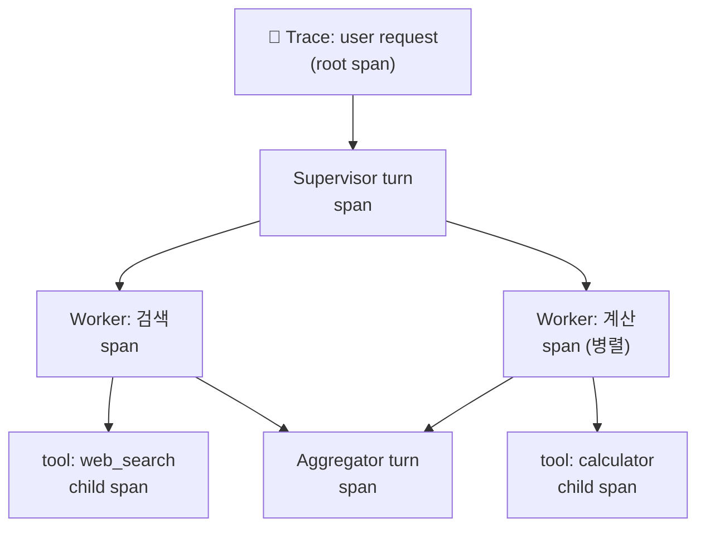
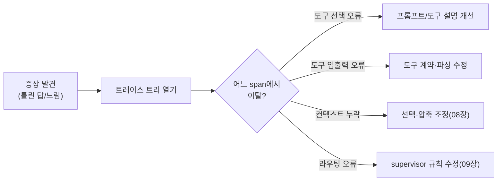

# 13. 디버깅 & 관측

에이전트 관측(observability)은 전통적인 서비스 관측과 **목적이 다릅니다.** 마이크로서비스에서는
"응답이 빠르고 500이 안 나는가"를 봅니다. 하지만 에이전트에서 진짜 궁금한 것은
**"왜 저 도구를 골랐는가", "무슨 의도로 저렇게 판단했는가"** 입니다. 즉 지연·에러 같은
*시스템 신호*가 아니라 **의도(intent) 가시성**이 핵심입니다. 이 챕터는 무엇을 로깅하고,
어떤 도구로 트레이스를 보고, 멀티에이전트의 병렬 실행을 어떻게 상관(correlate)시키는지를 다룹니다.

## 1. 서비스 관측 vs 에이전트 관측

| 축 | 전통 서비스 관측 | 에이전트 관측 |
|----|------------------|----------------|
| 핵심 질문 | 느린가? 실패하는가? | **왜 그렇게 판단했나?** |
| 주요 신호 | latency, error rate, throughput | 프롬프트, 도구 선택, 추론 분기 |
| 단위 | request/response | **에이전트 턴 · 도구 호출 span** |
| 비결정성 | 낮음(같은 입력→같은 출력) | 높음(같은 입력→다른 경로) |
| 디버깅 대상 | 스택트레이스 | **트레이스 트리 + 프롬프트 diff** |

!!! note "의도 가시성이 왜 어려운가"
    LLM의 결정은 프롬프트·컨텍스트·샘플링에 좌우됩니다. 재현이 안 되는 버그가 흔하고,
    "실패"가 예외가 아니라 **그럴듯하지만 틀린 답**으로 나타납니다. 그래서 입력/출력만이 아니라
    **결정에 이르는 컨텍스트 전체**를 기록해야 사후 분석이 가능합니다.

## 2. 무엇을 로깅해야 하나

에이전트 한 턴에서 최소한 아래를 남기면 대부분의 사고를 재구성할 수 있습니다.

- **프롬프트(구성된 최종 컨텍스트)** — 시스템/유저/툴 결과가 합쳐진 실제 입력. 요약·선택·격리가 적용된 뒤의 모습.
- **도구 선택과 인자** — 어떤 도구를, 왜(직전 추론), 어떤 인자로 불렀나.
- **도구 입출력** — 반환값, 크기, 소요 시간. (민감정보는 마스킹)
- **에러/재시도** — 도구 예외, 파싱 실패, 재시도 횟수.
- **결정 분기** — supervisor의 라우팅, 조건 엣지 선택, 핸드오프 대상.
- **토큰/비용/모델** — 입력·출력 토큰, 사용 모델, 누적 비용(→ [15장](15-evaluation-cost.md)).

!!! warning "민감정보 주의"
    프롬프트에는 PII·자격증명이 섞이기 쉽습니다. 트레이싱 SDK 대부분이 마스킹/제외 훅을 제공합니다.
    보안 관점은 [14장](14-permissions-security-hitl.md)과 함께 보세요.

## 3. 트레이스 트리 — 멀티에이전트의 핵심 난제

단일 에이전트의 트레이스는 선형에 가깝습니다. 하지만 멀티에이전트는 **병렬 워커의 span을
하나의 논리적 실행으로 상관**시켜야 합니다. 이때 부모-자식 span 관계(트레이스 컨텍스트 전파)가
깨지면 트레이스가 조각나 원인 추적이 불가능해집니다.



!!! tip "그래서 OpenTelemetry가 중요하다"
    병렬 워커가 서로 다른 프로세스·스레드·벤더 SDK로 돌아가면, 공통 **트레이스 컨텍스트 표준**이
    없이는 span을 한 트리로 묶을 수 없습니다. **OpenTelemetry(OTel)** 는 trace_id/span_id 전파와
    시맨틱 컨벤션(예: GenAI semantic conventions)을 제공해, 벤더가 달라도 하나의 트레이스로 상관됩니다.
    2026년의 관측 도구 대부분이 OTel 위에 서 있는 이유입니다.

## 4. 도구 비교 — LangSmith · Langfuse · Phoenix · Laminar

| 도구 | 성격 | 계측 방식 | 특징 |
|------|------|-----------|------|
| **LangSmith** | 상용(LangChain) | 환경변수 자동 트레이싱 + `@traceable` | LangChain/LangGraph 무설정 연동, 평가·데이터셋 통합 |
| **Langfuse** | 오픈소스(셀프호스팅 가능) | OTel 기반 SDK v3 + LangChain **CallbackHandler** | OTel 표준, `@observe` 데코레이터, 저비용 셀프호스팅 |
| **Arize Phoenix** | 오픈소스 | OpenInference/OTel 자동계측 | 로컬 실행 용이, 평가·임베딩 드리프트 분석 강점 |
| **Laminar** | 오픈소스 | OTel 기반 | 파이프라인·평가 통합, 경량 |

!!! note "선택 가이드"
    - LangChain/LangGraph 스택이고 빨리 붙이고 싶다 → **LangSmith**(환경변수만).
    - 셀프호스팅·데이터 주권·OTel 표준 → **Langfuse**.
    - 로컬에서 무료로 트레이스 트리를 보고 싶다 → **Phoenix**.
    - 벤더 독립성이 최우선 → **OTel 계측 후 백엔드 교체**가 자유로운 조합.

### LangSmith — 환경변수 자동 트레이싱

LangChain/LangGraph를 쓰면 **코드 변경 없이** 환경변수만으로 트레이싱이 켜집니다.

```bash
export LANGSMITH_TRACING=true
export LANGSMITH_API_KEY="ls-..."
export LANGSMITH_PROJECT="agent-atoz"   # 선택(미설정 시 default 프로젝트)
# EU 리전 계정이면: export LANGSMITH_ENDPOINT="https://eu.api.smith.langchain.com"
```

임의의 함수(비-LangChain 코드)도 `@traceable` 데코레이터로 트레이스에 편입할 수 있습니다.

```python
from langsmith import traceable

@traceable  # 이 함수 호출이 트레이스 span으로 기록됨
def choose_tool(query: str) -> str:
    ...
```

### Langfuse — OTel 기반 콜백

Langfuse는 OpenTelemetry 위에 있으며, LangChain에는 **CallbackHandler**를 넘겨 붙입니다.

```python
from langfuse.langchain import CallbackHandler

handler = CallbackHandler()
graph.invoke(state, config={"callbacks": [handler]})  # LangGraph/LangChain 공통
```

비-LangChain 코드는 `@observe` 데코레이터로 span을 만듭니다. OTel 기반이라 다른
자동계측(예: HTTP 클라이언트)의 span도 같은 트레이스에 함께 모입니다.

## 5. 디버깅 워크플로우



!!! tip "재현 불가 버그 다루기"
    비결정성 때문에 "가끔" 틀리는 버그는, 실패한 트레이스의 **정확한 입력 컨텍스트를 캡처해
    데이터셋으로 고정**한 뒤 평가([15장](15-evaluation-cost.md))로 회귀를 막는 것이 정석입니다.

## 6. 실습 코드

`examples/19_tracing.py` — LangSmith(환경변수) 또는 Langfuse(콜백)로 간단한 도구 사용
에이전트를 트레이싱합니다. **관측 SDK가 설치/설정되지 않아도** 에이전트 자체는 동작하도록
방어적으로 작성되어, 콘솔에 자체 span 트리를 함께 출력합니다.
([매핑표](../examples/README.md) 참고)

```bash
python examples/19_tracing.py
# 트레이싱을 켜려면: LANGSMITH_TRACING=true, LANGSMITH_API_KEY=... 설정 후 재실행
```

## 참고 자료

- [LangSmith Tracing Quickstart](https://docs.langchain.com/langsmith/observability-quickstart)
- [LangSmith `@traceable` / 환경변수](https://docs.smith.langchain.com/observability/how_to_guides/tracing/annotate_code)
- [Langfuse Observability SDK (Python v3, OTel 기반)](https://langfuse.com/docs/observability/sdk/overview)
- [Langfuse × LangChain Callback](https://langfuse.com/integrations/frameworks/langchain)
- [Arize Phoenix](https://phoenix.arize.com/)
- [Laminar](https://www.lmnr.ai/)
- [OpenTelemetry GenAI Semantic Conventions](https://opentelemetry.io/docs/specs/semconv/gen-ai/)
