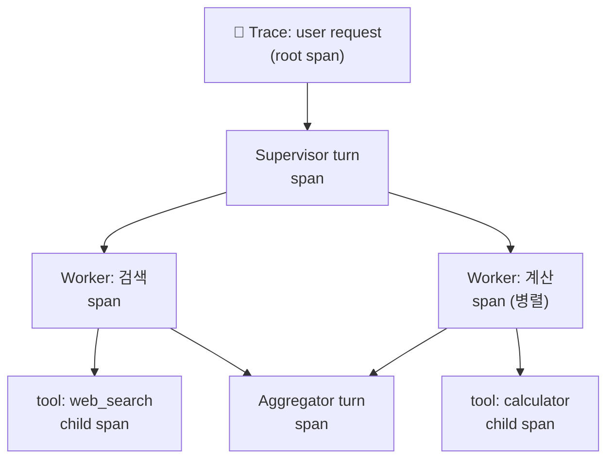
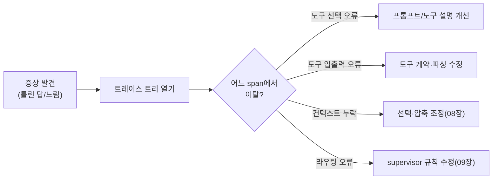
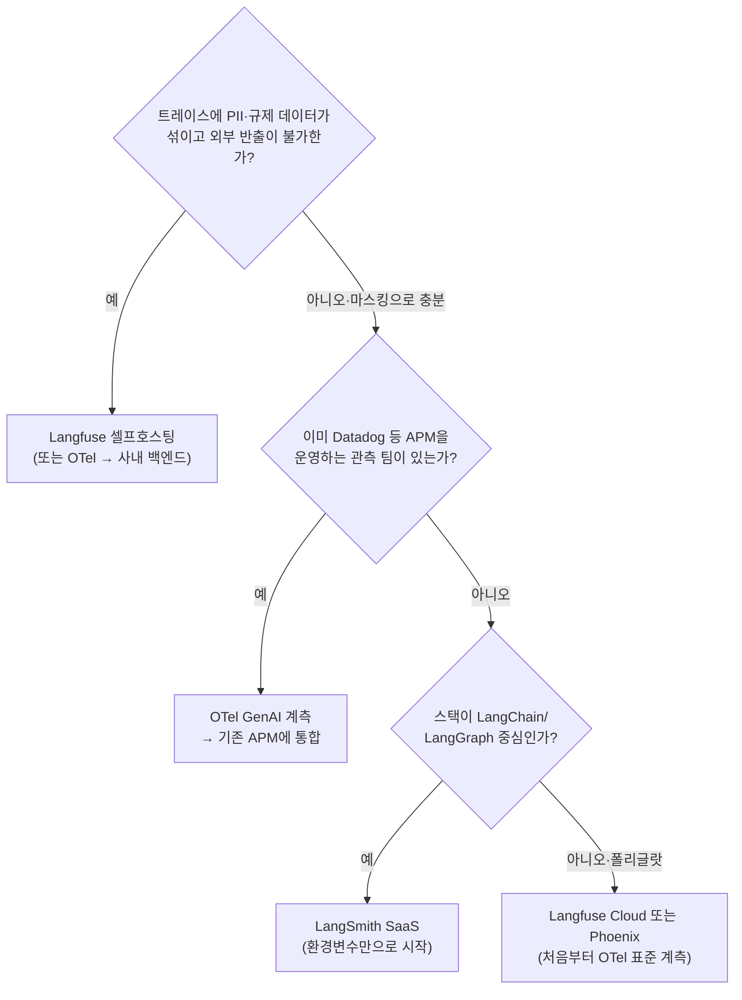

# 13. 디버깅 & 관측

에이전트 관측(observability)은 전통적인 서비스 관측과 **목적이 다릅니다.** 마이크로서비스에서는
"응답이 빠르고 500이 안 나는가"를 봅니다. 하지만 에이전트에서 진짜 궁금한 것은
**"왜 저 도구를 골랐는가", "무슨 의도로 저렇게 판단했는가"** 입니다. 즉 지연·에러 같은
*시스템 신호*가 아니라 **의도(intent) 가시성**이 핵심입니다. 이 챕터는 무엇을 로깅하고,
어떤 도구로 트레이스를 보고, 멀티에이전트의 병렬 실행을 어떻게 상관(correlate)시키는지를 다룹니다.

## 1. 서비스 관측 vs 에이전트 관측

| 축 | 전통 서비스 관측 | 에이전트 관측 |
|----|------------------|----------------|
| 핵심 질문 | 느린가? 실패하는가? | **왜 그렇게 판단했나?** |
| 주요 신호 | latency, error rate, throughput | 프롬프트, 도구 선택, 추론 분기 |
| 단위 | request/response | **에이전트 턴 · 도구 호출 span** |
| 비결정성 | 낮음(같은 입력→같은 출력) | 높음(같은 입력→다른 경로) |
| 디버깅 대상 | 스택트레이스 | **트레이스 트리 + 프롬프트 diff** |

!!! note "의도 가시성이 왜 어려운가"
    LLM의 결정은 프롬프트·컨텍스트·샘플링에 좌우됩니다. 재현이 안 되는 버그가 흔하고,
    "실패"가 예외가 아니라 **그럴듯하지만 틀린 답**으로 나타납니다. 그래서 입력/출력만이 아니라
    **결정에 이르는 컨텍스트 전체**를 기록해야 사후 분석이 가능합니다.

## 2. 무엇을 로깅해야 하나

에이전트 한 턴에서 최소한 아래를 남기면 대부분의 사고를 재구성할 수 있습니다.

- **프롬프트(구성된 최종 컨텍스트)** — 시스템/유저/도구 결과가 합쳐진 실제 입력. 요약·선택·격리가 적용된 뒤의 모습.
- **도구 선택과 인자** — 어떤 도구를, 왜(직전 추론), 어떤 인자로 불렀나.
- **도구 입출력** — 반환값, 크기, 소요 시간. (민감정보는 마스킹)
- **에러/재시도** — 도구 예외, 파싱 실패, 재시도 횟수.
- **결정 분기** — supervisor의 라우팅, 조건 엣지 선택, 핸드오프 대상.
- **토큰/비용/모델** — 입력·출력 토큰, 사용 모델, 누적 비용(→ [15장](15-evaluation-cost.md)).

!!! warning "민감정보 주의"
    프롬프트에는 PII·자격증명이 섞이기 쉽습니다. 트레이싱 SDK 대부분이 마스킹/제외 훅을 제공합니다.
    보안 관점은 [14장](14-permissions-security-hitl.md)과 함께 보세요.

## 3. 트레이스 트리 — 멀티에이전트의 핵심 난제

단일 에이전트의 트레이스는 선형에 가깝습니다. 요청이 들어오고, 모델이 생각하고, 도구를 부르고,
답이 나가는 한 줄기 흐름이라 따라가기 쉽습니다. 하지만 멀티에이전트는 **병렬 워커의 span을
하나의 논리적 실행으로 상관**시켜야 합니다. 공항 관제탑에 비유하면, 동시에 뜨고 내리는 여러
항공기(워커)를 따로따로 보는 게 아니라 "이 비행들은 전부 같은 운항 계획의 일부"로 묶어 보는
것과 같습니다. 이때 부모-자식 span 관계(트레이스 컨텍스트 전파)가 깨지면 트레이스가 조각나 —
관제 기록이 끊긴 비행처럼 — 원인 추적이 불가능해집니다.



!!! tip "그래서 OpenTelemetry가 중요하다"
    병렬 워커가 서로 다른 프로세스·스레드·벤더 SDK로 돌아가면, 공통 **트레이스 컨텍스트 표준**이
    없이는 span을 한 트리로 묶을 수 없습니다. **OpenTelemetry(OTel)** 는 trace_id/span_id 전파와
    시맨틱 컨벤션(예: GenAI semantic conventions)을 제공해, 벤더가 달라도 하나의 트레이스로 상관됩니다.
    2026년의 관측 도구 대부분이 OTel 위에 서 있는 이유입니다.

## 4. 도구 비교 — LangSmith · Langfuse · Phoenix · Laminar

| 도구 | 성격 | 계측 방식 | 특징 |
|------|------|-----------|------|
| **LangSmith** | 상용(LangChain) | 환경변수 자동 트레이싱 + `@traceable` | LangChain/LangGraph 무설정 연동, 평가·데이터셋 통합 |
| **Langfuse** | 오픈소스(셀프호스팅 가능) | OTel 기반 SDK v3 + LangChain **CallbackHandler** | OTel 표준, `@observe` 데코레이터, 저비용 셀프호스팅 |
| **Arize Phoenix** | 오픈소스 | OpenInference/OTel 자동계측 | 로컬 실행 용이, 평가·임베딩 드리프트 분석 강점 |
| **Laminar** | 오픈소스 | OTel 기반 | 파이프라인·평가 통합, 경량 |

!!! note "선택 가이드"
    - LangChain/LangGraph 스택이고 빨리 붙이고 싶다 → **LangSmith**(환경변수만).
    - 셀프호스팅·데이터 주권·OTel 표준 → **Langfuse**.
    - 로컬에서 무료로 트레이스 트리를 보고 싶다 → **Phoenix**.
    - 벤더 독립성이 최우선 → **OTel 계측 후 백엔드 교체**가 자유로운 조합.

### LangSmith — 환경변수 자동 트레이싱

LangChain/LangGraph를 쓰면 **코드 변경 없이** 환경변수만으로 트레이싱이 켜집니다.

```bash
export LANGSMITH_TRACING=true
export LANGSMITH_API_KEY="ls-..."
export LANGSMITH_PROJECT="agent-atoz"   # 선택(미설정 시 default 프로젝트)
# EU 리전 계정이면: export LANGSMITH_ENDPOINT="https://eu.api.smith.langchain.com"
```

임의의 함수(비-LangChain 코드)도 `@traceable` 데코레이터로 트레이스에 편입할 수 있습니다.

```python
from langsmith import traceable

@traceable  # 이 함수 호출이 트레이스 span으로 기록됨
def choose_tool(query: str) -> str:
    ...
```

### Langfuse — OTel 기반 콜백

Langfuse는 OpenTelemetry 위에 있으며, LangChain에는 **CallbackHandler**를 넘겨 붙입니다.

```python
from langfuse.langchain import CallbackHandler

handler = CallbackHandler()
graph.invoke(state, config={"callbacks": [handler]})  # LangGraph/LangChain 공통
```

비-LangChain 코드는 `@observe` 데코레이터로 span을 만듭니다. OTel 기반이라 다른
자동계측(예: HTTP 클라이언트)의 span도 같은 트레이스에 함께 모입니다.

## 5. 디버깅 워크플로우



!!! tip "재현 불가 버그 다루기"
    비결정성 때문에 "가끔" 틀리는 버그는, 실패한 트레이스의 **정확한 입력 컨텍스트를 캡처해
    데이터셋으로 고정**한 뒤 평가([15장](15-evaluation-cost.md))로 회귀를 막는 것이 정석입니다.

## 따라하기 — 예제 19: 트레이싱

이 장의 실습은 [`examples/19_tracing.py`](https://github.com/agent-chobi/agent-atoz/blob/main/examples/19_tracing.py)입니다.
예제 19는 **LangSmith(환경변수 설정 시) 또는 콘솔 폴백**으로 동작하며, **Langfuse는 이 장에서
플랫폼 소개로만 다룹니다**(예제 코드에 Langfuse 연동은 없습니다). 관측 SDK가 설치/설정되지
않아도 에이전트 자체는 항상 동작하도록 방어적으로 작성되어, 콘솔에 자체 span 트리를 출력합니다.
(전체 예제 목록은 [매핑표](https://github.com/agent-chobi/agent-atoz/blob/main/examples/README.md) 참고)

**1) 사전 준비**

```bash
pip install anthropic python-dotenv
# .env 에 ANTHROPIC_API_KEY=sk-ant-... 설정

# (선택) LangSmith로 트레이스를 전송하려면
pip install langsmith
export LANGSMITH_TRACING=true
export LANGSMITH_API_KEY="ls-..."
```

**2) 실행**

```bash
python examples/19_tracing.py
```

**3) 기대 출력 요지**

- 헤더에 `트레이싱 상태:` — LangSmith ON / 설치됨+미설정 / 미설치 중 어느 모드인지 표시됩니다.
- 콘솔에 `▶ agent_loop → llm_call (turn 0) → tool: calculator` 형태의 **중첩 span 트리**와
  span별 소요 시간(ms), 턴마다 `stop_reason` 로그가 찍힙니다.
- 최종 답변으로 12 × (3+4) = **84**가 나옵니다. LangSmith가 켜져 있으면
  smith.langchain.com에서 트레이스를 확인하라는 안내가 추가됩니다.

**4) 흔한 에러**

| 증상 | 원인 / 해결 |
|------|-------------|
| `AuthenticationError` | `.env`의 `ANTHROPIC_API_KEY` 미설정·오타. |
| LangSmith를 켰는데 웹 UI에 트레이스가 없음 | `LANGSMITH_TRACING=true` 철자와 API 키 확인. 잘못돼도 예제는 콘솔 폴백으로 계속 동작합니다. |
| `langsmith` 미설치 | 에러가 아닙니다 — no-op 데코레이터로 폴백해 콘솔 트리만 출력합니다. |
| 콘솔 트리 문자 깨짐 | 예제가 UTF-8 출력을 강제하지만, 오래된 Windows 터미널이면 `chcp 65001` 후 재실행. |

## 실무 트레이드오프 — 트레이스를 어디에 쌓을 것인가

| 축 | LangSmith (SaaS) | Langfuse (셀프호스팅) | OTel 직접 계측 |
|----|------------------|----------------------|----------------|
| 도입 속도 | **환경변수만 — 가장 빠름** | 서버 구축 필요(ClickHouse·Postgres·Redis 등) | 계측 코드 직접 작성 — 가장 느림 |
| 운영 부담 | 없음(벤더가 운영) | 업그레이드·백업·스케일링을 직접 | 선택한 백엔드에 따라 다름 |
| 데이터 주권 | 벤더 클라우드에 저장 | **내 인프라에 저장** | 내가 정한 백엔드 |
| 벤더 종속 | 높음 | 낮음(OTel 기반) | **가장 낮음 — 백엔드 교체 자유** |
| 잘 맞는 곳 | LangChain 스택, 빠른 시작 | 규제·프라이버시 요건, 비용 통제 | 폴리글랏 조직, 장기 표준화 |

!!! tip "흔한 경로"
    처음에는 SaaS로 빠르게 가시성을 확보하고, 규모와 규제 요건이 커지면 OTel 표준 계측으로
    이동성을 확보하는 단계적 경로가 실무에서 흔합니다. 처음부터 완벽한 스택을 고르려고
    출시를 늦추는 것이 가장 비싼 선택입니다.

## 설계 가이드 — 관측 스택을 어떻게 짤 것인가

위 트레이드오프 표가 "어디에 쌓을지"의 비교라면, 여기서는 규모·보안 요건을 입력으로
스택을 **결정**하고, 무엇을 언제부터 계측할지 **로드맵**을 세웁니다.

### 스택 결정 트리



셀프호스팅은 공짜가 아닙니다 — Langfuse v3는 Postgres·ClickHouse·Redis·오브젝트
스토리지를 직접 운영해야 합니다. 전담 인력이 없다면 "SaaS + 전송 전 마스킹"이
현실적으로 더 안전한 선택인 경우가 많습니다.

### 단계별 계측 로드맵 — 한 번에 다 계측하지 마라

| 단계 | 계측 대상 | 도입 시점의 신호 |
|------|-----------|------------------|
| **MVP** | LLM 호출(최종 프롬프트·응답·모델·stop_reason) + 도구 호출 입출력·에러 | 처음부터 — 이것만으로 "왜 틀렸나"의 대부분이 재구성됨 |
| **성장** | 결정 분기(라우팅·핸드오프·조건 엣지) + 트레이스당 토큰·비용 집계 | 멀티에이전트 도입, 월 청구서가 신경 쓰이기 시작할 때 |
| **성숙** | 평가 연동 — 실패 트레이스의 평가셋 승격, judge 점수를 트레이스에 태깅, 사용자 피드백 상관 | [15장](15-evaluation-cost.md) 평가 파이프라인이 돌기 시작할 때 |

순서를 뒤집으면(평가 연동부터) 계측할 실패 데이터 자체가 없어 헛돕니다.

### 보존 기간과 PII 마스킹 설계

- **보존을 트레이스 등급으로 나눕니다.** 예컨대 LangSmith는 base 14일 / extended 400일
  2등급 가격제입니다 — 전량 장기 보존은 비쌉니다. "디버깅용은 짧게, 평가셋 후보와
  피드백 달린 트레이스만 장기 보존"이 기본 전략입니다.
- **마스킹은 전송 전에.** 백엔드에 저장한 뒤 지우는 것은 늦습니다. Langfuse는 SDK
  레벨 masking 함수(모든 span의 입출력·메타데이터에 적용)를, LangSmith는
  `hide_inputs`/`hide_outputs` 훅을 제공합니다. 정규식(이메일·카드번호)으로 시작해
  필요 시 전용 익명화 라이브러리로 올립니다.
- **감사 로그와 트레이스를 분리하세요.** 트레이스는 지워도 되지만 승인·정책 결정
  기록([14장](14-permissions-security-hitl.md))은 보존 의무 대상일 수 있습니다.
  같은 스토리지·같은 보존 정책에 섞지 마세요.

### 샘플링 전략

| 트래픽 | 전략 |
|--------|------|
| 개발·스테이징 | 100% 수집 — 샘플링 없음 |
| 프로덕션 정상 경로 | 확률 샘플링 — Langfuse `LANGFUSE_SAMPLE_RATE`(0~1), OTel `TraceIdRatioBased` |
| 에러·HITL 거부·비용 상위 트레이스 | **항상 100%** — 문제 있는 트레이스가 가장 값진 데이터 |

주의: 샘플링은 반드시 **트레이스 단위**로 — span 단위로 자르면 트리가 조각납니다
(Langfuse SDK도 trace 단위로 샘플링하며, 샘플된 트레이스의 모든 관측이 함께 수집됩니다).

## 2026 실무 트렌드

- **OTel GenAI 시맨틱 컨벤션의 확장** — LLM 호출을 넘어 에이전트 span(`invoke_agent`),
  도구 실행 span(`execute_tool`), MCP 도구 호출까지 표준 스키마가 커버합니다. 단, 다수
  `gen_ai.*` 속성이 아직 Development 안정성 단계라 이름이 바뀔 수 있습니다.
- **"에이전트 관측 = 프로덕션 필수"로 격상** — 전통 APM이 못 잡는 도구 호출 재시도 루프,
  프레임워크 업그레이드발 프롬프트 회귀, 폭주 루프의 비용 스파이크가 실제 장애의 주범으로
  지목되면서, 관측이 "있으면 좋은 것"에서 배포 전제 조건이 됐습니다.
- **시장 이원화** — LangSmith·Langfuse·Phoenix 같은 전문 도구와 Datadog·Honeycomb 등
  기존 관측 강자의 LLM 관측 진입이 병행됩니다. 어느 쪽을 고르든 OTel 표준 계측이
  나중에 갈아탈 수 있게 해 주는 보험입니다.

## 실전 레퍼런스

- [Inside the LLM Call: GenAI Observability with OpenTelemetry](https://opentelemetry.io/blog/2026/genai-observability/) — OTel 공식 블로그의 GenAI 관측 해설(2026).
- [How OpenTelemetry Traces LLM Calls, Agent Reasoning, and MCP Tools — Greptime](https://greptime.com/blogs/2026-05-09-opentelemetry-genai-semantic-conventions) — 에이전트 추론·MCP 도구까지 이어지는 span 트리의 실전 해부.
- [OpenTelemetry GenAI Semantic Conventions — MLflow Docs](https://mlflow.org/docs/latest/genai/tracing/opentelemetry/genai-semconv/) — 컨벤션 필드를 실제 트레이싱 코드에 매핑해 보여주는 문서.
- [How We Build Effective Agents — Barry Zhang, Anthropic (AI Engineer Summit, YouTube)](https://youtu.be/D7_ipDqhtwk) — "에이전트의 관점(컨텍스트)에서 에러를 보라"는 디버깅 관점을 담은 발표.

### 함께 보면 좋은 한국어 자료

- [LangSmith 추적 설정 — 랭체인 노트(WikiDocs)](https://wikidocs.net/250954) — 가입부터 환경변수 설정, 첫 트레이스 확인까지를 한국어 스크린샷과 함께 안내하는 무료 튜토리얼 장
- [[LLM 개발기초] LangSmith 활용하기 — Hello Llama](https://hellollama.net/llm-%EC%B4%88%EA%B8%89%EA%B0%95%EC%A2%8C-7-langsmith-%ED%99%9C%EC%9A%A9%ED%95%98%EA%B8%B0/) — LLM 앱의 호출 추적·디버깅을 LangSmith로 시작하는 법을 초급자 눈높이로 설명
- [LangSmith, 사용 후기 — sudormrf](https://sudormrf.run/2024/08/17/langsmith_review/) — 실제로 써 본 관점에서 무엇이 좋고 아쉬운지를 정리한 개인 블로그 후기

## 참고 자료

- [LangSmith Tracing Quickstart](https://docs.langchain.com/langsmith/observability-quickstart)
- [LangSmith `@traceable` / 환경변수](https://docs.smith.langchain.com/observability/how_to_guides/tracing/annotate_code)
- [Langfuse Observability SDK (Python v3, OTel 기반)](https://langfuse.com/docs/observability/sdk/overview)
- [Langfuse × LangChain Callback](https://langfuse.com/integrations/frameworks/langchain)
- [Arize Phoenix](https://phoenix.arize.com/)
- [Laminar](https://www.lmnr.ai/)
- [OpenTelemetry GenAI Semantic Conventions](https://opentelemetry.io/docs/specs/semconv/gen-ai/)
