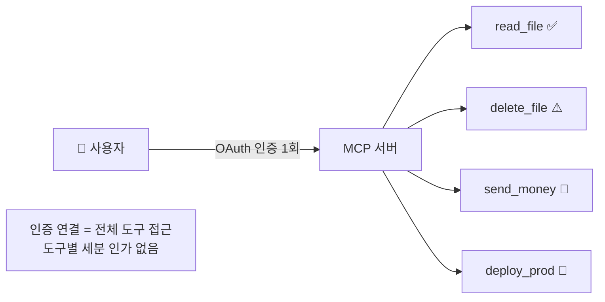
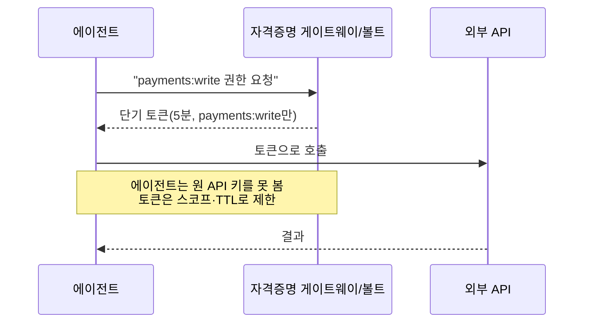
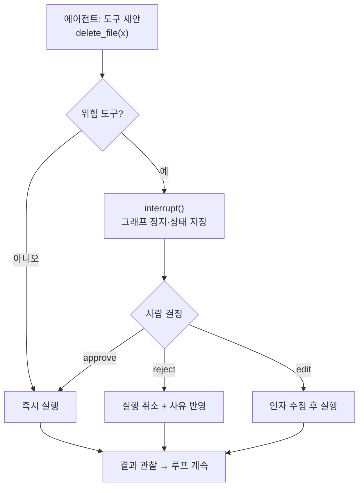

# 14. 권한 & 보안 & HITL

에이전트가 실제 세상에 **행동(action)** 을 하기 시작하면, 관측만으로는 부족합니다.
파일을 지우고, 돈을 보내고, 프로덕션에 배포하는 도구를 손에 쥔 순간부터는
**"할 수 있는 일"을 좁히고(최소권한), 위험한 일은 사람이 승인(HITL)** 하도록 만들어야 합니다.
이 챕터는 MCP 인가의 구조적 공백, 자격증명 게이트웨이, HITL 승인 게이트, 그리고
2026년 규제(EU AI Act) 관점을 다룹니다.

## 1. 핵심 위험 — MCP에는 네이티브 per-tool 인가가 없다

MCP의 인가(authorization)는 **OAuth 기반으로 "서버 연결" 단위**로 이뤄집니다. 즉 사용자가
한 MCP 서버에 인증을 붙이면, 그 서버가 노출하는 **모든 도구에 대한 접근이 사실상 함께 열립니다.**
스펙에는 "도구 A는 읽기만, 도구 B는 승인 필요" 같은 **네이티브 per-tool 인가 개념이 없습니다.**



!!! danger "인증 연결 = 전체 도구 접근 위험"
    따라서 "MCP 서버를 붙였다"는 것은 곧 **그 서버의 모든 능력을 에이전트에 위임**했다는 뜻입니다.
    호텔에 비유하면, MCP 인증은 방마다 다른 키를 주는 것이 아니라 **모든 방을 여는 마스터키
    하나를 통째로 건네는 것**에 가깝습니다. 그래서 per-tool 통제는
    **호출자(클라이언트/오케스트레이터) 쪽에서 직접** 구현해야 합니다.

### 2026 스펙이 채우는 부분

최근 MCP 스펙(2025-06 이후)은 이 공백을 부분적으로 보완합니다.

- **Elicitation** — 서버가 도구 실행 중 사용자에게 **구조화된 입력/확인을 요청**하고, 결과는
  `accept / decline / cancel` 로 돌아옵니다. HITL을 스펙 차원에서 형식화한 것입니다.
- **Incremental scope consent** — 필요한 스코프를 한 번에 다 받지 않고, 실제 필요한 시점에
  **점진적으로 동의**를 받습니다(Cross-App Access 등으로 추가 팝업 없이 단기 토큰 교환).

!!! note "스펙도 HITL을 명시한다"
    MCP는 고위험/부수효과가 있는 작업에 대해 **사람의 확인을 받도록 권고**합니다.
    elicitation은 그 권고를 구현하는 표준 통로입니다.

## 2. 최소권한(least privilege) 원칙

에이전트에는 **작업을 끝내는 데 꼭 필요한 최소한의 능력만** 부여합니다.

- **읽기/쓰기 분리** — 조회 전용 도구와 변경 도구를 별도 서버/역할로 나눕니다.
- **역할별 도구셋** — 검색 워커에는 `send_money`를 아예 노출하지 않습니다(→ [09장](09-multi-agent-patterns.md) 전문화).
- **범위 한정** — 파일 도구는 특정 디렉터리로, DB 도구는 특정 스키마로 제한.
- **기본 거부(deny-by-default)** — 명시적으로 허용되지 않은 도구는 실행 불가.

## 3. 자격증명 게이트웨이 / 볼트

에이전트가 **원(原) 자격증명을 절대 보지 못하게** 하는 것이 핵심입니다. 에이전트는 실제 API 키
대신, 게이트웨이가 발급한 **스코프·시한부 토큰**만 사용합니다.



- **스코프(scope)** — 토큰에 딱 필요한 권한만.
- **시한부(TTL)** — 짧은 만료로 유출 시 피해 최소화.
- **감사(audit)** — 어떤 에이전트가 언제 무슨 스코프로 발급받았는지 게이트웨이가 기록.
- **폐기(revocation)** — 이상 징후 시 즉시 무효화.

!!! tip "샌드박싱을 함께"
    도구 실행 자체를 **격리된 환경(컨테이너/전용 FS/네트워크 제한)** 에서 돌리면,
    프롬프트 인젝션으로 도구가 오남용돼도 폭발 반경(blast radius)이 봉쇄됩니다.

## 4. HITL 승인 게이트 — LangGraph `interrupt`

고위험 도구는 실행 **직전에** 사람의 승인을 받아야 합니다. LangGraph는 `interrupt()`로
그래프를 그 지점에서 멈추고, 상태를 체크포인터에 저장한 뒤, 사람이 응답하면
`Command(resume=...)` 로 **그 자리에서** 재개합니다.



핵심은 세 가지입니다.

1. **체크포인터 필수** — `interrupt()`는 **체크포인터 없이는 동작하지 않습니다**(→ [04장](04-langgraph-state-graph.md)).
   주의할 점은 에러가 나는 **시점**입니다. 체크포인터 없이 `compile()`하는 것 자체는 성공하고,
   그래프 실행 중 `interrupt()`가 호출되는 순간 **런타임 에러**가 납니다. 즉 컴파일이 통과했다고
   HITL이 준비된 것이 아니므로, 반드시 실행 경로로 검증하세요.
2. **동일 `thread_id`** — 최초 `invoke`와 재개(`Command(resume=...)`)는 같은 thread로 묶어야 정지 상태가 복원됩니다.
3. **결정 4종** — approve(그대로) / edit(수정 후) / reject(거부+피드백) / respond(질의응답).

LangGraph 4의 HITL 미들웨어는 위 패턴을 도구 호출에 표준적으로 얹어줍니다(→ [04장](04-langgraph-state-graph.md)).

## 5. 규제 — EU AI Act 고위험 의무

EU AI Act는 단계적으로 발효되며, **2026-08-02에 규정 본문이 전면 적용**됩니다(금지관행은 2025-02,
GPAI 의무는 2025-08부터 이미 적용). 자율적으로 행동하는 에이전트가 채용·신용·의료 등
**고위험(Annex III)** 영역에 쓰이면 위험관리·로깅·**인간 감독(human oversight)** 의무가 걸립니다.

!!! warning "일정은 유동적 — 최신 관보 확인"
    2026년 Digital Omnibus 개정 논의로 **Annex III(용도기반 고위험) 의무 일부가 2027년 말로
    연기**될 수 있습니다. 제품 내장형 고위험(Article 6(1))은 2027-08 적용입니다.
    구체 일정은 반드시 최신 EU 공식 자료로 확인하세요. 다만 방향성은 분명합니다 —
    **로깅·인간 감독·투명성은 선택이 아니라 의무가 된다.** 이 챕터의 HITL·관측 실천이 곧 규정 준수의 토대입니다.

## 6. 보안 체크리스트

!!! note "프로덕션 배포 전 점검"
    - [ ] 도구를 **읽기/쓰기로 분리**하고 역할별 최소 도구셋만 노출했는가?
    - [ ] 부수효과·비가역 도구(삭제·송금·배포)에 **HITL 승인 게이트**가 있는가?
    - [ ] 에이전트가 **원 자격증명을 못 보고**, 스코프·시한부 토큰만 쓰는가?
    - [ ] 도구 실행이 **샌드박스**에서 격리되는가(FS/네트워크 제한)?
    - [ ] 모든 도구 호출·승인 결정이 **감사 로그**로 남는가(→ [13장](13-debugging-observability.md))?
    - [ ] 프롬프트 인젝션을 가정하고 **기본 거부** 정책을 두었는가?
    - [ ] 프롬프트/로그에서 **PII·비밀정보를 마스킹**하는가?
    - [ ] 고위험 도메인이라면 **인간 감독·기록** 규제 요건을 반영했는가?

## 따라하기 — 예제 20: HITL 승인 게이트

이 장의 실습은 [`examples/20_permissions_hitl.py`](https://github.com/agent-chobi/agent-atoz/blob/main/examples/20_permissions_hitl.py)입니다.
`delete_file`·`send_money` 흉내 도구를 실행하기 **전에** 정책 함수(allow/deny/ask)로 분류하고,
`ask`인 경우 사람 승인을 받는 게이트를 구현합니다. LangGraph `interrupt` 패턴의 순수 파이썬
축약형입니다. (전체 예제 목록은 [매핑표](https://github.com/agent-chobi/agent-atoz/blob/main/examples/README.md) 참고)

**1) 사전 준비**

```bash
pip install python-dotenv
# 이 예제는 LLM을 호출하지 않으므로 API 키가 없어도 됩니다.
```

**2) 실행**

```bash
python examples/20_permissions_hitl.py               # 스크립트 데모(자동 응답)
python examples/20_permissions_hitl.py --interactive  # 콘솔에서 직접 y/n 승인
```

**3) 기대 출력 요지**

도구 호출 4건이 각각 다른 경로를 타는 것을 확인합니다.

- `read_file` → 정책 `allow` → 즉시 실행.
- `delete_file` → 정책 `ask` → (데모 시나리오상) 사람이 **거부** → 차단.
- `send_money` → 정책 `ask` → 사람이 **승인** → 실행.
- `exec_shell` → 정책 `deny` → 무조건 차단. 마지막에 위 4개 분기의 요약이 출력됩니다.

**4) 흔한 에러**

| 증상 | 원인 / 해결 |
|------|-------------|
| `ModuleNotFoundError: dotenv` | `pip install python-dotenv`. |
| `--interactive`에서 승인이 안 됨 | `y` 또는 `yes`만 승인으로 처리됩니다. 그 외 입력(엔터 포함)은 전부 거부 — deny-by-default의 축소판입니다. |
| 이모지·특수문자 깨짐 | 예제가 UTF-8 출력을 강제하지만, 오래된 Windows 터미널이면 `chcp 65001` 후 재실행. |

## 실무 트레이드오프 — 보안 강도 vs 개발 속도

보안 게이트는 공짜가 아닙니다. 강하게 조일수록 안전하지만, 개발 속도가 느려지고 사람 승인이
**병목**이 됩니다. 모든 도구에 승인을 걸면 에이전트의 자율성이 사라져 "자동화"의 의미가 없어집니다.

| 접근 | 보안 강도 | 개발/운영 속도 | 주된 병목·비용 |
|------|-----------|----------------|----------------|
| 전면 자동 허용 | 최저 — 인젝션 한 방에 전체 노출 | 최고 | 사고 시 복구 비용이 전부를 상쇄 |
| deny-by-default + 정책 분류 | 중 — 미등록 도구 차단 | 높음 — 승인은 위험 도구만 | 정책 테이블 유지보수 |
| 모든 위험 도구 HITL | 높음 | 낮음 — **사람 응답 대기가 병목** | 승인 피로(alert fatigue)로 무심코 승인하는 역효과 |
| 게이트웨이 + 샌드박스 + HITL 풀스택 | 최고 | 초기 구축 비용 큼 | 인프라 운영·토큰 발급 지연 |

!!! tip "실무 절충"
    "비가역성"을 기준으로 나누는 것이 요령입니다 — 되돌릴 수 있는 작업(조회·초안 작성)은
    자동 허용하고, 되돌리기 힘든 작업(삭제·송금·배포)에만 HITL을 겁니다. 승인 요청이 하루
    수십 건을 넘으면 사람은 읽지 않고 누르기 시작합니다 — 게이트 수 자체가 보안 품질입니다.

## 2026 실무 트렌드

- **OWASP Top 10 for Agentic Applications 2026 발표(2025-12)** — Agent Goal Hijack,
  Tool Misuse, Memory Poisoning 등 에이전트 고유 위협을 정리한 표준 위협 모델이 나왔습니다.
  MCP 서버 보안을 다루는 **OWASP MCP Top 10** 프로젝트도 병행됩니다.
- **에이전트 아이덴티티(비인간 ID) 부상** — 사람용 IAM으로는 에이전트의 다단 위임·비결정적
  행동을 다룰 수 없다는 공감대가 형성되어, **단명(ephemeral)·컨텍스트 인지 토큰, JIT(Just-in-Time)
  접근, 즉시 킬 스위치**가 표준 관행으로 자리잡는 중입니다. 이 장의 자격증명 게이트웨이가 그 구현체입니다.
- **최소권한의 실증** — 과권한 에이전트 시스템이 최소권한 시스템보다 사고율이 크게 높다는
  업계 조사들이 이어지며, least privilege가 "컴플라이언스 항목"이 아니라 실리적 방어로 재평가되고 있습니다.

## 실전 레퍼런스

- [OWASP Top 10 for Agentic Applications for 2026](https://genai.owasp.org/resource/owasp-top-10-for-agentic-applications-for-2026/) — 에이전트 앱의 10대 위험(ASI01~ASI10) 공식 문서.
- [OWASP MCP Top 10](https://owasp.org/www-project-mcp-top-10/) — MCP 서버·클라이언트 관점의 10대 보안 위험 프로젝트.
- [Four priorities for AI-powered identity and network access security in 2026 — Microsoft Security Blog](https://www.microsoft.com/en-us/security/blog/2026/01/20/four-priorities-for-ai-powered-identity-and-network-access-security-in-2026/) — 에이전트 시대 아이덴티티 보안의 기업 관점 우선순위.
- [AI Agent Identity Is Solved Backwards — Cloud Security Alliance](https://cloudsecurityalliance.org/blog/2026/05/08/ai-agent-identity-is-being-solved-backwards-and-the-window-to-fix-it-is-now) — 에이전트 아이덴티티 설계가 왜 지금 중요한지에 대한 분석.

## 참고 자료

- [MCP Authorization Spec (2025-11-25)](https://modelcontextprotocol.io/specification/2025-11-25/basic/authorization)
- [MCP Elicitation (사용자 입력/확인)](https://modelcontextprotocol.io/specification/2025-06-18/client/elicitation)
- [LangGraph Human-in-the-Loop](https://docs.langchain.com/oss/python/langchain/human-in-the-loop)
- [EU AI Act Implementation Timeline](https://artificialintelligenceact.eu/implementation-timeline/)
- [EU AI Act Article 6 (고위험 분류)](https://artificialintelligenceact.eu/article/6/)
- [OWASP Top 10 for LLM Applications](https://genai.owasp.org/llm-top-10/)
