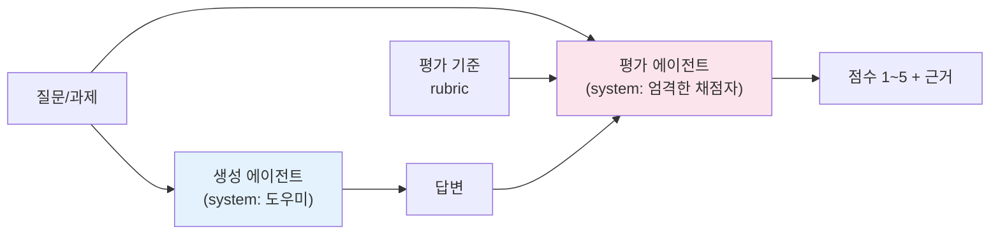
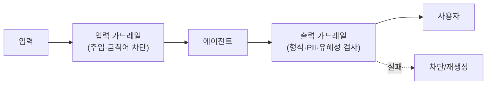

# 15. 평가 & 비용

에이전트를 "만드는" 것과 "믿고 프로덕션에 태우는" 것은 다릅니다. 이 챕터는 에이전트
출력을 **어떻게 자동으로 채점하고(evaluation)**, 그 과정에서 **토큰과 비용을 어떻게
통제하는지**를 다룹니다. 두 축을 관통하는 원칙은 하나입니다 — **측정하지 않으면
개선할 수 없다.** 그리고 측정의 첫 번째 함정은 "생성한 모델에게 스스로 채점을
맡기는 것"입니다.

## 1. 왜 평가가 어려운가

LLM 출력은 정답이 하나가 아닙니다. 요약·코드·대화처럼 **열린 출력**은 정규표현식이나
`==` 비교로 채점할 수 없습니다. 그래서 두 가지 접근을 조합합니다.

| 방식 | 언제 | 한계 |
|------|------|------|
| **규칙 기반(assertion)** | 형식·필드 존재·금칙어 등 확정적 검사 | 의미 품질은 못 잰다 |
| **LLM-as-judge** | 정확성·관련성·톤 등 주관적 품질 | 편향·비용·비결정성 |
| **사람 평가** | 최종 기준(ground truth) 확립 | 느리고 비쌈 |

실전에서는 **규칙 기반으로 걸러내고, LLM-judge로 품질을 점수화하며, 소수 샘플만
사람이 검수**하는 3단 구조가 흔합니다.

## 2. LLM-as-judge: 생성과 평가를 반드시 분리

가장 중요한 규칙입니다. **생성한 프롬프트/역할로 그대로 자기 출력을 채점하게 하면
점수가 후하게 나옵니다(self-scoring bias).** 이는 00장에서 "비평(critique)을 위해
생성과 평가를 분리하라"고 한 원칙의 구체적 사례입니다.

!!! danger "자기채점 편향"
    같은 세션·같은 역할에서 "네가 방금 쓴 답을 채점해"라고 하면 모델은 자기 답을
    변호하는 방향으로 점수를 매깁니다. **채점자는 별도 프롬프트로, "생성자가 아니라
    냉정한 평가자"라는 역할을 명시적으로 부여**해야 합니다.



judge를 신뢰하려면 몇 가지가 필요합니다.

- **명시적 rubric** — "좋다"는 모호합니다. `accuracy / relevance / conciseness`처럼
  독립적으로 판정 가능한 항목으로 쪼갭니다.
- **구조화된 출력** — 점수를 `output_config.format`(JSON 스키마)로 강제하면 항상
  파싱 가능한 결과가 나옵니다. 문자열 파싱은 깨지기 쉽습니다.
- **근거 반환** — 점수만이 아니라 "왜"를 받으면 judge의 오판을 사람이 감사할 수 있습니다.

실습 [`21_llm_judge.py`](../examples/21_llm_judge.py)에서 생성→평가 분리와 JSON 채점을
확인하세요.

## 3. 에이전트 평가셋과 오프라인 eval

한 번의 채점은 일화(anecdote)일 뿐입니다. **고정된 평가셋(eval set)**에 대해 반복
측정해야 회귀(regression)를 잡습니다.

!!! tip "에이전트 평가의 두 층위"
    - **최종 결과(outcome) 평가** — 과제를 실제로 달성했는가? (정답/rubric 대비)
    - **궤적(trajectory) 평가** — 올바른 도구를 올바른 순서로 호출했는가?
      멀티에이전트에서는 라우팅·핸드오프가 의도대로였는지도 본다(→ 13장 트레이싱).

오프라인 eval 루프의 뼈대:

```python
# 개념 스케치 — 평가셋을 돌려 평균 점수와 통과율을 낸다
cases = load_eval_set("cases.jsonl")   # {question, rubric} 목록
scores = []
for c in cases:
    answer = generate_answer(c["question"])          # 생성
    verdict = judge_answer(c["question"], answer, c["rubric"])  # 별도 채점
    scores.append(verdict["score"])
print("평균", sum(scores) / len(scores), "통과율", sum(s >= 4 for s in scores) / len(scores))
```

프롬프트나 모델을 바꿀 때마다 이 수치를 비교하면, "체감상 좋아진 것 같다"가 아니라
**숫자로** 판단할 수 있습니다.

### LangSmith evaluators

LangChain 스택이라면 [LangSmith](https://docs.smith.langchain.com/)의 `evaluate()`가
평가셋·채점 함수·실행을 묶어 줍니다. 커스텀 채점자(위의 `judge_answer`)를 그대로
evaluator로 등록하거나, 내장 LLM-judge를 쓸 수 있습니다.

```python
# 개념 스케치 (langsmith)
from langsmith import evaluate

def correctness(run, example):
    v = judge_answer(example.inputs["question"], run.outputs["answer"], example.metadata["rubric"])
    return {"key": "correctness", "score": v["score"] / 5}

evaluate(my_agent, data="my-dataset", evaluators=[correctness])
```

결과는 대시보드에 누적되어 실험 간 비교·회귀 추적이 됩니다.

## 4. 토큰·비용 관리

멀티에이전트는 토큰을 많이 씁니다(00장: 중앙집중형 오케스트레이션은 단일 대비 최대
+285%). 비용을 통제하는 네 가지 레버가 있습니다.

### 4.1 usage 추적

모든 응답의 `usage`를 로깅하세요. 어디서 토큰이 새는지 보이지 않으면 최적화도 없습니다.

```python
resp = client.messages.create(model=MODEL, max_tokens=1024, messages=[...])
u = resp.usage
print(u.input_tokens, u.output_tokens,
      u.cache_creation_input_tokens, u.cache_read_input_tokens)
```

전체 입력 크기 = `input_tokens + cache_creation_input_tokens + cache_read_input_tokens`
입니다. `input_tokens`만 보면 캐시로 처리된 양을 놓칩니다.

### 4.2 프롬프트 캐싱

큰 고정 프리픽스(시스템 프롬프트, few-shot, 검색 문서)를 캐싱하면 **캐시 읽기는
기본 입력가의 ~0.1배**로 처리됩니다.

!!! warning "캐싱은 프리픽스 매칭이다"
    프리픽스 어디든 1바이트만 바뀌면 그 뒤 전부가 무효화됩니다. 시스템 프롬프트에
    `datetime.now()`·UUID·정렬 안 된 JSON을 넣으면 캐시가 매번 깨집니다. 변하는 값은
    프롬프트 **끝**으로 옮기세요. 효과 검증은 `cache_read_input_tokens`가 0이 아닌지로
    확인합니다.

### 4.3 모델 선택

작업 난이도에 맞춰 모델을 나눕니다. 분류·추출 같은 단순 작업에 Opus를 쓰는 것은
낭비입니다.

| 모델 | 입력/출력($/1M) | 쓰는 곳 |
|------|-----------------|---------|
| `claude-opus-4-8` | $5 / $25 | 어려운 추론·장기 에이전트 |
| `claude-sonnet-5` | $3 / $15 | 균형, 대량 프로덕션 |
| `claude-haiku-4-5` | $1 / $5 | 분류·라우팅·judge 반복 |

패턴: **메인 루프는 Opus, 서브에이전트/채점 같은 하위 작업은 Haiku**로 내리면
품질 손실 없이 비용이 크게 줍니다.

### 4.4 배치와 상한

- 지연에 민감하지 않은 대량 평가는 **Batches API**(50% 할인)로 돌립니다.
- `max_tokens`를 합리적으로 잡아 폭주를 막고, 장기 에이전트는 **task budget**으로
  누적 토큰에 상한을 둡니다.

## 5. 가드레일

평가가 "사후"라면 가드레일은 "실시간" 방어입니다. 생성 전후에 규칙을 끼웁니다.



- **입력 가드레일** — 프롬프트 주입, 범위 밖 요청, 금칙어를 사전 차단.
- **출력 가드레일** — 형식 위반, PII 유출, 유해성. 규칙 기반 + 필요 시 경량 LLM 분류기.
- **judge를 가드레일로** — 응답을 사용자에게 보내기 전 judge가 임계 점수 미만이면
  재생성. 단, 비용·지연이 늘므로 고위험 경로에만 적용합니다.

!!! note "평가와 가드레일은 한 몸"
    같은 rubric을 오프라인 eval(회귀 추적)과 온라인 가드레일(실시간 차단) 양쪽에
    재사용하면 기준이 일관됩니다.

## 6. 정리

- 생성과 평가는 **반드시 분리** — 자기채점은 후하다.
- rubric을 쪼개고, judge 출력은 **구조화**하고, 근거를 받아 감사하라.
- 고정 **평가셋**으로 반복 측정해 회귀를 숫자로 잡아라(LangSmith 등).
- 비용은 **usage 로깅 → 캐싱 → 모델 분리 → 배치/상한**의 순서로 통제하라.
- 같은 기준을 오프라인 eval과 온라인 가드레일에 함께 쓰라.

다음 장에서는 이 규율을 갖춘 에이전트를 **셀프호스팅 런타임**(OpenClaw·Hermes)에
얹는 법을 봅니다. 캡스톤인 17장에서는 계획/생성/평가 분리를 하나의 **하네스**로
묶습니다.

## 참고 자료

- [Building Effective Agents — Anthropic](https://www.anthropic.com/research/building-effective-agents)
- [LangSmith Evaluation Docs](https://docs.smith.langchain.com/evaluation)
- [Prompt Caching — Anthropic](https://platform.claude.com/docs/en/build-with-claude/prompt-caching)
- [Message Batches API — Anthropic](https://platform.claude.com/docs/en/build-with-claude/batch-processing)
