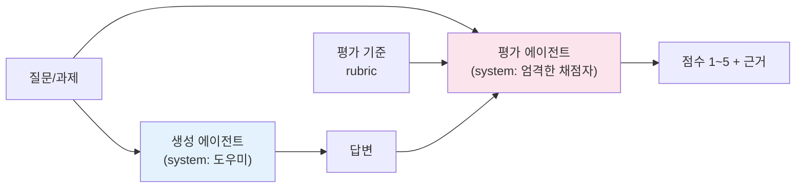
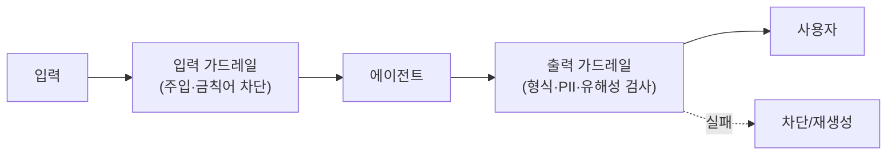

# 15. 평가 & 비용

에이전트를 "만드는" 것과 "믿고 프로덕션에 태우는" 것은 다릅니다. 이 챕터는 에이전트
출력을 **어떻게 자동으로 채점하고(evaluation)**, 그 과정에서 **토큰과 비용을 어떻게
통제하는지**를 다룹니다. 두 축을 관통하는 원칙은 하나입니다 — **측정하지 않으면
개선할 수 없다.** 그리고 측정의 첫 번째 함정은 "생성한 모델에게 스스로 채점을
맡기는 것"입니다.

## 1. 왜 평가가 어려운가

LLM 출력은 정답이 하나가 아닙니다. 요약·코드·대화처럼 **열린 출력**은 정규표현식이나
`==` 비교로 채점할 수 없습니다. 객관식 시험(정답 대조)이 아니라 **논술 시험(기준표 채점)**에
가깝기 때문입니다. 그래서 성격이 다른 접근들을 조합합니다.

| 방식 | 언제 | 한계 |
|------|------|------|
| **규칙 기반(assertion)** | 형식·필드 존재·금칙어 등 확정적 검사 | 의미 품질은 못 잰다 |
| **LLM-as-judge** | 정확성·관련성·톤 등 주관적 품질 | 편향·비용·비결정성 |
| **사람 평가** | 최종 기준(ground truth) 확립 | 느리고 비쌈 |

실전에서는 **규칙 기반으로 걸러내고, LLM-judge로 품질을 점수화하며, 소수 샘플만
사람이 검수**하는 3단 구조가 흔합니다.

## 2. LLM-as-judge: 생성과 평가를 반드시 분리

가장 중요한 규칙입니다. **생성한 프롬프트/역할로 그대로 자기 출력을 채점하게 하면
점수가 후하게 나옵니다(self-scoring bias).** 이는 00장에서 "비평(critique)을 위해
생성과 평가를 분리하라"고 한 원칙의 구체적 사례입니다.

!!! danger "자기채점 편향"
    같은 세션·같은 역할에서 "네가 방금 쓴 답을 채점해"라고 하면 모델은 자기 답을
    변호하는 방향으로 점수를 매깁니다. **채점자는 별도 프롬프트로, "생성자가 아니라
    냉정한 평가자"라는 역할을 명시적으로 부여**해야 합니다.



judge를 신뢰하려면 몇 가지가 필요합니다.

- **명시적 rubric** — "좋다"는 모호합니다. `accuracy / relevance / conciseness`처럼
  독립적으로 판정 가능한 항목으로 쪼갭니다.
- **구조화된 출력** — 점수를 `output_config.format`(JSON 스키마)로 강제하면 항상
  파싱 가능한 결과가 나옵니다. 문자열 파싱은 깨지기 쉽습니다.
- **근거 반환** — 점수만이 아니라 "왜"를 받으면 judge의 오판을 사람이 감사할 수 있습니다.

실습 [`21_llm_judge.py`](https://github.com/agent-chobi/agent-atoz/blob/main/examples/21_llm_judge.py)에서
생성→평가 분리와 JSON 채점을 확인하세요(실행 방법은 아래 "따라하기" 참고).

## 3. 에이전트 평가셋과 오프라인 eval

한 번의 채점은 일화(anecdote)일 뿐입니다. **고정된 평가셋(eval set)**에 대해 반복
측정해야 회귀(regression)를 잡습니다.

!!! tip "에이전트 평가의 두 층위"
    - **최종 결과(outcome) 평가** — 과제를 실제로 달성했는가? (정답/rubric 대비)
    - **궤적(trajectory) 평가** — 올바른 도구를 올바른 순서로 호출했는가?
      멀티에이전트에서는 라우팅·핸드오프가 의도대로였는지도 본다(→ 13장 트레이싱).

오프라인 eval 루프의 뼈대:

```python
# 개념 스케치 — 평가셋을 돌려 평균 점수와 통과율을 낸다
cases = load_eval_set("cases.jsonl")   # {question, rubric} 목록
scores = []
for c in cases:
    answer = generate_answer(c["question"])          # 생성
    verdict = judge_answer(c["question"], answer, c["rubric"])  # 별도 채점
    scores.append(verdict["score"])
print("평균", sum(scores) / len(scores), "통과율", sum(s >= 4 for s in scores) / len(scores))
```

프롬프트나 모델을 바꿀 때마다 이 수치를 비교하면, "체감상 좋아진 것 같다"가 아니라
**숫자로** 판단할 수 있습니다.

### LangSmith evaluators

LangChain 스택이라면 [LangSmith](https://docs.smith.langchain.com/)의 `evaluate()`가
평가셋·채점 함수·실행을 묶어 줍니다. 커스텀 채점자(위의 `judge_answer`)를 그대로
evaluator로 등록하거나, 내장 LLM-judge를 쓸 수 있습니다.

```python
# 개념 스케치 (langsmith)
from langsmith import evaluate

def correctness(run, example):
    v = judge_answer(example.inputs["question"], run.outputs["answer"], example.metadata["rubric"])
    return {"key": "correctness", "score": v["score"] / 5}

evaluate(my_agent, data="my-dataset", evaluators=[correctness])
```

결과는 대시보드에 누적되어 실험 간 비교·회귀 추적이 됩니다.

## 4. 토큰·비용 관리

멀티에이전트는 토큰을 많이 씁니다(00장: 중앙집중형 오케스트레이션은 단일 대비 **약 +285%** —
측정 조건과 워크로드에 따라 달라지는 **참고치**이므로 절대 수치보다 "몇 배 단위로 늘어난다"는
규모감으로 읽으세요). 비용을 통제하는 네 가지 레버가 있습니다.

### 4.1 usage 추적

모든 응답의 `usage`를 로깅하세요. 어디서 토큰이 새는지 보이지 않으면 최적화도 없습니다.

```python
resp = client.messages.create(model=MODEL, max_tokens=1024, messages=[...])
u = resp.usage
print(u.input_tokens, u.output_tokens,
      u.cache_creation_input_tokens, u.cache_read_input_tokens)
```

전체 입력 크기 = `input_tokens + cache_creation_input_tokens + cache_read_input_tokens`
입니다. `input_tokens`만 보면 캐시로 처리된 양을 놓칩니다.

### 4.2 프롬프트 캐싱

큰 고정 프리픽스(시스템 프롬프트, few-shot, 검색 문서)를 캐싱하면 **캐시 읽기는
기본 입력가의 ~0.1배**로 처리됩니다.

!!! warning "캐싱은 프리픽스 매칭이다"
    프리픽스 어디든 1바이트만 바뀌면 그 뒤 전부가 무효화됩니다. 시스템 프롬프트에
    `datetime.now()`·UUID·정렬 안 된 JSON을 넣으면 캐시가 매번 깨집니다. 변하는 값은
    프롬프트 **끝**으로 옮기세요. 효과 검증은 `cache_read_input_tokens`가 0이 아닌지로
    확인합니다.

### 4.3 모델 선택

작업 난이도에 맞춰 모델을 나눕니다. 분류·추출 같은 단순 작업에 Opus를 쓰는 것은
낭비입니다.

| 모델 | 입력/출력($/1M) | 쓰는 곳 |
|------|-----------------|---------|
| `claude-opus-4-8` | $5 / $25 | 어려운 추론·장기 에이전트 |
| `claude-sonnet-5` | $3 / $15 | 균형, 대량 프로덕션 |
| `claude-haiku-4-5` | $1 / $5 | 분류·라우팅·judge 반복 |

패턴: **메인 루프는 Opus, 서브에이전트/채점 같은 하위 작업은 Haiku**로 내리면
품질 손실 없이 비용이 크게 줍니다.

### 4.4 배치와 상한

- 지연에 민감하지 않은 대량 평가는 **Batches API**(50% 할인)로 돌립니다.
- `max_tokens`를 합리적으로 잡아 폭주를 막고, 장기 에이전트는 **task budget**으로
  누적 토큰에 상한을 둡니다.

## 5. 가드레일

평가가 "사후"라면 가드레일은 "실시간" 방어입니다. 생성 전후에 규칙을 끼웁니다.



- **입력 가드레일** — 프롬프트 주입, 범위 밖 요청, 금칙어를 사전 차단.
- **출력 가드레일** — 형식 위반, PII 유출, 유해성. 규칙 기반 + 필요 시 경량 LLM 분류기.
- **judge를 가드레일로** — 응답을 사용자에게 보내기 전 judge가 임계 점수 미만이면
  재생성. 단, 비용·지연이 늘므로 고위험 경로에만 적용합니다.

!!! note "평가와 가드레일은 한 몸"
    같은 rubric을 오프라인 eval(회귀 추적)과 온라인 가드레일(실시간 차단) 양쪽에
    재사용하면 기준이 일관됩니다.

## 따라하기 — 예제 21: LLM-as-judge

이 장의 실습은 [`examples/21_llm_judge.py`](https://github.com/agent-chobi/agent-atoz/blob/main/examples/21_llm_judge.py)입니다.
생성(도우미 프롬프트)과 평가(엄격한 채점자 프롬프트)를 완전히 분리하고, judge의 점수를
JSON 스키마로 강제해 항상 파싱 가능한 결과를 받는 흐름을 시연합니다.
(전체 예제 목록은 [매핑표](https://github.com/agent-chobi/agent-atoz/blob/main/examples/README.md) 참고)

**1) 사전 준비**

```bash
pip install anthropic python-dotenv
# .env 에 ANTHROPIC_API_KEY=sk-ant-... 설정
```

**2) 실행**

```bash
python examples/21_llm_judge.py
```

**3) 기대 출력 요지**

- 질문에 대한 **생성 답변**(3~5문장)이 먼저 출력됩니다.
- 이어서 별도 judge 프롬프트가 채점한 **구조화된 JSON** — `score`(1~5 정수)와
  `reasoning`(점수 근거) — 이 출력됩니다. 점수는 enum으로 1~5만 허용되므로
  "4.5점" 같은 파싱 불가 응답이 나오지 않습니다.

**4) 흔한 에러**

| 증상 | 원인 / 해결 |
|------|-------------|
| `AuthenticationError` | `.env`의 `ANTHROPIC_API_KEY` 미설정·오타. |
| 실행 비용이 부담됨 | 기본 모델이 Opus입니다. 파일 상단의 `MODEL`을 `claude-haiku-4-5`로 바꾸면 반복 실습에 적합합니다. |
| judge 점수가 매번 조금씩 다름 | LLM 채점의 비결정성 — 정상입니다. 실전에서는 고정 평가셋 + 반복 측정 평균으로 흡수합니다(§3). |

## 실무 트레이드오프 — 누가 채점할 것인가

세 채점자는 비용·신뢰도·속도가 전부 다릅니다. 어느 하나로 통일하는 것이 아니라
**층(layer)으로 쌓는 것**이 핵심입니다.

| 축 | 규칙 기반(assertion) | LLM-as-judge | 휴먼 평가 |
|----|---------------------|--------------|-----------|
| 건당 비용 | 거의 0 | 모델 호출 1회(Haiku면 저렴) | **가장 비쌈**(인건비) |
| 신뢰도 | 검사 범위 안에서는 100% | 편향·비결정성 있음 — 보정 필요 | **기준(ground truth)** |
| 속도·규모 | 전수(100%) 적용 가능 | 대량 자동화 가능 | 소수 샘플만 현실적 |
| 잡는 것 | 형식·필드·금칙어 | 의미 품질(정확성·관련성·톤) | 미묘한 품질·judge의 오판 |
| 한계 | 의미를 못 봄 | 자기채점 편향, judge 자체 검증 필요 | 느리고 일관성 유지 어려움 |

!!! tip "3단 구조의 경제학"
    결정적 검사는 공짜에 가까우니 **100% 전수**로, judge는 표본 또는 위험 경로에,
    사람은 judge를 보정하는 **소수 골든 샘플**에 씁니다. 사람의 채점 결과로 judge의
    편향을 주기적으로 교정(calibration)하면, 비싼 채점자의 신뢰도를 싼 채점자에 이식하는 셈이 됩니다.

## 설계 가이드 — 평가 파이프라인을 어떻게 짤 것인가

위 표가 "누가 채점하나"라면, 여기서는 평가셋을 **어떻게 만들고**, judge를 **어떻게 고르고**,
CI와 프로덕션에 **어디에 끼울지**를 정합니다.

### 평가셋 구축 — 프로덕션 트레이스에서 골든셋 추출

평가셋을 책상에서 지어내면 실제 실패 분포와 어긋납니다. 정석 절차:

1. **수집** — 트레이싱([13장](13-debugging-observability.md))에서 실패 신호가 붙은
   트레이스를 모은다: 사용자 부정 피드백, judge 저점, HITL 거부, 에러 재시도.
2. **고정** — 실패 당시의 **정확한 입력 컨텍스트**(구성된 프롬프트·도구 결과 포함)를
   그대로 케이스로 캡처한다. 질문만 떼어 오면 재현이 안 된다.
3. **라벨** — 사람이 기대 출력 또는 rubric을 단다. 이 단계만은 자동화하지 않는다.
4. **버저닝** — 케이스 추가 시점을 기록하고, 점수 비교는 **같은 평가셋 버전끼리만** 한다.
   케이스가 늘어난 셋과 이전 점수를 비교하면 "회귀처럼 보이는 착시"가 생긴다.
5. **분포 유지** — 실패 케이스만 모으면 비정상적으로 어려운 셋이 된다. 정상 케이스를
   일정 비율 섞어 실제 트래픽 분포를 근사한다.

시작 규모는 20~50케이스면 충분합니다 — 완벽한 셋을 기다리지 말고 회귀 감지부터 돌리세요.

### judge 모델 선택 체크리스트

- [ ] **생성 모델과 다른 모델(최소한 다른 프롬프트·역할)인가?** — §2의 자기채점 편향.
      같은 계열 모델은 같은 실수를 "정답"으로 볼 수 있으므로, 가능하면 세대·계열을 달리한다.
- [ ] **채점 항목이 단순 판별이면 Haiku급으로 충분한가?** — 형식·관련성 판정은 소형
      모델로 내리고, 미묘한 정확성 판정만 상위 모델에 맡기면 대량 평가 비용이 크게 준다.
- [ ] **judge 자체를 검증했는가?** — 사람 라벨 골든 샘플과 judge 판정의 일치율을 먼저
      재고(예: 90% 이상), 미달이면 rubric을 쪼개거나 모델을 올린다.
- [ ] **비결정성을 흡수했는가?** — 같은 케이스를 여러 번 채점해 평균 내거나, 점수 대신
      pass/fail 이진 판정으로 단순화하면 분산이 줄어든다.

### CI 연동과 회귀 임계값

| 배치 지점 | 무엇을 돌리나 | 실패 시 |
|-----------|---------------|---------|
| PR 게이트 | 소형 스모크 셋(10~20케이스, Haiku judge) — 수 분 내 완료 | 머지 차단 |
| nightly | 전체 평가셋 + 상위 judge | 대시보드 경고, 담당자 알림 |
| 릴리스 전 | 전체 셋 + 사람 샘플 검수 | 배포 보류 |

임계값은 **절대 점수가 아니라 기준선 대비 상대 하락**으로 잡습니다(예: "통과율이 직전
main 대비 5%p 이상 하락하면 실패"). LLM 채점의 분산 때문에 1~2%p 변동은 노이즈일 수
있으므로, 임계값을 분산보다 크게 잡거나 반복 측정 평균을 쓰세요.

### 온라인 vs 오프라인 평가 배치

| 축 | 오프라인 eval | 온라인 평가 |
|----|---------------|-------------|
| 시점 | 배포 전, 고정 평가셋 | 프로덕션 트래픽 실시간·준실시간 |
| 목적 | 회귀 차단, 변경 비교 | 품질 드리프트 감지, 가드레일(§5) |
| 비용 통제 | Batches API(50% 할인)로 대량 실행 | 샘플링 + 고위험 경로만 전수 |
| 산출물 | 점수 리포트, 머지/배포 판정 | 실패 트레이스 → **오프라인 평가셋으로 환류** |

이 환류 고리(온라인 실패 → 골든셋 승격 → 오프라인 회귀 방지)가 닫혀 있어야
평가 파이프라인이 시간이 갈수록 강해집니다.

## 2026 실무 트렌드

- **품질이 배포의 1순위 장벽** — LangChain의 2026 State of AI Agents 조사에서 57%의
  조직이 에이전트를 프로덕션에 운영 중이며, 배포를 막는 가장 큰 요인으로 "품질"을
  꼽았습니다. 평가 체계가 곧 배포 속도를 결정합니다.
- **비용 인지(cost-aware) 평가 파이프라인** — 결정적 검사(거의 무료)는 전 출력에,
  LLM-judge는 샘플링·고위험 경로에 계층적으로 배치해 "신호 대비 지출"을 설계하는
  접근이 표준화되고 있습니다.
- **judge 보정(calibration) 워크플로** — 사람의 교정 데이터를 모아 LLM-judge를
  정렬(align)하는 도구·절차가 제품화되어, "judge를 누가 평가하나" 문제에 대한 실무 답이 생겼습니다.
- **캐싱 + 배치 중첩 할인** — 프롬프트 캐싱(최대 ~90% 절감)과 배치 API(50% 할인)를 겹치면
  유효 단가가 표준가의 약 1/4까지 내려갑니다. 단, 에이전트는 태스크당 수십~수백 회를
  호출하므로 "싼 토큰 × 많은 호출"이 여전히 큰 청구서가 됩니다 — 호출 수 자체를 줄이는 설계가 병행돼야 합니다.

## 실전 레퍼런스

- [Evaluating Large Language Models with OpenEvals — LangChain Blog](https://www.langchain.com/blog/evaluating-llms-with-openevals) — LLM-judge·구조화 출력용 기성 evaluator 패키지 소개.
- [agentevals — GitHub](https://github.com/langchain-ai/agentevals) — 에이전트 궤적(trajectory) 평가용 기성 evaluator 모음.
- [How to Calibrate LLM-as-Judge with Human Corrections — LangChain](https://www.langchain.com/resources/llm-as-a-judge) — 휴먼 교정 데이터로 judge를 보정하는 방법론.
- [Klarna's AI assistant does the work of 700 full-time agents — OpenAI](https://openai.com/index/klarna/) — 대표적 기업 사례. 첫 달 230만 대화, 반복 문의 25% 감소 — 이후 2025년 복잡 케이스를 위해 인간 상담을 재확충한 후일담까지 포함해 "측정과 인간 감독"의 교훈으로 읽을 것.

## 6. 정리

- 생성과 평가는 **반드시 분리** — 자기채점은 후하다.
- rubric을 쪼개고, judge 출력은 **구조화**하고, 근거를 받아 감사하라.
- 고정 **평가셋**으로 반복 측정해 회귀를 숫자로 잡아라(LangSmith 등).
- 비용은 **usage 로깅 → 캐싱 → 모델 분리 → 배치/상한**의 순서로 통제하라.
- 같은 기준을 오프라인 eval과 온라인 가드레일에 함께 쓰라.

다음 장에서는 이 규율을 갖춘 에이전트를 **셀프호스팅 런타임**(OpenClaw·Hermes)에
얹는 법을 봅니다. 캡스톤인 17장에서는 계획/생성/평가 분리를 하나의 **하네스**로
묶습니다.

## 참고 자료

- [Building Effective Agents — Anthropic](https://www.anthropic.com/research/building-effective-agents)
- [LangSmith Evaluation Docs](https://docs.smith.langchain.com/evaluation)
- [Prompt Caching — Anthropic](https://platform.claude.com/docs/en/build-with-claude/prompt-caching)
- [Message Batches API — Anthropic](https://platform.claude.com/docs/en/build-with-claude/batch-processing)
