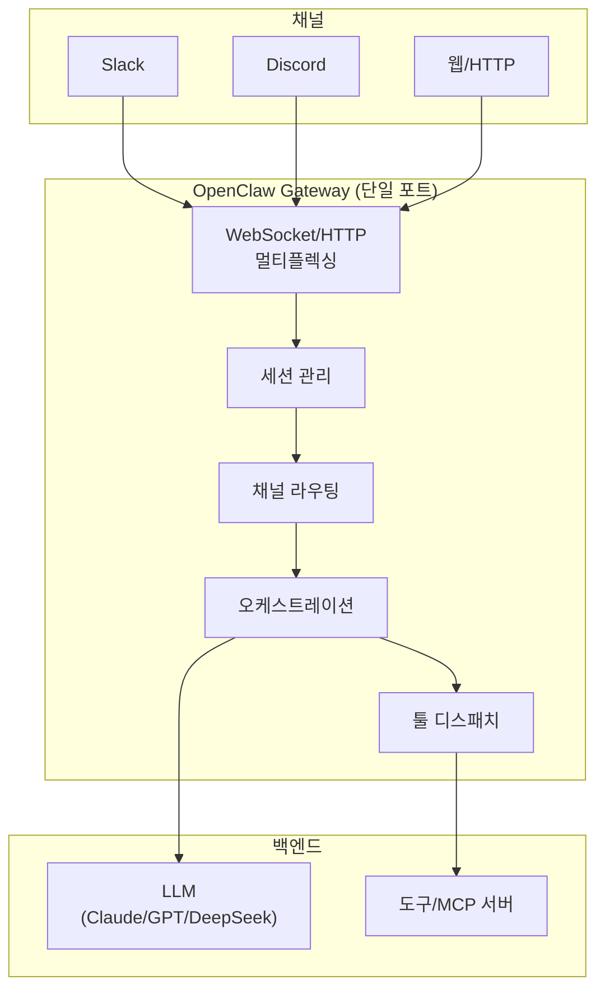
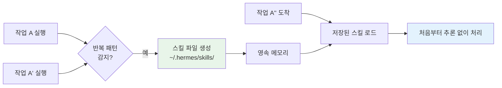

# 16. 셀프호스팅 런타임 (OpenClaw & Hermes)

앞선 챕터들은 에이전트를 **코드로 조립**하는 법(프레임워크·SDK)을 다뤘습니다. 이 장은
다른 선택지 — 여러 LLM과 메시징 채널에 곧바로 붙는 **완성형 셀프호스팅 런타임**을
살펴봅니다. 대표 주자가 **OpenClaw**와 **Hermes**입니다. 둘 다 "직접 서버에 띄워
돌리는" 오픈소스 오케스트레이션 런타임이라, 실행 코드보다 **아키텍처와 설정** 이해가
핵심입니다.

## 1. SDK로 조립 vs 런타임 채택 — 언제 무엇을

| 축 | SDK로 조립 (LangGraph·Claude Agent SDK 등) | 런타임 채택 (OpenClaw·Hermes) |
|----|------------------------------------------|------------------------------|
| 제어도 | 노드·엣지까지 세밀 | 런타임이 정한 범위 안에서 설정 |
| 시작 비용 | 코드 작성 필요 | 설치·설정 위주, 빠른 기동 |
| 채널 연동 | 직접 구현 | 슬랙·디스코드·텔레그램 등 **내장** |
| 멀티 LLM | 어댑터로 가능 | **기본 전제**(아무 모델) |
| 세션·라우팅 | 직접 관리 | 런타임이 관리 |

!!! tip "선택 기준 한 줄"
    **"에이전트 로직 자체가 제품"이면 SDK로 조립**하세요. **"여러 채널에 붙는 상시
    운영 봇을 빨리 세우는 것"이 목표면 런타임을 채택**하세요. 런타임 위에서도 결국
    LLM·프롬프트·도구는 여러분이 정의합니다 — 오케스트레이션 배관을 물려받는 것뿐입니다.

## 2. OpenClaw — Gateway 중심 아키텍처

**OpenClaw**는 오픈소스 셀프호스팅 에이전트 런타임입니다(원래 *Clawdbot*, 2026-02
OpenAI가 인수). 핵심은 **중앙 Gateway**입니다. 단일 포트에서 WebSocket/HTTP를
멀티플렉싱하며 **세션 관리·툴 디스패치·채널 라우팅·오케스트레이션**을 한곳에서
담당합니다. LLM은 Claude·GPT·DeepSeek 등 무엇이든, 전부 로컬에서 실행됩니다.



Gateway가 단일 진입점이라 얻는 이점:

- **관측·제어 집중** — 모든 세션과 툴 호출이 한 지점을 지나므로 로깅·인가가 쉽다(→ 13·14장).
- **채널 독립** — 슬랙에서든 웹에서든 같은 세션·같은 에이전트에 연결된다.
- **모델 교체 용이** — 오케스트레이션은 그대로 두고 뒤의 LLM만 바꾼다.

### 설정 스케치 (개념 수준)

OpenClaw는 pip 패키지가 아니라 **셀프호스팅 서버**입니다. 대략의 흐름:

```yaml
# openclaw.yaml (개념 예시) — Gateway 설정
gateway:
  port: 8787            # 단일 포트에서 WS/HTTP 멀티플렉싱
model:
  provider: anthropic
  id: claude-opus-4-8   # 어떤 LLM이든 지정 (로컬 실행)
channels:
  - type: slack
    token_env: SLACK_BOT_TOKEN
  - type: http
tools:
  - type: mcp
    url: http://localhost:9001/sse   # MCP 서버 연결 (→ 11장)
```

```bash
# 개념 명령 — Gateway 기동
openclaw serve --config openclaw.yaml
# 이후 각 채널(슬랙 등)의 메시지가 Gateway로 라우팅됨
```

!!! note "실제 명령·필드는 버전마다 다르다"
    위는 아키텍처를 설명하기 위한 **개념 스케치**입니다. 정확한 설정 키·CLI는
    프로젝트 문서를 확인하세요. 요지는 "Gateway 하나가 채널·세션·툴·모델을 잇는다"입니다.

## 3. Hermes — 자기개선 Skills 런타임

**Hermes Agent**는 Nous Research의 오픈소스 셀프호스팅 런타임입니다(2026-02 출시).
아무 LLM에 **16개 이상의 메시징 플랫폼**을 붙이고, **영속 메모리**를 갖습니다. 가장
특징적인 것은 **자기개선 학습 루프**입니다.

!!! tip "Skills 자동생성 — Hermes의 킬러 기능"
    Hermes는 **반복되는 작업을 감지하면, 재사용 가능한 스킬 파일을 스스로 생성**해
    `~/.hermes/skills/` 에 저장합니다. 다음에 비슷한 작업이 오면 매번 처음부터
    추론하지 않고 저장된 스킬을 불러 씁니다. 사람이 스킬을 미리 정의하는 게 아니라,
    **에이전트가 경험에서 스킬을 축적**합니다.



이 구조는 08장(컨텍스트 엔지니어링)의 **절차적 기억(procedural memory)**과 07장(장기
메모리)의 실전 구현입니다. 다른 점은 스킬 생성이 **자동**이라는 것입니다.

### 설정 스케치 (개념 수준)

```yaml
# hermes.yaml (개념 예시)
model:
  provider: anthropic
  id: claude-opus-4-8
memory:
  path: ~/.hermes/memory       # 영속 메모리
skills:
  path: ~/.hermes/skills       # 자동 생성 스킬 저장소
  auto_generate: true          # 반복 작업 감지 시 스킬 생성
channels:
  - type: telegram
  - type: discord
```

## 4. 비교표

| 항목 | **OpenClaw** | **Hermes** |
|------|--------------|------------|
| 주체 | 오픈소스 (Clawdbot → 2026-02 OpenAI 인수) | Nous Research 오픈소스 (2026-02) |
| 핵심 아키텍처 | 중앙 **Gateway**(단일 포트 WS/HTTP 멀티플렉싱) | 자기개선 학습 루프 + 영속 메모리 |
| 오케스트레이션 | Gateway가 세션·라우팅·툴 디스패치 집중 | 에이전트 중심 + 스킬 재사용 |
| LLM | 아무 모델(Claude/GPT/DeepSeek), 로컬 실행 | 아무 모델 |
| 채널 | Slack·Discord·HTTP 등 | **16개 이상** 메시징 플랫폼 |
| 메모리 | 세션 관리 | **영속 메모리** |
| Skills 자동생성 | — | **있음**(`~/.hermes/skills/`) |
| 라이선스/호스팅 | 오픈소스·셀프호스팅 | 오픈소스·셀프호스팅 |
| 강점 | 집중형 제어·관측, 채널 라우팅 | 자율 스킬 축적, 다채널 |

!!! note "공통점과 위치"
    둘 다 **로컬 실행·오픈소스·셀프호스팅**입니다. 00장 지형도에서 "런타임" 계층에
    속하며, [부록 A](appendix-sdk-matrix.md)에서 SDK와 함께 비교됩니다. 프로토콜(MCP·A2A)은
    이들과 직교하므로, 런타임 위에서도 MCP 도구·A2A 에이전트를 붙일 수 있습니다.

## 5. 정리

- 런타임은 **오케스트레이션 배관(세션·채널·툴·모델)을 물려받는** 선택지입니다.
  로직 자체가 제품이면 SDK로, 상시 다채널 봇을 빨리 세우려면 런타임으로.
- **OpenClaw**는 중앙 Gateway로 제어를 집중합니다 — 단일 포트에서 모든 것을 라우팅.
- **Hermes**는 반복 작업에서 스킬을 스스로 만들어 축적하는 자기개선 루프가 핵심.
- 정확한 설정·명령은 버전 의존적이므로, 이 장의 코드는 **개념 스케치**로 보고 실제
  운영 시 프로젝트 문서를 확인하세요.

다음 장(캡스톤)에서는 지금까지의 모든 규율 — 메모리·컨텍스트·오케스트레이션·평가·권한 —
을 하나의 **하네스**로 묶습니다.

## 참고 자료

- [Building Effective Agents — Anthropic](https://www.anthropic.com/research/building-effective-agents)
- [Model Context Protocol](https://modelcontextprotocol.io/)
- [Nous Research](https://nousresearch.com/)
- [부록 A · SDK 비교 매트릭스](appendix-sdk-matrix.md)
