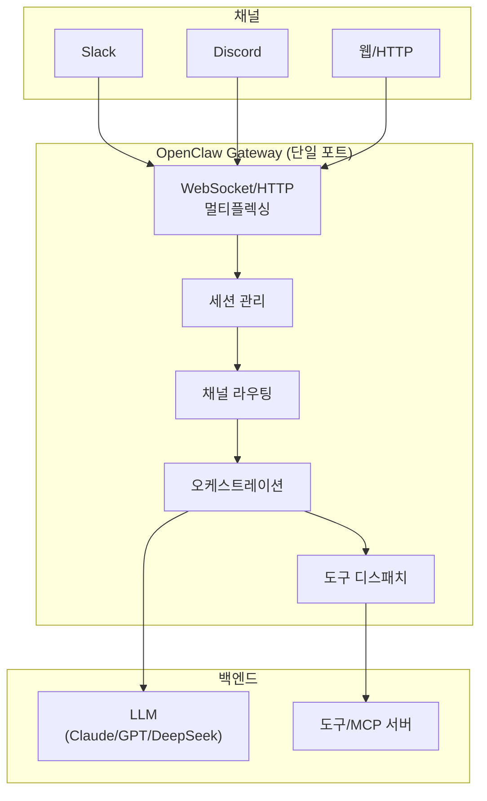
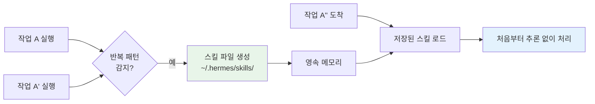

# 16. 셀프호스팅 런타임 (OpenClaw & Hermes)

앞선 챕터들은 에이전트를 **코드로 조립**하는 법(프레임워크·SDK)을 다뤘습니다. 이 장은
다른 선택지 — 여러 LLM과 메시징 채널에 곧바로 붙는 **완성형 셀프호스팅 런타임**을
살펴봅니다. 대표 주자가 **OpenClaw**와 **Hermes**입니다. 둘 다 "직접 서버에 띄워
돌리는" 오픈소스 오케스트레이션 런타임이라, 실행 코드보다 **아키텍처와 설정** 이해가
핵심입니다.

!!! note "이 장은 개념 장입니다 — 대응 예제가 없습니다"
    다른 장들과 달리 이 장에는 `examples/`의 대응 실습 코드가 없습니다. 런타임은
    pip로 설치하는 라이브러리가 아니라 **서버로 띄우는 소프트웨어**이고, 설치·설정
    방법이 버전마다 달라지기 때문입니다. 본문의 YAML/CLI는 모두 **개념 스케치**이며,
    실습은 아래 "따라하기"의 로컬 설치 체험 가이드로 대체합니다.

## 1. SDK로 조립 vs 런타임 채택 — 언제 무엇을

| 축 | SDK로 조립 (LangGraph·Claude Agent SDK 등) | 런타임 채택 (OpenClaw·Hermes) |
|----|------------------------------------------|------------------------------|
| 제어도 | 노드·엣지까지 세밀 | 런타임이 정한 범위 안에서 설정 |
| 시작 비용 | 코드 작성 필요 | 설치·설정 위주, 빠른 기동 |
| 채널 연동 | 직접 구현 | 슬랙·디스코드·텔레그램 등 **내장** |
| 멀티 LLM | 어댑터로 가능 | **기본 전제**(아무 모델) |
| 세션·라우팅 | 직접 관리 | 런타임이 관리 |

!!! tip "선택 기준 한 줄"
    **"에이전트 로직 자체가 제품"이면 SDK로 조립**하세요. **"여러 채널에 붙는 상시
    운영 봇을 빨리 세우는 것"이 목표면 런타임을 채택**하세요. 집에 비유하면 SDK 조립은
    설계도부터 그리는 맞춤 주택이고, 런타임 채택은 배관·전기가 다 깔린 집에 입주해
    가구(LLM·프롬프트·도구)만 들이는 것입니다. 어느 쪽이든 가구는 여러분이 고릅니다 —
    물려받는 것은 오케스트레이션 배관뿐입니다.

## 2. OpenClaw — Gateway 중심 아키텍처

**OpenClaw**는 오픈소스 셀프호스팅 에이전트 런타임입니다(원래 *Clawdbot*, 2026-02
OpenAI가 인수). 핵심은 **중앙 Gateway**입니다. 단일 포트에서 WebSocket/HTTP를
멀티플렉싱하며 **세션 관리·도구 디스패치·채널 라우팅·오케스트레이션**을 한곳에서
담당합니다. LLM은 Claude·GPT·DeepSeek 등 무엇이든, 전부 로컬에서 실행됩니다.



Gateway가 단일 진입점이라 얻는 이점:

- **관측·제어 집중** — 모든 세션과 도구 호출이 한 지점을 지나므로 로깅·인가가 쉽다(→ 13·14장).
- **채널 독립** — 슬랙에서든 웹에서든 같은 세션·같은 에이전트에 연결된다.
- **모델 교체 용이** — 오케스트레이션은 그대로 두고 뒤의 LLM만 바꾼다.

### 설정 스케치 (개념 수준)

OpenClaw는 pip 패키지가 아니라 **셀프호스팅 서버**입니다. 대략의 흐름:

```yaml
# openclaw.yaml (개념 예시) — Gateway 설정
gateway:
  port: 8787            # 단일 포트에서 WS/HTTP 멀티플렉싱
model:
  provider: anthropic
  id: claude-opus-4-8   # 어떤 LLM이든 지정 (로컬 실행)
channels:
  - type: slack
    token_env: SLACK_BOT_TOKEN
  - type: http
tools:
  - type: mcp
    url: http://localhost:9001/sse   # MCP 서버 연결 (→ 11장)
```

```bash
# 개념 명령 — Gateway 기동
openclaw serve --config openclaw.yaml
# 이후 각 채널(슬랙 등)의 메시지가 Gateway로 라우팅됨
```

!!! note "실제 명령·필드는 버전마다 다르다"
    위는 아키텍처를 설명하기 위한 **개념 스케치**입니다. 정확한 설정 키·CLI는
    프로젝트 문서를 확인하세요. 요지는 "Gateway 하나가 채널·세션·도구·모델을 잇는다"입니다.

## 3. Hermes — 자기개선 Skills 런타임

**Hermes Agent**는 Nous Research의 오픈소스 셀프호스팅 런타임입니다(2026-02 출시).
아무 LLM에 **16개 이상의 메시징 플랫폼**을 붙이고, **영속 메모리**를 갖습니다. 가장
특징적인 것은 **자기개선 학습 루프**입니다.

!!! tip "Skills 자동생성 — Hermes의 킬러 기능"
    Hermes는 **반복되는 작업을 감지하면, 재사용 가능한 스킬 파일을 스스로 생성**해
    `~/.hermes/skills/` 에 저장합니다. 다음에 비슷한 작업이 오면 매번 처음부터
    추론하지 않고 저장된 스킬을 불러 씁니다. 사람이 스킬을 미리 정의하는 게 아니라,
    **에이전트가 경험에서 스킬을 축적**합니다.



이 구조는 08장(컨텍스트 엔지니어링)의 **절차적 기억(procedural memory)**과 07장(장기
메모리)의 실전 구현입니다. 다른 점은 스킬 생성이 **자동**이라는 것입니다.

### 설정 스케치 (개념 수준)

```yaml
# hermes.yaml (개념 예시)
model:
  provider: anthropic
  id: claude-opus-4-8
memory:
  path: ~/.hermes/memory       # 영속 메모리
skills:
  path: ~/.hermes/skills       # 자동 생성 스킬 저장소
  auto_generate: true          # 반복 작업 감지 시 스킬 생성
channels:
  - type: telegram
  - type: discord
```

## 4. 비교표

| 항목 | **OpenClaw** | **Hermes** |
|------|--------------|------------|
| 주체 | 오픈소스 (Clawdbot → 2026-02 OpenAI 인수) | Nous Research 오픈소스 (2026-02) |
| 핵심 아키텍처 | 중앙 **Gateway**(단일 포트 WS/HTTP 멀티플렉싱) | 자기개선 학습 루프 + 영속 메모리 |
| 오케스트레이션 | Gateway가 세션·라우팅·도구 디스패치 집중 | 에이전트 중심 + 스킬 재사용 |
| LLM | 아무 모델(Claude/GPT/DeepSeek), 로컬 실행 | 아무 모델 |
| 채널 | Slack·Discord·HTTP 등 | **16개 이상** 메시징 플랫폼 |
| 메모리 | 세션 관리 | **영속 메모리** |
| Skills 자동생성 | — | **있음**(`~/.hermes/skills/`) |
| 라이선스/호스팅 | 오픈소스·셀프호스팅 | 오픈소스·셀프호스팅 |
| 강점 | 집중형 제어·관측, 채널 라우팅 | 자율 스킬 축적, 다채널 |

!!! note "공통점과 위치"
    둘 다 **로컬 실행·오픈소스·셀프호스팅**입니다. 00장 지형도에서 "런타임" 계층에
    속하며, [부록 A](appendix-sdk-matrix.md)에서 SDK와 함께 비교됩니다. 프로토콜(MCP·A2A)은
    이들과 직교하므로, 런타임 위에서도 MCP 도구·A2A 에이전트를 붙일 수 있습니다.

## 따라하기 — OpenClaw/Hermes 로컬 설치 체험 가이드 (개념 실습)

이 장에는 대응 예제 코드가 없으므로, 실습은 **런타임을 직접 로컬(또는 VPS)에 띄워 보는
체험**으로 대체합니다. 정확한 명령·설정 키는 버전마다 다르므로, 아래는 어떤 런타임이든
공통으로 밟게 되는 **체험의 뼈대**입니다. 실제 설치는 반드시 공식 저장소의 최신 가이드를
따르세요(Hermes: [github.com/nousresearch/hermes-agent](https://github.com/nousresearch/hermes-agent)).

**1) 사전 준비**

- 상시 켜 둘 수 있는 머신 — 로컬 PC, 홈서버, 저사양 VPS면 충분합니다.
- LLM API 키 — Anthropic/OpenAI/OpenRouter 등, 런타임이 지원하는 아무 제공자.
- 연결할 채널 1개의 봇 토큰 — 처음에는 만들기 쉬운 Telegram·Discord 봇을 권장합니다.
- 런타임별 실행 환경 — OpenClaw는 Node.js 계열, Hermes는 저장소의 요구 사항 확인.

**2) 실행 (체험 흐름)**

1. 공식 저장소의 설치 가이드대로 런타임을 설치합니다.
2. 설정 파일에 **모델(제공자·API 키)**과 **채널(봇 토큰)**을 등록합니다 — 본문의
   `openclaw.yaml`/`hermes.yaml` 스케치가 이 단계의 개념도입니다.
3. 게이트웨이/에이전트 프로세스를 기동하고, 연결한 채널에서 봇에게 첫 메시지를 보냅니다.

**3) 기대 출력 요지**

- 채널에서 보낸 메시지가 런타임 로그에 **세션으로 잡히고**, LLM의 응답이 채널로 돌아옵니다.
  이 왕복 하나가 곧 "채널 → Gateway/에이전트 → LLM → 채널" 배관이 완성됐다는 증거입니다.
- Hermes라면 비슷한 작업을 몇 번 반복시킨 뒤 `~/.hermes/skills/` 디렉터리를 열어 보세요 —
  **스킬 파일이 자동 생성**되어 있으면 자기개선 루프가 동작하는 것입니다.

**4) 흔한 에러**

| 증상 | 원인 / 해결 |
|------|-------------|
| 포트 충돌로 기동 실패 | Gateway 포트가 이미 사용 중 — 설정에서 포트 변경. |
| 봇이 메시지에 반응 없음 | 채널 봇 토큰 권한(스코프) 부족, 또는 웹훅/폴링이 방화벽에 막힘. |
| LLM 응답만 실패 | API 키 미설정·크레딧 부족 — 런타임 로그의 제공자 에러를 확인. |
| 문서와 설정 키가 다름 | 버전 차이 — 이 장의 YAML은 개념 스케치입니다. 설치한 버전의 문서를 기준으로. |

## 실무 트레이드오프 — 조립의 자유 vs 배관의 편안함

§1의 표가 "기능" 비교였다면, 여기서는 **운영 책임** 관점의 트레이드오프입니다.
런타임을 채택하는 것은 남이 지은 집에 사는 것과 같아서, 수리는 편하지만 벽을 옮길 수는 없습니다.

| 축 | SDK로 조립 | 런타임 채택 |
|----|-----------|-------------|
| 커스터마이징 한계 | 없음 — 코드가 곧 내 것 | 런타임이 정한 확장점 안에서만 |
| 업그레이드·보안 패치 | 내 의존성은 내가 관리 | 프로젝트 릴리스에 의존 — 방치하면 노출, 추종하면 파손 위험 |
| 장애 디버깅 | 내 코드라 추적 용이 | 런타임 내부는 블랙박스에 가까움 — 로그·이슈 트래커 의존 |
| 종속(lock-in) | 프레임워크 수준 | 설정·스킬·세션 데이터가 런타임 형식에 묶임 |
| 인력 요구 | 에이전트 설계 역량 | 서버 운영(배포·모니터링·백업) 역량 |

## 2026 실무 트렌드

- **OpenClaw의 거버넌스 전환** — 2026-02 창업자(Peter Steinberger)의 OpenAI 합류와 함께,
  프로젝트는 OpenAI가 후원하는 **독립 오픈소스 재단 체제**로 이관됐습니다. 셀프호스팅
  런타임에서 "누가 프로젝트를 지배하는가"가 기술만큼 중요한 선택 기준이 된 사례입니다.
- **Hermes의 부상** — MIT 라이선스의 "do, learn, improve" 자기개선 루프를 앞세워
  2026년 상반기 OpenRouter 사용량 순위 상위권에 오르며, 자동 스킬 축적이 마케팅 문구가
  아니라 실사용 견인 요인임을 보여줬습니다.
- **카테고리 분화** — 다채널 개인 비서 축(OpenClaw: 게이트웨이가 WhatsApp·iMessage 등으로
  팬아웃)과 단일 VPS에서 도는 스크립터블 프로세스 축(Hermes)으로 셀프호스팅 런타임의
  용도가 갈라지고 있습니다. "런타임"이라는 한 단어로 뭉뚱그리기 어려워진 것입니다.

## 실전 레퍼런스

- [Hermes Agent — Nous Research (GitHub)](https://github.com/nousresearch/hermes-agent) — 공식 저장소. 설치·설정·스킬 구조의 1차 소스.
- [OpenClaw and Hermes agree on what an agent is. They disagree on what controls it. — The New Stack](https://thenewstack.io/openclaw-hermes-agent-harness/) — 두 런타임의 제어 철학 차이 분석.
- [Hermes vs OpenClaw: Local AI Agents Compared — Turing Post](https://www.turingpost.com/p/hermes) — 로컬 에이전트 관점의 비교 해설.
- [Hermes Agent vs OpenClaw, Paperclip, and the Best Open-Source AI Agents in 2026 — Contabo Blog](https://contabo.com/blog/hermes-agent-vs-openclaw-paperclip-and-the-best-open-source-ai-agents-in-2026/) — 셀프호스팅(VPS) 운영자 관점의 실전 비교.

### 함께 보면 좋은 한국어 자료

아직 한국어 자료가 드문 최신 주제입니다(특히 Hermes) — 확인된 OpenClaw 체험기 위주로 소개합니다.

- [오픈클로(OpenClaw) 나도 한 번 설치해 볼까? — 브런치](https://brunch.co.kr/@teumlab/54) — 비개발자도 따라갈 수 있게 쓴 OpenClaw 설치·첫 사용 체험기
- [OpenClaw를 뜯어보고, 홈서버에 24/7 AI 에이전트를 올린 이야기 — Medium](https://medium.com/@dndb3599/openclaw%EB%A5%BC-%EB%9C%AF%EC%96%B4%EB%B3%B4%EA%B3%A0-%ED%99%88%EC%84%9C%EB%B2%84%EC%97%90-24-7-ai-%EC%97%90%EC%9D%B4%EC%A0%84%ED%8A%B8%EB%A5%BC-%EC%98%AC%EB%A6%B0-%EC%9D%B4%EC%95%BC%EA%B8%B0-1ba281919e23) — Gateway 구조·Heartbeat 토큰 비용 등 내부 동작을 뜯어보며 상시 운영 시 주의점을 정리한 글

## 5. 정리

- 런타임은 **오케스트레이션 배관(세션·채널·도구·모델)을 물려받는** 선택지입니다.
  로직 자체가 제품이면 SDK로, 상시 다채널 봇을 빨리 세우려면 런타임으로.
- **OpenClaw**는 중앙 Gateway로 제어를 집중합니다 — 단일 포트에서 모든 것을 라우팅.
- **Hermes**는 반복 작업에서 스킬을 스스로 만들어 축적하는 자기개선 루프가 핵심.
- 정확한 설정·명령은 버전 의존적이므로, 이 장의 코드는 **개념 스케치**로 보고 실제
  운영 시 프로젝트 문서를 확인하세요.

다음 장(캡스톤)에서는 지금까지의 모든 규율 — 메모리·컨텍스트·오케스트레이션·평가·권한 —
을 하나의 **하네스**로 묶습니다.

## 참고 자료

- [Building Effective Agents — Anthropic](https://www.anthropic.com/research/building-effective-agents)
- [Model Context Protocol](https://modelcontextprotocol.io/)
- [Nous Research](https://nousresearch.com/)
- [부록 A · SDK 비교 매트릭스](appendix-sdk-matrix.md)
