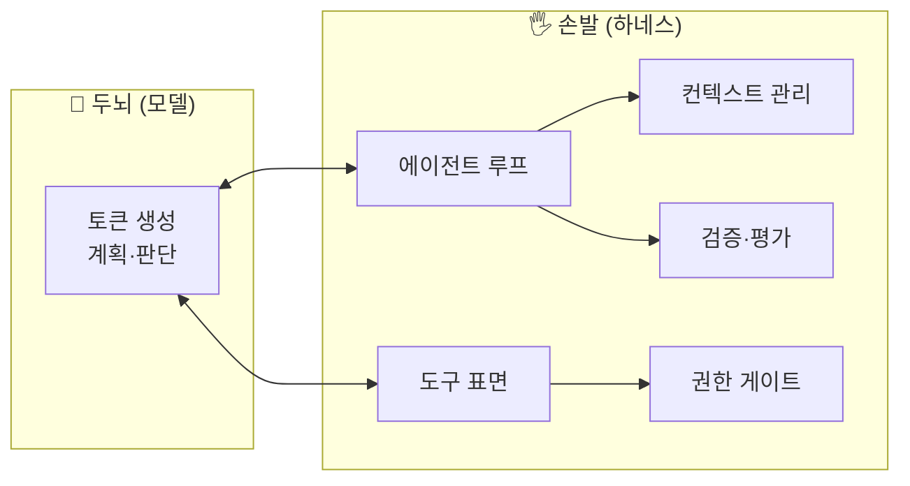
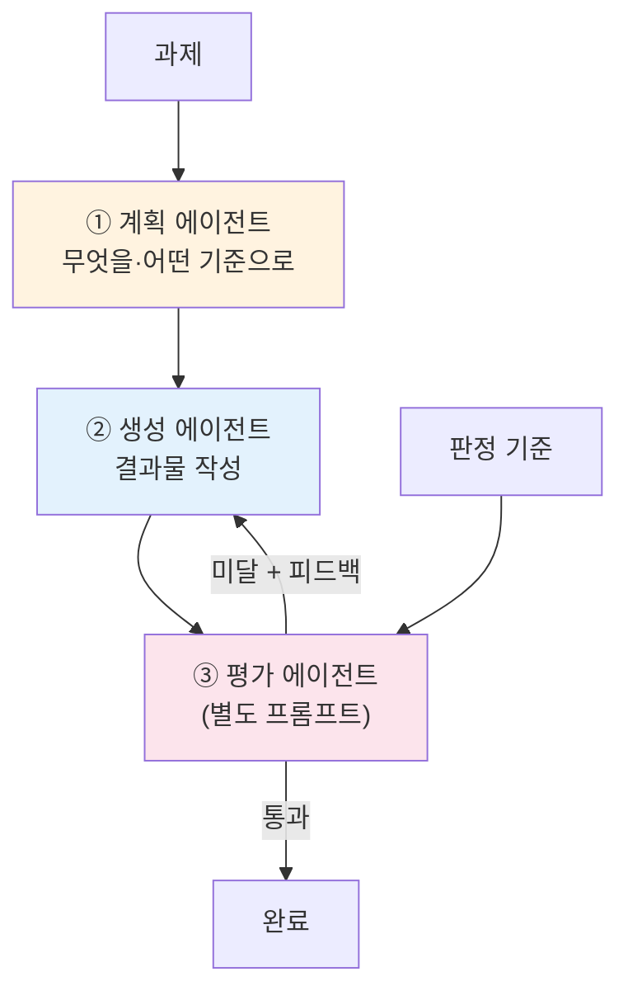
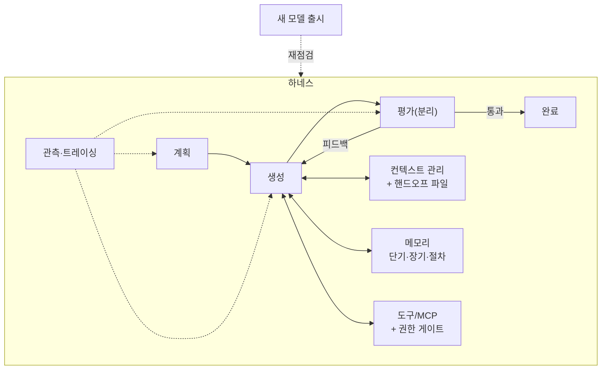

# 17. 하네스 엔지니어링 (캡스톤)

이 저장소의 마지막 챕터입니다. 지금까지 조각조각 배운 것 — 메모리, 컨텍스트 엔지니어링,
오케스트레이션, 평가, 권한 — 을 하나로 묶는 규율이 **하네스 엔지니어링(harness
engineering)**입니다. 모델은 "두뇌"이고, 그 두뇌가 세상과 상호작용하게 만드는 모든
배관 — 도구, 루프, 컨텍스트 관리, 검증 — 이 "손발", 즉 **하네스**입니다.

!!! quote "핵심 명제"
    좋은 에이전트는 좋은 모델만으로 만들어지지 않습니다. **같은 모델이라도 하네스가
    다르면 결과가 완전히 달라집니다.** 하네스 엔지니어링은 그 손발을 설계하는 규율입니다.

## 1. 두뇌와 손발의 분리

모델(두뇌)은 토큰을 생성할 뿐입니다. **무엇을 도구로 노출할지, 결과를 어떻게 되먹일지,
언제 멈출지, 컨텍스트를 어떻게 유지할지**는 전부 하네스가 정합니다. 이 분리를 의식하면
설계가 명확해집니다.



앞 챕터들은 사실상 하네스의 각 부품이었습니다.

| 하네스 부품 | 다룬 챕터 |
|-------------|-----------|
| 도구 표면·서브에이전트 | 05·10·11 |
| 에이전트 루프·오케스트레이션 | 02·09 |
| 컨텍스트 관리(선택·압축·격리) | 08 |
| 메모리(단기·장기·절차) | 06·07 |
| 검증·평가(생성≠평가) | 15 |
| 권한·HITL | 14 |
| 관측·디버깅 | 13 |

## 2. 3-에이전트 하네스: 계획 / 생성 / 평가 분리

Anthropic의 하네스 엔지니어링 지침 중 핵심은 **계획·생성·평가를 분리한 3-에이전트
구조**입니다. 한 에이전트에게 전부 시키면 역할이 뒤엉키고, 특히 **자기 출력을 스스로
채점하면 점수가 후하게 나옵니다**(15장의 self-scoring bias).



- **계획(plan)** — 결과물을 직접 쓰지 않고, 단계와 판정 기준만 세운다.
- **생성(build)** — 계획(과 피드백)을 보고 실제 결과물을 만든다.
- **평가(evaluate)** — **생성과 분리된 별도 프롬프트/역할**로 채점하고 피드백을 남긴다.

이 루프를 **평가가 통과할 때까지 반복**합니다. 실습
[`22_harness.py`](https://github.com/agent-chobi/agent-atoz/blob/main/examples/22_harness.py)가
바로 이 최소 루프입니다 — 계획→생성→평가를 돌리고, 임계 점수 미만이면 피드백을 반영해
다시 생성합니다.

!!! danger "자기채점은 후하다 — 다시 강조"
    평가 에이전트는 반드시 생성과 **다른 역할**을 부여받아야 합니다. "네가 방금 만든 걸
    채점해"는 편향을 부릅니다. 별도 채점자가 "냉정하게, 후하게 주지 말고" 평가하게
    하세요.

## 3. 컨텍스트 리셋 + 압축 핸드오프 파일

장기 실행 에이전트의 가장 큰 적은 **컨텍스트 오염**입니다. 수백 번의 도구 호출과
중간 결과가 쌓이면, 요약(compaction)만으로는 부족합니다 — 오래된 실수·잘못된 가정이
여전히 컨텍스트에 남아 새 추론을 오염시킵니다.

!!! tip "compaction만으로는 부족하다"
    Anthropic의 지침: 긴 작업에서는 **컨텍스트를 완전히 리셋하고**, 잘 정제된 **압축
    핸드오프 파일**만 읽혀 **새 세션을 시작**하라. 히스토리를 요약해 이어붙이는 것이
    아니라, 진행 상황·결정·다음 할 일을 담은 깨끗한 파일로 **새 출발**을 하는 것입니다.


핸드오프 파일이 담아야 할 것:

- **과제와 성공 기준** — 무엇을, 언제 완료로 볼지.
- **지금까지의 결정과 근거** — 재논의 방지.
- **검증된 사실** — 도구 결과로 확인된 것만(추측 배제).
- **다음 할 일** — 다음 세션이 곧바로 이어갈 지점.

핸드오프 파일은 교대 근무의 **인수인계 노트**와 같습니다 — 다음 근무자(새 세션)는 지난
8시간의 CCTV(전체 히스토리)를 돌려보는 게 아니라, 잘 정리된 한 장의 노트만 읽고 일을
이어갑니다. `22_harness.py`는 이 패턴의 축소판으로, 매 반복마다 진행 파일
`examples/_scratch_progress.md`(기본값 — `HARNESS_PROGRESS` 환경변수로 경로 변경 가능)를
갱신합니다. 실전 장기 에이전트에서는 이 파일을 **새 세션의 유일한 입력**으로 삼아
컨텍스트를 리셋합니다. 이는 08장 핸드오프 요약과 07장 장기 메모리를 하네스 차원으로
끌어올린 것입니다.

## 4. 하네스 재점검 원칙

하네스는 특정 모델에 맞춰 튜닝됩니다 — 도구 설명의 강도, 프롬프트의 장황함, 재시도
횟수 등. **새 모델이 나오면 하네스를 재점검**해야 합니다. 이전 모델의 약점을 보완하려고
넣은 스캐폴딩이 새 모델에서는 오히려 방해가 되기 때문입니다.

!!! warning "모델이 바뀌면 하네스도 바뀐다"
    - 강한 지시(`CRITICAL: 반드시 도구를 써라`)는 신형 모델에서 **과잉 발동**을 부를 수 있다.
    - "N번마다 진행 요약" 같은 강제 스캐폴딩은 신형 모델이 이미 알아서 하면 군더더기다.
    - 검증·재시도 로직도 모델 능력에 맞춰 조정 — 더 똑똑한 모델엔 더 적은 손잡이.

즉, 하네스는 **한 번 만들고 끝**이 아니라, 평가셋(15장) 위에서 모델·프롬프트 변경마다
회귀를 재측정하며 **계속 재조정**하는 살아있는 시스템입니다.

## 5. 전체를 하나로 — 캡스톤 정리



하네스 엔지니어링이 앞 모든 챕터를 묶는 방식:

- **오케스트레이션(09·10)** — 계획/생성/평가를 역할로 나눈 것이 바로 supervisor식 분업.
- **컨텍스트(08)·메모리(06·07)** — 리셋+핸드오프 파일로 장기 실행을 지탱.
- **평가(15)** — 생성과 분리된 채점자가 루프의 종료 조건.
- **권한·HITL(14)** — 되돌리기 힘든 행동은 게이트로 승인.
- **관측(13)** — 계획·생성·평가 각 단계를 트레이싱해 디버깅.

!!! note "제1원칙으로 돌아가기"
    00장에서 "가장 단순한 것부터 시작하라"고 했습니다. 하네스도 마찬가지입니다 —
    단일 에이전트 + 좋은 도구로 시작하고, **전문화·병렬성·비평이 값을 할 때만** 계획/생성/평가
    분리와 컨텍스트 리셋 같은 복잡성을 더하세요.

## 따라하기 — 예제 22: 미니 하네스

이 장의 실습은 [`examples/22_harness.py`](https://github.com/agent-chobi/agent-atoz/blob/main/examples/22_harness.py)입니다.
계획→생성→평가 3-에이전트 루프를 돌리고, 매 반복마다 핸드오프 파일을 갱신하는
캡스톤 최소 구현입니다.
(전체 예제 목록은 [매핑표](https://github.com/agent-chobi/agent-atoz/blob/main/examples/README.md) 참고)

**1) 사전 준비**

```bash
pip install anthropic python-dotenv
# .env 에 ANTHROPIC_API_KEY=sk-ant-... 설정
```

**2) 실행**

```bash
python examples/22_harness.py
```

**3) 기대 출력 요지**

- 먼저 **계획 에이전트**가 단계와 판정 기준을 출력합니다.
- 이어서 반복마다 **생성 결과물**과 **평가 점수(1~5)·근거**가 출력됩니다. 점수가
  통과 임계(기본 4점) 이상이면 종료, 미만이면 피드백을 반영해 다시 생성합니다(최대 3회).
- 실행 후 `examples/_scratch_progress.md`가 생성됩니다 — 과제·계획·반복 이력이 담긴
  **핸드오프 파일**입니다. 열어서 "새 세션이 이 파일만 읽고 이어갈 수 있겠는가"를 점검해 보세요.

**4) 흔한 에러**

| 증상 | 원인 / 해결 |
|------|-------------|
| `AuthenticationError` | `.env`의 `ANTHROPIC_API_KEY` 미설정·오타. |
| 비용이 부담됨 | 기본 모델이 Opus이고 반복마다 LLM을 3회(계획 제외) 호출합니다. `MODEL`을 `claude-haiku-4-5`로 바꿔 실습하세요. |
| 3회 반복해도 통과 못 함 | 버그가 아니라 정상 동작입니다 — 평가자가 엄격하면 생깁니다. `PASS_THRESHOLD`를 낮추거나 과제를 단순화해 보세요. |
| 진행 파일이 안 보임 | 기본 경로는 `examples/_scratch_progress.md`입니다. `HARNESS_PROGRESS` 환경변수를 설정했다면 그 경로를 확인하세요. |

## 실무 트레이드오프 — 하네스 정교화 vs 단순 루프

하네스는 정교할수록 좋은 게 아닙니다. 부품이 늘수록 유지보수 대상도 늘고,
§4에서 본 것처럼 **새 모델이 나올 때마다 재점검할 표면적**도 함께 늘어납니다.

| 축 | 단순 루프(단일 에이전트 + 도구) | 정교한 하네스(계획/생성/평가 + 리셋) |
|----|-------------------------------|--------------------------------------|
| 구축·유지보수 비용 | 낮음 — 코드가 적고 이해 쉬움 | 높음 — 역할별 프롬프트·루프·파일 관리 |
| 짧은 과제 성능 | 충분 — 오버헤드 없음 | 과잉 — 계획·평가 호출이 낭비 |
| 긴 과제 신뢰성 | 낮음 — 컨텍스트 오염·자기채점 | **높음 — 분리된 평가와 리셋이 버팀목** |
| 토큰 비용 | 낮음 | 높음(역할별 추가 호출) — 15장 레버로 상쇄 |
| 모델 교체 시 | 재점검 표면적 작음 | 스캐폴딩 전체 재점검 필요 |
| 디버깅 | 쉬움 — 한 흐름만 추적 | 트레이싱(13장) 없이는 어려움 |

!!! tip "판단 기준"
    00장의 제1원칙 그대로 — **전문화·비평·장기 실행이 값을 할 때만** 정교화하세요.
    "한 번의 호출로 끝나는 과제에 3-에이전트 하네스"는 경운기에 비행기 조종석을
    다는 일입니다.

## 설계 가이드 — 하네스의 네 가지 설계 결정

위 표가 "얼마나 정교하게"라면, 여기서는 정교화를 결정한 뒤 마주치는 구체적 설계
질문 네 가지 — 세션 경계, 핸드오프 스키마, 평가 게이트 위치, 진행 상태 저장소 — 를 다룹니다.

### 세션 경계 — 무엇을 기준으로 리셋하나

리셋 트리거는 하나가 아니라 **셋을 OR로** 겁니다. 어느 하나라도 걸리면 핸드오프
파일을 쓰고 새 세션을 시작합니다.

| 트리거 | 기준 예시 | 근거 |
|--------|-----------|------|
| **컨텍스트 사용량** | 윈도의 60~70% 도달 | 한계까지 채우면 핸드오프 파일 쓸 여유조차 없어짐 |
| **작업 단위 완료** | 계획의 마일스톤 1개 완료 | 자연스러운 인수인계 지점 — 미완성 상태 서술이 가장 어렵다 |
| **오염 신호** | 같은 실수 반복, 검증 실패 연속 N회 | §3의 오염 — 요약으로는 못 지우고 리셋만이 답 |

토큰 잔량만 보고 리셋하면 작업 한가운데서 끊깁니다. 가능하면 "마일스톤 완료 시점 중
컨텍스트가 가장 찬 곳"에서 리셋하도록 두 조건을 조합하세요.

### 핸드오프 파일 스키마 — 반드시 남길 것

§3의 목록을 검증 가능한 스키마로 고정합니다. 자유 서술로 두면 세션마다 품질이 널뜁니다.

```markdown
# HANDOFF (progress.md)
## 과제와 성공 기준     ← 불변. 매 세션 그대로 복사
## 완료 목록            ← 검증된 것만 ("테스트 통과" 등 증거 포함)
## 미완료 / 진행 중     ← 다음 세션이 이어받을 정확한 지점
## 결정사항과 근거      ← "왜 A안을 버렸나" — 재논의 방지의 핵심
## 알려진 함정          ← 이번 세션이 밟은 실수 (다음 세션의 지뢰 지도)
## 다음 단계            ← 첫 행동을 명령형으로 ("tests/test_x.py부터 실행")
```

품질 검증법은 하나입니다 — **"이 파일만 읽은 새 세션이 5분 안에 일을 이어갈 수 있는가."**
자신 없으면 평가 에이전트에게 핸드오프 파일 자체를 채점시키는 것도 유효한 게이트입니다.

### 평가 게이트 배치 지점

| 배치 지점 | 잡는 것 | 비용 |
|-----------|---------|------|
| 생성 직후 (매 반복) | 품질 미달 즉시 재생성 — §2의 기본 루프 | 반복마다 judge 호출 |
| 세션 경계 (리셋 직전) | 오염된 세션이 잘못된 핸드오프를 남기는 것 | 세션당 1회 — 저렴 |
| 최종 산출물 | 사용자에게 나가기 전 마지막 방어선 | 1회, 가장 엄격한 rubric |

세 지점을 다 쓰되 강도를 달리하는 것이 정석입니다 — 반복 게이트는 저렴한 모델로
느슨하게, 최종 게이트는 상위 모델로 엄격하게([15장](15-evaluation-cost.md) 모델 분리).

### 진행 상태 저장 위치 — 파일 vs DB

| 축 | 파일 (progress.md + git) | DB (체크포인터·상태 저장소) |
|----|--------------------------|------------------------------|
| 읽는 주체 | **모델이 직접 읽는 입력** — 사람도 그대로 읽음 | 코드가 복원하는 실행 상태 |
| 이력 | git 커밋이 곧 감사 추적 | 스키마 마이그레이션 필요 |
| 동시성 | 단일 에이전트 전제 | 멀티 세션·멀티 에이전트 안전 |
| 잘 맞는 곳 | 코딩 에이전트, 장기 단일 과제 | 서비스형 에이전트, 병렬 실행 |

둘은 배타가 아닙니다 — LangGraph 체크포인터(실행 재개용, [20장](20-langgraph-advanced.md))와
핸드오프 파일(컨텍스트 리셋용)은 **역할이 다른 별개 층**입니다. 체크포인터는 "멈춘
지점부터 기계적 재개"를, 핸드오프 파일은 "오염 없는 새 출발"을 담당합니다.

## 2026 실무 트렌드

- **이니셜라이저/코딩 에이전트 이중 구조** — Anthropic의 장기 실행 하네스 후속 지침은
  첫 컨텍스트 윈도우에서 환경을 세팅하는 **initializer agent**와, 매 세션 증분 진행 후
  다음 세션을 위한 아티팩트(`claude-progress.txt` + git 히스토리)를 남기는 **coding
  agent**를 분리합니다. 이 장의 핸드오프 파일 패턴이 제품 수준으로 정식화된 것입니다.
- **"두뇌-손발 분리"의 인프라화** — 하네스를 애플리케이션 코드가 아니라 관리형
  인프라(managed agents)로 끌어올려, 모델과 실행 환경을 독립적으로 스케일하는 아키텍처가
  제안되고 있습니다.
- **하네스 엔지니어링의 분과화** — 도구·평가·메모리·권한·관측을 아우르는 "하네스"가
  고유한 엔지니어링 분과로 이름을 얻어, 전용 자료 모음과 컨퍼런스 트랙이 생기고 있습니다.

## 실전 레퍼런스

- [Harness design for long-running application development — Anthropic Engineering](https://www.anthropic.com/engineering/harness-design-long-running-apps) — 장기 앱 개발용 하네스 설계 후속편.
- [Scaling Managed Agents: Decoupling the brain from the hands — Anthropic Engineering](https://www.anthropic.com/engineering/managed-agents) — 두뇌(모델)와 손발(실행 인프라) 분리를 인프라 차원으로 확장한 글.
- [How We Build Effective Agents — Barry Zhang, Anthropic (AI Engineer Summit, YouTube)](https://youtu.be/D7_ipDqhtwk) — "모든 것에 에이전트를 만들지 마라, 단순하게 유지하라"는 이 장의 결론과 같은 메시지의 컨퍼런스 발표.
- [awesome-harness-engineering — GitHub](https://github.com/ai-boost/awesome-harness-engineering) — 하네스 엔지니어링(도구·평가·메모리·MCP·권한·관측) 자료 큐레이션 목록.

### 함께 보면 좋은 한국어 자료

아직 한국어 자료가 드문 최신 주제이지만, 확인된 좋은 글들이 있습니다.

- [하네스 엔지니어링으로 본 Deep Insight: 로컬 개발에서 프로덕션 운영까지의 설계 여정 — AWS 기술 블로그(한국어)](https://aws.amazon.com/ko/blogs/tech/harness-engineering-from-deep-insight/) — 하네스 개념을 실제 멀티에이전트 서비스의 설계 여정으로 풀어 주는 국내 실전 사례
- [하네스 엔지니어링이란? 2026년 AI 에이전트 개발의 핵심으로 떠오른 이유 — 채널톡 블로그](https://channel.io/kr/blog/articles/what-is-harness-2611ddf1) — "왜 모델이 아니라 하네스인가"를 비개발자도 읽기 쉽게 정리한 입문 글
- [하네스 엔지니어링, 왜 AI 에이전트 시대에 필수일까? — 와탭(WhaTap) 블로그](https://whatap.io/ko/blog/harness-engineering-ai-agents) — 뜻·방법·예시를 관측성 회사의 시각으로 간결하게 설명

## 6. 마치며

에이전트 A to Z의 여정은 여기서 끝납니다. LLM API(01·02)에서 시작해 프레임워크(03–05),
메모리·컨텍스트(06–08), 오케스트레이션·프로토콜(09–12), 그리고 프로덕션 규율(13–17)까지
왔습니다. **하네스 엔지니어링은 이 전부를 신뢰할 수 있는 하나의 시스템으로 만드는
마지막 조립**입니다. 두뇌는 계속 좋아집니다 — 여러분의 일은 그에 걸맞은 손발을 짓고,
새 두뇌가 올 때마다 손발을 다시 맞추는 것입니다.

## 참고 자료

- [Effective harnesses for long-running agents — Anthropic](https://www.anthropic.com/engineering/effective-harnesses-for-long-running-agents)
- [Building Effective Agents — Anthropic](https://www.anthropic.com/research/building-effective-agents)
- [15. 평가 & 비용](15-evaluation-cost.md)
- [08. 컨텍스트 엔지니어링](08-context-engineering.md)
