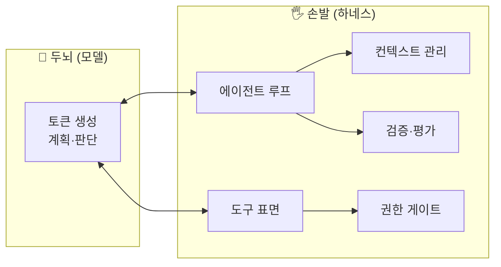
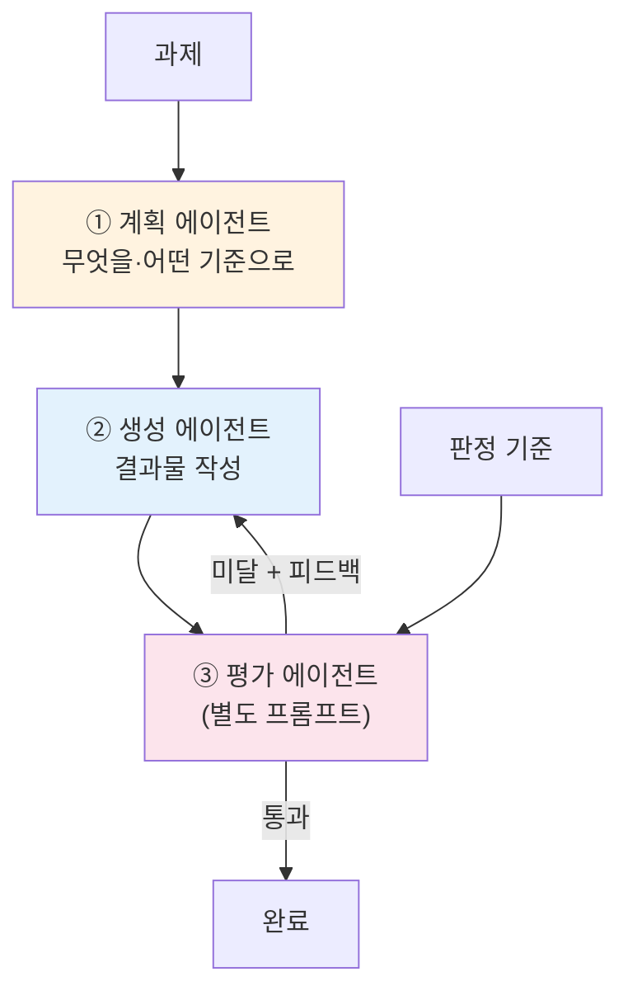
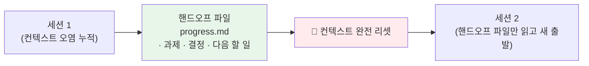
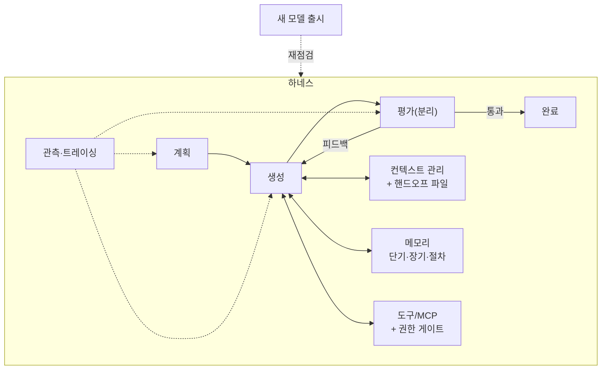

# 17. 하네스 엔지니어링 (캡스톤)

이 저장소의 마지막 챕터입니다. 지금까지 조각조각 배운 것 — 메모리, 컨텍스트 엔지니어링,
오케스트레이션, 평가, 권한 — 을 하나로 묶는 규율이 **하네스 엔지니어링(harness
engineering)**입니다. 모델은 "두뇌"이고, 그 두뇌가 세상과 상호작용하게 만드는 모든
배관 — 도구, 루프, 컨텍스트 관리, 검증 — 이 "손발", 즉 **하네스**입니다.

!!! quote "핵심 명제"
    좋은 에이전트는 좋은 모델만으로 만들어지지 않습니다. **같은 모델이라도 하네스가
    다르면 결과가 완전히 달라집니다.** 하네스 엔지니어링은 그 손발을 설계하는 규율입니다.

## 1. 두뇌와 손발의 분리

모델(두뇌)은 토큰을 생성할 뿐입니다. **무엇을 도구로 노출할지, 결과를 어떻게 되먹일지,
언제 멈출지, 컨텍스트를 어떻게 유지할지**는 전부 하네스가 정합니다. 이 분리를 의식하면
설계가 명확해집니다.

앞 챕터들은 사실상 하네스의 각 부품이었습니다.

| 하네스 부품 | 다룬 챕터 |
|-------------|-----------|
| 도구 표면·서브에이전트 | 05·10·11 |
| 에이전트 루프·오케스트레이션 | 02·09 |
| 컨텍스트 관리(선택·압축·격리) | 08 |
| 메모리(단기·장기·절차) | 06·07 |
| 검증·평가(생성≠평가) | 15 |
| 권한·HITL | 14 |
| 관측·디버깅 | 13 |

## 2. 3-에이전트 하네스: 계획 / 생성 / 평가 분리

Anthropic의 하네스 엔지니어링 지침 중 핵심은 **계획·생성·평가를 분리한 3-에이전트
구조**입니다. 한 에이전트에게 전부 시키면 역할이 뒤엉키고, 특히 **자기 출력을 스스로
채점하면 점수가 후하게 나옵니다**(15장의 self-scoring bias).

- **계획(plan)** — 결과물을 직접 쓰지 않고, 단계와 판정 기준만 세운다.
- **생성(build)** — 계획(과 피드백)을 보고 실제 결과물을 만든다.
- **평가(evaluate)** — **생성과 분리된 별도 프롬프트/역할**로 채점하고 피드백을 남긴다.

이 루프를 **평가가 통과할 때까지 반복**합니다. 실습 [`22_harness.py`](../examples/22_harness.py)가
바로 이 최소 루프입니다 — 계획→생성→평가를 돌리고, 임계 점수 미만이면 피드백을 반영해
다시 생성합니다.

!!! danger "자기채점은 후하다 — 다시 강조"
    평가 에이전트는 반드시 생성과 **다른 역할**을 부여받아야 합니다. "네가 방금 만든 걸
    채점해"는 편향을 부릅니다. 별도 채점자가 "냉정하게, 후하게 주지 말고" 평가하게
    하세요.

## 3. 컨텍스트 리셋 + 압축 핸드오프 파일

장기 실행 에이전트의 가장 큰 적은 **컨텍스트 오염**입니다. 수백 번의 도구 호출과
중간 결과가 쌓이면, 요약(compaction)만으로는 부족합니다 — 오래된 실수·잘못된 가정이
여전히 컨텍스트에 남아 새 추론을 오염시킵니다.

!!! tip "compaction만으로는 부족하다"
    Anthropic의 지침: 긴 작업에서는 **컨텍스트를 완전히 리셋하고**, 잘 정제된 **압축
    핸드오프 파일**만 읽혀 **새 세션을 시작**하라. 히스토리를 요약해 이어붙이는 것이
    아니라, 진행 상황·결정·다음 할 일을 담은 깨끗한 파일로 **새 출발**을 하는 것입니다.

핸드오프 파일이 담아야 할 것:

- **과제와 성공 기준** — 무엇을, 언제 완료로 볼지.
- **지금까지의 결정과 근거** — 재논의 방지.
- **검증된 사실** — 도구 결과로 확인된 것만(추측 배제).
- **다음 할 일** — 다음 세션이 곧바로 이어갈 지점.

`22_harness.py`는 이 패턴의 축소판으로, 매 반복마다 `progress.md`를 갱신합니다. 실전
장기 에이전트에서는 이 파일을 **새 세션의 유일한 입력**으로 삼아 컨텍스트를 리셋합니다.
이는 08장 핸드오프 요약과 07장 장기 메모리를 하네스 차원으로 끌어올린 것입니다.

## 4. 하네스 재점검 원칙

하네스는 특정 모델에 맞춰 튜닝됩니다 — 도구 설명의 강도, 프롬프트의 장황함, 재시도
횟수 등. **새 모델이 나오면 하네스를 재점검**해야 합니다. 이전 모델의 약점을 보완하려고
넣은 스캐폴딩이 새 모델에서는 오히려 방해가 되기 때문입니다.

!!! warning "모델이 바뀌면 하네스도 바뀐다"
    - 강한 지시(`CRITICAL: 반드시 도구를 써라`)는 신형 모델에서 **과잉 발동**을 부를 수 있다.
    - "N번마다 진행 요약" 같은 강제 스캐폴딩은 신형 모델이 이미 알아서 하면 군더더기다.
    - 검증·재시도 로직도 모델 능력에 맞춰 조정 — 더 똑똑한 모델엔 더 적은 손잡이.

즉, 하네스는 **한 번 만들고 끝**이 아니라, 평가셋(15장) 위에서 모델·프롬프트 변경마다
회귀를 재측정하며 **계속 재조정**하는 살아있는 시스템입니다.

## 5. 전체를 하나로 — 캡스톤 정리

하네스 엔지니어링이 앞 모든 챕터를 묶는 방식:

- **오케스트레이션(09·10)** — 계획/생성/평가를 역할로 나눈 것이 바로 supervisor식 분업.
- **컨텍스트(08)·메모리(06·07)** — 리셋+핸드오프 파일로 장기 실행을 지탱.
- **평가(15)** — 생성과 분리된 채점자가 루프의 종료 조건.
- **권한·HITL(14)** — 되돌리기 힘든 행동은 게이트로 승인.
- **관측(13)** — 계획·생성·평가 각 단계를 트레이싱해 디버깅.

!!! note "제1원칙으로 돌아가기"
    00장에서 "가장 단순한 것부터 시작하라"고 했습니다. 하네스도 마찬가지입니다 —
    단일 에이전트 + 좋은 도구로 시작하고, **전문화·병렬성·비평이 값을 할 때만** 계획/생성/평가
    분리와 컨텍스트 리셋 같은 복잡성을 더하세요.

## 6. 마치며

에이전트 A to Z의 여정은 여기서 끝납니다. LLM API(01·02)에서 시작해 프레임워크(03–05),
메모리·컨텍스트(06–08), 오케스트레이션·프로토콜(09–12), 그리고 프로덕션 규율(13–17)까지
왔습니다. **하네스 엔지니어링은 이 전부를 신뢰할 수 있는 하나의 시스템으로 만드는
마지막 조립**입니다. 두뇌는 계속 좋아집니다 — 여러분의 일은 그에 걸맞은 손발을 짓고,
새 두뇌가 올 때마다 손발을 다시 맞추는 것입니다.

## 참고 자료

- [Effective harnesses for long-running agents — Anthropic](https://www.anthropic.com/engineering/effective-harnesses-for-long-running-agents)
- [Building Effective Agents — Anthropic](https://www.anthropic.com/research/building-effective-agents)
- [15. 평가 & 비용](15-evaluation-cost.md)
- [08. 컨텍스트 엔지니어링](08-context-engineering.md)
