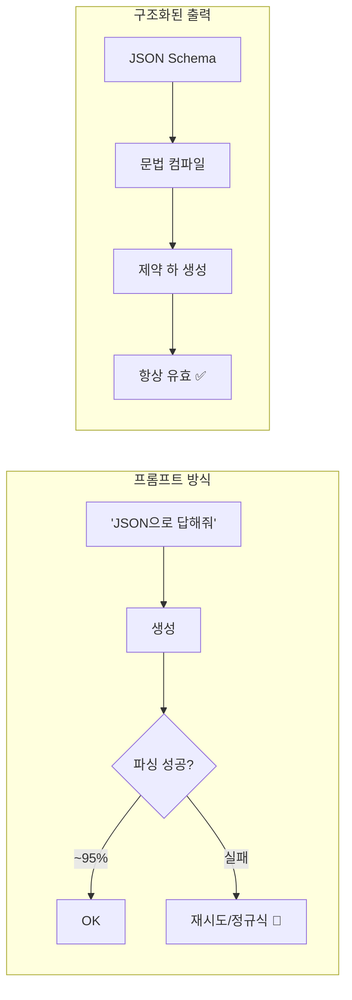
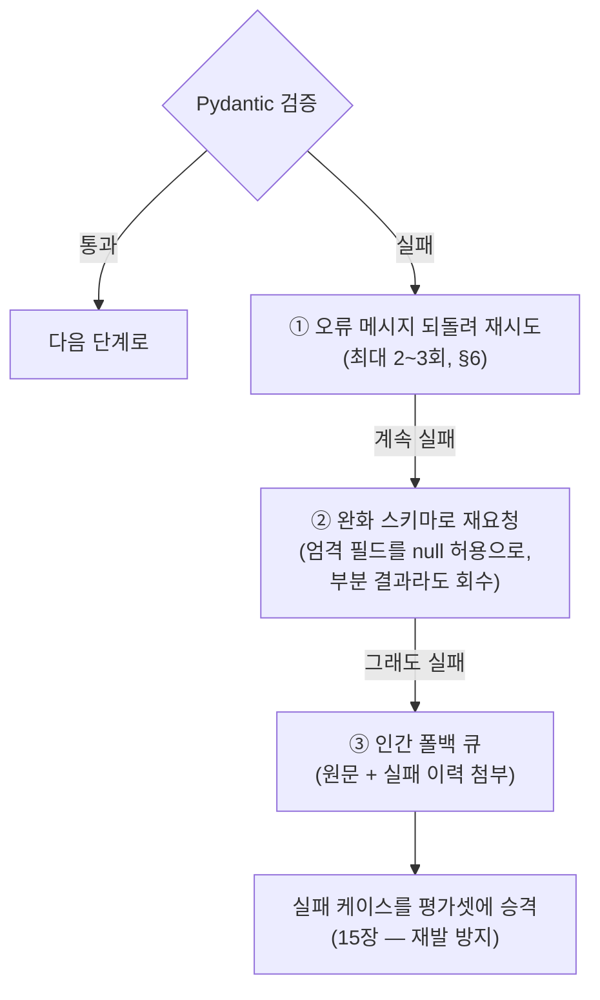

# 18. 구조화된 출력

[01장](01-llm-api-basics.md)의 "구조화된 출력 맛보기"에서 모델에게 JSON 을 *부탁*하는 법을
봤습니다. 이 챕터는 거기서 이어집니다 — 부탁이 아니라 **강제**하는 법입니다. 에이전트의
출력을 다음 단계(DB 저장, API 호출, [19장](19-workflow-patterns.md)의 라우팅 분기)가
기계적으로 소비하려면 "거의 항상 유효한 JSON"으로는 부족합니다. **JSON Schema 로 출력
형식을 100% 보장**하는 두 장치 — `output_config.format` 과 strict tool use — 그리고
Pydantic·LangChain 연동, 검증 실패 재시도까지 다룹니다.

## 1. 왜 프롬프트만으로는 부족한가

"반드시 JSON 으로만 답하라"는 프롬프트는 95~99% 성공합니다. 문제는 나머지입니다 —
마크다운 코드펜스로 감싸거나, 필드명이 미묘하게 다르거나, 설명 문장을 앞에 붙입니다.
하루 1만 건 파이프라인이면 매일 수십 건이 파싱 단계에서 터집니다.

**구조화된 출력(structured outputs)** 은 접근이 다릅니다. 스키마를 **문법(grammar)으로
컴파일**해 토큰 생성 단계에서 스키마를 어기는 토큰 자체를 뽑지 못하게 막습니다
(constrained decoding). 후처리·정규식·기도가 필요 없어집니다.



!!! note "두 가지 장치는 보완 관계"
    - **`output_config.format`** — 모델의 **응답 본문**을 스키마로 강제
    - **strict tool use** — 모델이 만드는 **도구 입력**([02장](02-tool-use-agent-loop.md))을 스키마로 강제

    "최종 답이 JSON 이어야 한다"면 전자, "도구 파라미터가 깨지면 안 된다"면 후자,
    에이전트라면 대개 둘 다 씁니다.

## 2. `output_config.format` — 응답을 JSON Schema 로 강제

`messages.create()` 에 `output_config.format` 을 넘기면 첫 텍스트 블록이 **항상 스키마에
맞는 유효한 JSON** 임이 보장됩니다.

```python
resp = client.messages.create(
    model="claude-opus-4-8", max_tokens=1024,
    messages=[{"role": "user", "content": "김개발(kim@example.com), 5년차 백엔드. 파싱하라."}],
    output_config={
        "format": {
            "type": "json_schema",
            "schema": {
                "type": "object",
                "properties": {
                    "name": {"type": "string"},
                    "email": {"type": "string", "format": "email"},
                    "years": {"type": "integer"},
                },
                "required": ["name", "email", "years"],
                "additionalProperties": False,   # 필수!
            },
        }
    },
)
data = json.loads(next(b.text for b in resp.content if b.type == "text"))
```

!!! warning "스키마 제약 사항"
    - 모든 객체에 `additionalProperties: False` 필수
    - 재귀 스키마, 수치 제약(`minimum`/`maximum`), 문자열 길이 제약은 **미지원**
      (Python/TS SDK 는 이런 제약을 스키마에서 떼어내 클라이언트에서 검증)
    - **같은 스키마의 첫 요청은 문법 컴파일 비용으로 느림** — 이후 24시간 캐시
    - citations 기능과 동시 사용 불가(400), 구식 `output_format` 최상위 파라미터는 폐기됨

## 3. Pydantic 모델 → 스키마: `messages.parse()`

스키마를 손으로 쓰는 대신 **Pydantic 모델을 그대로 전달**하는 것이 권장 경로입니다.
SDK 가 스키마 변환 + 응답 검증 + 인스턴스화를 모두 처리합니다.

```python
from pydantic import BaseModel

class Receipt(BaseModel):
    store: str
    date: str
    items: list[str]
    total: int

resp = client.messages.parse(               # create 가 아니라 parse
    model="claude-opus-4-8", max_tokens=1024,
    messages=[{"role": "user", "content": f"영수증 파싱: {receipt_text}"}],
    output_format=Receipt,                  # Pydantic 모델이 곧 스키마
)
receipt = resp.parsed_output                # 검증 완료된 Receipt 인스턴스
print(receipt.total)                        # IDE 자동완성 + 타입 체크
```

## 4. strict tool use — 도구 입력 보장

[02장](02-tool-use-agent-loop.md)의 도구 정의에 `strict: True` 한 줄을 추가하면
`tool_use.input` 이 `input_schema` 를 **정확히** 준수함이 보장됩니다. 없으면 모델이
가끔 필수 필드를 빼먹거나 enum 밖의 값을 넣는 일이 생깁니다.

```python
tools = [{
    "name": "book_meeting",
    "description": "회의를 예약한다.",
    "strict": True,                          # tool_choice 가 아니라 '도구 정의'에!
    "input_schema": {
        "type": "object",
        "properties": {
            "title": {"type": "string"},
            "date": {"type": "string", "format": "date"},
            "attendees": {"type": "integer", "enum": [2, 3, 4, 5, 6]},
        },
        "required": ["title", "date", "attendees"],   # 전 필드 나열
        "additionalProperties": False,
    },
}]
```

!!! danger "흔한 착각 두 가지"
    - `strict` 를 `tool_choice` 에 넣으면 **아무 효과가 없습니다.** 도구 정의의
      최상위 필드입니다.
    - strict 는 **입력의 형식**을 보장할 뿐, 값의 의미(존재하는 회의실인지 등)는
      보장하지 않습니다. 의미 검증은 도구 구현부의 몫입니다.

## 5. LangChain `.with_structured_output()`

[03장](03-langchain-basics.md)의 LangChain 스택에서는 모델에 `.with_structured_output()`
을 걸면 됩니다. `method="json_schema"` 를 지정하면 위의 네이티브 구조화 출력을 쓰고,
기본값(`function_calling`)은 강제 도구 호출로 우회합니다 (`langchain-anthropic>=1.1.0`).

```python
from langchain_anthropic import ChatAnthropic

model = ChatAnthropic(model="claude-opus-4-8")
structured = model.with_structured_output(Receipt, method="json_schema")
receipt = structured.invoke("영수증 파싱: ...")   # Receipt 인스턴스 반환
```

[04장](04-langgraph-state-graph.md)의 LangGraph 노드 안에서 그대로 쓸 수 있어,
"상태에 넣기 전 형식 보장"이라는 실무 요구를 한 줄로 해결합니다.

## 6. 검증 실패와 재시도

스키마 강제가 있어도 **비즈니스 규칙**(합계 = 품목 합, 날짜가 미래 등)은 여전히 깨질 수
있습니다. 정석은 Pydantic `model_validator` 로 잡고, **오류 메시지를 대화에 되돌려**
재시도하는 것입니다 — [02장](02-tool-use-agent-loop.md)의 `is_error` 패턴과 같은 철학입니다.

```python
for attempt in range(3):
    text = call_llm(messages)                     # output_config.format 적용된 호출
    try:
        return Receipt.model_validate(json.loads(text))
    except ValidationError as e:
        messages += [
            {"role": "assistant", "content": text},
            {"role": "user", "content": f"검증 오류. 수정해서 다시 출력하라:\n{e}"},
        ]
raise RuntimeError("재시도 한도 초과")
```

## 따라하기

**사전 준비** — 의존성 설치와 API 키 설정:

```bash
pip install -r requirements.txt          # anthropic, pydantic, python-dotenv 포함
# .env 에 ANTHROPIC_API_KEY=sk-ant-... 설정
```

**실행 명령**:

```bash
python examples/23_structured_output.py
```

**기대 출력 예시**:

```text
=== 1) Pydantic 영수증 파싱 (messages.parse) ===
가게: 한빛분식 / 날짜: 2026-07-01
- 김치찌개 x2 @ 9000원
- 공기밥 x2 @ 1000원
합계: 20000원 (검증 통과: True)

=== 2) strict tool use — 회의 예약 ===
도구 호출: book_meeting
입력(스키마 보장): {'title': '주간 회고', 'date': '2026-07-10', 'attendees': 4}

=== 3) 검증 실패 재시도 ===
[시도 1] 검증 통과 → {'name': '김개발', 'email': 'kim@example.com', ...}
```

**흔한 에러와 해결**:

| 에러 | 원인 | 해결 |
|------|------|------|
| `AuthenticationError` | API 키 누락/오타 | `.env` 의 `ANTHROPIC_API_KEY` 확인 |
| 400: `additionalProperties` | 스키마에 `False` 지정 누락 | 모든 객체에 `additionalProperties: False` + `required` 전체 나열 |
| 첫 요청만 유난히 느림 | 문법 컴파일 비용 | 정상 — 24시간 캐시되므로 두 번째부터 빠름 |
| `ValidationError` 반복 | 스키마 밖 비즈니스 규칙 위반 | 6절의 재시도 루프 + 오류 피드백 적용 |

## 실무 트레이드오프

| 방식 | 형식 보장 | 지연/비용 | 유연성 | 언제 |
|------|-----------|-----------|--------|------|
| 프롬프트 "JSON으로 답해" | ~95% | 최저 | 최고 | 프로토타입, 사람이 읽는 출력 |
| `output_config.format` | **100%** | 첫 요청 컴파일 지연, 이후 캐시 | 스키마 제약 있음 | 파이프라인·DB 저장 등 기계 소비 |
| strict tool use | 도구 입력 **100%** | 미미 | 도구 스키마 제약 | 에이전트 도구 호출 전반 |
| `.with_structured_output()` | method 에 따름 | 프레임워크 오버헤드 소폭 | 체인 합성 용이 | LangChain/LangGraph 스택 |

!!! tip "실전 기본값"
    에이전트 코드라면 **도구에는 전부 `strict: True`, 최종 산출물에는
    `messages.parse()` + Pydantic** 이 2026년 기본값입니다. 프롬프트-JSON 은
    스키마가 자주 바뀌는 탐색 단계에서만 쓰고, 프로덕션 전환 시 걷어내세요.

## 설계 가이드 — 스키마를 어떻게 설계할 것인가

위 표가 "어느 장치를 쓸지"라면, 여기서는 **스키마 자체를 어떻게 설계해야 정확도가
유지되는지**를 다룹니다. 형식 보장(100% 유효 JSON)과 **내용 정확도는 별개**입니다 —
스키마가 나쁘면 "유효하지만 틀린" JSON 이 나옵니다.

### 필드 수·중첩 깊이와 정확도

- **필드는 실제로 소비하는 것만.** "나중에 쓸지도 몰라서" 넣은 필드는 모델의 주의를
  분산시키고, 억지로 채워야 하니 지어내기(hallucination)를 유발합니다. 다음 단계
  코드가 읽지 않는 필드는 전부 삭제 후보입니다.
- **중첩은 얕게.** 깊은 중첩(4단계 이상)일수록 모델이 구조를 놓칠 확률이 올라가고,
  디버깅도 어려워집니다. 중첩이 깊어지면 "한 호출로 다 뽑기"가 아니라 **호출을
  쪼개기**([19장](19-workflow-patterns.md) chaining)를 먼저 검토하세요.
- **거대 스키마는 분할.** 추출 항목이 수십 개면 주제별로 스키마를 나눠 병렬 호출 후
  코드로 합치는 쪽이 정확도·디버깅 양면에서 이깁니다.

### optional vs required 전략

핵심 함정: **모든 필드를 `required` 로 강제하면, 원문에 정보가 없을 때 모델은 어쨌든
값을 채워야 하므로 지어냅니다.** 형식 보장이 오히려 환각을 강제하는 역설입니다.

| 상황 | 설계 |
|------|------|
| 원문에 반드시 존재하는 값 | `required` — 누락 자체가 버그 신호 |
| 없을 수도 있는 값 | `required` 에 넣되 **타입을 `["string", "null"]`** 로 — "모르면 null" 탈출구 제공 |
| 판단 근거가 필요한 값 | 값 필드 **앞에** `evidence`/`reasoning` 필드 배치 — 필드 순서대로 생성되므로 근거를 먼저 쓰게 하면 정확도가 오름 |

"모르면 null"을 허용했다면, null 비율을 모니터링하세요 — 갑자기 치솟으면 입력 품질이나
프롬프트가 회귀했다는 신호입니다.

### enum 활용 — 분류는 자유 문자열로 받지 마라

분류·라우팅 라벨을 `{"type": "string"}` 으로 받으면 `"billing"`, `"Billing"`,
`"결제 문의"` 가 뒤섞입니다. `"enum": ["billing", "technical", "general"]` 로 못
박으면 라우팅 코드의 분기가 절대 깨지지 않습니다([19장](19-workflow-patterns.md)의
Routing 이 이 위에 서 있습니다). 점수도 마찬가지 — `1~5 정수 enum` 이 "4.5점" 사고를
원천 차단합니다(예제 21). 단, enum 항목이 수십 개를 넘으면 분류 정확도가 떨어지므로
계층 분류(대분류 → 소분류 2회 호출)로 나누세요.

### 실패 처리 계층 — 재시도 → 완화 스키마 → 인간 폴백

스키마 강제로 형식 실패는 사라지지만, 비즈니스 검증(§6) 실패는 남습니다. 복구를
한 층이 아니라 **계단**으로 설계하세요.



②의 완화 스키마는 "전부 아니면 전무"를 피하는 장치입니다 — 필수 10개 중 8개만
확실해도 8개는 건지고 나머지만 사람에게 넘기는 쪽이, 전체를 폐기하는 것보다 쌉니다.
③까지 온 케이스는 그대로 버리지 말고 평가셋([15장](15-evaluation-cost.md))에 넣어
같은 실패의 재발을 회귀 테스트로 막으세요.

## 2026 실무 트렌드

- **전 벤더 표준화 완료** — OpenAI(2024.8)·Google(2024.5)에 이어 Anthropic 이 2025년 11월
  constrained decoding 기반 구조화 출력을 출시하면서, 2026년 현재 주요 프로바이더 전부가
  "스키마 = 생성 시점 강제"를 지원합니다. "JSON 파싱 재시도 코드"는 레거시가 됐습니다.
- **오픈소스 추론 엔진의 기본 기능화** — XGrammar·llguidance 같은 저오버헤드 문법 엔진이
  vLLM·SGLang·TensorRT-LLM 의 기본 구조화 생성 백엔드로 채택되어, 셀프호스팅 모델에서도
  같은 보장을 얻습니다([16장](16-self-hosted-runtimes.md)의 런타임과 조합 가능).
- **평가 파이프라인과의 결합** — LLM-as-judge 점수([15장](15-evaluation-cost.md))를
  구조화 출력으로 받는 것이 표준 관행으로 자리잡았습니다. 점수 파싱 실패로 평가가 누락되는
  문제가 사라졌기 때문입니다.

## 실전 레퍼런스

- [Structured outputs on the Claude Developer Platform (Anthropic 공식 블로그)](https://claude.com/blog/structured-outputs-on-the-claude-developer-platform) — 출시 발표와 설계 배경 한눈에.
- [Hands-On with Anthropic's New Structured Output Capabilities (Towards Data Science)](https://towardsdatascience.com/hands-on-with-anthropics-new-structured-output-capabilities/) — output_config vs strict tool use 실습 비교.
- [How Structured Outputs and Constrained Decoding Work (Let's Data Science)](https://letsdatascience.com/blog/structured-outputs-making-llms-return-reliable-json) — 문법 컴파일과 토큰 마스킹 원리 해설.
- [ChatAnthropic integration (LangChain 공식 문서)](https://docs.langchain.com/oss/python/integrations/chat/anthropic) — `with_structured_output(method="json_schema")` 공식 가이드.

## 참고 자료

- [Structured outputs 공식 문서](https://platform.claude.com/docs/en/build-with-claude/structured-outputs)
- [with_structured_output 레퍼런스 (langchain-anthropic)](https://reference.langchain.com/python/langchain-anthropic/chat_models/ChatAnthropic/with_structured_output)
- [Tool Use 개요 — strict 필드](https://platform.claude.com/docs/en/agents-and-tools/tool-use/overview)
- 실습 코드: [`examples/23_structured_output.py`](https://github.com/agent-chobi/agent-atoz/blob/main/examples/23_structured_output.py)
