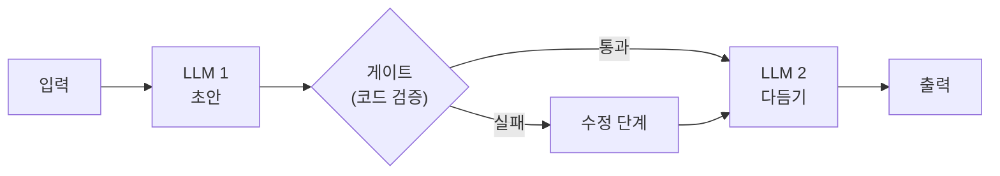
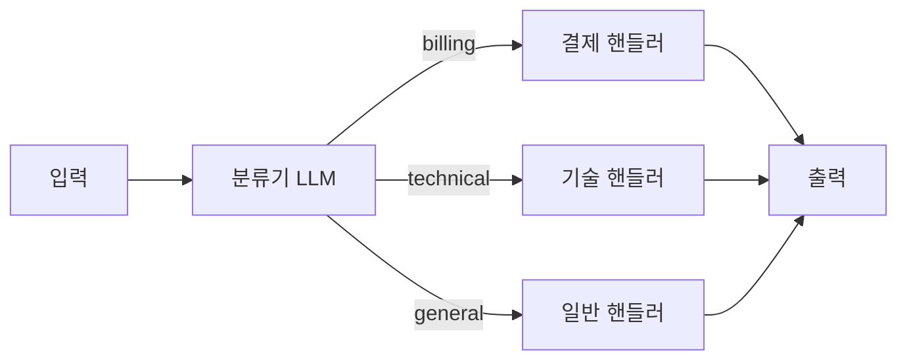
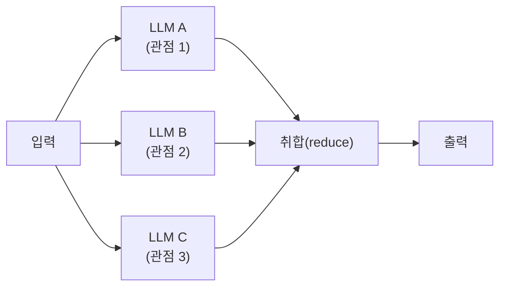
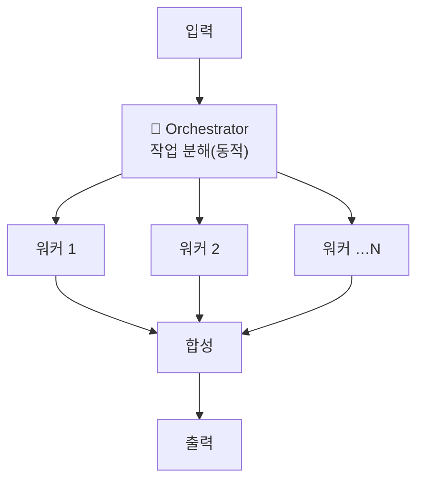
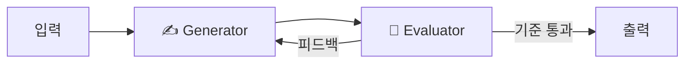

# 19. 워크플로우 패턴

[02장](02-tool-use-agent-loop.md)에서 만든 에이전트 루프는 **모델이 흐름을 결정**했습니다
— 도구를 부를지, 몇 번 돌지 모두 모델 판단이었죠. 하지만 실무 작업의 상당수는 경로가
미리 정해져 있습니다: "요약하고 → 검증하고 → 번역한다". 이럴 때는 모델에게 흐름까지
맡길 이유가 없습니다. 이 챕터는 Anthropic 의 *Building Effective Agents* 가 정리한
**5가지 워크플로우 패턴**과, 가장 중요한 판단인 **Workflow vs Agent 선택 기준**,
그리고 [09장 멀티에이전트 패턴](09-multi-agent-patterns.md)과의 관계를 다룹니다.

## 1. Workflow vs Agent — 용어부터

Anthropic 은 "agentic system"을 두 부류로 나눕니다:

| | **Workflow** | **Agent** |
|--|--------------|-----------|
| 흐름 결정 | **코드**가 미리 정의한 경로 | **모델**이 매 스텝 동적으로 결정 |
| 예측 가능성 | 높음 (같은 입력 → 같은 경로) | 낮음 (경로가 실행마다 다름) |
| 토큰/지연 | 호출 수가 상수로 고정 | 루프 길이만큼 가변 |
| 디버깅 | 단계별 격리 용이 | 트레이싱 필수([13장](13-debugging-observability.md)) |
| 언제 | 하위 작업을 **미리 열거 가능**할 때 | 필요한 스텝 수를 **예측 불가**할 때 |

!!! tip "제1원칙: 워크플로우로 충분하면 에이전트를 만들지 마라"
    [00장](00-landscape.md)의 "가장 단순한 것부터"의 연장입니다. 단일 호출 → 워크플로우
    → 에이전트 순으로 올라가되, **각 단계는 아래 단계로 풀리지 않을 때만** 선택합니다.
    2026년 프로덕션의 지배적 구조도 "결정적 백본(워크플로우) + 필요한 지점에만 에이전트
    삽입"입니다.

## 2. Prompt Chaining — 직렬 분해 + 게이트

작업을 고정된 단계로 쪼개고, 각 호출의 출력을 다음 호출의 입력으로 넘깁니다. 핵심은
단계 사이의 **게이트(gate)** — LLM 이 아니라 *코드*가 중간 결과를 검증하는 지점입니다.



정확도를 위해 지연을 지불하는 패턴입니다 — 한 번에 다 시키는 것보다 각 호출이 쉬워져
품질이 오릅니다. 마케팅 카피 생성 → 길이/톤 검증 → 번역 같은 흐름이 전형입니다.

## 3. Routing — 분류 후 전문 핸들러로

입력을 먼저 **분류**하고, 카테고리별 전문 프롬프트/모델/도구로 보냅니다. 관심사가
분리되어 각 핸들러를 독립적으로 최적화할 수 있습니다.



!!! tip "분류는 구조화 출력으로"
    분류 결과를 자유 텍스트로 받으면 라우팅 코드가 깨집니다. [18장](18-structured-output.md)의
    `enum` 스키마로 라벨 자체를 강제하세요. 분류기는 저렴한 모델(haiku)로 내리는 것이
    비용 정석입니다.

## 4. Parallelization — 동시 실행 후 취합

독립적인 하위 작업을 **동시에** 던지고 결과를 합칩니다. 두 변형이 있습니다:

- **Sectioning** — 작업을 서로 다른 관점/구역으로 쪼개 병렬 처리 (보안·비용·성능 리뷰)
- **Voting** — 같은 작업을 여러 번 돌려 다수결/합의로 신뢰도를 올림 (판정, 취약점 탐지)



지연은 "가장 느린 호출 1개" 수준으로 줄지만 비용은 호출 수만큼 늘어납니다.
Python 에서는 `AsyncAnthropic` + `asyncio.gather` 가 전부입니다 — 프레임워크 불필요.

## 5. Orchestrator-Worker — 동적 분해

오케스트레이터 LLM 이 작업을 **런타임에** 하위 작업으로 쪼개고, 워커들에게 위임한 뒤
결과를 합성합니다. Parallelization 과의 차이: 하위 작업의 **개수·내용을 미리 알 수 없어
모델이 정합니다**. 워크플로우에서 에이전트로 넘어가는 경계선상의 패턴입니다.



[09장 5절](09-multi-agent-patterns.md)에서 본 orchestrator-worker 와 같은 개념입니다 —
09장은 이를 LangGraph `Send` API 로 멀티에이전트화하는 구현을 다룹니다.

## 6. Evaluator-Optimizer — 생성·평가 루프

한 LLM 이 생성하고 다른 LLM 이 **명시적 기준으로 평가·피드백**해 반복 개선합니다.
평가 기준이 명확하고, 반복이 실제로 품질을 올리는 작업(번역 뉘앙스, 코드 리뷰 반영)에
적합합니다.



!!! warning "반복 상한은 필수"
    [09장 6절](09-multi-agent-patterns.md)의 critique 패턴과 동일한 주의사항 — 상한 없는
    생성↔평가 루프는 무한 왕복과 비용 폭증으로 이어집니다. 최대 N회 + 탈출 조건을 코드로
    못 박으세요. 평가 기준이 모호하면 이 패턴 자체가 값을 못 합니다.

## 7. 09장(멀티에이전트)과의 관계

다섯 패턴은 **한 프로세스 안의 LLM 호출 배치**이고, 09장의 패턴은 이를 **독립 에이전트
(각자 도구·프롬프트·컨텍스트 소유)로 승격**한 것입니다. 대응 관계:

| 워크플로우 패턴 (19장) | 멀티에이전트 대응 (09장) | 승격 기준 |
|------------------------|--------------------------|-----------|
| Prompt Chaining | Sequential pipeline | 단계별로 도구/권한 분리가 필요할 때 |
| Routing | Supervisor | 핸들러가 다단계 대화를 소유해야 할 때 |
| Parallelization | Orchestrator-Worker (Send) | 워커가 도구를 쥐고 자율 판단해야 할 때 |
| Orchestrator-Worker | Orchestrator-Worker / Hierarchical | 그대로 확장 |
| Evaluator-Optimizer | Critique (생성·평가 분리) | 평가자에게 별도 컨텍스트가 필요할 때 |

같은 형태라도 멀티에이전트로 승격하면 토큰 오버헤드(+58~285%, [09장 1절](09-multi-agent-patterns.md))가
붙습니다. **워크플로우 버전으로 시작해, 전문화·병렬성·비평의 이득이 증명될 때만 승격**하세요.

## 따라하기

**사전 준비**:

```bash
pip install -r requirements.txt          # anthropic, python-dotenv 포함
# .env 에 ANTHROPIC_API_KEY=sk-ant-... 설정
```

**실행 명령**:

```bash
python examples/24_workflow_patterns.py
```

**기대 출력 예시**:

```text
=== 1) Prompt Chaining ===
[1단계] 한 줄 카피 초안: 회의록은 AI가, 결정은 당신이.
[게이트] 30자 이내 검증 통과
[2단계] 최종 카피: 회의록은 AI가 쓰고, 결정은 당신이 합니다.

=== 2) Routing ===
[분류] '환불 언제 되나요?' → billing
[billing 전문 응답] 환불은 결제 취소 후 영업일 기준 3~5일 내 처리됩니다. ...

=== 3) Parallelization ===
[병렬] 3개 관점 동시 분석
- 보안: 사내 문서 접근 권한 모델을 먼저 정의해야 ...
- 비용: 임베딩 배치 처리로 초기 인덱싱 비용을 ...
- 성능: 검색 지연이 사용자 경험을 좌우하므로 ...
[취합] 종합 권고: 권한 모델을 선결한 뒤 ...
```

**흔한 에러와 해결**:

| 에러 | 원인 | 해결 |
|------|------|------|
| `AuthenticationError` | API 키 누락/오타 | `.env` 의 `ANTHROPIC_API_KEY` 확인 |
| `RuntimeError: asyncio.run() cannot be called...` | Jupyter 등 이미 이벤트 루프가 도는 환경 | `await demo_parallel(...)` 로 직접 호출 |
| `RateLimitError` (429) | 병렬 호출이 조직 한도 초과 | gather 대상 수 축소 또는 지수 백오프 재시도 |
| 라우팅 분기 오동작 | 분류 결과가 자유 텍스트 | 예제처럼 `enum` 스키마로 강제([18장](18-structured-output.md)) |

## 실무 트레이드오프

| 패턴 | 지연 | 비용(호출 수) | 예측 가능성 | 주 리스크 |
|------|------|---------------|-------------|-----------|
| Prompt Chaining | 단계 수에 비례 ↑ | 단계 수 ×1 | 매우 높음 | 단계 과다 분해로 지연 낭비 |
| Routing | +분류 1회 | +1 | 높음 | 오분류가 전체 품질 좌우 |
| Parallelization | 최장 호출 1개 수준 ↓ | 병렬 폭 × | 높음 | 비용 배수, 취합 품질 |
| Orchestrator-Worker | 분해+합성 오버헤드 | 가변 | 중간 | 분해 품질에 전체가 종속 |
| Evaluator-Optimizer | 반복 횟수 × | 반복 × 2 | 중간 | 무한 루프, 모호한 평가 기준 |

## 2026 실무 트렌드

- **"결정적 백본 + 지점 에이전트"가 승자 구조** — 2026년 프로덕션 컨센서스는 워크플로우가
  전체 흐름을 쥐고, 모호성 해소가 필요한 스텝에만 에이전트를 호출한 뒤 제어권을 백본으로
  회수하는 하이브리드입니다. 순수 자율 에이전트는 토큰·지연·비결정성 비용 때문에 소수파.
- **실패 원인은 인프라가 아니라 명세** — 멀티에이전트 실패의 약 79%가 명세·조정 문제라는
  연구가 인용되면서, "패턴을 늘리기 전에 각 스텝의 계약(입출력 스키마)을 고정하라"는
  실천이 확산 — [18장](18-structured-output.md)의 구조화 출력이 그 계약 도구입니다.
- **결정적 계산은 코드로 회수** — 산술·상태 조회·규칙 분기처럼 정답이 결정적인 스텝을
  LLM 에서 일반 코드로 되돌리는 리팩터링이 비용 최적화의 첫 항목으로 자리잡았습니다.

## 실전 레퍼런스

- [Building Effective Agents (Anthropic 공식)](https://www.anthropic.com/research/building-effective-agents) — 이 챕터의 원전. 5패턴 + workflow/agent 구분의 출처.
- [How We Build Effective Agents — Barry Zhang, Anthropic (AI Engineer Summit, YouTube)](https://www.youtube.com/watch?v=D7_ipDqhtwk) — 원저자가 직접 설명하는 컨퍼런스 발표.
- [AI Agents and Deterministic Workflows: A Spectrum (deepset 기술블로그)](https://www.deepset.ai/blog/ai-agents-and-deterministic-workflows-a-spectrum) — 워크플로우↔에이전트를 이분법이 아닌 스펙트럼으로 보는 실무 관점.
- [The 2026 Guide to AI Agent Workflows (Vellum)](https://www.vellum.ai/blog/agentic-workflows-emerging-architectures-and-design-patterns) — 패턴별 프로덕션 아키텍처 사례 모음.

## 참고 자료

- [Building Effective Agents — Anthropic](https://www.anthropic.com/research/building-effective-agents)
- [09장 멀티에이전트 패턴](09-multi-agent-patterns.md) — 패턴의 멀티에이전트 승격판
- [18장 구조화된 출력](18-structured-output.md) — 스텝 간 계약 고정
- 실습 코드: [`examples/24_workflow_patterns.py`](https://github.com/agent-chobi/agent-atoz/blob/main/examples/24_workflow_patterns.py)
