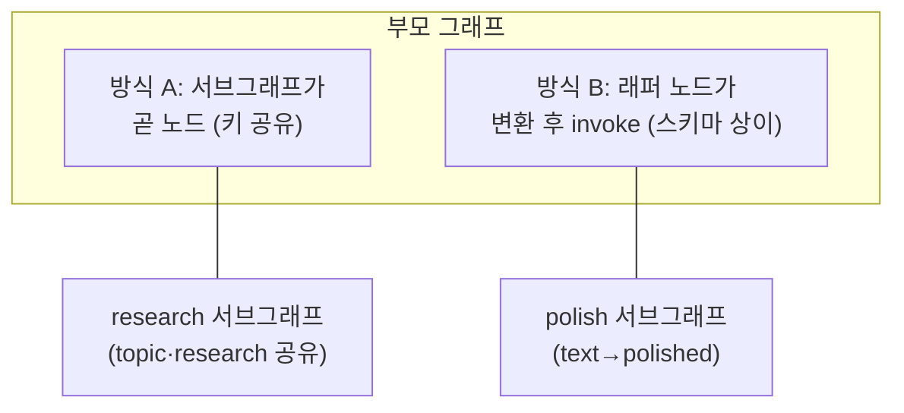

# 20. LangGraph 심화

[04장](04-langgraph-state-graph.md)에서 상태·노드·엣지와 HITL 을 익혔습니다. 프로덕션으로
가면 네 가지가 더 필요해집니다 — 그래프가 커질 때 **서브그래프**로 모듈화하고, UI 를 위해
**스트리밍**을 세밀하게 제어하고, 그래프 조립이 과할 때 **Functional API** 로 쓰고,
프로세스가 죽어도 이어지는 **Durable Execution** 을 보장하는 것. 이 넷은
[09장](09-multi-agent-patterns.md)의 멀티에이전트 패턴을 실제 서비스로 옮길 때의
기반 기술이기도 합니다.

## 1. 서브그래프 — 그래프 안의 그래프

컴파일된 그래프는 그 자체로 `Runnable` 이므로 **다른 그래프의 노드**가 될 수 있습니다.
[09장](09-multi-agent-patterns.md)의 hierarchical 패턴("supervisor 그래프를 상위 supervisor 의
노드로")이 바로 이 메커니즘입니다. 부모와 서브그래프의 **상태 스키마 관계**에 따라
연결 방식이 둘로 갈립니다.

### 방식 A — 상태 공유: 그대로 노드로 추가

부모와 서브그래프가 **키를 일부 공유**하면, 컴파일된 서브그래프를 `add_node` 에 바로
넘깁니다. 공유 키의 갱신만 부모에 반영되고, 서브그래프 내부 전용 키는 밖에서 보이지
않습니다 — 컨텍스트 격리([08장](08-context-engineering.md))가 공짜로 따라옵니다.

```python
class ParentState(TypedDict):
    topic: str; research: str; report: str

class ResearchState(TypedDict):
    topic: str      # 부모와 공유
    research: str   # 부모와 공유 — 이 갱신만 부모로 올라간다
    notes: str      # 내부 전용 — 부모에게 보이지 않음

research_graph = research_builder.compile()
builder.add_node("research_team", research_graph)   # 그대로 노드로!
```

### 방식 B — 상태 변환: 노드 함수에서 invoke

스키마가 **완전히 다르면** 노드 함수 안에서 변환 → `invoke` → 역변환합니다.
외부 팀이 만든 그래프나 범용 유틸 그래프를 붙일 때의 방식입니다.

```python
def call_polish(state: ParentState) -> dict:
    result = polish_graph.invoke({"text": state["report"]})   # 부모 → 서브 변환
    return {"report": result["polished"]}                     # 서브 → 부모 역변환

builder.add_node("polish", call_polish)
```



!!! warning "체크포인터는 부모에만"
    서브그래프의 영속성·interrupt 는 **부모를 컴파일할 때 넘긴 체크포인터**가 전파되어
    처리됩니다. 서브그래프에 별도 체크포인터를 또 넘기지 마세요([06장](06-short-term-memory.md)).

## 2. 스트리밍 — stream_mode 4종

`graph.stream()` / `astream()` 의 `stream_mode` 로 **무엇을** 받을지 고릅니다.

| 모드 | 각 청크의 내용 | 용도 |
|------|----------------|------|
| `values` | 각 스텝 후 **전체 상태** 스냅샷 | 상태 전체를 미러링하는 대시보드 |
| `updates` | 각 노드가 반환한 **갱신분만** `{노드: 갱신}` | 진행 로그, 어느 노드가 뭘 바꿨나 |
| `messages` | LLM **토큰 단위** `(청크, 메타데이터)` | 챗 UI 실시간 타이핑 효과 |
| `custom` | 노드 안에서 `get_stream_writer()` 로 보낸 임의 데이터 | 진행률, 도구 실행 상황 |

```python
from langgraph.config import get_stream_writer

def gather(state):
    writer = get_stream_writer()
    writer("자료 수집 중...")          # custom 모드 소비자에게 즉시 전달
    return {"notes": "..."}

# 여러 모드 동시 + 서브그래프 내부까지: 청크가 (네임스페이스, 모드, 데이터) 튜플이 된다
for ns, mode, chunk in graph.stream(inputs, stream_mode=["updates", "custom", "messages"],
                                    subgraphs=True):
    ...
```

!!! note "subgraphs=True 를 잊지 마세요"
    기본값으로는 **부모 그래프의 이벤트만** 옵니다. 서브그래프 내부 노드의 진행을 보려면
    `subgraphs=True` — 각 청크에 네임스페이스(어느 서브그래프 호출인지)가 붙습니다.
    멀티에이전트 관측([13장](13-debugging-observability.md))의 1차 도구입니다.

## 3. Functional API — @entrypoint / @task

그래프 조립이 과하다고 느껴지는 순간이 있습니다 — 분기가 한둘뿐인데 노드·엣지 보일러
플레이트가 코드를 압도할 때. **Functional API** 는 같은 런타임(체크포인트·HITL·스트리밍)을
**일반 파이썬 함수 + 데코레이터**로 씁니다.

```python
from langgraph.func import entrypoint, task
from langgraph.checkpoint.memory import InMemorySaver

@task                                   # 체크포인트되는 작업 단위
def write_essay(topic: str) -> str:
    return llm.invoke(f"'{topic}' 에세이를 써라").content

@entrypoint(checkpointer=InMemorySaver())   # 워크플로우 본체
def workflow(topic: str) -> dict:
    essay = write_essay(topic).result()     # task 는 future 를 반환
    decision = interrupt({"essay": essay})  # HITL 도 그대로 동작
    return {"essay": essay, "approved": decision}
```

| | Graph API (StateGraph) | Functional API |
|--|------------------------|----------------|
| 흐름 표현 | 노드·엣지 선언 | 일반 `if`/`for` 제어문 |
| 상태 | 공유 State + 리듀서 | 함수 스코프 변수 |
| 시각화·부분 재실행 | 그래프 구조 기반 지원 | 제한적 |
| 어울리는 곳 | 복잡한 분기·순환·멀티에이전트 | 직선적 워크플로우([19장](19-workflow-patterns.md) 패턴) |

두 API 는 섞어 쓸 수 있습니다 — `@task` 를 StateGraph 노드 안에서 호출해도 됩니다.

## 4. Durable Execution — 죽어도 이어지는 실행

체크포인터([06장](06-short-term-memory.md))가 있으면 LangGraph 실행은 **내구적(durable)**
이 됩니다: 프로세스가 죽거나, HITL 로 며칠 멈추거나, 배포로 재시작해도 **마지막
체크포인트부터** 재개합니다. 완료된 `@task` 의 결과는 캐시되어 재실행되지 않습니다.

```python
graph = builder.compile(checkpointer=checkpointer)
config = {"configurable": {"thread_id": "job-42"}}

graph.invoke(inputs, config=config, durability="sync")   # 내구성 모드 지정
# ... 프로세스 크래시 후 ...
graph.invoke(None, config=config)    # 같은 thread_id → 멈춘 지점부터 재개
```

| durability | 체크포인트 기록 시점 | 성능 | 크래시 복구 |
|------------|----------------------|------|-------------|
| `"exit"` | 실행 종료 시(성공/에러/interrupt)에만 | 최고 | 중간 크래시 복구 불가 |
| `"async"` | 다음 스텝 실행과 **병행** 비동기 기록 | 좋음 | 드물게 마지막 체크포인트 유실 가능 |
| `"sync"` | 다음 스텝 **전에** 동기 기록 | 오버헤드 | 전 스텝 보장 |

!!! danger "결정성 규칙"
    재개 시 LangGraph 는 성공한 스텝을 **다시 실행하지 않고 저장된 결과를 재생**합니다.
    따라서 (1) 부수효과(API 호출, 파일 쓰기)는 반드시 `@task` 나 노드 안에 가두고,
    (2) 노드 바깥 로직은 결정적으로 유지하고, (3) 부수효과는 가능한 한 멱등하게
    설계하세요. 난수·현재시각도 task 안으로 넣어야 재생이 일관됩니다.

## 따라하기

**사전 준비**:

```bash
pip install -r requirements.txt          # langgraph, langchain-anthropic 포함
# .env 에 ANTHROPIC_API_KEY=sk-ant-... 설정
```

**실행 명령**:

```bash
python examples/25_langgraph_advanced.py
```

**기대 출력 예시**:

```text
=== 서브그래프 + 멀티모드 스트리밍 ===
[custom  |research_team] 'LangGraph 서브그래프' 자료 수집 중...
[updates |research_team] gather → ['notes']
[updates |research_team] summarize → ['research']
[updates |(root)] research_team → ['research']
LangGraph의 서브그래프는 상태를 공유하거나 변환하는 두 방식으로 ... (토큰 단위 출력)
[updates |(root)] write_report → ['report']
[updates |(root)] polish → ['report']

=== 최종 상태 ===
report  : LangGraph의 서브그래프는 ... (다듬어진 보고서)
```

**흔한 에러와 해결**:

| 에러 | 원인 | 해결 |
|------|------|------|
| `AuthenticationError` | API 키 누락/오타 | `.env` 의 `ANTHROPIC_API_KEY` 확인 |
| 서브그래프 내부 이벤트가 안 보임 | `subgraphs=True` 누락 | `stream(..., subgraphs=True)` |
| custom 청크가 안 나옴 | `stream_mode` 에 `"custom"` 미포함 | 모드 리스트에 `"custom"` 추가 |
| `InvalidUpdateError` | 공유 키에 리듀서 없이 동시 기록 | 키 소유권 분리 또는 리듀서 지정([04장](04-langgraph-state-graph.md)) |
| 재개 시 결과가 달라짐 | 부수효과가 task/노드 밖에 존재 | 4절의 결정성 규칙 적용 |

## 실무 트레이드오프

| 선택지 | 장점 | 비용/단점 | 언제 |
|--------|------|-----------|------|
| 단일 그래프 유지 | 단순, 관측 쉬움 | 거대해지면 수정 충돌 | 노드 ~10개 이하 |
| 서브그래프 분리 | 팀별 소유권, 컨텍스트 격리, 재사용 | 스키마 경계 설계 비용 | 멀티팀·멀티에이전트 |
| Graph API | 시각화·복잡 분기·Send 팬아웃 | 보일러플레이트 | 순환·동적 분기 존재 |
| Functional API | 코드량 최소, 학습곡선 낮음 | 그래프 시각화 제한 | 직선 워크플로우 |
| `durability="sync"` | 전 스텝 복구 보장 | 스텝마다 쓰기 지연 | 결제·승인 등 크리티컬 |
| `durability="exit"` | 최고 성능 | 중간 크래시 유실 | 짧고 재실행 저렴한 잡 |

## 2026 실무 트렌드

- **LangGraph 1.x 안정화와 durable-first 설계** — 2025년 10월 1.0 GA 이후(현재 1.2)
  Uber·LinkedIn·Klarna·Elastic 등의 채택 사례가 공개되며, "체크포인터 없는 그래프는
  프로토타입"이라는 인식이 표준이 됐습니다. 장기 실행 잡은 durability 모드를 명시하는
  것이 코드 리뷰 체크리스트에 오릅니다.
- **스트리밍 UX 가 채택 기준** — 에이전트 응답이 수십 초로 길어지면서 `messages`(토큰)
  + `custom`(진행률) 조합으로 중간 상태를 보여주는 것이 제품 요구사항으로 굳었습니다.
- **Functional API 로 워크플로우 수렴** — [19장](19-workflow-patterns.md)류의 직선
  워크플로우는 Functional API 로, 동적 분기·멀티에이전트는 Graph API 로 쓰는 이원화가
  팀 컨벤션으로 자리잡는 중입니다.

## 실전 레퍼런스

- [Subgraphs (LangChain 공식 문서)](https://docs.langchain.com/oss/python/langgraph/use-subgraphs) — 상태 공유/변환 두 방식의 공식 가이드.
- [Streaming (LangChain 공식 문서)](https://docs.langchain.com/oss/python/langgraph/streaming) — stream_mode 전 모드와 subgraphs 옵션.
- [Durable execution (LangChain 공식 문서)](https://docs.langchain.com/oss/python/langgraph/durable-execution) — durability 모드와 결정성 규칙.
- [Introducing the LangGraph Functional API (LangChain 블로그)](https://www.langchain.com/blog/introducing-the-langgraph-functional-api) — @entrypoint/@task 설계 배경.
- [LangChain and LangGraph 1.0 발표 (LangChain 블로그)](https://www.langchain.com/blog/langchain-langgraph-1dot0) — 1.0 마일스톤과 프로덕션 채택 기업.

## 참고 자료

- [Functional API 레퍼런스 (@entrypoint/@task)](https://langchain-ai.github.io/langgraph/reference/func/)
- [04장 LangGraph 상태 그래프](04-langgraph-state-graph.md) — 기초 3요소와 HITL
- [06장 단기 메모리](06-short-term-memory.md) — 체크포인터·thread 개념
- 실습 코드: [`examples/25_langgraph_advanced.py`](https://github.com/agent-chobi/agent-atoz/blob/main/examples/25_langgraph_advanced.py)
