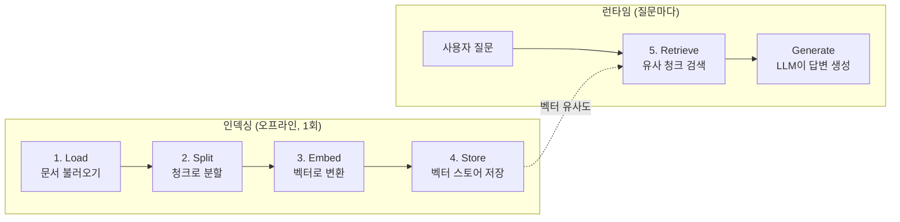
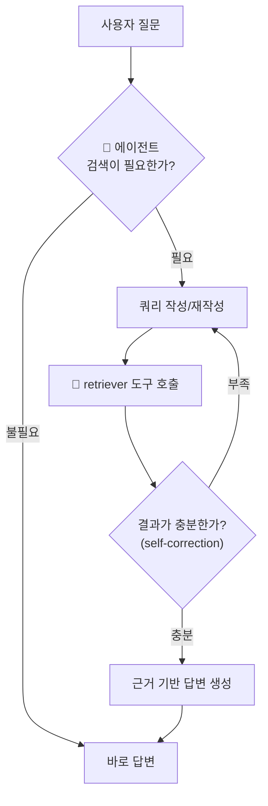

# 21. RAG & Agentic RAG

LLM은 학습 시점 이후의 정보와 사내 비공개 문서를 모릅니다. **RAG(Retrieval-Augmented
Generation, 검색 증강 생성)** 는 질문과 관련된 문서를 **검색해서 프롬프트에 넣어주는**
기법으로, 이 공백을 메우는 가장 검증된 방법입니다. 이 챕터는 고전적인 **단순 RAG
파이프라인**을 5단계로 해부한 뒤, 2026년의 주류가 된 **Agentic RAG** — 검색기를
*도구로 쥔 에이전트*가 검색 여부·시점·쿼리를 스스로 결정하는 방식 — 로 확장합니다.

!!! note "07장(장기 메모리)과의 관계"
    [07장](07-long-term-memory.md)의 스토어 의미 검색(semantic search)과 RAG는
    **같은 기술(임베딩 + 벡터 유사도 검색)** 을 씁니다. 다른 점은 검색 대상입니다 —
    장기 메모리는 *대화에서 추출한 사용자 기억*을, RAG는 *외부 문서 코퍼스*(매뉴얼,
    위키, 규정집)를 검색합니다. 하나를 이해하면 다른 하나는 공짜입니다.

## 1. RAG 파이프라인 5단계

단순 RAG는 **인덱싱(오프라인) 4단계 + 검색(런타임) 1단계**로 구성됩니다.



| 단계 | 하는 일 | 이 저장소에서 쓰는 도구 |
|------|---------|------------------------|
| **Load** | PDF·웹·마크다운 등에서 텍스트 추출 | `DocumentLoader` (예제에선 파이썬 문자열) |
| **Split** | 임베딩·검색 단위로 분할(청크) | `langchain-text-splitters` |
| **Embed** | 텍스트 → 고정 길이 벡터 | `langchain-openai` 임베딩 (아래 2절) |
| **Store** | 벡터 + 원문을 저장·색인 | **Chroma** (`langchain-chroma`) |
| **Retrieve** | 질문 벡터와 유사한 청크 top-k 반환 | `vectorstore.as_retriever()` |

!!! tip "Split이 품질의 절반"
    청크가 너무 크면 관련 없는 내용이 딸려 오고([08장](08-context-engineering.md)의
    컨텍스트 과부하), 너무 작으면 문맥이 잘립니다. 통상 **300~1000 토큰 + 10~20%
    오버랩**에서 시작해 평가로 조정합니다. 2026년에는 청크에 문서 맥락을 한 줄
    붙여 넣는 **contextual retrieval**(Anthropic)이 사실상 표준 보강 기법입니다.

## 2. 임베딩 선택 — Anthropic은 임베딩 API가 없다

중요한 사실: **Anthropic은 자체 임베딩 API를 제공하지 않습니다.** 공식 문서는
**Voyage AI**를 권장 임베딩 프로바이더로 안내합니다(현재 MongoDB 소속).

| 선택지 | 대표 모델 | 특징 | 언제 |
|--------|-----------|------|------|
| **Voyage AI** (Anthropic 공식 권장) | `voyage-3.5`, `voyage-code-3` | 검색 특화, 도메인 특화 모델(금융·법률·코드), MTEB 상위권 | Claude 스택에서 검색 품질 최우선 |
| **OpenAI** | `text-embedding-3-small/large` | 저렴하고 생태계 통합 최다, LangChain 기본 예제 다수 | 빠른 시작, 범용 |
| **로컬(오픈소스)** | `bge-m3`, `multilingual-e5` | 무료·데이터 외부 유출 없음, 운영 부담 | 온프레미스·규제 환경 |

!!! warning "생성 모델과 임베딩 모델은 독립이다"
    "Claude를 쓰니 임베딩도 Anthropic 것"이라는 조합은 존재하지 않습니다.
    **생성은 Claude, 임베딩은 Voyage/OpenAI** 처럼 나눠 쓰는 것이 정상 구성입니다.
    단, 인덱싱에 쓴 임베딩 모델과 검색에 쓰는 임베딩 모델은 **반드시 같아야** 합니다 —
    모델을 바꾸면 전체 재인덱싱이 필요합니다.

이 저장소 예제는 진입 장벽이 낮은 `text-embedding-3-small`(OpenAI)을 씁니다.

## 3. 벡터 스토어 — Chroma

**Chroma**는 로컬 파일/메모리로 도는 오픈소스 벡터 스토어로, 학습·프로토타입의
기본 선택입니다. `pip install chromadb langchain-chroma` 로 바로 씁니다.

```python
from langchain_chroma import Chroma
from langchain_openai import OpenAIEmbeddings

vectorstore = Chroma.from_texts(
    texts=chunks,                                    # 분할된 텍스트 청크들
    embedding=OpenAIEmbeddings(model="text-embedding-3-small"),
    collection_name="company-docs",
    # persist_directory="./chroma_db",  # 지정하면 디스크에 영속화
)
retriever = vectorstore.as_retriever(search_kwargs={"k": 2})  # top-2 검색
```

프로덕션 규모(수백만 벡터, 하이브리드 검색, 필터링)에서는 pgvector·Qdrant·Pinecone
등으로 갈아타지만, **인터페이스(`as_retriever()`)가 같아서** 코드 변경은 적습니다.

## 4. 단순 RAG 체인 — 고정 파이프라인

가장 기본형은 "**항상** 검색하고, 결과를 프롬프트에 붙여 **한 번** 생성"하는
고정 체인입니다.

```python
from langchain_anthropic import ChatAnthropic

def simple_rag(question: str) -> str:
    docs = retriever.invoke(question)                      # 1) 무조건 검색
    context = "\n\n".join(d.page_content for d in docs)    # 2) 컨텍스트 조립
    prompt = f"다음 문서만 근거로 답하라.\n\n[문서]\n{context}\n\n[질문]\n{question}"
    return model.invoke(prompt).content                    # 3) 1회 생성
```

싸고 예측 가능하지만 구조적 한계가 있습니다.

- **불필요한 검색** — "안녕?"에도 검색을 돌립니다(지연·비용 낭비).
- **쿼리 = 질문 그대로** — 사용자의 표현이 문서의 표현과 다르면 검색이 빗나갑니다.
- **1회 검색으로 끝** — 결과가 나빠도 다시 검색하지 않습니다. 여러 문서를 조합해야
  하는 다단계(multi-hop) 질문에 특히 약합니다.

## 5. Agentic RAG — 검색기를 도구로 쥔 에이전트

**Agentic RAG**는 retriever를 [02장](02-tool-use-agent-loop.md)의 **도구(tool)** 로
에이전트에게 쥐여 줍니다. 그러면 에이전트가 스스로 결정합니다.

- **검색할지 말지** — 인사말엔 검색 없이 바로 답합니다.
- **어떤 쿼리로** — 사용자 문장을 그대로 쓰지 않고 검색에 맞게 **재작성**합니다.
- **몇 번이나** — 결과가 부실하면 쿼리를 바꿔 **다시 검색**합니다(self-correction).



구현은 놀랄 만큼 짧습니다 — retriever를 감싼 `@tool` 하나를
`create_react_agent`([03](03-langchain-basics.md)·[04장](04-langgraph-state-graph.md))에
넘기면 위 루프가 ReAct 에이전트 루프로 자연히 구현됩니다.

```python
from langchain_core.tools import tool
from langgraph.prebuilt import create_react_agent

@tool
def search_docs(query: str) -> str:
    """사내 문서에서 관련 내용을 검색한다. 검색어는 짧은 키워드 문장으로."""
    docs = retriever.invoke(query)
    return "\n\n".join(d.page_content for d in docs)

agent = create_react_agent(
    model, tools=[search_docs],
    prompt="문서 근거가 필요한 질문이면 search_docs 로 검색하고, "
           "결과가 부족하면 검색어를 바꿔 다시 검색하라. 근거 없는 답은 하지 마라.",
)
```

self-correction을 더 명시적으로 통제하려면(검색 결과 관련성 채점 노드, 쿼리 재작성
노드) LangGraph `StateGraph`로 직접 조립합니다 — LangChain 공식 Agentic RAG
튜토리얼이 정확히 이 구조이며, [20장](20-langgraph-advanced.md)의 조건부 엣지가
그대로 쓰입니다. 검색 결과를 채점해 부족하면 재검색하는 변형을 **Corrective RAG
(CRAG)**, 질문 난이도에 따라 "검색 없음/1회/반복"을 라우팅하는 변형을 **Adaptive
RAG**라 부릅니다.

## 따라하기

### 사전 준비

```bash
pip install -r requirements.txt   # chromadb, langchain-chroma, langchain-openai 포함
```

`.env`에 키 **두 개**가 필요합니다 — 생성(Claude)과 임베딩(OpenAI)이 분리되어 있기
때문입니다(2절).

```bash
ANTHROPIC_API_KEY=sk-ant-...
OPENAI_API_KEY=sk-...        # 임베딩용. 없으면 예제가 안내 후 정상 종료
```

### 실행

```bash
python examples/26_agentic_rag.py
```

예제는 가상의 사내 규정 문서 4개를 Chroma(인메모리)에 인덱싱하고, retriever 도구를
쥔 LangGraph ReAct 에이전트에게 두 가지를 물어봅니다 — 검색이 필요한 질문과
필요 없는 질문.

### 기대 출력 예시

```text
=== 1) 인덱싱: 문서 4개 → Chroma ===
색인 완료: 4개 청크

=== 2) 질문: 재택근무는 주 며칠까지 가능하고, 노트북 반출 규정은? ===
  [도구 호출] search_docs(query='재택근무 주당 가능 일수')
  [도구 호출] search_docs(query='노트북 사외 반출 보안 규정')

[에이전트 답변]
재택근무는 주 3일까지 가능하며 팀장 사전 승인이 필요합니다. 회사 노트북을
사외로 반출할 때는 디스크 암호화가 활성화되어 있어야 하고 ...

=== 3) 질문: 고마워! (검색 불필요) ===
  (도구 호출 없음)
[에이전트 답변]
천만에요! 더 궁금한 규정이 있으면 언제든 물어보세요.
```

핵심 관찰 포인트: 첫 질문에서는 에이전트가 **쿼리를 스스로 재작성해 두 번 검색**하고,
둘째 질문에서는 **검색 도구를 아예 부르지 않습니다**. 이것이 단순 RAG와의 차이입니다.

### 흔한 에러

| 증상 | 원인 | 해결 |
|------|------|------|
| `OPENAI_API_KEY 가 없습니다` 안내 후 종료 | 임베딩용 키 미설정 | `.env`에 `OPENAI_API_KEY` 추가 (에러가 아니라 의도된 안내) |
| `AuthenticationError: 401` | 키 오타/만료 | 두 키 모두 유효한지 확인 |
| `sqlite3` 버전 에러 (chromadb) | Chroma는 sqlite3 ≥ 3.35 필요 | Python 3.11+ 사용 또는 `pysqlite3-binary` 설치 |
| 검색 결과가 매번 엉뚱함 | 인덱싱과 검색의 임베딩 모델 불일치 | 같은 임베딩 모델 사용, 컬렉션 재생성 |
| 답이 문서와 무관 | top-k가 너무 크거나 청크가 너무 큼 | `k`를 2~4로, 청크 크기 축소 |

## 실무 트레이드오프

| 항목 | 단순 RAG | Agentic RAG |
|------|----------|-------------|
| **LLM 호출 수** | 1회 (고정) | 2~N회 (검색 판단·재작성마다 추가) |
| **지연** | 낮고 일정 | 높고 가변적 |
| **비용** | 낮음 | 검색 루프만큼 증가 |
| **단순 질문** | 충분 | 과잉 (불필요한 판단 오버헤드) |
| **다단계(multi-hop) 질문** | 취약 (1회 검색) | 강함 (반복 검색·조합) |
| **잘못된 검색 복구** | 불가 | self-correction으로 가능 |
| **디버깅** | 쉬움 (고정 경로) | 트레이싱 필요 (→ [13장](13-debugging-observability.md)) |
| **적합한 곳** | FAQ, 단일 문서 Q&A | 리서치, 사내 지식 어시스턴트, 복합 질의 |

!!! tip "선택 기준"
    [09장](09-multi-agent-patterns.md)의 원칙이 여기도 적용됩니다 — **가장 단순한
    것부터.** 질문 대부분이 1회 검색으로 풀리면 단순 RAG로 시작하고, "검색이
    빗나가는" 실패가 로그에 쌓일 때 Agentic으로 올리세요. 또한 문서 전체가 컨텍스트
    윈도에 들어가는 규모라면, RAG 대신 **전체 문서 + 프롬프트 캐싱**([15장](15-evaluation-cost.md))이
    더 정확하고 단순할 수 있습니다.

## 설계 가이드 — RAG 스택을 어떻게 짤 것인가

위 표가 "단순 vs Agentic"이라면, 여기서는 스택의 각 부품 — 벡터 DB, 청크, 임베딩,
갱신 파이프라인 — 을 고르는 기준을 정리합니다.

### 벡터 DB 선택 기준표

| 선택지 | 성격 | 잘 맞는 곳 | 주의점 |
|--------|------|-----------|--------|
| **Chroma** | 로컬 파일/인메모리, 설치 즉시 사용 | 학습·프로토타입, 단일 프로세스 | 대규모·동시성·하이브리드 검색에는 부적합 |
| **pgvector** | Postgres 확장 — 기존 RDB에 벡터 컬럼 추가 | 이미 Postgres를 운영 중이고 스택을 늘리기 싫을 때, 벡터+관계 데이터 조인 | 수천만 벡터 이상·고QPS에서 전용 DB 대비 불리 |
| **Qdrant** | 오픈소스 전용 벡터 DB(셀프호스트/클라우드) | 대규모 + 메타데이터 필터링·하이브리드 검색이 많은 워크로드 | 셀프호스트 시 운영 부담 |
| **Pinecone** | 관리형 전용(서버리스) | 운영 인력 없이 스케일, 사용량 과금 선호 | 셀프호스트 불가 — 데이터 주권·비용 통제 요건과 충돌 |

결정 규칙: **프로토타입은 Chroma → 프로덕션 첫 선택은 "이미 있는 Postgres + pgvector" →
벡터 수천만 개·복잡한 필터·고QPS가 실측되면 Qdrant(주권)/Pinecone(무운영)** 순서로
올리세요. `as_retriever()` 인터페이스가 같아 이 사다리의 이사 비용은 낮습니다(§3).

### 청크 크기·오버랩 설계 절차

1. §1의 기본값(300~1000토큰, 오버랩 10~20%)으로 시작하되, **문서 구조 경계**(제목·절·
   문단)를 우선하는 스플리터를 씁니다 — 고정 길이로 자르면 문장이 반토막 납니다.
2. 골든 질문 20~30개로 **retrieval만 따로 평가**합니다(정답 청크가 top-k에 들었는가 —
   생성 품질과 분리해서 측정).
3. 검색이 빗나가는 방향으로 조정 — 답이 여러 청크에 흩어지면 크기 ↑, 관련 없는 내용이
   딸려 오면 크기 ↓. 청크에 문서 맥락 한 줄을 붙이는 contextual retrieval(§1)은
   크기 조정보다 효과가 큰 경우가 많습니다.
4. **크기를 바꾸면 전체 재인덱싱**입니다 — 실험은 프로덕션 인덱스가 커지기 전에 끝내세요.

### 임베딩 모델 선택

| 요건 | 선택 | 근거 |
|------|------|------|
| 빠른 시작·저비용 | OpenAI `text-embedding-3-small` (~$0.02/1M 토큰) | 관리형 최저가급, 생태계 통합 최다 |
| 검색 정확도 최우선 | Voyage `voyage-3.5` (~$0.06/1M) | 검색 특화·도메인 모델, Anthropic 공식 권장(§2) |
| 다국어(한국어 포함) 중요 | `bge-m3`(셀프호스트) 또는 상용 다국어 상위 모델 | bge-m3는 100+개 언어 지원 오픈소스 대표 |
| 데이터 외부 반출 불가 | `bge-m3`, `multilingual-e5` 셀프호스트 | 비용 대신 GPU 운영 부담 |

한국어 코퍼스라면 영어 벤치마크 순위를 믿지 말고 **자기 문서 표본으로 검색 품질을
직접 비교**하세요. 그리고 §2의 철칙 — 모델 교체 = 전체 재인덱싱 — 때문에 임베딩
선택은 벡터 DB 선택보다 되돌리기 비쌉니다.

### 단순 RAG → Agentic RAG 전환 판단

로그에서 다음 신호가 쌓이면 전환할 때입니다. 반대로 하나도 없다면 단순 RAG 유지가 정답입니다.

- [ ] 검색이 필요 없는 질문(인사·잡담)에도 검색이 돌아 지연·비용이 낭비된다 → 최소한 "검색 여부 라우팅"부터
- [ ] 사용자 표현과 문서 표현이 달라 검색이 빗나가는 실패가 반복된다 → 쿼리 재작성
- [ ] 여러 문서를 조합해야 하는 multi-hop 질문의 비율이 늘고 있다 → 반복 검색 루프
- [ ] 첫 검색 결과가 나빠도 그대로 오답을 생성한다 → 관련성 채점 + 재검색(CRAG)

전부가 아니라 **걸린 신호에 해당하는 부품만** 추가하세요 — Adaptive RAG(§5)처럼
쉬운 질문은 여전히 싼 경로로 보내는 라우팅이 비용을 지킵니다.

### 인덱스 갱신 파이프라인

- **증분 갱신 기본** — 문서 해시(또는 수정시각)를 메타데이터로 저장하고, 변경된 문서의
  청크만 삭제 후 재삽입합니다. 매번 전체 재인덱싱은 임베딩 비용 낭비입니다.
- **전체 재인덱싱이 불가피한 경우** — 임베딩 모델·청크 전략 변경. 새 컬렉션에 색인한 뒤
  검색 대상을 스위칭(blue-green)하면 무중단으로 전환됩니다.
- **삭제 전파를 잊지 마세요** — 원본에서 지워진 문서가 인덱스에 남으면 에이전트가
  폐기된 규정을 근거로 답합니다. RAG 특유의 조용한 장애입니다.
- 갱신 주기는 코퍼스 성격으로 정합니다 — 규정집은 일 배치로 충분하고, 티켓·위키처럼
  실시간성이 중요하면 변경 이벤트 기반(웹훅) 파이프라인으로.

## 2026 실무 트렌드

- **실패의 병목은 생성이 아니라 검색** — 2026년 업계 분석들은 RAG 실패의 대부분이
  retrieval 단계에서 난다고 일관되게 보고합니다. 투자도 생성 프롬프트가 아니라
  검색 품질(하이브리드 검색, 리랭킹)로 이동했습니다.
- **하이브리드 검색이 기본값** — 벡터 유사도 단독이 아니라 **벡터 + 키워드(BM25) +
  리랭커** 조합이 표준 구성이 됐습니다. Anthropic의 contextual retrieval(청크에 문서
  맥락 프리픽스 부여 + BM25 병행)은 검색 실패율을 크게 줄이는 대표 기법입니다.
- **Agentic RAG 패턴의 수렴** — router / ReAct / plan-and-execute / multi-agent
  retrieval / self-RAG(자기평가) 다섯 패턴으로 프로덕션 사례가 수렴하고 있으며,
  이 챕터의 예제는 그중 ReAct + self-correction 조합입니다.
- **"RAG vs 긴 컨텍스트" 논쟁의 정리** — 컨텍스트 윈도가 커지면서 소규모 코퍼스는
  통째로 넣고 캐싱하는 쪽이 이겼고, 대규모·갱신 잦은 코퍼스는 여전히 RAG가
  이깁니다. 경계에서는 "검색으로 후보 축소 → 긴 컨텍스트로 정밀 독해" 하이브리드가
  늘고 있습니다(컨텍스트 아키텍처 논의 → [08장](08-context-engineering.md)).

## 실전 레퍼런스

WebSearch로 실존을 확인한 자료만 싣습니다.

- [Build a custom RAG agent with LangGraph — LangChain 공식 문서](https://docs.langchain.com/oss/python/langgraph/agentic-rag) — 검색 결과 채점·쿼리 재작성 노드를 가진 Agentic RAG를 StateGraph로 직접 조립하는 공식 튜토리얼.
- [Contextual Retrieval — Anthropic Engineering](https://www.anthropic.com/engineering/contextual-retrieval) — 청크에 문맥을 프리픽스로 붙여 검색 실패를 49~67% 줄인 기법과 프롬프트 캐싱 병용법.
- [Embeddings — Claude 공식 문서](https://platform.claude.com/docs/en/build-with-claude/embeddings) — Anthropic이 임베딩 미제공을 명시하고 Voyage AI를 권장하는 공식 페이지.
- [Agentic RAG with LangGraph — Qdrant 기술 블로그](https://qdrant.tech/documentation/tutorials-build-essentials/agentic-rag-langgraph/) — 벡터 DB 벤더 관점의 다단계 검색 에이전트 구축 튜토리얼.
- [Context architecture is replacing RAG — VentureBeat](https://venturebeat.com/data/context-architecture-is-replacing-rag-as-agentic-ai-pushes-enterprise-retrieval-to-its-limits) — 하이브리드 검색 급증 등 2026년 엔터프라이즈 검색 지형 데이터.

## 참고 자료

- [Chroma 공식 문서](https://docs.trychroma.com/)
- [langchain-chroma 통합 문서](https://docs.langchain.com/oss/python/integrations/vectorstores/chroma)
- [Voyage AI 임베딩 가이드 — anthropics/claude-cookbooks](https://github.com/anthropics/claude-cookbooks/blob/main/third_party/VoyageAI/how_to_create_embeddings.md)
- [예제 코드: 26_agentic_rag.py](https://github.com/agent-chobi/agent-atoz/blob/main/examples/26_agentic_rag.py)
