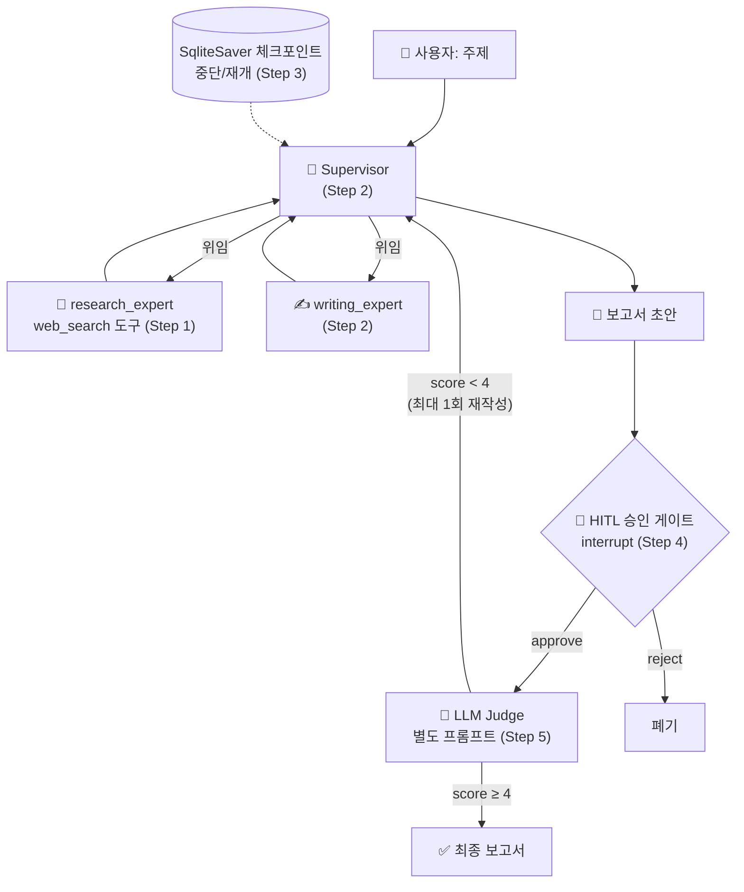

# 22. 통합 프로젝트: 미니 리서치 팀 만들기 (단계별)

지금까지 배운 조각들 — tool use, supervisor, 체크포인터, HITL, LLM judge — 을 **하나의
동작하는 시스템**으로 조립합니다. 만들 것은 "주제를 주면 **조사 → 보고서 작성 →
사람 승인 → 품질 채점**까지 하는 **미니 리서치 팀**"입니다. 이 저장소의 통합
캡스톤으로, 17장(하네스)이 *규율*의 캡스톤이라면 이 장은 *조립*의 캡스톤입니다.

핵심 설계 원칙은 하나입니다 — **한 번에 하나씩 얹는다.** 각 Step은 이전 Step의
코드를 import 해 재사용하면서(누적 확장) 새 개념 딱 하나만 추가하고, 그러면서도
**각각 독립 실행이 가능**합니다. 문제가 생기면 어느 층에서 생겼는지 바로 보입니다.

## 최종 아키텍처



각 Step이 쓰는 챕터 개념:

| Step | 만드는 것 | 사용하는 챕터 개념 | 파일 |
|------|-----------|--------------------|------|
| 0 | 환경 준비 | — | `.env`, `requirements.txt` |
| 1 | 단일 리서치 에이전트 | [02](02-tool-use-agent-loop.md) tool use · [03](03-langchain-basics.md) `create_react_agent` | [`step1_agent.py`](https://github.com/agent-chobi/agent-atoz/blob/main/examples/project/step1_agent.py) |
| 2 | supervisor + 워커 2개 | [09](09-multi-agent-patterns.md) supervisor 패턴 | [`step2_supervisor.py`](https://github.com/agent-chobi/agent-atoz/blob/main/examples/project/step2_supervisor.py) |
| 3 | 중단/재개 | [06](06-short-term-memory.md) 체크포인터·thread_id | [`step3_checkpoint.py`](https://github.com/agent-chobi/agent-atoz/blob/main/examples/project/step3_checkpoint.py) |
| 4 | 사람 승인 게이트 | [14](14-permissions-security-hitl.md) HITL · [04](04-langgraph-state-graph.md) `interrupt` | [`step4_hitl.py`](https://github.com/agent-chobi/agent-atoz/blob/main/examples/project/step4_hitl.py) |
| 5 | 품질 채점 + 재작성 | [15](15-evaluation-cost.md) LLM-as-judge · [09](09-multi-agent-patterns.md) critique | [`step5_judge.py`](https://github.com/agent-chobi/agent-atoz/blob/main/examples/project/step5_judge.py) |

전체 코드: [`examples/project/`](https://github.com/agent-chobi/agent-atoz/blob/main/examples/project/README.md)

## Step 0 — 환경 준비

```bash
pip install -r requirements.txt     # langgraph, langgraph-supervisor,
                                    # langgraph-checkpoint-sqlite, langchain-anthropic 등
```

`.env`에 키 하나면 됩니다(이 프로젝트는 검색 도구가 데모용 가짜라 외부 키 불필요).

```bash
ANTHROPIC_API_KEY=sk-ant-...
```

!!! tip "비용 절감"
    모든 파일의 기본 모델은 `claude-opus-4-8` 입니다. 반복 실행하며 학습할 때는
    상단의 `MODEL` 을 `"claude-haiku-4-5"` 로 바꾸세요([15장](15-evaluation-cost.md)
    모델 분리 전략). 특히 Step 2부터는 워커 수만큼 LLM 호출이 늘어납니다.

## Step 1 — 단일 리서치 에이전트 (tool use)

**목표** — 도구(`web_search`)를 쥔 에이전트 하나를 세운다. [09장](09-multi-agent-patterns.md)의
제1원칙("가장 단순한 것부터")대로, 멀티에이전트 이전에 단일 에이전트가 기준선입니다.

**핵심 코드 발췌** — `create_react_agent`가 02장의 에이전트 루프를 대신 돌립니다.
`name="research_expert"` 는 Step 2에서 supervisor가 라우팅할 이름입니다.

```python
def build_research_agent(model):
    return create_react_agent(
        model=model,
        tools=[web_search],
        name="research_expert",   # Step 2 의 supervisor 가 이 이름으로 위임
        prompt="너는 리서처다. 사실 관계는 반드시 web_search 도구로 확인한 뒤 ...",
    )
```

**실행**

```bash
python examples/project/step1_agent.py
```

**기대 출력**

```text
=== Step 1: 단일 리서치 에이전트 ===
[도구 호출] web_search(query='멀티에이전트 시스템 토큰 오버헤드')
[최종 답변]
멀티에이전트 시스템은 단일 에이전트 대비 토큰 오버헤드가 큽니다.
중앙집중형은 약 +285%, 독립형은 약 +58% 수준이며 ...
```

**확인 포인트**

- [ ] `[도구 호출]` 로그가 찍히는가 — 에이전트가 답을 지어내지 않고 도구를 썼다는 증거.
- [ ] 답변에 검색 결과의 수치가 인용되는가.
- [ ] `build_research_agent` 가 **함수**인 이유를 이해했는가 — 모듈 레벨에서 모델을
  만들면 import 만 해도 API 키를 요구하게 됩니다. Step 2가 이 함수를 import 합니다.

## Step 2 — Supervisor + 워커 2개

**목표** — Step 1의 리서처를 워커로 격하(?)시키고, 작가 워커를 추가한 뒤
supervisor가 라우팅하게 한다. "조사"와 "작문"의 **전문화**([09장](09-multi-agent-patterns.md))가
멀티에이전트 비용을 정당화하는 근거입니다.

**핵심 코드 발췌** — Step 1을 import 해 재사용하는 것에 주목하세요.
`langgraph-supervisor` 사용법은 [12번 예제](https://github.com/agent-chobi/agent-atoz/blob/main/examples/12_supervisor.py)와 동일합니다.

```python
from step1_agent import build_research_agent          # Step 1 재사용

def build_team(model, checkpointer=None):              # checkpointer 는 Step 3 를 위한 자리
    workflow = create_supervisor(
        [build_research_agent(model), build_writer_agent(model)],
        model=model,
        prompt="너는 리서치 팀의 supervisor 다. 조사는 research_expert, "
               "글 다듬기는 writing_expert 에게 위임하라. 직접 답을 쓰지 마라.",
    )
    return workflow.compile(checkpointer=checkpointer)
```

**실행**

```bash
python examples/project/step2_supervisor.py
```

**기대 출력**

```text
=== Step 2: supervisor + 리서처/작가 워커 ===
[도구 호출] web_search(query='supervisor 패턴 채택률')
[최종 답변]
2026년 프로덕션 멀티에이전트의 다수는 supervisor 패턴을 씁니다. ...

=== 라우팅 추적 (누가 언제 말했나) ===
[human] 2026년 멀티에이전트에서 supervisor 패턴이 왜 기본값인지 ...
[supervisor] ...
[research_expert] ...
[writing_expert] ...
```

**확인 포인트**

- [ ] 라우팅 추적에 `research_expert → writing_expert` 순서가 보이는가.
- [ ] supervisor가 직접 답을 쓰지 않았는가(위임 강제 프롬프트의 효과).
- [ ] Step 1 대비 실행 시간·호출 수가 늘었음을 체감했는가 — 이것이 09장의 토큰
  오버헤드입니다.

## Step 3 — 체크포인터로 중단/재개

**목표** — 팀에 `SqliteSaver`([06장](06-short-term-memory.md))를 붙여 상태를 파일에
영속화한다. 프로세스가 죽어도(=중단) 같은 `thread_id`로 다시 invoke 하면 이어진다(=재개).

**핵심 코드 발췌** — Step 2와의 차이는 **한 줄**입니다.

```python
from step2_supervisor import build_team                # Step 2 재사용

with SqliteSaver.from_conn_string("research_team.sqlite") as checkpointer:
    team = build_team(model, checkpointer=checkpointer)   # ← 이 한 줄이 전부
    config = {"configurable": {"thread_id": "capstone-team"}}
    team.invoke({"messages": [("user", "...보고서 써줘")]}, config)   # 턴 1
    team.invoke({"messages": [("user", "방금 그거 요약해줘")]}, config)  # 턴 2: 기억함
```

**실행**

```bash
python examples/project/step3_checkpoint.py
# 한 번 더 실행하면 같은 thread 가 이어진다. 초기화: research_team.sqlite 삭제
```

**기대 출력**

```text
--- 턴 2: 같은 thread 에서 후속 질문 (이전 보고서를 기억) ---
[답변] 방금 보고서의 핵심은 두 가지입니다. 첫째, ...

--- 현재 스냅샷 ---
thread='capstone-team' 저장된 메시지 수: 14, 다음 노드: ()
```

**확인 포인트**

- [ ] 턴 2가 "방금 그 보고서"를 실제로 기억하는가.
- [ ] 스크립트를 **다시 실행**해도 이전 실행의 대화가 이어지는가 — 이것이 진짜
  중단/재개이며, `InMemorySaver`와의 차이입니다.
- [ ] `research_team.sqlite`를 지우면 기억이 사라지는가.

## Step 4 — HITL 승인 게이트

**목표** — 팀이 만든 보고서를 "게시"하기 전에 **사람 승인**을 받는다. [14장](14-permissions-security-hitl.md)의
원칙 — 부수효과가 있는 행동(게시·배포·송금) 앞에는 승인 게이트 — 을 구현합니다.

**핵심 코드 발췌** — Step 2의 팀 전체를 상위 `StateGraph`의 **한 노드**로 감싸고,
게시 직전에 `interrupt()`로 정지합니다. 승인은 `Command(resume=...)`로 재개합니다.

```python
def approval_node(state):
    decision = interrupt({"question": "이 보고서를 게시할까요?", "draft": state["draft"]})
    return {"approved": decision == "yes"}

# research_team → approval → publish 순서의 상위 그래프
# ⚠️ interrupt 는 체크포인터 필수, 재개는 같은 thread_id 로 (Step 3 개념 재사용)
pipeline = builder.compile(checkpointer=InMemorySaver())

state = pipeline.invoke({...}, config)                     # approval 에서 정지
final = pipeline.invoke(Command(resume="yes"), config)     # 사람 결정으로 재개
```

**실행**

```bash
python examples/project/step4_hitl.py               # 자동 승인 데모
python examples/project/step4_hitl.py --reject      # 거부 분기
python examples/project/step4_hitl.py --interactive # 콘솔에서 직접 y/n
```

**기대 출력**

```text
--- 1) 팀 실행 → 승인 게이트에서 정지 ---
[승인 요청] 이 보고서를 게시할까요?
[보고서 초안] 2026년 프로덕션 멀티에이전트의 다수는 supervisor 패턴 ...

--- 2) 사람 결정 'yes' 로 재개 ---
[결과] 보고서 게시 완료 ✅
```

**확인 포인트**

- [ ] 그래프가 `interrupt`에서 실제로 **멈추고** `__interrupt__` payload가 보이는가.
- [ ] `--reject` 시 게시가 반려되는가.
- [ ] 왜 체크포인터가 필수인지 설명할 수 있는가 — 정지 상태를 저장할 곳이
  없으면 재개할 수 없습니다.

## Step 5 — LLM judge 평가

**목표** — 완성된 보고서를 팀과 **완전히 분리된 judge**([15장](15-evaluation-cost.md))가
1~5점으로 채점하고, 미달이면 피드백을 팀에 돌려보내 **1회** 재작성시킨다
(critique 패턴 + 반복 상한, [09장](09-multi-agent-patterns.md)).

**핵심 코드 발췌** — judge는 별도 클라이언트·별도 시스템 프롬프트를 쓰고,
`output_config`(JSON 스키마)로 항상 파싱 가능한 채점을 받습니다.

```python
resp = judge_client.messages.create(
    model=MODEL, max_tokens=1024,
    system="너는 엄격한 채점자다. 답을 새로 쓰지 않는다. 후하게 주지 마라.",
    messages=[{"role": "user", "content": f"[평가 기준]\n{RUBRIC}\n\n[보고서]\n{report}..."}],
    output_config={"format": {"type": "json_schema", "schema": JUDGE_SCHEMA}},
)
# score < 4 이면: judge 의 feedback 을 붙여 팀에 재작성 요청 (최대 1회)
```

**실행**

```bash
python examples/project/step5_judge.py
```

**기대 출력**

```text
--- 2) 별도 judge 가 채점 (시도 1) ---
점수: 5 / 5
근거: 토큰 오버헤드 수치와 채택률을 정확히 인용했고 ...
판정: PASS ✅ (임계값 4점)
```

**확인 포인트**

- [ ] judge가 생성 팀과 다른 프롬프트·역할을 쓰는가(자기채점 편향 회피).
- [ ] 채점이 항상 파싱 가능한 JSON으로 오는가.
- [ ] 재작성 루프에 상한(`MAX_REVISIONS`)이 있는가 — 없으면 무한 왕복입니다.

!!! note "확장 과제"
    지금은 Step 4(HITL)와 Step 5(judge)가 각각 Step 2 위에 독립적으로 얹혀 있습니다.
    다섯 층을 **하나의 그래프**(팀 → judge → HITL → 게시)로 합쳐 보세요. 그다음엔
    가짜 `web_search`를 MCP 검색 서버([11장](11-mcp-integration.md))로 교체하고,
    트레이싱([13장](13-debugging-observability.md))을 붙이면 프로덕션 골격이 완성됩니다.

## 흔한 에러

| 증상 | 원인 | 해결 |
|------|------|------|
| `ImportError: langgraph_supervisor` | 의존성 누락 | `pip install -r requirements.txt` |
| `ModuleNotFoundError: step1_agent` | 파일 단위 복사 실행 | step 파일들은 같은 디렉터리에 있어야 import 가능 |
| supervisor가 직접 답변 | 위임 강제 프롬프트 누락 | "직접 답을 쓰지 말고 워커를 활용하라" 유지 |
| 턴 2가 기억 못함 (Step 3) | `thread_id` 불일치 | 두 invoke의 config가 같은지 확인 |
| interrupt가 동작 안 함 (Step 4) | 체크포인터 없이 compile | `compile(checkpointer=...)` 필수 |
| judge JSON 파싱 실패 (Step 5) | 구형 anthropic SDK | `pip install -U anthropic` (`output_config` 지원 버전) |

## 실무 트레이드오프

층을 얹을 때마다 무엇을 얻고 무엇을 내는지 명확히 합시다.

| 추가한 층 | 얻는 것 | 내는 것 | 생략해도 되는 경우 |
|-----------|---------|---------|--------------------|
| Step 2 supervisor | 전문화·라우팅 제어 | 토큰 최대 수 배, 지연 ↑ | 단일 에이전트로 품질이 충분할 때 |
| Step 3 체크포인터 | 중단/재개, 멀티턴, 감사 흔적 | 스토리지·직렬화 비용 | 1회성 배치 작업 |
| Step 4 HITL | 비가역 행동의 안전, 규제 대응 | 처리량 ↓ (사람이 병목) | 부수효과 없는 읽기 전용 작업 |
| Step 5 judge | 품질 하한 보장, 회귀 감지 | 채점 LLM 비용, 지연 | 출력을 사람이 전수 검토할 때 |

!!! tip "실전 기본형"
    다섯 층을 다 켜는 것이 목표가 아닙니다. 실무 기본형은 **Step 2 + 3 (+ 트레이싱)**
    이고, 비가역 행동이 생기는 순간 Step 4를, 품질 사고가 난 뒤가 아니라 나기 전에
    Step 5를 켭니다. judge는 저렴한 모델(`claude-haiku-4-5`)로 내려도 충분한 경우가
    많습니다.

## 2026 실무 트렌드

- **orchestrator-worker가 대규모 리서치의 표준** — Anthropic의 멀티에이전트 리서치
  시스템은 리드 에이전트(Opus)가 서브에이전트(Sonnet)들을 병렬로 부리는 구조로,
  단일 Opus 대비 내부 평가에서 90.2% 우세했지만 **토큰을 약 15배** 썼습니다.
  "결과 가치가 비용을 이기는 작업에만" 이라는 교훈이 이 캡스톤의 트레이드오프 표와
  정확히 같습니다.
- **HITL은 옵션에서 의무로** — EU AI Act의 인간 감독(human oversight) 요건이
  단계적으로 적용되면서([14장](14-permissions-security-hitl.md)), Step 4 같은 승인
  게이트가 컴플라이언스 기능으로 격상됐습니다.
- **eval-driven development** — 프롬프트/모델 변경을 감(感)이 아니라 고정 평가셋
  점수로 판단하는 흐름이 자리 잡았습니다. Step 5의 judge를 평가셋에 반복 적용하는
  것이 그 출발점입니다([15장](15-evaluation-cost.md)).
- **프레임워크 수렴** — supervisor/swarm prebuilt, HITL 미들웨어, 체크포인터가
  LangGraph 계열에 표준 부품으로 들어오면서, 이 캡스톤처럼 "부품 조립 + 정책
  코드"가 팀의 실제 작업이 됐습니다.

## 실전 레퍼런스

WebSearch로 실존을 확인한 자료만 싣습니다.

- [How we built our multi-agent research system — Anthropic Engineering](https://www.anthropic.com/engineering/multi-agent-research-system) — 이 캡스톤의 실물 대응: 리서치 팀을 프로덕션으로 키울 때의 프롬프트·평가·운영 교훈.
- [langgraph-supervisor (GitHub)](https://github.com/langchain-ai/langgraph-supervisor-py) — Step 2에서 쓴 supervisor prebuilt 공식 저장소.
- [Human-in-the-Loop — LangChain 공식 문서](https://docs.langchain.com/oss/python/langchain/human-in-the-loop) — Step 4의 `interrupt`/`Command(resume)` 공식 가이드.
- [LangSmith Evaluation — 공식 문서](https://docs.smith.langchain.com/evaluation) — Step 5의 judge를 평가셋·대시보드로 확장하는 방법.
- [Interrupt 2025 Recap — LangChain 블로그](https://www.langchain.com/blog/interrupt-2025-recap) — Cisco·Uber·Replit·LinkedIn 등의 프로덕션 에이전트 사례 발표(영상 링크 포함) 정리.

## 참고 자료

- [Building Effective Agents — Anthropic](https://www.anthropic.com/research/building-effective-agents)
- [LangGraph Multi-Agent 개념 문서](https://langchain-ai.github.io/langgraph/concepts/multi_agent/)
- [프로젝트 코드: examples/project/](https://github.com/agent-chobi/agent-atoz/blob/main/examples/project/README.md)
