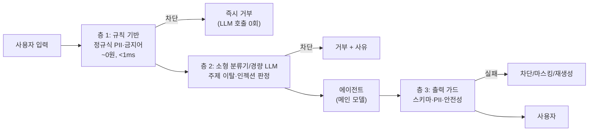
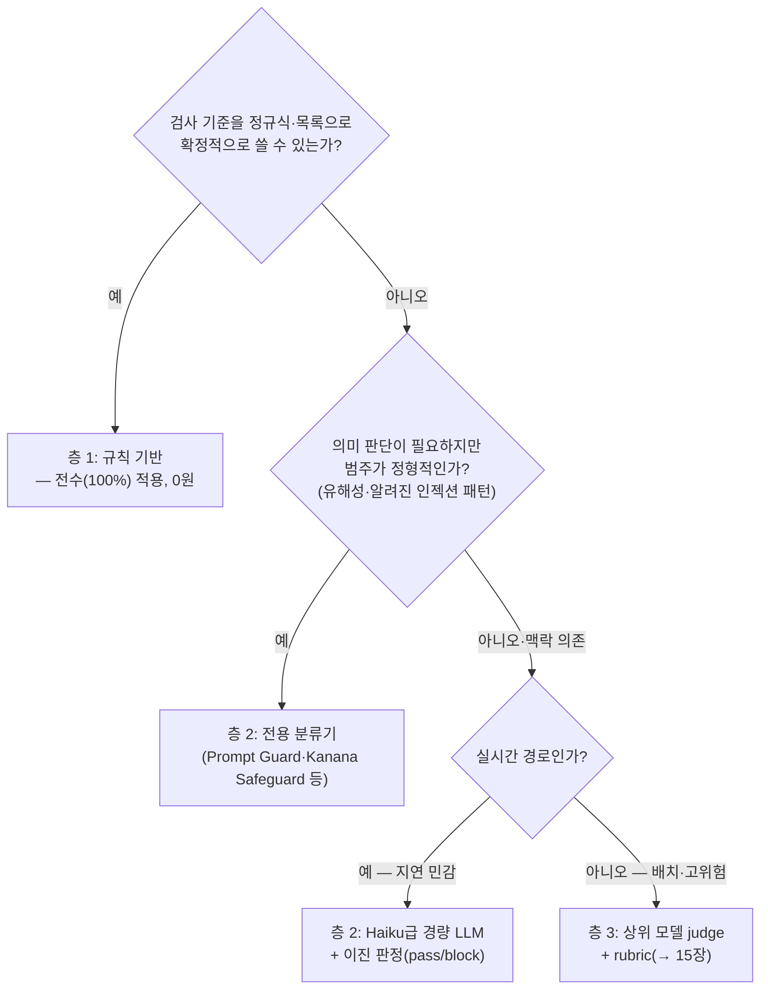

# 23. 가드레일 & 미들웨어

[15장](15-evaluation-cost.md) §5에서 가드레일을 "실시간 방어"로 스케치했습니다. 이 장은 그
스케치를 **아키텍처**로 확장합니다 — 가드레일이 왜 프롬프트 문구("위험한 답은 하지 마")가
아니라 독립 컴포넌트여야 하는지, LangChain 1.0의 **미들웨어 훅**이 그 컴포넌트를 어디에
끼워 주는지, 그리고 싸고 빠른 검사부터 무겁고 비싼 판정까지 **다층으로 쌓는 법**을 다룹니다.
[22장](22-capstone-project.md)까지 만든 에이전트를 사용자 앞에 내놓기 전의 마지막 방어선입니다.

## 1. 가드레일은 프롬프트 문구가 아니라 아키텍처다

시스템 프롬프트에 "개인정보를 노출하지 마라"라고 적는 것은 가드레일이 아닙니다. 이유는 셋입니다.

- **인젝션 한 번에 무력화** — 프롬프트 지시는 같은 컨텍스트의 다른 텍스트(사용자 입력, 도구
  결과)와 동급으로 경쟁합니다. "이전 지시를 무시해"가 통하는 구조적 이유입니다(→ [14장](14-permissions-security-hitl.md)).
- **확률적 준수** — LLM은 지시를 "높은 확률로" 따를 뿐입니다. 보안 요건은 100%가 필요합니다.
- **모델 교체에 취약** — 프롬프트 기반 통제는 모델을 바꾸는 순간 함께 흔들립니다. 독립
  컴포넌트로 분리하면 뒤의 모델이 바뀌어도 같은 정책을 재사용합니다.

!!! danger "정책은 모델 밖에"
    **모델이 협조하지 않아도 동작하는 코드 경로**에 정책을 두세요 — [14장](14-permissions-security-hitl.md)의
    "정책 평가 지점을 한 곳으로 수렴" 원칙과 같은 이치입니다.

## 2. 다층 방어 — 싸고 빠른 것 먼저

모든 검사를 LLM에 맡기면 요청마다 지연·비용이 배가됩니다. 실무 표준은 **싼 층이 먼저 걸러내고,
비싼 층은 통과분만 보는** 깔때기입니다 — 공항 보안검색처럼 금속탐지기(전수)가 먼저, 정밀 검사(선별)는 걸린 사람만.



| 층 | 기술 | 지연·비용 | 잡는 것 |
|----|------|-----------|---------|
| 규칙 기반 | 정규식, 금지어, 형식 검사 | <1ms, 0원 | 형식이 확정적인 것(카드번호, 이메일, 금칙어) |
| 소형 분류기 | Prompt Guard, Llama Guard, Kanana Safeguard 등 | 수십 ms | 학습된 공격·유해 패턴 |
| LLM 판정 | Haiku급 경량 모델 + rubric | 수백 ms~, 토큰 비용 | 맥락·의미 판단(주제 이탈, 미묘한 유해성) |

!!! tip "차단률의 경제학"
    규칙 층이 걸러낸 만큼 **메인 모델 호출이 통째로 절약**됩니다. 가드레일은 보안 장치이면서
    비용 절감 장치입니다 — 규칙 층이 먼저인 이유가 "빠르다"만이 아닙니다.

## 3. 입력 가드 — 들어가면 안 되는 것

- **PII 마스킹** — 이메일·전화번호·카드번호를 모델 도달 **전에** 마스킹. "LLM 컨텍스트에 들어간
  문자열은 유출될 수 있다"가 전제이고, 트레이스 마스킹([13장](13-debugging-observability.md))과 정책을 공유합니다.
- **주제 제한** — 고객지원 봇에게 주식 전망을 묻는 요청은 유해하지 않아도 **범위 밖**입니다.
  범위 밖 응답은 브랜드 리스크와 비용 누수이므로 경량 모델로 판정해 초입에서 거절합니다.
- **프롬프트 인젝션 탐지** — 직접 인젝션("이전 지시를 무시해")은 분류기로 상당 부분 탐지되지만,
  도구 결과·문서에 숨는 **간접 인젝션**은 입력 가드만으로 못 막습니다 — 도구 권한 축소와
  HITL([14장](14-permissions-security-hitl.md))이 병행돼야 합니다.

## 4. 출력 가드 — 나가면 안 되는 것

- **스키마 검증** — 구조화 출력이 계약을 지키는지. `output_config` 강제와 재시도 패턴은 [18장](18-structured-output.md).
- **PII·비밀 유출 검사** — 입력에 없던 PII가 출력에 나타나는 경우를 정규식으로 재검사.
  입력 가드와 같은 패턴을 재사용합니다.
- **안전성 검증** — 유해성 분류기 또는 LLM judge([15장](15-evaluation-cost.md))로 채점해
  임계 미만이면 차단/재생성. 비용이 크므로 고위험 경로에만.

!!! note "스트리밍과 출력 가드의 긴장"
    토큰을 실시간으로 흘리면([24장](24-deployment-operations.md) SSE) 출력 가드는 "다 나간 뒤"
    검사하는 셈입니다. 절충은 둘 — **버퍼링**(첫 N자를 모아 검사 후 방류, 위험 경로에만) 또는
    **청크 단위 마스킹**(`PIIMiddleware`는 `apply_to_output=True`로 스트림 델타에도 적용).

## 5. LangChain 1.0 미들웨어 — 가드를 끼우는 표준 지점

가드레일을 에이전트 호출 코드 앞뒤에 if문으로 끼우면 에이전트마다 복붙됩니다.
LangChain 1.0은 에이전트 루프의 고정 지점에 로직을 끼우는 **미들웨어 훅**을 표준화했습니다.

| 훅 | 실행 시점 | 가드레일 용도 |
|----|-----------|---------------|
| `before_agent` | 호출당 1회, 시작 전 | 입력 가드 — 주제 제한·인젝션 탐지·조기 차단 |
| `before_model` | 매 모델 호출 직전 | PII 마스킹, 히스토리 트리밍 |
| `wrap_model_call` | 모델 호출을 감쌈 | 재시도·캐시·모델 폴백 |
| `wrap_tool_call` | 도구 호출을 감쌈 | 도구 인자 검증, 권한 게이트(→ [14장](14-permissions-security-hitl.md)) |
| `after_model` | 매 모델 응답 직후 | 출력 가드 — 안전성·스키마 검증 |
| `after_agent` | 종료 시 1회 | 최종 출력 검증, 감사 로깅 |

데코레이터로 훅 하나짜리 미들웨어를 만들고, `jump_to`로 루프를 조기 종료합니다.

```python
from langchain.agents import create_agent
from langchain.agents.middleware import before_agent, hook_config, AgentState
from langchain.messages import AIMessage

@before_agent
@hook_config(can_jump_to=["end"])
def topic_guard(state: AgentState, runtime) -> dict | None:
    if is_off_topic(state["messages"][-1].content):      # 경량 판정 함수
        return {"messages": [AIMessage("지원 범위 밖의 요청입니다.")],
                "jump_to": "end"}                        # 메인 모델 호출 없이 종료
    return None

agent = create_agent(model, tools, middleware=[topic_guard, ...])
```

내장 미들웨어도 같은 훅 위에 있습니다 — `PIIMiddleware`(redact/mask/hash/block 전략),
`HumanInTheLoopMiddleware`(14장 HITL의 표준화), `ModelRetryMiddleware` 등. 미들웨어를 배열로
쌓으면 **들어갈 때는 등록 순서, 나올 때는 역순** — 웹 프레임워크와 같은 양파(onion) 모델입니다.

## 6. 14장·15장과의 역할 구분

세 장 모두 "에이전트를 통제"하지만 대상과 시점이 다릅니다. 겹치는 곳에 중복 구현하지 마세요.

| | [14장](14-permissions-security-hitl.md) 권한·HITL | **23장 가드레일** | [15장](15-evaluation-cost.md) 평가 |
|--|--|--|--|
| 통제 대상 | **행동**(도구 실행) | **콘텐츠**(입출력 텍스트) | **품질**(결과물 수준) |
| 시점 | 도구 실행 직전 | 모델 호출 앞뒤, 실시간 | 사후·오프라인(배치) |
| 핵심 질문 | "이 행동을 해도 되는가" | "이 내용이 들어가도/나가도 되는가" | "얼마나 잘했는가" |
| 실패 시 | 실행 차단·사람 승인 | 차단·마스킹·재생성 | 회귀 감지·개선 루프 |

연결 고리: 가드레일이 차단한 케이스는 15장 평가셋으로 승격시켜 회귀를 막고, 가드레일 자체의
오탐률은 15장 방법론으로 측정합니다. `wrap_tool_call` 지점의 통제는 14장 권한 정책의 담당입니다.

## 따라하기 — 예제 27: 이중 가드레일

이 장의 실습은 [`examples/27_guardrails.py`](https://github.com/agent-chobi/agent-atoz/blob/main/examples/27_guardrails.py)입니다.
**규칙 기반(정규식 PII 마스킹·금지어) + LLM 기반(주제 이탈 판정)** 이중 가드레일을 순수
`anthropic` SDK로 에이전트 호출 앞뒤에 끼웁니다 — §5의 훅이 하는 일의 수제 버전입니다.
(전체 예제 목록은 [매핑표](https://github.com/agent-chobi/agent-atoz/blob/main/examples/README.md) 참고)

**1) 사전 준비**

```bash
pip install anthropic python-dotenv
# .env 에 ANTHROPIC_API_KEY=sk-ant-... 설정
```

**2) 실행**

```bash
python examples/27_guardrails.py
```

**3) 기대 출력 요지**

시나리오 4건이 각각 다른 층에서 처리됩니다.

- 정상 질문 → 모든 층 통과 → 에이전트 답변 출력.
- PII 포함 질문 → 층 1이 이메일을 `[이메일]`로 **마스킹 후 통과** → 답변.
- 주제 이탈 질문(주가 전망) → 층 2(경량 LLM)가 **차단** + 사유 출력.
- 금지어 포함 → 층 1이 **즉시 차단** — LLM 호출 0회로 처리된 점이 요약에 표시됩니다.

**4) 흔한 에러**

| 증상 | 원인 / 해결 |
|------|-------------|
| `AuthenticationError` (401) | `.env`의 `ANTHROPIC_API_KEY` 미설정·오타. |
| `json.JSONDecodeError` | `output_config` 미지원 구형 SDK — `pip install -U anthropic`. |
| 주제 판정이 가끔 다르게 나옴 | LLM 판정의 비결정성 — 정상. 실전에서는 임계값·평가셋으로 보정합니다. |
| 이모지·특수문자 깨짐 | 예제가 UTF-8 출력을 강제하지만, 오래된 Windows 터미널이면 `chcp 65001` 후 재실행. |

## 설계 가이드 — 가드레일 스택을 어떻게 짤 것인가

위 절들이 "무엇을 검사하나"였다면, 여기서는 각 검사를 **어느 층에 배치하고**, 탐지 시
**어떻게 대응하고**, 가드레일 자체를 **어떻게 검증할지**를 정합니다.

### 층 배치 결정 트리



원칙: **확정적인 것은 아래층으로 계속 밀어 내리세요.** LLM 판정으로 시작했더라도 차단 로그에
반복 패턴이 보이면 그 패턴을 규칙 층으로 승격해 LLM 호출을 줄입니다.

### 탐지 후 대응 매트릭스 — 차단만이 답이 아니다

| 대응 | 동작 | 잘 맞는 곳 | 주의 |
|------|------|-----------|------|
| **차단(block)** | 요청/응답 폐기 + 정중한 거절 | 금지어, 명백한 인젝션 | 오탐 시 UX 손상 — 사유 로깅으로 이의 경로 확보 |
| **마스킹(sanitize)** | 위반 부분만 치환 후 진행 | PII — 요청 자체는 정당할 때 | 마스킹 값이 답변 품질에 필요한 경우 별도 처리 |
| **재생성(retry)** | 실패 피드백을 붙여 재호출 | 스키마 위반, 경미한 품질 미달 | 재시도 상한(2회 등) 필수 — 비용 폭주 방지 |
| **에스컬레이션** | 사람 검토 큐로 이관 | 판정 애매 + 고위험 | [14장](14-permissions-security-hitl.md) 승인 큐 재사용 |

대응을 하나로 고정하지 말고 `(검사, 심각도) → 대응` 표를 정책으로 선언하세요 — 예제 27도
금지어는 차단, PII는 마스킹으로 나눕니다.

### 가드레일 자체를 평가하라

가드레일도 분류기입니다 — **오탐(FP)은 UX를, 미탐(FN)은 보안을** 깎습니다.

- [ ] 차단·마스킹 결정을 전부 로깅하고([13장](13-debugging-observability.md) 트레이스에 태그), 샘플 검토로 오탐률을 잰다.
- [ ] 공격 문자열 + 정상 요청을 섞은 **가드레일 평가셋**으로 가드 변경 시 회귀 테스트([15장](15-evaluation-cost.md) 방법론 재사용).
- [ ] LLM 판정 층은 임계 부근을 차단 대신 에스컬레이션으로 돌려 오탐 비용을 줄인다.
- [ ] 가드레일 지연을 SLO에 포함 — 층 1+2 합산 p95가 응답 지연 예산의 10%를 넘으면 재배치.

마지막으로 구현 위치 — LangChain 스택이면 §5의 미들웨어로(훅·스트리밍 마스킹·HITL 연동이
표준화돼 있음), 프레임워크 밖이라면 예제 27처럼 가드 로직을 에이전트 코드와 분리된 모듈로
두고 정책(패턴 목록·임계값)은 설정으로 빼세요.

## 실무 트레이드오프 — 어떤 검사 기술을 쓸 것인가

| 축 | 규칙 기반(정규식·목록) | 전용 분류기(소형 모델) | LLM 판정(judge) |
|----|------------------------|------------------------|-----------------|
| 지연 | <1ms | 수십 ms | 수백 ms~수 초 |
| 비용 | ~0원 | 추론 인프라 소액 | 호출당 토큰 비용 |
| 잡는 것 | 확정적 패턴 | 학습된 공격·유해 범주 | 맥락·의미·주제 판단 |
| 우회 저항 | 낮음 — 변형("k1m@...")에 약함 | 중 — 학습 분포 밖 공격에 약함 | 높음 — 단, judge 자체가 인젝션 표적 가능 |
| 유지보수 | 패턴 목록 관리 | 모델 업데이트 주기 | 프롬프트·임계값 튜닝 + 비결정성 관리 |

!!! tip "실무 절충"
    셋 중 하나를 고르는 문제가 아니라 §2의 깔때기처럼 **순서대로 쌓는 것**이 정답입니다.
    예산이 없다면 규칙 기반 + Haiku급 이진 판정 두 층만으로도 방어력이 크게 오르고, 반대로
    전 층을 상위 모델 judge로 도배하면 비용·지연이 배가되어 가드레일이 병목이 됩니다.

## 2026 실무 트렌드

- **가드레일의 미들웨어 표준화** — LangChain 1.0이 에이전트 루프의 훅(§5)을 공식 API로 고정하고
  PII·HITL 가드를 내장 미들웨어로 제공하면서, "가드레일 = 루프에 끼우는 표준 컴포넌트"가 됐습니다.
- **한국어 특화 가드레일 모델의 오픈소스화** — 카카오가 유해 발화·법적 리스크·프롬프트 공격 탐지
  3종의 Kanana Safeguard 시리즈를 Apache 2.0으로 공개(국내 기업 최초), 영어 중심이던 전용
  분류기 층을 한국어 서비스에도 쓸 수 있게 됐습니다.
- **"모델 독립 가드레일"이 운영 상식으로** — 프롬프트 기반 통제는 모델 교체와 함께 흔들린다는
  경험이 쌓이며, LY(라인야후) 등이 가드레일을 서비스 LLM과 분리된 독립 컴포넌트로 두는 구조를
  공개했고, Bedrock Guardrails·Azure Content Safety 등 관리형 가드레일도 표준 옵션이 됐습니다.
  검사 대상도 OWASP Agentic Top 10(→ [14장](14-permissions-security-hitl.md))의 Goal Hijack·Tool
  Misuse처럼 입출력 텍스트를 넘어 도구 호출 인자로 넓어지는 중입니다.

## 실전 레퍼런스

- [Guardrails — LangChain 공식 문서](https://docs.langchain.com/oss/python/langchain/guardrails) — 내장 PII·HITL 미들웨어로 가드레일을 쌓는 공식 가이드.
- [Custom middleware — LangChain 공식 문서](https://docs.langchain.com/oss/python/langchain/middleware/custom) — 6개 훅의 시그니처와 `jump_to` 조기 종료 패턴.
- [How Middleware Lets You Customize Your Agent Harness — LangChain Blog](https://www.langchain.com/blog/how-middleware-lets-you-customize-your-agent-harness) — 미들웨어 설계 배경과 훅 철학.
- [Cortex AI Guardrails: Prompt Injection & Jailbreak Prevention — Snowflake Engineering](https://www.snowflake.com/en/blog/engineering/cortex-ai-guardrails-prompt-injection-prevention/) — 프로덕션 규모의 인젝션·탈옥 방어 구축기.
- [NeMo Guardrails — NVIDIA (GitHub)](https://github.com/NVIDIA/NeMo-Guardrails) — 프로그래머블 가드레일의 대표 오픈소스 툴킷.

### 함께 보면 좋은 한국어 자료

- [안전은 기본, 비용 절감은 덤: AI 서비스에 별도 가드레일이 필요한 이유 — LY(라인야후) 기술블로그](https://techblog.lycorp.co.kr/ko/safety-and-cost-saving-why-separate-guardrails-are-necessary) — 이 장 1절의 논지(프롬프트가 아닌 독립 컴포넌트)를 대형 서비스 운영 경험으로 뒷받침하는 글
- [카카오 AI 가드레일 모델, Kanana Safeguard 시리즈를 소개합니다 — 카카오 기술 블로그](https://tech.kakao.com/posts/705) — 한국어 특화 유해성·프롬프트 공격 탐지 모델 3종의 설계와 벤치마크
- [LLM Guardrails 2.0: 필터링을 넘어 추론 기반 보안 체계로 — 교보DTS 기술블로그](https://blog.kyobodts.co.kr/2025/12/01/llm-guardrails-2-0-%ED%95%84%ED%84%B0%EB%A7%81%EC%9D%84-%EB%84%98%EC%96%B4-%EC%B6%94%EB%A1%A0-%EA%B8%B0%EB%B0%98-%EB%B3%B4%EC%95%88-%EC%B2%B4%EA%B3%84%EB%A1%9C-%EC%A7%84%ED%99%94%ED%95%98%EB%8A%94-ai/) — 금칙어 필터를 넘어 입력·출력·도구 호출 전체를 통제하는 계층으로의 진화를 정리

## 참고 자료

- [Middleware 레퍼런스 — LangChain](https://reference.langchain.com/python/langchain/middleware) — 훅 시그니처·내장 미들웨어([PIIMiddleware](https://reference.langchain.com/python/langchain/agents/middleware/pii/PIIMiddleware) 포함) API 전체.
- [OWASP Top 10 for LLM Applications](https://genai.owasp.org/llm-top-10/) — 입력·출력 가드가 방어하는 위협 목록의 표준.
- [14장 권한 & 보안 & HITL](14-permissions-security-hitl.md) · [15장 평가 & 비용](15-evaluation-cost.md) · [18장 구조화된 출력](18-structured-output.md)
- 실습 코드: [`examples/27_guardrails.py`](https://github.com/agent-chobi/agent-atoz/blob/main/examples/27_guardrails.py)
