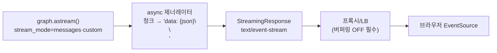

# 24. 배포와 운영

[20장](20-langgraph-advanced.md)에서 durable execution과 스트리밍을, [23장](23-guardrails-middleware.md)에서
가드레일까지 갖췄다면, 남은 것은 이 에이전트를 **서비스로 띄우고 계속 살아 있게 하는 일**입니다.
이 장은 컨테이너화(레이어 순서 설계), 체크포인터의 프로덕션 설정, 서빙 선택지(관리형 vs 자체 FastAPI),
LangGraph 스트리밍을 **SSE로 브라우저까지** 흘리는 패턴, 헬스체크·그레이스풀 셧다운·롤링 배포를 다룹니다.

## 1. 컨테이너화 — Dockerfile 레이어 순서가 빌드 시간을 정한다

Docker는 레이어 단위로 캐시하고, **한 레이어가 바뀌면 그 아래 모든 레이어를 다시 빌드**합니다.
원칙은 하나 — **자주 바뀌는 것일수록 아래(뒤)로.** 가장 자주 바뀌는 것은 코드, 가장 안 바뀌는
것은 의존성이므로 `requirements.txt`만 먼저 복사해 설치하고 코드는 마지막에 복사합니다.

```dockerfile
FROM python:3.12-slim
WORKDIR /app
# 1) 의존성 명세만 먼저 — 코드가 바뀌어도 이 레이어는 캐시 재사용
COPY requirements.txt .
RUN pip install --no-cache-dir -r requirements.txt
# 2) 코드는 마지막에 — 여기만 자주 무효화되도록
COPY . .
# 3) exec 폼 — SIGTERM이 프로세스에 직접 전달돼야 그레이스풀 셧다운이 된다(§5)
CMD ["uvicorn", "app:app", "--host", "0.0.0.0", "--port", "8000"]
```

!!! warning "순서를 뒤집으면 매번 5분 빌드"
    `COPY . .`을 먼저 하면 코드 한 줄 수정에도 `pip install` 레이어가 무효화되어 무거운
    의존성을 매 빌드마다 다시 받습니다 — CI 빌드가 느리다면 십중팔구 이 순서 문제입니다.
    `.dockerignore`에 `.venv`와 `.env`를 꼭 넣으세요 — `.env`가 이미지에 구워지는 사고는 실제로 흔합니다.

## 2. 상태는 컨테이너 밖으로 — PostgresSaver 프로덕션 설정

컨테이너는 언제든 죽고 다시 뜹니다(롤링 배포, 오토스케일링, 크래시). 대화 상태를 컨테이너 안
(InMemory/로컬 SQLite)에 두면 배포할 때마다 대화가 증발합니다 — [06장](06-short-term-memory.md)
설계 가이드의 결론(**프로덕션 기본값은 `PostgresSaver`**)이 배포 관점에서도 그대로 유효합니다.

```python
# pip install langgraph-checkpoint-postgres "psycopg[binary,pool]"
from langgraph.checkpoint.postgres.aio import AsyncPostgresSaver

# FastAPI 같은 비동기 서버에서는 AsyncPostgresSaver + 커넥션 풀
async with AsyncPostgresSaver.from_conn_string(DB_URI) as checkpointer:
    await checkpointer.setup()      # 최초 1회 — 배포 파이프라인의 마이그레이션 단계에서
    graph = builder.compile(checkpointer=checkpointer)
```

- **`setup()`은 배포 단계에서 1회** — 앱 기동마다 호출하지 말고 마이그레이션 잡으로 분리.
- **접속 정보는 환경변수/시크릿 주입** — 이미지에 굽지 않기(→ [14장](14-permissions-security-hitl.md)).
  OSS PostgresSaver에는 TTL이 없으므로 비활성 스레드 정리 배치도 함께 배포합니다([06장](06-short-term-memory.md)).
- 상태가 밖에 있으면 **인스턴스가 무상태(stateless)** 가 되어 수평 확장·롤링 배포(§5)가 자유로워집니다.

## 3. 서빙 선택지 — 관리형 플랫폼 vs 자체 FastAPI

LangGraph 그래프를 서비스로 노출하는 길은 크게 둘입니다. LangGraph Platform은 2025년 10월
**LangSmith Deployment**로 이름이 바뀌었고, Cloud(SaaS) / Hybrid(제어부만 SaaS) / 완전
셀프호스팅의 3가지 배포 옵션을 제공합니다.

| 축 | LangSmith Deployment (관리형) | 자체 FastAPI 서버 |
|----|-------------------------------|-------------------|
| 구축 속도 | 그래프 푸시로 끝 — 서버 코드 없음 | 엔드포인트·스트리밍·재개 로직 직접 구현 |
| 내장 기능 | 태스크 큐, cron, 스레드/메모리 API, Studio | 필요한 것만 직접 — FastAPI 생태계 활용 |
| 스케일링 | 플랫폼이 처리 | 오케스트레이터(K8s 등)와 직접 설계 |
| 비용 구조 | 노드 실행당 과금 + 플랜 요금 | 인프라 비용 + 구현·운영 인건비 |
| 종속성 | 벤더 API·과금 모델에 결합 | 완전 제어 — Aegra 같은 호환 OSS 대안도 존재 |
| 잘 맞는 곳 | 소규모 팀, 빠른 출시, 장기 실행 잡 | 기존 백엔드에 통합, 규제·비용 통제, 커스텀 인증 |

"플랫폼 아니면 맨손"이 아닙니다 — 자체 FastAPI라도 체크포인터(§2)와 트레이싱([13장](13-debugging-observability.md))을
붙이면 플랫폼 기능의 상당 부분이 재현됩니다. 예제 28이 그 최소 골격입니다.

## 4. 스트리밍 서빙 — stream_mode를 SSE로 브라우저까지

[20장](20-langgraph-advanced.md)의 `stream_mode`는 파이썬 프로세스 안의 이야기였습니다.
브라우저까지 토큰을 흘리는 전송 계층으로는, 에이전트 응답처럼 **서버→클라이언트 단방향**
스트림에 **SSE(Server-Sent Events)** 가 표준입니다 — 일반 HTTP라 프록시·인증을 그대로
통과하고, 브라우저 `EventSource`가 재연결을 내장합니다.



핵심 패턴 — LangGraph 청크를 SSE 프레임(`data: ...\n\n`)으로 바꾸는 async 제너레이터를 `StreamingResponse`에 넘깁니다.

```python
@app.get("/chat/stream")
async def chat_stream(q: str, thread_id: str):
    async def gen():
        cfg = {"configurable": {"thread_id": thread_id}}
        async for token, _meta in graph.astream({"messages": [("user", q)]}, cfg, stream_mode="messages"):
            yield f"data: {json.dumps({'type': 'token', 'text': token.content}, ensure_ascii=False)}\n\n"
        yield 'data: {"type": "done"}\n\n'
    return StreamingResponse(gen(), media_type="text/event-stream",
                             headers={"Cache-Control": "no-cache", "X-Accel-Buffering": "no"})
```

운영에서 반드시 챙길 세 가지:

- **프록시 버퍼링 끄기** — Nginx 등이 응답을 모아 보내면 "한 방에 다 오는" 증상이 됩니다. `X-Accel-Buffering: no`로 해제.
- **하트비트** — 15~30초마다 SSE 주석(`: keep-alive\n\n`)을 보내 LB의 유휴 타임아웃에 연결이 잘리는 것을 방지.
- **재연결 설계** — `EventSource`는 자동 재연결하지만 서버가 어디까지 보냈는지는 모릅니다.
  같은 `thread_id`로 상태를 복원하는(§2) 설계가 재연결의 기반입니다.

## 5. 헬스체크 · 그레이스풀 셧다운 · 롤링 배포 — 무중단의 3요소

- **헬스체크 2종 분리** — *liveness*(프로세스 생존 — 실패 시 재시작)와 *readiness*(트래픽 받을
  준비 — DB·모델 API 도달 가능 여부, 실패 시 라우팅 제외)를 분리합니다. readiness에 LLM 호출을
  넣지 마세요 — 헬스체크가 청구서가 됩니다.
- **그레이스풀 셧다운** — SIGTERM을 받으면 (1) readiness를 실패로 바꿔 새 요청을 끊고, (2) 진행
  중인 스트림·그래프 스텝을 마무리하고, (3) 커넥션을 정리한 뒤 종료. FastAPI `lifespan`이 정리
  지점이고 §1의 exec 폼 CMD가 신호 전달의 전제입니다. 종료 유예는 **가장 긴 정상 스트림 시간보다 길게**.
- **롤링 배포와 durable execution** — 유예 안에 못 끝나는 장기 잡은 [20장](20-langgraph-advanced.md)의
  durability가 보험입니다 — 체크포인트가 Postgres(§2)에 있으므로 새 인스턴스가 같은 `thread_id`로
  **멈춘 스텝부터 재개**합니다. "배포 = 프로세스 교체"를 전제로 설계하면 배포가 두렵지 않게 됩니다.

## 6. 비용·운영 모니터링

배포 후의 관측은 [13장](13-debugging-observability.md) 트레이싱 위에 **운영 신호**를 얹는 일입니다.

| 신호 | 왜 | 경보 기준 예 |
|------|-----|-------------|
| 요청당 토큰·비용 | 폭주 루프·컨텍스트 비대의 조기 감지 | 요청당 비용 p95가 기준선 2배 |
| 턴 수·도구 호출 수 | 무한 루프, 비효율 궤적 | 태스크당 턴 수 상한 초과율 |
| 스트림 시작 지연(TTFT)·동시 활성 스트림 수 | 체감 품질·스케일링 신호(SSE는 연결을 오래 점유) | TTFT p95 > 3초, 인스턴스당 상한의 80% |
| 가드레일 차단률([23장](23-guardrails-middleware.md)) | 공격 급증 또는 오탐 급증 | 급격한 변화율 |

토큰 예산·모델 분리 같은 비용 레버 자체는 [15장](15-evaluation-cost.md) §4를 그대로 적용합니다.

## 따라하기 — 예제 28: FastAPI + SSE 스트리밍 서빙

이 장의 실습은 [`examples/28_serve_fastapi.py`](https://github.com/agent-chobi/agent-atoz/blob/main/examples/28_serve_fastapi.py)입니다.
추가 라이브러리(sse-starlette) 없이 **표준 `StreamingResponse`만으로** 에이전트 응답을 SSE로
스트리밍하는 최소 서버로, 헬스체크와 lifespan 정리(그레이스풀 셧다운의 축소판)까지 포함합니다.
(전체 예제 목록은 [매핑표](https://github.com/agent-chobi/agent-atoz/blob/main/examples/README.md) 참고)

**1) 사전 준비**

```bash
pip install fastapi uvicorn anthropic python-dotenv
# .env 에 ANTHROPIC_API_KEY=sk-ant-... 설정
```

**2) 실행**

```bash
python examples/28_serve_fastapi.py          # 127.0.0.1:8000 에서 기동
# 다른 터미널에서:
curl http://127.0.0.1:8000/health
curl -N --get --data-urlencode "q=SSE가 뭐야? 두 문장으로" http://127.0.0.1:8000/chat/stream
```

**3) 기대 출력 요지** — `/health`는 `{"status":"ok",...}`를, `/chat/stream`은 SSE 프레임을 실시간으로 흘립니다.

```text
data: {"type": "start", "model": "claude-opus-4-8"}
data: {"type": "token", "text": "SSE"}
...
data: {"type": "done", "input_tokens": 32, "output_tokens": 118}
```

**4) 흔한 에러**

| 증상 | 원인 / 해결 |
|------|-------------|
| 기동 시 `RuntimeError: ANTHROPIC_API_KEY...` | `.env` 미설정 — 키 가드가 서버 기동 자체를 막습니다(의도된 동작). |
| curl 출력이 끝나고 한 번에 나옴 | `-N`(버퍼링 해제) 플래그 누락. 프록시 뒤라면 §4의 버퍼링 항목 확인. |
| `Address already in use` | 8000 포트 점유 — 파일 하단 `uvicorn.run`의 `port` 변경. |
| `ModuleNotFoundError: fastapi` | `pip install fastapi uvicorn`. |

## 설계 가이드 — 배포 아키텍처를 어떻게 정할 것인가

위 절들이 부품이라면, 여기서는 서빙 방식 결정 → 확장 전략 → 배포 절차 순으로 조립합니다.

### 서빙 방식 결정 트리

```mermaid
flowchart TD
    A{"에이전트가 기존 제품 백엔드의<br/>일부인가, 독립 서비스인가?"} -->|기존 백엔드에 통합| F["자체 FastAPI<br/>— 기존 인증·배포 파이프라인 재사용"]
    A -->|독립 서비스| B{"데이터가 외부 SaaS로<br/>나가도 되는가?"}
    B -->|아니오| C{"플랫폼 운영 여력이 있는가?"}
    C -->|예| H["LangSmith Deployment<br/>Hybrid/셀프호스팅"]
    C -->|아니오| F2["자체 FastAPI + Postgres<br/>(예제 28 골격 + §2)"]
    B -->|예| D{"장기 실행 잡·큐·cron이<br/>핵심 요구인가?"}
    D -->|예| P["LangSmith Deployment Cloud<br/>— 큐·재개가 내장"]
    D -->|"아니오 — 요청/응답 위주"| F3["자체 FastAPI로 시작<br/>— 필요해지면 플랫폼 재평가"]
```



### 확장 전략 — 무엇이 먼저 병목이 되나

에이전트 서버의 부하는 CPU가 아니라 **대기(I/O)** 입니다. LLM 응답을 기다리는 동안 연결만
점유하므로, 병목은 보통 이 순서로 옵니다.

1. **동시 연결 수** — SSE 스트림은 수십 초씩 연결을 잡습니다. async 서버(uvicorn)를 전제로
   인스턴스당 동시 스트림 상한을 정하고 §6의 지표로 감시 → 수평 확장.
2. **체크포인터 DB** — 인스턴스 수 × 커넥션 풀 크기가 DB `max_connections` 안에 들어오는지 먼저 확인.
3. **LLM API rate limit** — 인스턴스를 늘려도 모델 API 한도가 천장입니다. 재시도·백오프와
   요청 큐잉을 앱 레벨에 두고, 한도 상향은 별도 트랙으로.

워커 수 설계: 컨테이너 환경에서는 uvicorn 멀티 워커보다 **1컨테이너 1워커 × 레플리카 수**가
관측·롤링 배포 단위로 깔끔합니다.

### 배포 절차 체크리스트

- [ ] 이미지에 비밀이 없다 — `.dockerignore`에 `.env`, 시크릿은 런타임 주입([14장](14-permissions-security-hitl.md)).
- [ ] 마이그레이션(체크포인터 `setup()` 포함)이 앱 기동과 분리된 단계로 있다(§2).
- [ ] readiness와 liveness가 분리돼 있고, SIGTERM 경로를 로컬에서 실제로 테스트했다(§5).
- [ ] 롤백 계획 — 이전 이미지 태그로 즉시 복귀 가능, 체크포인트 스키마가 하위 호환된다.
- [ ] 배포 직후 볼 대시보드가 정해져 있다 — §6 지표 + 에러율, 그리고 [15장](15-evaluation-cost.md)의
      스모크 평가셋을 배포 파이프라인에서 1회 실행.

## 실무 트레이드오프

| 축 | 관리형 (Deployment Cloud) | 셀프호스팅 플랫폼 (Hybrid/Self-hosted) | 자체 FastAPI + Postgres |
|----|---------------------------|----------------------------------------|--------------------------|
| 구축 비용 | 최저 | 플랫폼 설치·운영 필요 | 서버 코드 직접(예제 28 수준이면 낮음, 큐·재개까지면 큼) |
| 운영 부담 | 벤더가 처리 | 업그레이드·스케일링 직접 | 전부 직접 — 대신 기존 운영 체계에 편입 |
| 데이터 주권·기능 | 벤더 클라우드 / 큐·cron·Studio 내장 | 내 인프라 / 동일 기능 | 내 인프라 / 필요한 만큼만 — 나머지는 부채 |
| 비용 모델 | 노드 실행당 과금 — 트래픽 커지면 급증 | 라이선스/플랜 + 인프라 | 인프라 + 인건비 — 규모가 크면 유리한 경향 |

!!! tip "실무 절충"
    갈림길의 실제 기준은 기능이 아니라 **팀의 운영 여력**입니다. 백엔드·인프라 인력이 있으면
    자체 FastAPI가 기존 체계(인증·CI/CD·모니터링)에 자연스럽게 얹히고, 없으면 관리형이 그 인력을
    대신합니다. 어느 쪽이든 상태 외부화(§2)와 트레이싱([13장](13-debugging-observability.md))을 지켜 두면 갈아타는 비용이 크게 줄어듭니다.

## 2026 실무 트렌드

- **LangGraph Platform → LangSmith Deployment 재편** — 2025년 10월 리네이밍 후 Cloud/Hybrid/
  Self-hosted 3옵션 체계로 정리됐고, 노드 실행당 과금이라 트래픽 규모별 비용 시뮬레이션이
  도입 검토의 핵심이 됐습니다. Aegra처럼 이 API를 FastAPI + PostgreSQL로 재현하는 오픈소스
  대안도 등장해 관리형과 수제 사이의 중간 지대가 생겼습니다.
- **SSE가 에이전트 서빙의 사실상 표준** — 단방향 스트리밍에는 WebSocket 대신 SSE가 기본값이
  됐고, 하트비트·프록시 버퍼링·타임아웃 정렬(§4)이 운영 체크리스트로 정형화됐습니다.
  OpenAI·Anthropic API 자체가 SSE로 스트리밍하는 것도 이 표준화를 밀었습니다.
- **durable-first 운영** — 체크포인터 외부화 + 그레이스풀 셧다운 + 재개(§5)를 갖춰 롤링 배포
  중에도 장기 실행 잡이 이어지는 설계가 프로덕션 요건으로 굳었습니다([20장](20-langgraph-advanced.md)).

## 실전 레퍼런스

- [LangGraph Platform is now Generally Available — LangChain Blog](https://www.langchain.com/blog/langgraph-platform-ga) — 관리형 서빙이 제공하는 기능(큐·스레드·재개)의 공식 소개.
- [Deployment options — LangChain 공식 문서](https://docs.langchain.com/langgraph-platform/deployment-options) — Cloud/Hybrid/Self-hosted 3옵션 비교의 원문.
- [Building best practices — Docker 공식 문서](https://docs.docker.com/build/building/best-practices/) — §1 레이어 순서·캐시 원칙의 공식 근거.
- [Aegra — GitHub](https://github.com/aegra/aegra) — LangGraph Platform의 오픈소스 대안(FastAPI + PostgreSQL 셀프호스팅).

### 함께 보면 좋은 한국어 자료

- [컨테이너의 FastAPI - 도커 — FastAPI 공식 문서(한국어)](https://fastapi.tiangolo.com/ko/deployment/docker/) — 이 장 §1의 Dockerfile 패턴을 한국어로 따라 할 수 있는 공식 번역 문서
- [FastAPI와 OpenAI를 사용한 SSE 기반 비동기 스트리밍 구현 — velog](https://velog.io/@byu0hyun/FastAPI%EC%99%80-OpenAI-%EB%B9%84%EB%8F%99%EA%B8%B0-%EC%8A%A4%ED%8A%B8%EB%A6%AC%EB%B0%8D-%EC%82%AC%EC%9A%A9) — LLM 응답을 SSE로 스트리밍하는 구현 과정을 한국어 코드와 함께 설명하는 실전 글

## 참고 자료

- [LangGraph Streaming — 공식 문서](https://docs.langchain.com/oss/python/langgraph/streaming) — stream_mode 4종([20장](20-langgraph-advanced.md)에서 상세).
- [Durable execution — 공식 문서](https://docs.langchain.com/oss/python/langgraph/durable-execution) — 재개(§5)의 기반 메커니즘.
- [06장 단기 메모리](06-short-term-memory.md) — PostgresSaver 선택 기준과 보존 정책.
- 실습 코드: [`examples/28_serve_fastapi.py`](https://github.com/agent-chobi/agent-atoz/blob/main/examples/28_serve_fastapi.py)
