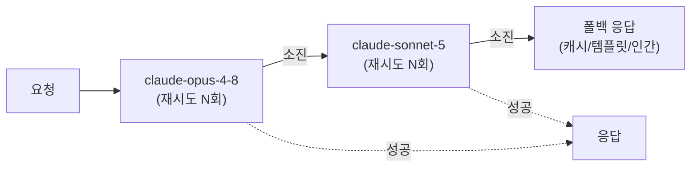
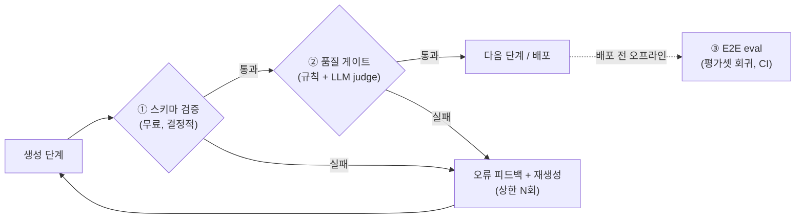

# 25. 신뢰성 & 워크플로 검증

에이전트가 데모에서 도는 것과 프로덕션에서 **매일 수천 번** 도는 것은 다른 문제입니다.
LLM API 호출은 1~5%가 레이트리밋·타임아웃·서버 오류로 실패하고, 형식이 완벽한 출력도
내용은 틀릴 수 있습니다. 이 챕터는 두 축을 다룹니다 — **에러 복구**(재시도·폴백·서킷브레이커로
"실패해도 죽지 않게")와 **워크플로 검증**(검증 게이트로 "불량 산출물이 하류로 새지 않게").

!!! note "15장과의 역할 분담"
    [15장](15-evaluation-cost.md)은 **평가 방법론** — 누가(규칙/judge/사람) 어떻게 채점하고
    judge를 어떻게 보정하는가를 다룹니다. 이 챕터는 그 채점자들을 **파이프라인 어디에,
    어떤 순서로 끼워 넣어 실행 중에 불량을 차단·재생성하는가**를 다룹니다. 15장이 "저울
    만들기"라면 25장은 "저울을 공정 라인에 설치하기"입니다.

## 1. 에러 복구 — 실패의 종류부터 구분하라

모든 실패를 같은 방식으로 다루면 안 됩니다. **일시적(transient)** 실패는 재시도가 답이고,
**결정적(deterministic)** 실패는 재시도해 봐야 같은 결과입니다.

| 실패 유형 | 예 | 대응 |
|-----------|----|------|
| 일시적 | 429(레이트리밋), 5xx, 529(과부하), 네트워크 단절 | **지수 백오프 재시도** |
| 지속적 | 특정 엔드포인트/모델 장애가 수 분간 지속 | **서킷브레이커** + 폴백 |
| 결정적 | 400(잘못된 요청), 인증 오류, 스키마 위반 코드 버그 | 재시도 금지 — 수정 또는 인간 에스컬레이션 |
| 의미적 | 형식은 유효하나 내용이 틀림/저품질 | **검증 게이트**(§3) → 피드백 재생성 |

### 1.1 지수 백오프 재시도

재시도 간격을 1초 → 2초 → 4초처럼 늘리고(백오프), 무작위 지연(jitter)을 더해 동시 재시도
폭주(thundering herd)를 막습니다. Anthropic SDK는 429·5xx·연결 오류를 **기본 2회 자동
재시도**하므로(`max_retries`로 조정), 커스텀 재시도는 SDK가 못 하는 것 — 폴백 모델 전환,
게이트 실패 시 재생성 — 에만 쓰는 것이 정석입니다.

### 1.2 폴백 모델 체인과 서킷브레이커

재시도를 소진했다면 **다른 모델로 갈아탑니다**. Opus가 과부하면 Sonnet으로, 그것도 안 되면
Haiku 또는 캐시된 응답/정중한 실패 메시지로 — 층을 이루는 강등(graceful degradation)입니다.



**서킷브레이커**는 실패율이 임계를 넘으면 회로를 열어(Open) 일정 시간 호출 자체를 차단하고,
반열림(Half-Open) 상태에서 소수 요청으로 회복을 탐지한 뒤 닫습니다(Closed). 장애 중인
엔드포인트에 재시도를 퍼붓는 "재시도 폭풍"과 연쇄 장애를 막는 장치로, 폴백 체인과 함께
쓰면 "열린 회로 → 즉시 폴백 모델"로 지연 없이 우회합니다.

!!! warning "멱등성(idempotency) 없이는 재시도도 위험하다"
    "이메일 발송" 도구가 성공했는데 응답만 유실됐다면, 재시도는 **중복 발송**이 됩니다.
    부작용 있는 도구는 요청에 멱등성 키(idempotency key)를 붙여 같은 키의 재실행을
    서버가 무시하게 하거나, "조회 후 없으면 생성" 패턴으로 설계하세요. 읽기 전용 도구만
    안심하고 재시도할 수 있습니다.

### 1.3 LangGraph의 노드 재시도 — `retry_policy`

[04장](04-langgraph-state-graph.md)의 그래프에서는 재시도를 노드 단위로 선언합니다.
`add_node`에 `retry_policy`를 넘기면 해당 노드만 재실행됩니다 — 전체 그래프가 아니라요.

```python
from langgraph.types import RetryPolicy

builder.add_node(
    "call_api", call_api,
    retry_policy=RetryPolicy(
        max_attempts=3,        # 첫 시도 포함 최대 3회
        initial_interval=0.5,  # 첫 재시도까지 0.5초
        backoff_factor=2.0,    # 간격을 2배씩
        jitter=True,           # 무작위 지연 추가
        # retry_on=...         # 재시도할 예외 타입/판별 함수 (기본: 5xx·연결 오류)
    ),
)
```

기본 정책은 연결 오류·HTTP 5xx 같은 일시적 실패만 재시도하고 `ValueError`·`TypeError` 같은
결정적 오류는 재시도하지 않습니다 — §1의 분류가 API에 그대로 반영된 설계입니다.

### 1.4 Send 팬아웃의 부분 실패

[09장](09-multi-agent-patterns.md)의 `Send` 팬아웃에서 워커 5개 중 1개가 죽으면?
LangGraph의 슈퍼스텝(superstep)은 **원자적**입니다 — 병렬 노드 중 하나라도 실패하면 그
스텝 전체가 실패로 처리되고 상태에 반영되지 않습니다. 단, 체크포인터가 있으면 성공한
노드의 결과는 내부 저장되어 **재개 시 실패한 브랜치만 다시 실행**됩니다. 실무 패턴 두 가지:

- **체크포인터 + 노드 `retry_policy`** — 실패 브랜치만 자동 재시도, 성공분은 재실행 안 함.
- **센티널 반환** — 워커 안에서 `try/except`로 감싸고 실패 시 `{"error": ...}` 값을 반환,
  취합(fan-in) 노드가 부분 결과로 진행할지·재시도할지 결정([19장](19-workflow-patterns.md)의
  "부분 결과로 취합 진행"과 같은 원칙).

## 2. 워크플로 검증 — 3계층 게이트

에러 복구가 "호출이 죽는" 문제였다면, 검증은 "호출은 성공했지만 **산출물이 불량**인"
문제입니다. 게이트를 싼 것부터 비싼 것 순으로 쌓습니다.



- **① 중간 산출물 스키마 검증** — 각 단계의 출력이 다음 단계가 소비할 계약(스키마)을
  지키는지. [18장](18-structured-output.md)의 `output_config.format`·strict tool use가 형식을
  100% 보장하고, Pydantic `model_validator`가 비즈니스 규칙(합계 일치, 날짜 유효성)을 잡습니다.
  실패 시 오류 메시지를 대화에 되돌려 재시도(18장 6절) — 거의 무료이므로 **전수 적용**.
- **② 품질 게이트** — 규칙 검사(길이·금칙어·필수 항목)를 먼저, 통과분만 LLM judge가
  rubric으로 채점([15장](15-evaluation-cost.md) §2). 임계 미달이면 judge의 근거(reasoning)를
  피드백으로 붙여 재생성합니다. 이것이 [19장](19-workflow-patterns.md) §6
  **Evaluator-Optimizer의 실전 형태**입니다 — 반복 상한과 "개선 없으면 조기 종료"를 코드로
  못 박고, 최종 미달 시 인간 폴백 큐로 보냅니다.
- **③ E2E eval** — 게이트 ①②가 런타임(온라인) 방어라면, ③은 **배포 전(오프라인)** 방어입니다.
  고정 평가셋으로 전체 워크플로를 돌려 회귀를 잡습니다(평가셋 구축·judge 보정·임계값 설계는
  15장 설계 가이드 참고). Anthropic도 Claude Code에 대해 "자동 eval을 CI/CD에서 모든 변경과
  모델 업그레이드마다 돌리는 것이 품질 문제의 1차 방어선"이라고 정리했습니다.

### 결정적 테스트 — 도구 모킹과 트레이스 재생

E2E eval은 LLM을 실제로 호출하므로 느리고 비결정적입니다. **파이프라인 배관 자체**(라우팅
분기, 게이트 로직, 재시도 경로)는 LLM 없이 검증할 수 있어야 합니다.

- **도구 모킹** — 도구·LLM 응답을 고정값으로 대체해 "judge가 3점을 주면 재생성 루프에
  들어가는가?" 같은 분기를 일반 유닛 테스트로 확인. 결정적이라 CI에서 수 초에 끝납니다.
- **트레이스 재생(replay)** — [13장](13-debugging-observability.md)에서 수집한 프로덕션
  트레이스의 도구 결과를 그대로 되먹여 실패 상황을 재현. "화요일의 버그를 수요일에 같은
  입력으로" 디버깅할 수 있습니다.
- **CI 배치** — PR마다: 결정적 테스트(전수) + 소형 스모크 eval(10~20케이스, Haiku judge).
  nightly: 전체 평가셋. LangSmith `pytest` 플러그인(`@pytest.mark.langsmith`)을 쓰면 평가셋과
  테스트 케이스가 하나로 관리되고, 점수 임계 미달 시 파이프라인을 실패시킬 수 있습니다.

## 따라하기

이 챕터의 예제는 [`examples/29_reliability_validation.py`](https://github.com/agent-chobi/agent-atoz/blob/main/examples/29_reliability_validation.py)
입니다 — (A) 재시도+폴백 데코레이터가 일시적 실패를 흡수하는 과정과, (B) 스키마→규칙→LLM judge
3단 게이트가 불량 산출물을 잡아 재생성시키는 파이프라인을 시연합니다.
(전체 예제 목록은 [매핑표](https://github.com/agent-chobi/agent-atoz/blob/main/examples/README.md) 참고)

**1) 사전 준비**

```bash
pip install anthropic python-dotenv
# .env 에 ANTHROPIC_API_KEY=sk-ant-... 설정
```

**2) 실행**

```bash
python examples/29_reliability_validation.py
```

**3) 기대 출력 요지**

- (A) 가짜 불안정 함수가 2번 실패한 뒤 성공하는 동안, 데코레이터가 `0.5초 → 1.0초` 백오프
  로그를 찍고 3번째 시도에서 성공을 반환합니다. 모든 재시도 소진 시 폴백 모델로 넘어가는
  경로도 로그로 표시됩니다.
- (B) 1차 시도 산출물(실습을 위해 고의로 오염시킨 것)이 **규칙 게이트에서 FAIL** →
  실패 사유가 피드백으로 붙어 재생성 → 2차 산출물이 스키마·규칙·judge(4점 이상) 게이트를
  모두 통과해 `[최종 통과]`가 출력됩니다.

**4) 흔한 에러**

| 증상 | 원인 / 해결 |
|------|-------------|
| `AuthenticationError` (401) | `.env`의 `ANTHROPIC_API_KEY` 미설정·오타 |
| 실행 비용이 부담됨 | 기본 모델이 Opus — 파일 상단 `MODEL`을 `claude-haiku-4-5`로 변경 |
| judge 게이트에서 계속 FAIL | LLM 채점의 비결정성 — 재생성 상한(2회) 도달 시 인간 폴백으로 처리되는 것이 **정상 동작**입니다 |
| `RateLimitError` 429 | 데코레이터가 자동 재시도 — 계속되면 조직 한도 확인 |

## 설계 가이드 — 어디에 어떤 방어를 둘 것인가

### 실패 지점별 방어 장치 매핑

| 실패 지점 | 1차 방어 | 2차 방어 | 최후 방어 |
|-----------|----------|----------|-----------|
| LLM API 호출 | SDK 자동 재시도(429/5xx) | 폴백 모델 체인 | 캐시 응답/정중한 실패 |
| 도구 호출 | 지수 백오프(멱등 확인 후) | `is_error` 결과로 모델에 위임([02장](02-tool-use-agent-loop.md)) | 해당 도구 없이 진행 지시 |
| 외부 서비스 지속 장애 | 서킷브레이커(차단) | 대체 서비스/캐시 | 기능 축소 모드 |
| 중간 산출물 형식 | 스키마 강제(18장) | 오류 피드백 재시도 | 완화 스키마 → 인간 폴백 |
| 중간 산출물 품질 | 규칙 게이트 | judge 게이트 + 재생성 | 인간 검수 큐 |
| 워크플로 회귀 | 결정적 테스트(PR) | 스모크 eval(PR) | 전체 eval(nightly) + 배포 보류 |

### 게이트 배치 결정 기준

1. **모든 단계 경계에 스키마 게이트** — 공짜입니다. 안 달 이유가 없습니다. 19장의 원칙
   그대로: "단계 사이 계약은 반드시 구조화 출력으로 고정."
2. **judge 게이트는 비싼 곳에만** — 호출 1회 = 비용+지연. 사용자에게 직접 나가는 출력,
   되돌리기 어려운 액션(발송·결제) 직전, 하류 비용이 큰 분기점에 배치합니다. 내부 중간
   단계는 규칙 게이트로 충분한 경우가 많습니다.
3. **재생성 상한은 2~3회** — 그 이상 반복해도 통과율은 별로 안 오르고 비용만 늡니다.
   상한 도달 케이스는 버리지 말고 평가셋으로 승격해([15장](15-evaluation-cost.md)) 회귀
   테스트로 만드세요 — 이것이 온라인 실패를 오프라인 방어로 환류하는 고리입니다.
4. **복구 지점은 상태를 되돌릴 수 있는 곳에** — 게이트에서 실패를 감지해도, 재실행은
   "해당 단계만"이어야 합니다(전체 재실행 금지). LangGraph 체크포인터([06장](06-short-term-memory.md))가
   이 부분 재실행의 기반입니다.

### 재시도 예산(retry budget)

재시도 × 폴백 × 재생성이 중첩되면 최악의 경우 호출 수가 곱으로 늘어납니다
(재시도 3 × 폴백 2 × 재생성 3 = 최대 18회). **태스크 전체의 시도 예산**을 하나 두고
(예: "총 LLM 호출 8회 초과 시 중단"), 각 층의 상한을 그 안에서 배분하세요. 예산 소진 시의
행동(부분 결과 반환 vs 실패 보고)도 코드로 정해 둬야 합니다.

## 실무 트레이드오프

| 장치 | 비용 | 지연 | 복잡도 | 주의점 |
|------|------|------|--------|--------|
| 지수 백오프 재시도 | 실패 시에만 추가 호출 | 백오프만큼 증가 | 낮음(SDK 내장) | 결정적 오류까지 재시도하면 낭비 |
| 폴백 모델 체인 | 폴백 모델 단가 | 전환 1회분 | 낮음 | 모델 전환 시 프롬프트 캐시 무효화, 품질 편차 |
| 서킷브레이커 | 거의 0 | 열림 상태에선 즉시 실패(빠름) | 중간 | 임계·회복 시간 튜닝 필요 |
| 스키마 게이트 | 거의 0 | 무시 가능 | 낮음 | 형식만 보장 — 내용은 못 봄 |
| judge 게이트 | 호출 +1(Haiku면 저렴) | 호출 1회분 | 중간 | 비결정성, 자기채점 편향(15장) |
| E2E eval(CI) | 평가셋 × 실행 비용 | 배포 파이프라인 수 분 | 높음 | 평가셋 유지보수, 임계값은 상대 하락 기준 |

핵심 판단: **런타임 게이트(①②)는 지연·비용을 사용자당 지불**하고, **오프라인 eval(③)은
배포당 지불**합니다. 트래픽이 크면 런타임 게이트를 위험 경로에만 좁히고 오프라인 방어를
두껍게, 트래픽이 작고 실수 비용이 크면(B2B 문서 생성 등) 런타임 게이트를 전수로 거는 것이
경제적입니다.

## 2026 실무 트렌드

- **신뢰성 계층의 상품화** — 재시도·폴백·서킷브레이커를 애플리케이션 코드가 아니라 LLM
  게이트웨이(Portkey·LiteLLM 등)나 프레임워크 선언(LangGraph `retry_policy`)으로 내리는
  구성이 표준이 되고 있습니다. 비즈니스 로직과 신뢰성 로직의 분리가 설계 원칙으로 자리잡는 중.
- **eval의 CI 1급 시민화** — Anthropic의 "Demystifying evals" 이후, 자동 eval을 코드 변경·모델
  업그레이드마다 CI에서 돌리고 프로덕션 모니터링과 짝지우는 2단 구조가 업계 컨센서스가
  됐습니다. LangSmith pytest·Vitest 통합처럼 "테스트 = 평가셋"으로 관리하는 도구도 성숙.
- **멀티에이전트 재시도 폭풍의 부상** — 에이전트가 에이전트를 부르는 구조에서 각 층이
  독립 재시도하면 지수적으로 증폭되는 문제가 보고되면서, 서킷브레이커와 태스크 수준
  재시도 예산이 멀티에이전트 설계 체크리스트에 포함되기 시작했습니다.
- **결정적 백본 위의 검증 게이트** — [19장](19-workflow-patterns.md)의 "결정적 백본 + 지점
  에이전트" 구조에서, 게이트를 코드(결정적)로 두고 LLM 판단은 게이트 안쪽에만 가두는
  배치가 실무 표준으로 정착했습니다.

## 실전 레퍼런스

- [Fault Tolerance in LangGraph: Retries, Timeouts and Error Handlers — LangChain Blog](https://www.langchain.com/blog/fault-tolerance-in-langgraph) — `retry_policy`·타임아웃·에러 핸들러를 노드에 붙이는 공식 해설.
- [Demystifying evals for AI agents — Anthropic Engineering](https://www.anthropic.com/engineering/demystifying-evals-for-ai-agents) — Claude Code 팀이 실제로 쓰는 평가 전략. CI 자동 eval + 프로덕션 모니터링의 2단 방어 구조의 출처.
- [Retries, fallbacks, and circuit breakers in LLM apps — Portkey](https://portkey.ai/blog/retries-fallbacks-and-circuit-breakers-in-llm-apps/) — 세 장치를 언제 무엇으로 쓸지 구분하는 실무 가이드.
- [How to run evaluations with pytest — LangSmith Docs](https://docs.langchain.com/langsmith/pytest) — 평가셋을 pytest 테스트 케이스로 정의해 CI에 끼우는 공식 문서.

### 함께 보면 좋은 한국어 자료

- [LLMOps로 확장하는 AI플랫폼 2.0 — 우아한형제들 기술블로그](https://techblog.woowahan.com/22839/) — 요청의 입출력·재시도·지연·비용을 트레이스 단위로 기록하고 이상 패턴을 감지하는 국내 실전 LLMOps 구축기.
- [에이닷 운영 효율화 사례: Agent(LLM) 운영체계와 프롬프트 엔지니어링 실무 — SK 데보션(DEVOCEAN)](https://devocean.sk.com/blog/techBoardDetail.do?ID=166281&boardType=techBlog) — 대규모 LLM 에이전트 서비스를 운영하며 품질·안정성을 관리하는 체계를 공유한 사례.

## 참고 자료

- [RetryPolicy — LangGraph Reference](https://reference.langchain.com/python/langgraph/types/RetryPolicy)
- [Errors — Claude API 공식 문서](https://platform.claude.com/docs/en/api/errors)
- [18장 구조화된 출력](18-structured-output.md) — 게이트 ①의 계약 도구
- [15장 평가 & 비용](15-evaluation-cost.md) — 게이트 ②③의 채점 방법론
- 실습 코드: [`examples/29_reliability_validation.py`](https://github.com/agent-chobi/agent-atoz/blob/main/examples/29_reliability_validation.py)
