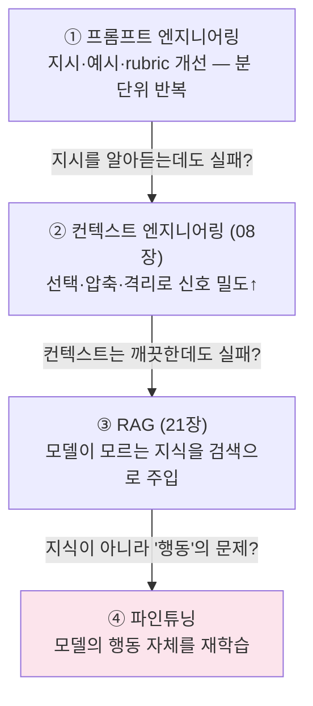

# 26. 파인튜닝으로 에이전트 강화

지금까지 이 저장소는 에이전트 품질을 **모델 바깥에서** 끌어올렸습니다 — 프롬프트, 컨텍스트,
검색, 워크플로. 이 챕터는 마지막 수단인 **모델 자체를 바꾸는** 선택지를 다룹니다: 언제
파인튜닝이 정당한지(대부분은 아닙니다), 방법론(SFT/DPO/RFT/증류)은 무엇이 다른지, 에이전트에
특히 중요한 **도구 호출(tool-use) 파인튜닝**을 위해 프로덕션 트레이스를 학습 데이터로 바꾸는
법, 그리고 2026년 현재 프로바이더별로 무엇이 실제로 가능한지를 정리합니다.

## 1. 에스컬레이션 사다리 — 파인튜닝은 마지막 계단

품질 문제를 만나면 아래 사다리를 **순서대로** 올라가야 합니다. 각 계단은 아래 계단보다
비싸고 되돌리기 어렵기 때문입니다.



| 문제의 성격 | 올바른 계단 | 이유 |
|-------------|-------------|------|
| 지시를 다르게 해석함, 형식이 흔들림 | ① 프롬프트 / [18장](18-structured-output.md) 스키마 강제 | 가장 싸고 즉시 반복 가능 |
| 관련 없는 정보에 휘둘림, 긴 대화에서 붕괴 | ② [컨텍스트 엔지니어링](08-context-engineering.md) | 넣는 것을 고치는 게 모델을 고치는 것보다 먼저 |
| 최신·사내 지식을 모름 | ③ [RAG](21-rag-agentic-rag.md) | **지식**은 파인튜닝으로 주입하는 것이 아니라 검색으로 주입 |
| 도메인 말투·판단 스타일·도구 호출 습관이 계속 어긋남 | ④ 파인튜닝 | 프롬프트로 매번 가르치던 "행동"을 가중치에 굽는다 |

!!! danger "파인튜닝으로 지식을 넣지 마라"
    "우리 회사 규정을 학습시키자"는 가장 흔한 오용입니다. 파인튜닝은 **스타일과 행동**을
    가르치는 데 강하고, 사실 지식 주입에는 약합니다(업데이트도 안 됩니다 — 규정이 바뀌면
    재학습). 지식은 RAG, 행동은 파인튜닝 — 이 구분이 이 챕터의 제1원칙입니다.

파인튜닝이 값을 하는 전형적 상황: **작은 모델을 특정 작업에서 큰 모델 수준으로**(비용·지연
절감), 프롬프트에 넣던 수천 토큰의 few-shot을 가중치로 흡수(토큰 절감), 도구 호출 정확도가
프롬프트 튜닝으로 한계에 달했을 때, 그리고 일관된 출력 포맷·톤이 계약 수준으로 요구될 때.

## 2. 방법론 한눈 비교 — SFT / DPO / RFT / 증류

| 방법 | 학습 신호 | 데이터 요구 | 강점 | 약점 |
|------|-----------|-------------|------|------|
| **SFT** (supervised fine-tuning) | 정답 시연(입력→모범 출력) | 수백~수천 쌍 | 단순·저렴, 포맷/스타일/도구 호출 습관에 최적 | 시연 품질에 상한이 묶임 |
| **DPO** (direct preference optimization) | 선호 쌍(좋은 답 vs 나쁜 답) | 선호 쌍 수백~수천 | "정답은 없지만 더 나은 답"이 있는 주관 품질(톤·안전성) | 쌍 데이터 구축 비용 |
| **RFT** (reinforcement fine-tuning) | 채점기(grader)의 보상 점수 | 케이스 수십~수백 + **채점기** | 정답 검증이 가능한 추론 작업에서 소량 데이터로 큰 향상 | 채점기 설계가 어렵고, 보상 해킹 위험 |
| **증류** (distillation) | 큰 모델의 출력을 작은 모델이 모방 | 큰 모델로 생성한 대량 시연 | 품질 유지하며 비용·지연 대폭 절감 | 교사 모델 수준을 넘지 못함 |

에이전트 실무에서의 조합: **큰 모델로 프로덕션을 돌리며 트레이스 수집 → 성공 트레이스로
작은 모델을 SFT(사실상 증류) → 채점 가능한 작업이면 RFT로 마무리**. RFT의 채점기는
[15장](15-evaluation-cost.md)의 rubric·judge 설계와 정확히 같은 문제입니다 — 평가 체계가
없으면 RFT는 시작조차 못 합니다.

## 3. 도구 호출 파인튜닝 — 트레이스가 데이터다

에이전트 파인튜닝의 중심은 **도구 호출 능력**입니다: 올바른 도구를, 올바른 인자로, 올바른
순서로. 다행히 학습 데이터는 이미 있습니다 — [13장](13-debugging-observability.md)에서
수집한 프로덕션 트레이스입니다.

```mermaid
flowchart LR
    TR["프로덕션 트레이스<br/>(13장 트레이싱)"] --> FLT["품질 필터<br/>성공만·중복 제거·길이"]
    FLT --> CONV["포맷 변환<br/>messages + tools (JSONL)"]
    CONV --> DS["학습 데이터셋"]
    DS --> FT["파인튜닝 (SFT)"]
    FT --> EV["평가셋으로 효과 측정<br/>(15장 — 필수!)"]
    EV --회귀 발견-.-> FLT
```

**변환** — 트레이스 하나가 학습 예제 하나가 됩니다. `messages` 포맷(system → user →
assistant의 `tool_calls` → `tool` 결과 → 최종 assistant)에 그 시점의 **도구 정의(tools)** 를
함께 기록해야 모델이 "이 스키마를 보고 이렇게 호출했다"를 배웁니다.

**품질 필터** — 쓰레기를 학습시키면 쓰레기 습관이 가중치에 굽힙니다. 최소 세 겹:

1. **성공 트레이스만** — 과제 달성 라벨(judge 점수, 사용자 피드백, 에러 없음)이 있는 것만.
   실패 트레이스는 버리지 말고 DPO의 "나쁜 답" 쪽 후보로.
2. **중복 제거** — 같은 요청·같은 도구 시퀀스가 수백 번 반복되면 분포가 왜곡됩니다.
   내용 해시로 dedupe하고, 흔한 패턴은 다운샘플링.
3. **길이·형식 필터** — 비정상적으로 짧은(사실상 no-op) 트레이스와 컨텍스트 한계를 치는
   초장문 트레이스 제외. 도구 인자가 스키마를 위반하는 레코드 제외.

**효과 측정은 평가셋으로** — 파인튜닝 전후를 같은 평가셋([15장](15-evaluation-cost.md))으로
비교하지 않으면 "좋아진 느낌"만 남습니다. 특히 도구 호출 파인튜닝은 **일반 능력의 퇴행**
(지시 따르기·대화 품질 저하)을 일으킬 수 있어, 대상 작업 점수와 일반 작업 점수를 **둘 다**
추적해야 합니다.

## 4. 프로바이더 현황 (2026년 중반 기준)

| 경로 | 가능한 것 | 비고 |
|------|-----------|------|
| **Anthropic API** | 파인튜닝 **미제공** | 프롬프트·컨텍스트·RAG가 공식 권장 경로 |
| **AWS Bedrock** | Claude 3 Haiku **SFT** (us-west-2) | 관리형으로 Claude를 파인튜닝하는 유일한 경로. 사용 시 Provisioned Throughput 구매 필요 |
| **OpenAI (자체 플랫폼)** | 셀프서브 파인튜닝 **단계적 종료 중** | 2026년 5월 발표: 신규 조직 차단, 2027년 1월 신규 잡 생성 종료. 기존 파인튜닝 모델의 추론은 유지 |
| **Azure AI Foundry** | OpenAI 모델 SFT/DPO + **o4-mini RFT**(GA) | 엔터프라이즈용 OpenAI 파인튜닝의 실질적 이관처 |
| **Google Vertex AI** | Gemini 관리형 튜닝 | 관리형 대안 |
| **오픈 모델 (셀프호스팅)** | **LoRA/QLoRA** 전 방법론 | Unsloth·Axolotl·TRL·LLaMA-Factory. QLoRA는 24GB GPU 한 장으로 수십B 모델 튜닝 가능. [16장](16-self-hosted-runtimes.md)의 셀프호스팅 스택과 결합 |

!!! info "OpenAI의 셀프서브 파인튜닝 종료가 말해주는 것"
    OpenAI가 밝힌 사유는 "신형 베이스 모델의 지시·포맷 준수가 좋아져 프롬프트 기반 접근이
    더 싸고 빠르다"였습니다. §1의 사다리가 공식화된 셈입니다 — 베이스 모델이 좋아질수록
    ①~③ 계단으로 풀리는 문제가 늘고, 파인튜닝의 정당한 영역은 좁아집니다. 남는 영역은
    관리형(Bedrock·Azure·Vertex)과 오픈 모델 LoRA로 양분되는 흐름입니다.

**LoRA/QLoRA 요지** — 전체 가중치 대신 저랭크 어댑터 행렬만 학습해 메모리·비용을 수십 분의
1로 줄입니다. QLoRA(4-bit 양자화 + LoRA)는 정확도 손실 1~2% 수준으로 하드웨어 요구를 약
1/10로 낮추고, Unsloth는 표준 HuggingFace 학습 대비 2~5배 빠릅니다. "튜닝된 소형 오픈 모델로
라우팅·추출 같은 고빈도 단순 작업을 처리하고, 어려운 추론은 프론티어 모델에 남기는" 하이브리드가
전형적 활용입니다.

## 따라하기

이 챕터의 예제는 [`examples/30_finetune_dataset.py`](https://github.com/agent-chobi/agent-atoz/blob/main/examples/30_finetune_dataset.py)
입니다 — 내장된 샘플 에이전트 트레이스(JSON)를 §3의 3겹 필터(성공만·중복 제거·길이)로 거른 뒤,
도구 호출 학습 데이터셋(JSONL, messages 포맷)으로 변환합니다. **외부 API가 필요 없어 키 없이
바로 실행됩니다.** 학습 실행 자체는 파일 하단에 개념 스케치(주석)로만 담았습니다.
(전체 예제 목록은 [매핑표](https://github.com/agent-chobi/agent-atoz/blob/main/examples/README.md) 참고)

**1) 사전 준비**

```bash
pip install python-dotenv    # 이 예제는 API 키 불필요
```

**2) 실행**

```bash
python examples/30_finetune_dataset.py
```

**3) 기대 출력 요지**

- 샘플 트레이스 6건이 필터를 통과하는 과정이 단계별로 출력됩니다: 실패 트레이스 제외(-2),
  중복 제거(-1), 길이 필터(-1) → 최종 2건.
- 통과한 트레이스가 `messages` + `tools` 구조의 JSONL 레코드로 변환되어
  `finetune_dataset.jsonl` 파일로 저장되고, 첫 레코드의 구조가 콘솔에 표시됩니다.

**4) 흔한 에러**

| 증상 | 원인 / 해결 |
|------|-------------|
| `PermissionError` (JSONL 저장 실패) | 실행 디렉터리에 쓰기 권한 없음 — 쓰기 가능한 위치에서 실행 |
| 한글 출력이 깨짐 | Windows 콘솔 인코딩 — 예제에 UTF-8 강제 가드가 있으나, 구형 터미널이면 `chcp 65001` |
| 필터 후 0건 | 자기 데이터로 바꿔 실행할 때 성공 라벨(`status: "success"`) 누락 — 트레이스에 성공/실패 라벨부터 붙일 것 |

## 설계 가이드 — 파인튜닝 go/no-go 결정

### 결정 체크리스트 (모두 "예"여야 go)

- [ ] **사다리 ①~③을 실제로 소진했는가?** — 프롬프트 개선·컨텍스트 정리·RAG를 시도한
      **기록**(평가셋 점수 변화)이 있는가. "해봤는데 안 됐다"가 아니라 숫자로.
- [ ] **문제가 지식이 아니라 행동인가?** — 바뀌는 정보라면 무조건 RAG. 파인튜닝된 지식은
      다음 규정 개정 때 부채가 된다.
- [ ] **평가셋이 먼저 있는가?** — 전후 비교 없는 파인튜닝은 도박이다. 최소 수십 케이스의
      골든셋([15장](15-evaluation-cost.md) 설계 가이드)과 일반 능력 퇴행 감지용 셋.
- [ ] **데이터가 있는가?** — SFT 기준 품질 필터를 통과한 시연 수백 건 이상. 없다면 먼저
      트레이싱([13장](13-debugging-observability.md))부터.
- [ ] **재학습 루프를 감당할 수 있는가?** — 베이스 모델 업데이트·도구 스키마 변경·데이터
      분포 변화마다 재학습+재평가가 돌아야 한다. 일회성 프로젝트로는 유지가 안 된다.

### 경로 선택

| 상황 | 권장 경로 |
|------|-----------|
| Claude 스택 유지 + 관리형 필요 | Bedrock에서 Haiku SFT — 단, Provisioned Throughput 비용을 먼저 견적 |
| OpenAI 스택 + 엔터프라이즈 | Azure AI Foundry (SFT/DPO/RFT) |
| 데이터 주권·비용 통제 최우선 | 오픈 모델 + QLoRA(Unsloth) — 운영 부담은 직접 짊어짐([16장](16-self-hosted-runtimes.md)) |
| 채점 가능한 추론 작업, 데이터 소량 | RFT — 채점기 설계에 15장 rubric 역량을 재사용 |
| "그냥 더 잘하게 하고 싶다" | **파인튜닝 아님** — 사다리 ①~③으로 복귀 |

### 데이터셋 규모 감각

- SFT 스타일·포맷 교정: 수백 건이면 효과가 보입니다. 1만 건의 잡음보다 500건의 정제가 낫습니다.
- 도구 호출: 도구별·시나리오별 커버리지가 건수보다 중요 — 안 쓰이는 도구, 도구 거절(호출하지
  말아야 할 때) 예제를 반드시 포함하세요.
- RFT: 수십~수백 케이스로도 동작하지만 채점기가 허술하면 보상 해킹으로 오히려 악화됩니다.

## 실무 트레이드오프

| 축 | 프롬프트/컨텍스트/RAG (사다리 ①~③) | 파인튜닝 (④) |
|----|--------------------------------------|---------------|
| 반복 속도 | 분~시간 (텍스트 수정) | 일~주 (데이터→학습→평가) |
| 초기 비용 | 거의 0 | 데이터 구축 + 학습 비용 + 평가셋 구축 |
| 운영 비용 | 토큰 비용(few-shot·검색 컨텍스트) | 토큰 절감 가능하나 호스팅/PT 비용, **재학습 유지비** |
| 베이스 모델 업데이트 시 | 대부분 그대로 동작 | **재학습 필수** — 이전 어댑터는 새 모델에 못 얹음 |
| 지식 갱신 | RAG면 인덱스 갱신만 | 재학습 전까지 낡은 채 고정 |
| 디버깅 | 프롬프트 diff로 원인 추적 | 가중치 안은 블랙박스 — 평가셋 점수로만 관찰 |
| 잘하는 것 | 지식 주입, 형식 강제, 빠른 실험 | 일관된 행동·톤, 소형 모델 상향, few-shot 토큰 흡수 |

**숨은 비용 1위는 재학습 루프**입니다. 학습 1회는 쌉니다 — 비싼 것은 "모델·도구·데이터가
바뀔 때마다 데이터 파이프라인과 평가가 다시 돌아야 하는 체계"의 유지입니다. 이 체계를
만들 여력이 없다면 사다리 ①~③에 머무는 것이 옳은 선택입니다.

## 2026 실무 트렌드

- **셀프서브 파인튜닝의 퇴조, 관리형·오픈의 양극화** — OpenAI가 2026년 5월 셀프서브
  파인튜닝 플랫폼의 단계적 종료를 발표하면서(신규 차단 → 2027년 1월 종료, 기존 모델 추론
  유지), 파인튜닝 수요는 Azure AI Foundry·Bedrock·Vertex의 관리형과 오픈 모델 LoRA로
  재편되고 있습니다.
- **RFT의 부상** — 채점기(grader) 기반 강화 파인튜닝이 o4-mini를 시작으로 GA에 도달하며,
  "시연 데이터를 모으기 어렵지만 정답 검증은 가능한" 도메인(코드, 수학적 추론, 규정 판정)에서
  소량 데이터 파인튜닝의 표준으로 자리 잡는 중입니다. 채점기 설계 역량 = 평가([15장](15-evaluation-cost.md))
  역량이라는 인식도 함께 확산.
- **트레이스 → 데이터셋 파이프라인의 표준화** — APIGen·xLAM·ToolACE 계열 연구가 도구 호출
  데이터의 생성·검증 파이프라인을 공개하면서, "프로덕션 텔레메트리를 학습 데이터로 환류"하는
  구성이 에이전트 운영의 정석 코스로 문서화되고 있습니다.
- **소형 튜닝 모델의 하이브리드 배치** — QLoRA·Unsloth로 낮아진 진입장벽 덕에, 고빈도
  단순 작업(라우팅·추출·분류)은 튜닝된 소형 오픈 모델로, 저빈도 복잡 추론은 프론티어 모델로
  나누는 비용 구조가 확산됐습니다.

## 실전 레퍼런스

- [Fine-tune Claude 3 Haiku in Amazon Bedrock — Anthropic](https://www.anthropic.com/news/fine-tune-claude-3-haiku) — Claude를 관리형으로 파인튜닝하는 유일한 경로의 공식 발표.
- [Best practices for fine-tuning Claude 3 Haiku on Amazon Bedrock — AWS ML Blog](https://aws.amazon.com/blogs/machine-learning/best-practices-and-lessons-for-fine-tuning-anthropics-claude-3-haiku-on-amazon-bedrock/) — 데이터 준비·하이퍼파라미터·평가까지 실측 기반 교훈.
- [Reinforcement fine-tuning — OpenAI Docs](https://developers.openai.com/api/docs/guides/reinforcement-fine-tuning) — RFT의 채점기(grader) 설계와 동작 원리 공식 문서.
- [Fine-tuning LLMs for Function Calling with the xLAM Dataset — Hugging Face Cookbook](https://huggingface.co/learn/cookbook/function_calling_fine_tuning_llms_on_xlam) — 도구 호출 파인튜닝을 오픈 모델 + LoRA로 처음부터 끝까지 실습.
- [Unsloth Documentation](https://docs.unsloth.ai/) — 소비자 GPU에서 LoRA/QLoRA 파인튜닝을 2~5배 가속하는 오픈소스의 공식 가이드.

### 함께 보면 좋은 한국어 자료

- [LLM 파인튜닝 실전 — LoRA, QLoRA, PEFT로 나만의 모델 만들기 — Chaos and Order](https://www.youngju.dev/blog/llm/2026-03-02-llm-finetuning-lora-qlora-peft) — LoRA 계열 기법의 원리와 실전 코드를 한국어로 정리한 실습 가이드.
- [sLLM 기반 도메인 특화 AI 구축을 위한 파인튜닝 방법론 — CSLEE 기술블로그](https://blog.cslee.co.kr/sllm-finetuning-strategy/) — 모델 선정→데이터 준비→Full/LoRA/QLoRA 선택→평가까지 단계별 방법론을 기업 관점에서 해설.
- [로컬 환경에서 LLM을 파인튜닝하는 오픈소스 라이브러리 10선 — AI Sparkup](https://aisparkup.com/wiki/llm-fine-tuning-tips-local-libraries) — Unsloth·LLaMA-Factory·PEFT·TRL·Axolotl 등 도구 지형을 빠르게 훑는 정리 글.

## 참고 자료

- [Fine-tuning for Claude 3 Haiku in Amazon Bedrock — AWS News Blog](https://aws.amazon.com/blogs/aws/fine-tuning-for-anthropics-claude-3-haiku-model-in-amazon-bedrock-is-now-generally-available/)
- [Supervised fine-tuning / Direct preference optimization — OpenAI Docs](https://developers.openai.com/api/docs/guides/supervised-fine-tuning)
- [08장 컨텍스트 엔지니어링](08-context-engineering.md) · [21장 RAG](21-rag-agentic-rag.md) — 파인튜닝 전에 올라야 할 계단
- [15장 평가 & 비용](15-evaluation-cost.md) — 파인튜닝 효과 측정의 전제 조건
- 실습 코드: [`examples/30_finetune_dataset.py`](https://github.com/agent-chobi/agent-atoz/blob/main/examples/30_finetune_dataset.py)
