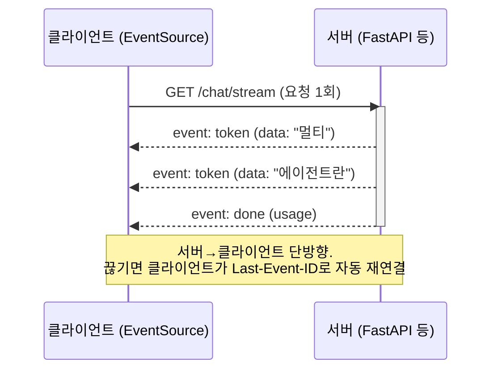
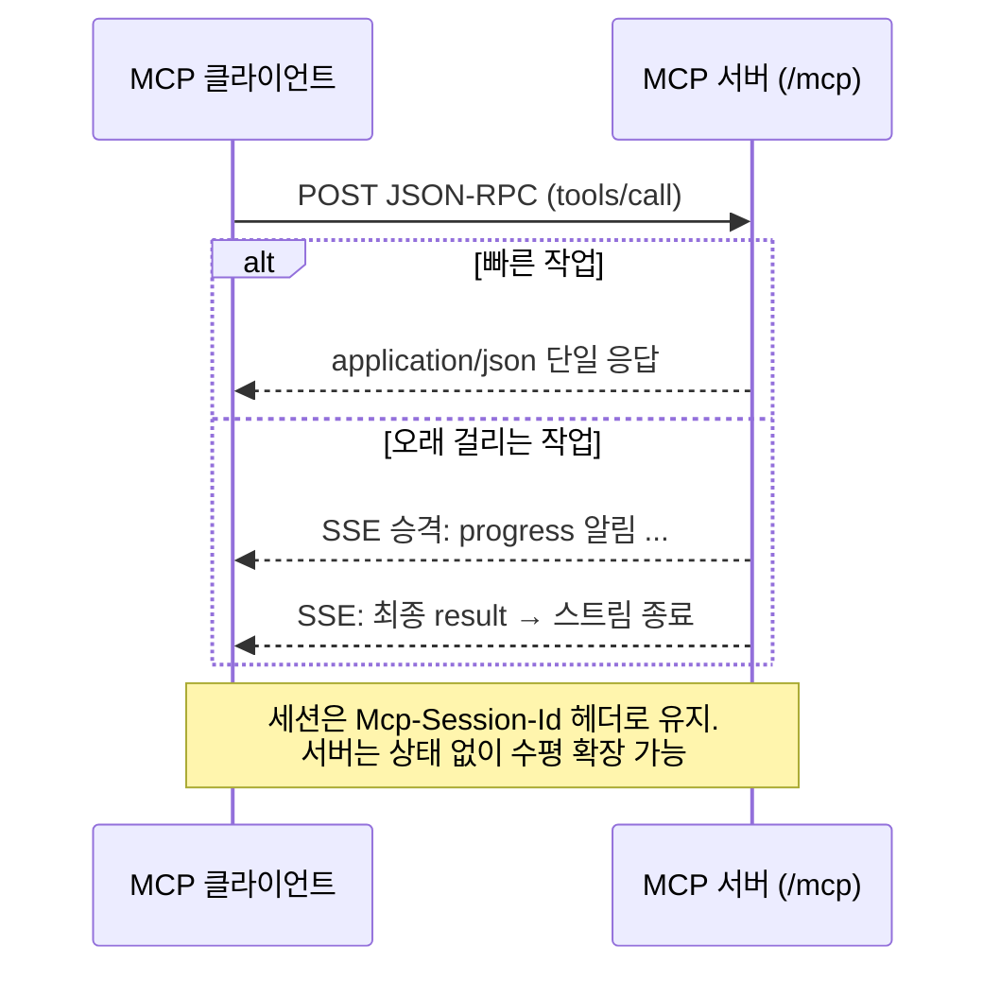
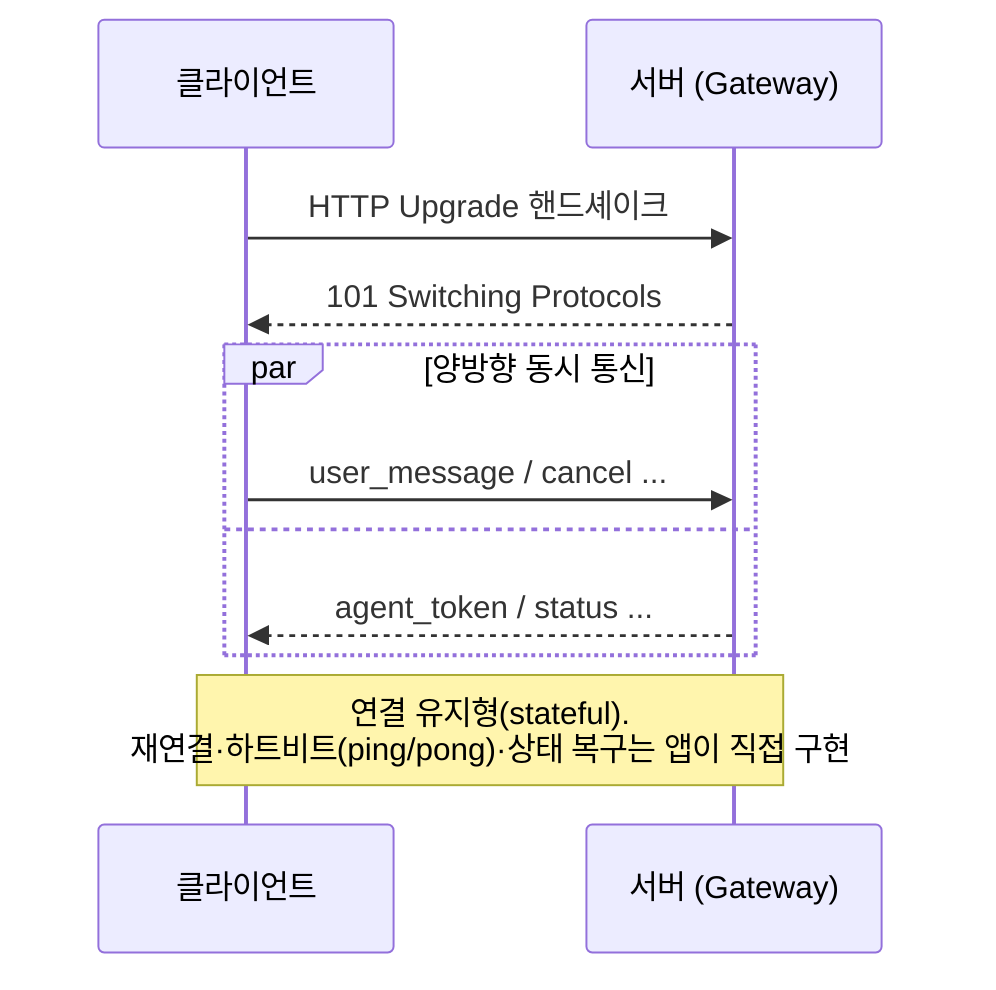
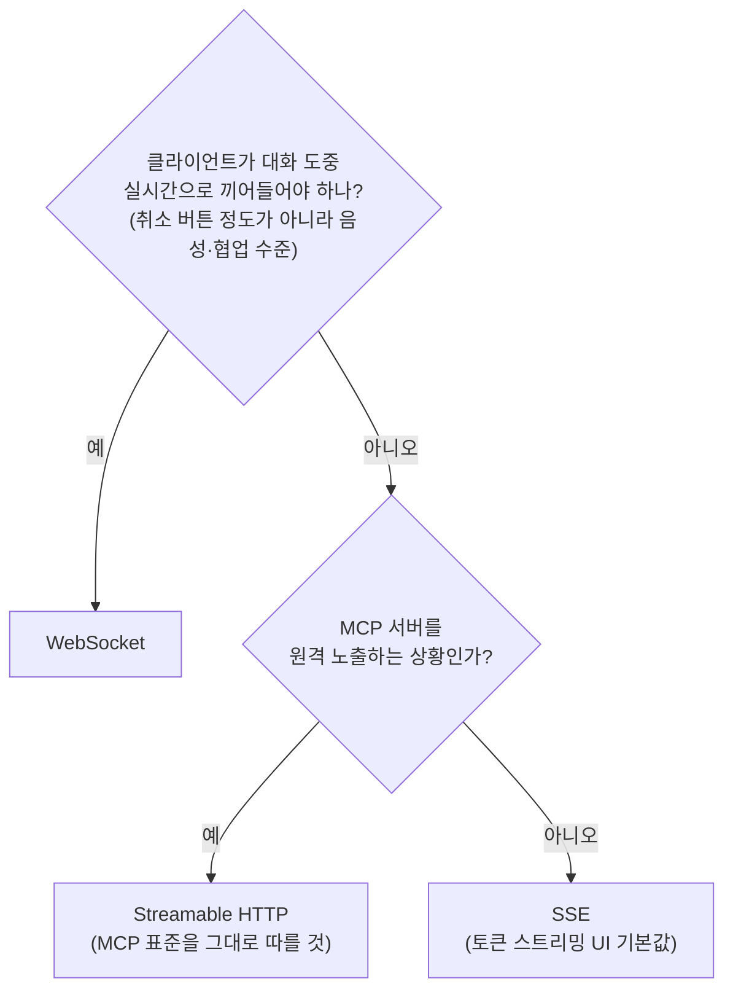

# 부록 B · 스트리밍 전송 비교 — SSE vs Streamable HTTP vs WebSocket

에이전트 시스템을 만들다 보면 "실행 결과를 어떻게 흘려보낼 것인가"라는 전송 계층 선택을
반드시 만나게 됩니다. 이 저장소에서도 세 방식이 각각 다른 곳에서 등장합니다:

- **SSE** — 에이전트 토큰 스트리밍을 브라우저로 서빙 ([24장](24-deployment-operations.md))
- **Streamable HTTP** — 원격 MCP 서버의 표준 전송 ([11장](11-mcp-integration.md))
- **WebSocket** — OpenClaw Gateway의 채널 통신 ([16장](16-self-hosted-runtimes.md))

이 부록은 세 방식의 정의·와이어 포맷·흐름을 나란히 놓고, 언제 무엇을 쓸지 정리합니다.

## 1. SSE (Server-Sent Events)

**정의**: 클라이언트가 HTTP 요청을 한 번 보내면, 서버가 연결을 닫지 않고
`text/event-stream` 형식으로 이벤트를 **단방향(서버→클라이언트)** 으로 계속 밀어주는
표준(HTML Living Standard)입니다. 브라우저에 `EventSource` API가 내장돼 있습니다.

**와이어 포맷 예시** — LLM 토큰 스트리밍 응답:

```text
HTTP/1.1 200 OK
Content-Type: text/event-stream
Cache-Control: no-cache

event: token
id: 1
data: {"delta": "멀티"}

event: token
id: 2
data: {"delta": "에이전트란"}

event: done
data: {"usage": {"output_tokens": 42}}
```

- 각 이벤트는 `event:`(타입)·`id:`(재연결용)·`data:`(페이로드) 줄과 **빈 줄**로 구분
- 연결이 끊기면 브라우저가 자동 재연결하며 `Last-Event-ID` 헤더로 마지막 위치를 알림

**흐름도**:



**특징**: 그냥 HTTP라서 프록시·로드밸런서·인증 미들웨어를 그대로 통과하고 인프라 변경이
없습니다. 대신 **클라이언트→서버 방향이 없어** 사용자의 중간 개입(취소·추가 입력)은
별도의 일반 HTTP 요청으로 처리해야 합니다.

## 2. Streamable HTTP

**정의**: 웹 표준이 아니라 **MCP 스펙(2025-03-26)이 정의한 전송 방식**입니다.
단일 엔드포인트(예: `/mcp`)에 클라이언트가 JSON-RPC를 **POST**하면, 서버가 상황에 따라
① 일반 JSON 한 방으로 응답하거나 ② 그 응답을 **SSE 스트림으로 승격**해 진행 상황을
흘려보낼 수 있습니다. "필요할 때만 스트리밍이 되는 HTTP"라고 이해하면 정확합니다.
(구버전 MCP의 "HTTP+SSE 2-엔드포인트" 방식을 대체했습니다.)

**와이어 포맷 예시** — MCP 도구 호출:

```text
POST /mcp HTTP/1.1
Content-Type: application/json
Accept: application/json, text/event-stream
Mcp-Session-Id: abc-123

{"jsonrpc": "2.0", "id": 7, "method": "tools/call",
 "params": {"name": "search_docs", "arguments": {"query": "체크포인터"}}}
```

서버가 오래 걸리는 작업이면 SSE로 승격해 응답:

```text
HTTP/1.1 200 OK
Content-Type: text/event-stream

data: {"jsonrpc":"2.0","method":"notifications/progress",
data:  "params":{"progress":0.5,"message":"인덱스 검색 중"}}

data: {"jsonrpc":"2.0","id":7,"result":{"content":[{"type":"text","text":"..."}]}}
```

**흐름도**:



**특징**: 요청/응답 모델을 유지하면서 스트리밍이 "옵션"이라 서버를 무상태로 만들기 쉽고,
서버리스(Lambda 등)에도 올라갑니다. 단, MCP 생태계 밖에서는 쓰이지 않는 용어라는 점을
기억하세요 — 일반 웹 API를 설계한다면 그냥 "POST + SSE 응답" 패턴입니다.

## 3. WebSocket

**정의**: HTTP로 핸드셰이크(`Upgrade: websocket`)한 뒤 **하나의 TCP 연결 위에서
양방향(전이중) 메시지**를 주고받는 별도 프로토콜(RFC 6455)입니다. `ws://`/`wss://` 스킴을
쓰고, 연결이 살아 있는 동안 양쪽 누구든 언제든 보낼 수 있습니다.

**와이어 포맷 예시** — OpenClaw Gateway 스타일의 채널 통신:

```text
# 핸드셰이크 (HTTP → WebSocket 승격)
GET /gateway HTTP/1.1
Upgrade: websocket
Connection: Upgrade
Sec-WebSocket-Key: dGhlIHNhbXBsZSBub25jZQ==

HTTP/1.1 101 Switching Protocols

# 이후 프레임 단위 양방향 메시지 (JSON 페이로드 관례)
→ {"type": "user_message", "channel": "slack", "text": "배포 상태 알려줘"}
← {"type": "agent_token", "text": "현재"}
← {"type": "agent_token", "text": " 배포는"}
→ {"type": "cancel"}                  ← 스트리밍 중에도 클라이언트가 끼어들 수 있음
← {"type": "stopped"}
```

**흐름도**:



**특징**: 진짜 실시간 양방향(음성 에이전트, 협업 편집, 중간 개입이 잦은 UI)에 유일한
정답입니다. 대신 **연결이 상태**가 되므로 로드밸런서 sticky session, 재연결 시 상태 복구,
하트비트 관리 등 운영 부담이 셋 중 가장 큽니다.

## 4. 한눈 비교

| | SSE | Streamable HTTP | WebSocket |
|---|---|---|---|
| 방향 | 서버→클라이언트 단방향 | 요청/응답 + 응답만 스트림 승격 | 양방향 전이중 |
| 정체 | 웹 표준 (HTML LS) | MCP 스펙 용어 (실체는 POST+SSE) | 별도 프로토콜 (RFC 6455) |
| 브라우저 API | `EventSource` 내장 | `fetch` + 스트림 파싱 | `WebSocket` 내장 |
| 재연결 | 자동 (`Last-Event-ID`) | 요청 단위라 불필요 | 직접 구현 (지수 백오프 등) |
| 프록시/인프라 친화성 | 높음 (그냥 HTTP)¹ | 높음 (그냥 HTTP) | 낮음 (Upgrade 지원·sticky 필요) |
| 서버 상태 | 연결당 스트림 1개 | 무상태 설계 쉬움 (서버리스 OK) | 연결 = 상태 (스케일아웃 부담) |
| 대표 용도 | LLM 토큰 스트리밍 UI | 원격 MCP 서버 | 음성·실시간 개입·게이트웨이 |
| 이 저장소 | [24장](24-deployment-operations.md) | [11장](11-mcp-integration.md) | [16장](16-self-hosted-runtimes.md) |

¹ 단, 프록시 버퍼링(nginx `X-Accel-Buffering: no`)과 타임아웃은 꺼야 합니다 — 24장 따라하기 참고.

## 5. 선택 가이드



!!! tip "실무 기본값"
    에이전트 응답을 화면에 흘리는 게 목적이라면 **SSE가 기본값**입니다. 취소는
    별도 POST 한 번이면 충분한 경우가 대부분이라, WebSocket의 운영 비용을 지불할
    이유가 생기기 전까지는 단순한 쪽을 유지하세요 — "가장 단순한 것부터"라는
    [00장](00-landscape.md)의 제1원칙은 전송 계층에도 그대로 적용됩니다.

## 참고 자료

- [Server-Sent Events — MDN](https://developer.mozilla.org/en-US/docs/Web/API/Server-sent_events/Using_server-sent_events)
- [MCP Transports 명세 (Streamable HTTP)](https://modelcontextprotocol.io/specification/2025-06-18/basic/transports)
- [The WebSocket Protocol — RFC 6455](https://datatracker.ietf.org/doc/html/rfc6455)
- [WebSockets — MDN](https://developer.mozilla.org/en-US/docs/Web/API/WebSockets_API)
