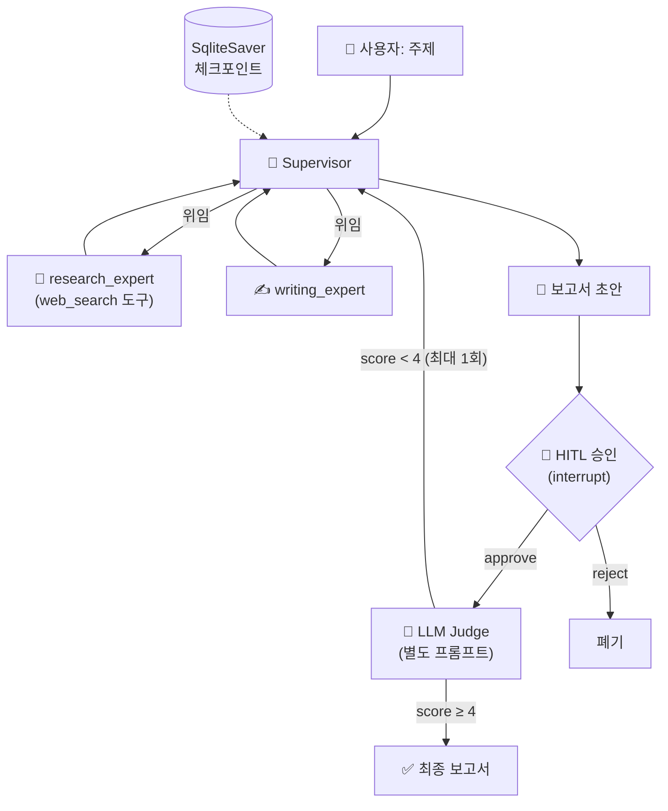

# 통합 프로젝트: 미니 리서치 팀 (캡스톤)

이 디렉터리는 [docs/22-capstone-project.md](../../docs/22-capstone-project.md)의 실습
코드입니다. "주제를 주면 **조사 → 보고서 작성 → 사람 승인 → 품질 채점**까지 하는
미니 리서치 팀"을 **5단계로 누적 확장**하며 만듭니다.

- 각 스텝은 이전 스텝의 빌더 함수를 `import` 해 재사용합니다(누적 확장).
- 동시에 **모든 스텝이 독립 실행 가능**합니다 — 아무 파일이나 바로 실행하세요.

## 사전 준비

```bash
pip install -r requirements.txt      # 저장소 루트의 requirements.txt
# .env (저장소 루트 또는 현재 디렉터리) 에:
#   ANTHROPIC_API_KEY=sk-ant-...
```

기본 모델은 `claude-opus-4-8` 입니다. 비용을 아끼려면 각 파일 상단의 `MODEL` 을
`"claude-haiku-4-5"` 로 바꾸세요.

## 단계 구성

| Step | 파일 | 추가되는 것 | 대응 챕터 |
|------|------|-------------|-----------|
| 1 | [`step1_agent.py`](step1_agent.py) | 도구(web_search)를 쥔 단일 리서치 에이전트 | 02 · 03 |
| 2 | [`step2_supervisor.py`](step2_supervisor.py) | supervisor + 워커 2개(리서처/작가) | 09 |
| 3 | [`step3_checkpoint.py`](step3_checkpoint.py) | SqliteSaver 체크포인터 — 중단/재개 | 06 |
| 4 | [`step4_hitl.py`](step4_hitl.py) | `interrupt()` 사람 승인 게이트 | 14 · 04 |
| 5 | [`step5_judge.py`](step5_judge.py) | 분리된 LLM judge 채점 + 재작성 루프 | 15 · 09 |

## 실행

```bash
python examples/project/step1_agent.py
python examples/project/step2_supervisor.py
python examples/project/step3_checkpoint.py   # 재실행하면 같은 thread 가 이어짐
python examples/project/step4_hitl.py         # --reject / --interactive 옵션
python examples/project/step5_judge.py
```

> step3 는 `research_team.sqlite` 파일을 만듭니다. 기억을 초기화하려면 지우세요.

## 최종 아키텍처 (Step 5 시점)



주의: 데모 단순화를 위해 step4(HITL)와 step5(judge)는 각각 step2 위에 독립적으로
얹혀 있습니다. 위 그림처럼 전부 하나의 그래프로 합치는 것은 docs/22 마지막의
확장 과제입니다.
